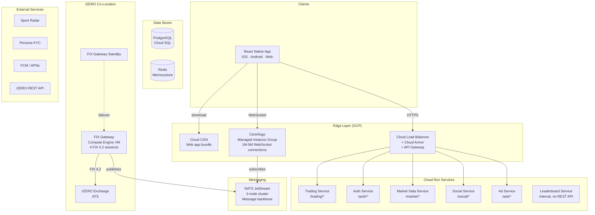
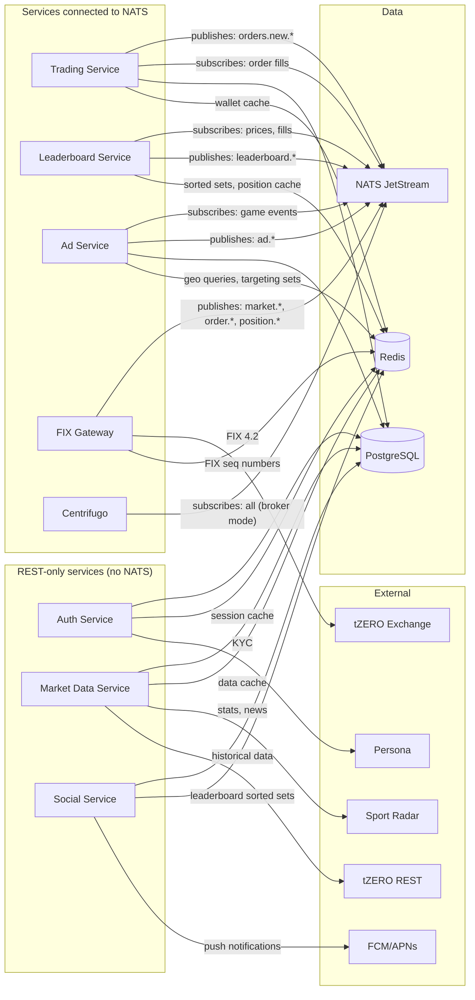
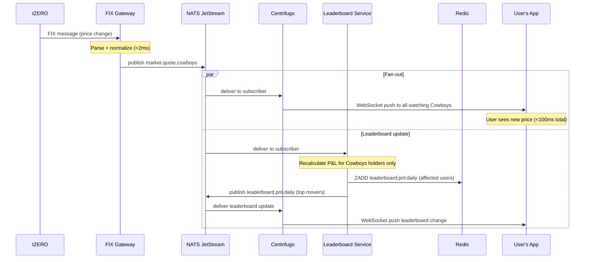
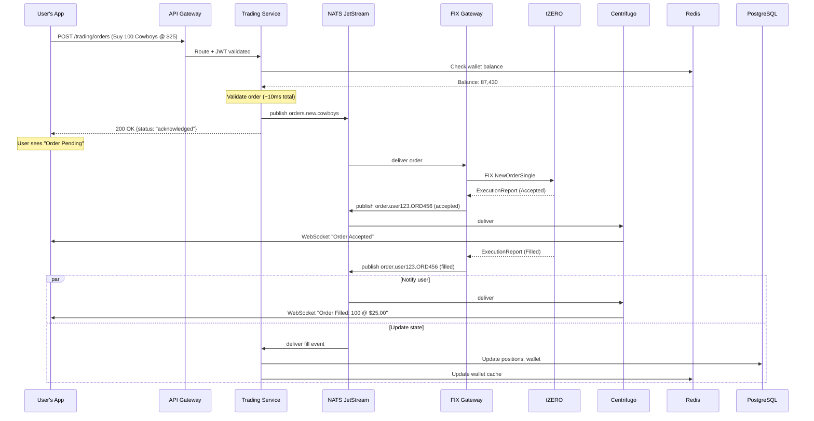

# InPlay Trading Challenge -- Technical Architecture

> **Project:** [[index]]
> **Status:** Draft
> **Date:** 2026-05-10
> **Owner:** Novosapien
> **Sources:** Vision document, T0 integration spec, architecture workshop sessions

## Overview

The InPlay Trading Challenge is a simulated sports equity trading platform targeting 1M-5M concurrent users at peak load. Users trade team stocks during live NFL and college football games using simulated currency, competing for real cash prizes ($5M-$25M season pool).

This architecture covers the trading challenge only -- not the production trading platform.

The system consists of 6 Cloud Run services (5 API + 1 Leaderboard), a FIX Gateway on Compute Engine, Centrifugo for real-time WebSocket delivery on a Managed Instance Group, NATS JetStream as the message backbone, and a React Native (Expo) frontend serving iOS, Android, and web from a single codebase.

## System Architecture Diagrams

### High-Level Overview

### Service Connection Map -- Who Talks to What

Not all services connect to NATS. Only services that deal with real-time events do. Auth, Market Data, and Social are REST-only services that read from PostgreSQL and Redis.

### Data Flow: Price Update

### Data Flow: Order Placement

## Tech Stack Summary

| Layer | Technology |
|-------|-----------|
| Frontend | React Native (Expo) -- iOS, Android, Web |
| API Services | Python / FastAPI (6 Cloud Run services) |
| FIX Gateway | Python / QuickFIX (Compute Engine VM) |
| Real-Time Delivery | Centrifugo (Managed Instance Group, NATS broker mode) |
| Message Bus | NATS JetStream (3-node cluster) |
| Database | PostgreSQL (Cloud SQL) |
| Cache / Data Structures | Redis (Memorystore) |
| Cloud Platform | Google Cloud Platform |

## Architecture Sections

### Decisions
- [[tech-stack]] -- What we chose and why, with alternatives considered
- [[frontend-framework]] -- React Native (Expo) vs Flutter vs Next.js, framework landscape
- [[infrastructure-decisions]] -- Cloud Run vs GKE, Compute Engine, API Gateway decisions

### Services
- [[services-overview]] -- Service map, monorepo structure, shared package, who talks to who
- [[trading-service]] -- Order execution, wallet management, position tracking
- [[auth-service]] -- Authentication, JWT, signup/login, KYC (Persona)
- [[market-data-service]] -- Teams, games, news, stats, Sport Radar integration
- [[social-service]] -- Referrals, leaderboards, notifications
- [[ad-service]] -- Google Ad Manager at launch, custom moment-based system post-launch
- [[fix-gateway]] -- FIX 4.2, 4 adapters, state machines, high availability
- [[centrifugo]] -- Real-time delivery, channels, Managed Instance Group, conflation

### Infrastructure
- [[infrastructure]] -- GCP deployment model, what runs where, managed services
- [[scaling]] -- Game-day scaling, min-instances, MIG schedules, scaling profiles
- [[api-gateway]] -- Routing, rate limiting, JWT validation at edge
- [[networking]] -- Load balancer, Cloud Armor, CDN, domains

### Data Flows
- [[price-update-flow]] -- tZERO to user screen (<100ms target)
- [[order-placement-flow]] -- User to tZERO and back
- [[user-reconnection-flow]] -- WebSocket drop, reconnect, last-value cache
- [[ad-delivery-flow]] -- Game event to targeted ad delivery

### Frontend
- [[frontend-architecture]] -- React Native (Expo), no server, runs on device
- [[frontend-deployment]] -- App Store, Play Store, Web/CDN, OTA updates
- [[frontend-performance]] -- Client-side throttling, subscriptions, reconnection

### Integrations
- [[integrations]] -- Summary of all external dependencies
- [[t0]] -- tZERO FIX 4.2 + REST API specification
- [[sportradar]] -- Sport Radar real-time data integration
- [[persona]] -- Persona KYC integration

### Performance
- [[latency-budget]] -- <100ms end-to-end target, per-hop breakdown
- [[throughput]] -- 25K msg/sec upstream, 500M fan-out, conflation strategies

### Open
- [[open-questions]] -- Unresolved questions with owners and impact
