# InPlay Trading Platform - Implementation Documentation

> Bloomberg-terminal-style interface for tZERO trading engine
> Target: 1M concurrent users at peak load
>
> Source specifications (verified across 3 validation rounds):
> - tZERO IOI Market Data Specification v1.2 (Dec 2025)
> - tZERO FIX Market Data Specification v8 (Dec 20, 2025)
> - tZERO Order Entry Specification FIX 4.2 v2.2
>
> Companion document: [Trading Architecture.md](./Trading%20Architecture.md) — full protocol reference

---

## Glossary of Key Concepts

Before diving in, here are the core concepts used throughout this document:

**FIX Protocol (Financial Information eXchange)**: The industry-standard messaging protocol for electronic trading. tZERO uses FIX 4.2, which defines how messages are structured, sequenced, and transmitted over TCP/IP. Every message has a header (with sequence numbers and timestamps), a body (with the actual trading data), and a trailer (with a checksum). Think of it as a strict, binary-efficient language that trading systems speak to each other.

**IOI (Indication of Interest)**: A message that says "someone wants to buy or sell X shares of a symbol at Y price." IOIs build up the order book — the collection of all outstanding buy and sell interest at every price level. When you see a bid/ask spread on a trading screen, that's constructed from IOI messages.

**Market Data Snapshot (MsgType=W)**: A complete point-in-time picture of a symbol's trading state — its open, high, low, close prices, total volume, and current order book. Think of it as a photograph of the market at a given instant. When you first connect, you get snapshots to establish baseline state.

**Incremental Refresh (MsgType=X)**: A real-time update that tells you what changed since the last snapshot or update. Instead of re-sending the entire picture, it says "the bid at price 150.50 changed to size 300" or "a new trade occurred at 151.00 for 100 shares." This is how the screen stays live.

**Execution Report (MsgType=8)**: The response from the trading engine after you submit, cancel, or modify an order. It tells you whether your order was accepted, rejected, partially filled, fully filled, cancelled, or busted. Every order action gets an execution report back.

**DFA (Deterministic Finite Automaton)**: A state machine where each state has exactly one valid transition for each possible input. We use DFAs (not NFAs) because trading state must be unambiguous — an order is either accepted or rejected, never both. There is no "maybe" in a trading system.

**Message Bus**: The internal pub/sub system that sits between our FIX gateway (which talks to tZERO) and our WebSocket gateway (which talks to users). It decouples the single upstream FIX connection from the 1M downstream user connections. Each user subscribes to topics they care about (e.g., quotes for AAPL) and receives only those updates.

**ClOrdID (Client Order ID)**: The ID your application assigns to each order. Maximum 20 characters, no leading zeroes. This is how you track an order through its entire lifecycle — from submission through fills to completion. tZERO assigns its own internal OrderID (tag 37), but you always reference orders by your ClOrdID.

**Conflation**: The practice of merging multiple rapid updates into a single delivery to the client. If a symbol's bid changes 50 times per second, a human can't perceive that — so we send 10 merged updates per second instead. This is critical for managing bandwidth at 1M users.

---

## Table of Contents

1. [System Topology](#1-system-topology)
2. [Message Bus Architecture](#2-message-bus-architecture)
3. [DFA State Machines](#3-dfa-state-machines)
4. [Session Management](#4-session-management)
5. [Disconnect and Recovery](#5-disconnect-and-recovery)
6. [Deduplication](#6-deduplication)
7. [Message Bus Envelope Specification](#7-message-bus-envelope-specification)
8. [Data Flow: tZERO to User Screen](#8-data-flow-tzero-to-user-screen)
9. [Latency Budget](#9-latency-budget)

---

## 1. System Topology

> **Why this matters**: Our application is a Bloomberg-style terminal. Users see live prices, order books, and trade their accounts — all in real time. But tZERO only gives us a handful of FIX connections (not one per user). This section explains how we fan out those sessions to serve 1 million users simultaneously.

Our application sits between upstream tZERO FIX sessions and 1M downstream user connections. tZERO provides 4 FIX session types: IOI Market Data, FIX Market Data, Order Entry, and Drop Copy (read-only execution reports). We design for a minimum of 3 active FIX sessions (IOI MD, FIX MD, Order Entry) as the conservative baseline from the PDF specifications, while architecting to use Drop Copy as a 4th session and potentially additional sessions if negotiated with tZERO. We do NOT give each user a direct FIX session. Instead, a thin backend fan-out layer consumes the FIX feeds and publishes normalized events onto an internal message bus.

> **Note on connection limits**: The "single client connection at a time" language appears in the IOI v1.2 PDF (Section 2), but is NOT present in the online API docs at apidocs.tzero.com. The actual number of simultaneous sessions is likely a business arrangement with tZERO, not a hard protocol limitation. No connection limits are stated in the online docs.
>
> **FIX version discrepancy**: Our PDF specifications (IOI v1.2, FIX MD v8, OE v2.2) all specify FIX 4.2 (`BeginString=FIX.4.2`). However, the online API docs at apidocs.tzero.com reference FIX 4.4. Confirm with tZERO which version applies to our integration before implementation.
>
> **REST API alternative**: tZERO also exposes REST APIs at `https://gateway-web-api.tzero.com/app` with OAuth authentication (clientId/clientSecret exchanged for a 1-hour bearer token). These may complement or substitute for FIX in non-streaming scenarios (e.g., historical data queries, account information, symbol reference data). Evaluate for use cases where real-time streaming is not required.

```
┌──────────────────────────────────────────────────────────────────────────────────┐
│                                tZERO Exchange                                    │
│  ┌──────────────┐  ┌──────────────┐  ┌──────────────────────┐  ┌──────────────┐  │
│  │ IOI MD v1.2  │  │ FIX MD v8   │  │ Order Entry v2.2     │  │ Drop Copy    │  │
│  │ (1 session)  │  │ (1 session)  │  │ (1 session per firm) │  │ (read-only)  │  │
│  └──────┬───────┘  └──────┬───────┘  └──────────┬───────────┘  └──────┬───────┘  │
└─────────┼────────────────┼──────────────────────┼──────────────────────┼─────────┘
          │ TCP/IP         │ TCP/IP               │ TCP/IP               │ TCP/IP
          │ FIX 4.2        │ FIX 4.2              │ FIX 4.2              │ FIX 4.2
          ▼                ▼                      ▼                      ▼
┌──────────────────────────────────────────────────────────────────────────────────┐
│                             FIX Gateway Layer                                    │
│  ┌──────────────┐  ┌──────────────┐  ┌──────────────────────┐  ┌──────────────┐  │
│  │ IOI Adapter  │  │ MD Adapter   │  │ OE Adapter           │  │ DC Adapter   │  │
│  │ - Parse IOI  │  │ - Parse W/X  │  │ - Parse MsgType 8/9  │  │ - Parse      │  │
│  │ - Parse W    │  │ - Parse f/h  │  │ - Route by ClOrdID   │  │   MsgType 8  │  │
│  │ - Track      │  │ - Track      │  │ - Track order state  │  │ - Read-only  │  │
│  │   IOIid      │  │   MDReqID    │  │   per user           │  │   exec rpts  │  │
│  └──────┬───────┘  └──────┬───────┘  └──────────┬───────────┘  └──────┬───────┘  │
└─────────┼────────────────┼──────────────────────┼──────────────────────┼─────────┘
          │                │                      │                      │
          ▼                ▼                      ▼                      ▼
┌─────────────────────────────────────────────────────────────────┐
│                    Internal Message Bus                         │
│                                                                 │
│  Topics:                                                        │
│  ├── market.snapshot.{symbol}    (OHLC + volume)                │
│  ├── market.book.{symbol}       (order book depth)              │
│  ├── market.trade.{symbol}      (individual trades)             │
│  ├── market.quote.{symbol}      (best bid/offer)                │
│  ├── market.status.{symbol}     (halt/resume/auction)           │
│  ├── market.session             (PRE/OPNX/CORE/POST + CB)      │
│  ├── order.{userId}.{clOrdId}   (per-user order lifecycle)      │
│  └── position.{userId}          (per-user position updates)     │
│                                                                 │
└─────────────────────────┬───────────────────────────────────────┘
                          │
                          ▼
┌─────────────────────────────────────────────────────────────────┐
│                    WebSocket Gateway                            │
│  - 1M concurrent connections                                    │
│  - Per-user subscription management                             │
│  - Subscription-based topic filtering                           │
│  - Client-side state reconciliation on reconnect                │
└─────────────────────────────────────────────────────────────────┘
```

### 1.1 Why This Topology

| Constraint | Source | Impact |
|---|---|---|
| IOI feed: "Each IOI Market Data session allows only a single client connection at a time" | IOI v1.2 PDF Section 2 (not in online docs) | Cannot give users direct FIX connections |
| FIX v8: ResetSeqNumFlag=Y required on every logon | FIX v8 Section 3/5.2 | Session recovery not supported — gateway must handle |
| Order Entry: tZERO is the acceptor | OE v2.2 Introduction | Single FIX session, must multiplex user orders |
| Drop Copy: read-only execution report stream | tZERO Drop Copy session type | Independent fill reconciliation; does not send orders |
| 4 FIX session types available (IOI MD, FIX MD, OE, Drop Copy) | tZERO API documentation | Architect for minimum 3 sessions, ready for 4th (Drop Copy) and beyond |
| Connection limits not stated in online docs | apidocs.tzero.com | Session count likely a business arrangement, not protocol limitation |
| FIX version discrepancy: PDFs say 4.2, online docs say 4.4 | IOI/MD/OE PDFs vs apidocs.tzero.com | Must confirm with tZERO before implementation |
| tZERO REST API available (OAuth, 1-hour bearer token) | https://gateway-web-api.tzero.com/app | Potential complement for non-streaming operations |
| 1M concurrent users | Product requirement | Fan-out via message bus, not FIX sessions |

---

## 2. Message Bus Architecture

> **Why this matters**: The message bus is the heart of the system. It takes raw FIX messages from 3 upstream connections and distributes them to the right users. Without it, we'd need 1M FIX connections (impossible) or a monolithic server that becomes a bottleneck. The bus gives us horizontal scalability — add more bus nodes as user count grows.
>
> **Why not just WebSockets direct to FIX?** Because FIX is a point-to-point protocol with sequence numbers, heartbeats, and session state. You can't share a FIX session across multiple consumers. The bus normalizes FIX messages into simple events that any number of WebSocket consumers can receive.

### 2.1 Update Intervals and Latency Targets

| Data Type | Source Feed | Upstream Cadence | Bus Publish Target | User Delivery Target |
|---|---|---|---|---|
| Best Bid/Offer (BBO) | FIX v8 Incremental (MsgType=X, MDEntryType=0/1) | As activity occurs | < 5ms from receipt | < 50ms to screen |
| Trades | FIX v8 Incremental (MsgType=X, MDEntryType=2) or IOI Snapshot (MsgType=W, MDEntryType=2) | As activity occurs | < 5ms from receipt | < 50ms to screen |
| OHLC Bar | IOI Snapshot (MsgType=W, MDEntryType=4/5/7/8) | As activity occurs | < 10ms from receipt | < 100ms to screen |
| Order Book Depth | IOI messages (IOITransType=N/C/R) or FIX v8 Full Book | As activity occurs | < 10ms from receipt | < 100ms to screen |
| Order Status | OE Execution Reports (MsgType=8) | Per order event | < 5ms from receipt | < 50ms to screen |
| Security Status | FIX v8 Security Status (MsgType=f) | On halt/resume | < 5ms from receipt | < 50ms to screen |
| Trading Session | FIX v8 Trading Session Status (MsgType=h) | On phase change | < 10ms from receipt | < 200ms to screen |
| Position/P&L | OE Execution Reports (tags 9383/9384/9385/9389) | Per fill/bust/correction | < 5ms from receipt | < 50ms to screen |

### 2.2 Topic Design

Each topic carries a specific, deterministic message type. Users subscribe to topics by symbol or by their userId. The bus must support:
- **Pub/sub with topic filtering** — users subscribe to `market.quote.AAPL`, not the entire firehose
- **Last-value cache** — new subscribers get the most recent value immediately (critical for reconnect)
- **Ordered delivery per topic** — messages within a topic arrive in order
- **At-least-once delivery** — duplicates are handled at the consumer (see Section 6)

### 2.3 Topic-to-Source Mapping

| Bus Topic | Source Feed | Source MsgType | Key Fields |
|---|---|---|---|
| `market.snapshot.{symbol}` | IOI v1.2 Snapshot | W | MDEntryType 2/4/5/7/8, MDEntryPx, TotalVolumeTraded, PreviousClosingPx (9846), InitPrx (9848) |
| `market.book.{symbol}` | IOI v1.2 IOI messages | 3 (tZERO custom) | IOIid, IOITransType (N/C/R), Side, Price, IOIShares |
| `market.book.{symbol}` | FIX v8 Snapshot + Incremental | W / X | MDEntryType 0/1, MDUpdateAction (0/1/2), MDEntryPx, MDEntrySize, NumberOfOrders |
| `market.trade.{symbol}` | FIX v8 Incremental | X | MDEntryType=2, MDEntryPx, MDEntrySize, MDEntryID, TradeCondition, TotalVolumeTraded |
| `market.quote.{symbol}` | FIX v8 Incremental (Top of Book) | X | MDEntryType 0/1, MDEntryPx, MDEntrySize, QuoteCondition |
| `market.status.{symbol}` | FIX v8 Security Status | f | SecurityTradingStatus (326), HaltReason (327), ShortSellRstrcn (8724) |
| `market.session` | FIX v8 Trading Session Status | h | TradingSessionID (336), TradSesStatus (340), MWCBLvl1/2/3Prx (8721/8722/8723) |
| `order.{userId}.{clOrdId}` | OE Execution Reports | 8 / 9 | ExecType (150), OrdStatus (39), ExecTransType (20), all fill fields |
| `position.{userId}` | OE Execution Reports | 8 | PosSIZ (9383), PosCOST (9384), PosRpnl (9385), PosUpnl (9389) |

---

## 3. DFA State Machines

> **Why DFA, not NFA?** In a trading system, state must be deterministic. An order cannot simultaneously be "accepted" and "rejected." A symbol cannot be both "halted" and "trading." NFAs allow multiple possible states for a single input — that ambiguity is unacceptable when money is on the line. DFAs guarantee that for any given current state and input event, there is exactly one next state. This makes our system predictable, testable, and auditable.
>
> **How to read these diagrams**: Each box is a state. Each arrow is a transition caused by a specific input (labeled on the arrow). The `[*]` symbol means the start state. If you trace from start through the arrows following a sequence of inputs, you get the exact state the system is in. There is never ambiguity.

All state machines are deterministic finite automata. Every state has exactly one transition per input symbol. No epsilon transitions. No ambiguous states.

### 3.1 IOI Feed Session DFA

> **What this is**: The IOI feed gives us the "all symbols at a glance" view — like the scrolling ticker on a Bloomberg terminal. It streams order book depth (who wants to buy/sell what at which price) and OHLC trade data for every active symbol simultaneously. This DFA tracks the connection lifecycle from disconnected through to steady-state streaming.
>
> **Why it matters**: The IOI feed is subscribe-once, stream-forever. After the initial request, updates flow automatically with no further requests needed. But if the connection drops, everything resets — the server forgets you existed and replays the entire book state on reconnect.

> Source: IOI v1.2 Sections 2, 3

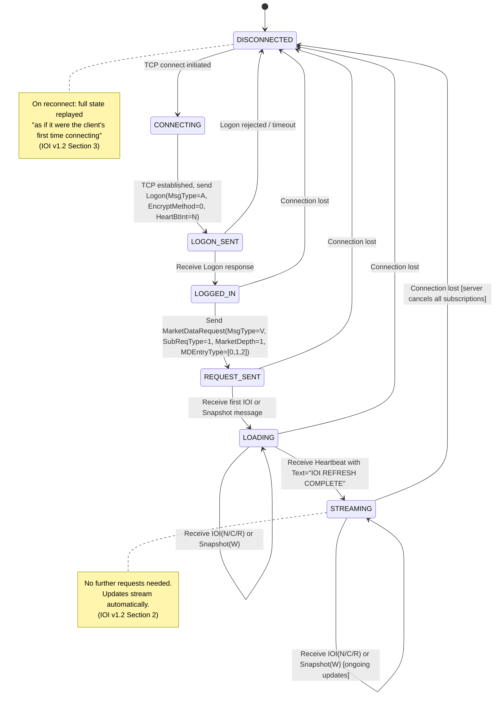

**DFA Alphabet (inputs):**
| Symbol | Meaning |
|---|---|
| `TCP_CONNECT` | TCP connection initiated |
| `TCP_ESTABLISHED` | TCP handshake complete |
| `LOGON_ACK` | Logon response received |
| `LOGON_REJECT` | Logon rejected or timeout |
| `MD_REQUEST_SENT` | MarketDataRequest sent |
| `IOI_OR_SNAPSHOT` | IOI message or MarketData Snapshot received |
| `IOI_REFRESH_COMPLETE` | Heartbeat with Text="IOI REFRESH COMPLETE" |
| `CONNECTION_LOST` | TCP disconnect for any reason |

**States:** `DISCONNECTED`, `CONNECTING`, `LOGON_SENT`, `LOGGED_IN`, `REQUEST_SENT`, `LOADING`, `STREAMING`

**Accepting states:** `STREAMING` (normal operation)

### 3.2 FIX Market Data Session DFA

> **What this is**: The FIX Market Data feed gives us deep, per-symbol detail — full order book depth, real-time trade-by-trade updates, security halt/resume notifications, trading session phases, and circuit breaker thresholds. This is what powers the detailed symbol view when a user clicks into a specific stock.
>
> **Key difference from IOI**: This feed supports snapshot-only mode (get data once), streaming mode (continuous updates), and unsubscribe. It also provides data the IOI feed doesn't have: order imbalances, theoretical opening prices during auctions, halt reasons, and short sale restrictions.
>
> **Critical implementation detail**: Session recovery is NOT supported on this feed. If the connection drops, you must reset sequence numbers on every logon (ResetSeqNumFlag=Y) and re-subscribe to everything. The server will GapFill any Resend Request rather than replaying missed messages.

> Source: FIX v8 Sections 2, 3, 5.2

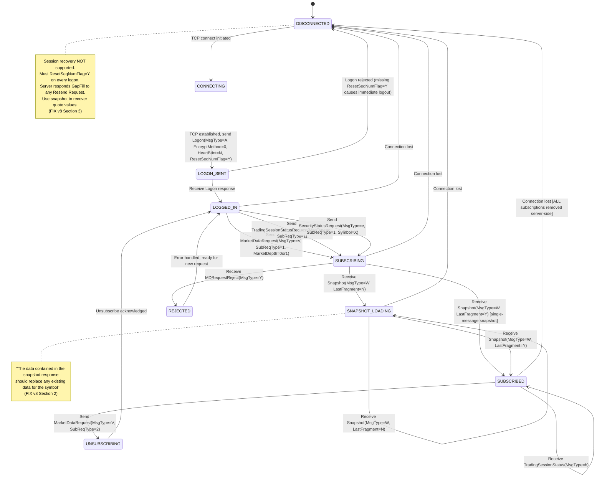

**DFA Alphabet (inputs):**
| Symbol | Meaning |
|---|---|
| `TCP_CONNECT` | TCP connection initiated |
| `TCP_ESTABLISHED` | TCP handshake complete |
| `LOGON_ACK` | Logon response received |
| `LOGON_REJECT` | Logon rejected (missing ResetSeqNumFlag) |
| `SUB_REQUEST_SENT` | MarketDataRequest / TradSesStatusReq / SecurityStatusReq sent |
| `SNAPSHOT_PARTIAL` | Snapshot with LastFragment=N |
| `SNAPSHOT_FINAL` | Snapshot with LastFragment=Y |
| `INCREMENTAL` | MarketDataIncrementalRefresh received |
| `STATUS_UPDATE` | SecurityStatus or TradingSessionStatus received |
| `REQUEST_REJECT` | MarketDataRequestReject received |
| `UNSUB_SENT` | Unsubscribe request sent |
| `UNSUB_ACK` | Unsubscribe acknowledged |
| `CONNECTION_LOST` | TCP disconnect for any reason |

**States:** `DISCONNECTED`, `CONNECTING`, `LOGON_SENT`, `LOGGED_IN`, `SUBSCRIBING`, `SNAPSHOT_LOADING`, `SUBSCRIBED`, `UNSUBSCRIBING`, `REJECTED`

**Accepting states:** `SUBSCRIBED` (receiving streaming updates)

### 3.3 FIX Market Data Subscription DFA (Per-Symbol)

> Source: FIX v8 Section 6.1

Each symbol subscription tracked independently:

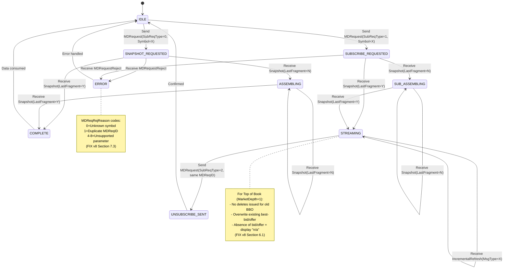

### 3.4 IOI Order Book Entry DFA (Per IOIid)

> **What this is**: Every entry in the order book (each bid or ask at a price level) has a unique 22-byte IOIid. This DFA tracks the lifecycle of a single book entry. When you see a bid appear on screen at $151.50 for 500 shares, that's an IOI entry in the ACTIVE state. When it disappears, it was CANCELLED. When the size changes, it was REPLACED.
>
> **Why it matters for the display**: The order book ladder on a Bloomberg terminal is built entirely from these IOI entries. Buy-side entries (Side=1) sorted by price descending form the bid side. Sell-side entries (Side=2) sorted by price ascending form the ask side. The spread between the best bid and best ask is the market spread.

> Source: IOI v1.2 Section 7.2

Each IOIid (22-byte unique identifier) tracked independently:

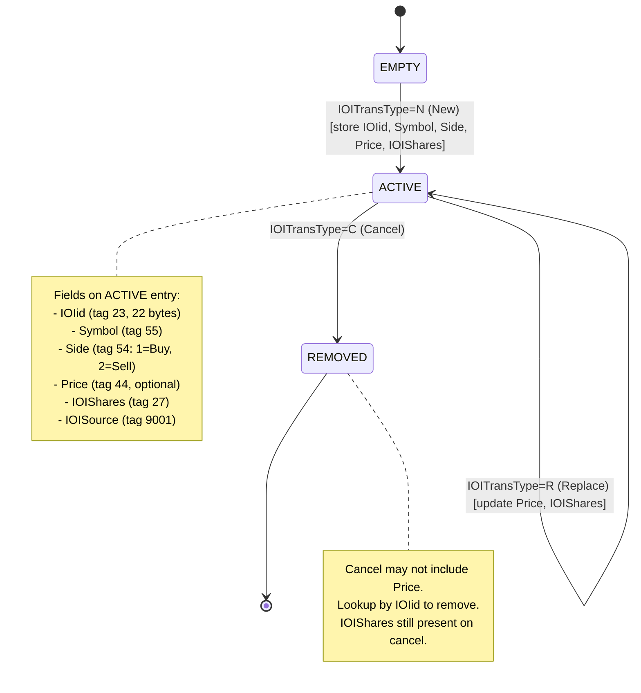

**DFA Alphabet:** `NEW`, `REPLACE`, `CANCEL`
**States:** `EMPTY`, `ACTIVE`, `REMOVED`
**Accepting states:** `ACTIVE` (entry visible in book)

### 3.5 FIX Incremental Refresh Entry DFA (Per Price Level)

> Source: FIX v8 Section 7.2

For full book (MarketDepth=0), each price level on each side tracked:

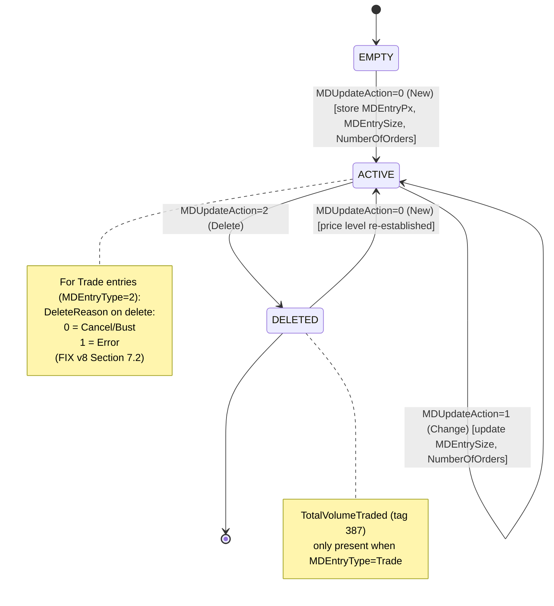

### 3.6 Order Lifecycle DFA

> **What this is**: This is the most important DFA in the system. It tracks every order from the moment the user clicks "Buy" or "Sell" through to final completion. Every order follows this exact path — there are no shortcuts and no ambiguous states.
>
> **The order types explained**:
> - **New Order Single (MsgType=D)**: The user wants to buy or sell. Always a Limit order on tZERO (they must specify a price). This is the only way to enter the market.
> - **Order Cancel Request (MsgType=F)**: The user wants to withdraw their unfilled order from the market. They reference the original order by OrigClOrdID.
> - **Order Cancel/Replace Request (MsgType=G)**: The user wants to change the price or quantity of a live order. tZERO cancels the old order and creates a new one atomically — the old ClOrdID dies, a new ClOrdID takes its place.
>
> **The response types explained**:
> - **Order Accepted (ExecType=0)**: Your order is now live on the book. Other traders can match against it.
> - **Order Rejected (ExecType=8)**: Your order was refused — bad symbol, exchange closed, exceeds limits, duplicate ID, etc. It never went live.
> - **Partial Fill (ExecType=1)**: Some of your order was matched. You wanted 100 shares, got 50. The remaining 50 are still live.
> - **Full Fill (ExecType=2)**: Your entire order was matched. Nothing left on the book.
> - **Cancelled (ExecType=4)**: Your order was removed from the book. Can be solicited (you asked for it) or unsolicited (the system did it — end of day, regulatory halt, etc.).
> - **Replaced (ExecType=5)**: Your old order was cancelled and a new one with your updated price/qty is now live.
> - **Done for Day (ExecType=3)**: The trading day ended and your day order expired. Any unfilled portion is gone.
> - **Execution Busted (ExecType=H)**: A previous fill is being reversed — the trade was erroneous. Your position and P&L get recalculated.
> - **Execution Corrected (ExecType=G)**: A previous fill's price or size is being adjusted. Not reversed, just corrected.

> Source: OE v2.2 Sections 4.7, 4.8

This is the core DFA for the order entry system. Each order tracked by ClOrdID. Transitions determined by the tuple `(ExecTransType, ExecType, OrdStatus)`.

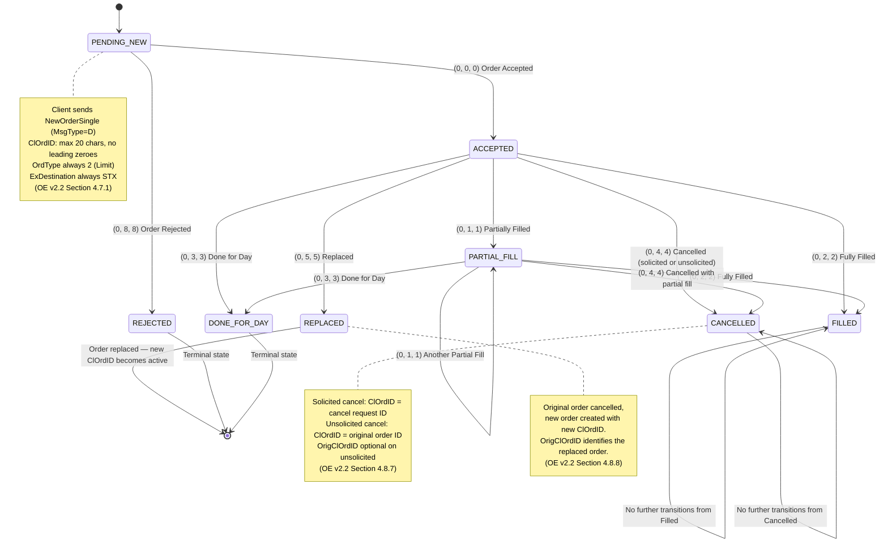

**DFA Alphabet (transition inputs):**
| Input Tuple (ExecTransType, ExecType, OrdStatus) | Name |
|---|---|
| (0, 0, 0) | ORDER_ACCEPTED |
| (0, 8, 8) | ORDER_REJECTED |
| (0, 1, 1) | PARTIAL_FILL |
| (0, 2, 2) | FULL_FILL |
| (0, 4, 4) | CANCELLED |
| (0, 5, 5) | REPLACED |
| (0, 3, 3) | DONE_FOR_DAY |

**States:** `PENDING_NEW`, `ACCEPTED`, `PARTIAL_FILL`, `FILLED`, `CANCELLED`, `REPLACED`, `REJECTED`, `DONE_FOR_DAY`

**Terminal states:** `FILLED`, `CANCELLED`, `REJECTED`, `DONE_FOR_DAY`
**Pseudo-terminal:** `REPLACED` (order itself is dead, but a new order with a new ClOrdID is now active)

### 3.7 Execution Lifecycle DFA (Per ExecID)

> **What this is**: Every fill (trade execution) gets a unique ExecID. This DFA tracks what happens to that specific fill after it occurs. Most fills stay ACTIVE forever — the trade happened, it's done. But sometimes trades get busted (reversed because of an error) or corrected (the price or quantity was wrong). This is rare but critical to handle correctly because it directly affects the user's P&L.
>
> **Why it's separate from the Order DFA**: An order can have multiple fills (partial fills building up to a full fill). Each fill is an independent entity that can be individually busted or corrected. The ExecRefID (tag 19) on a bust/correction points back to the original ExecID that's being affected.

> Source: OE v2.2 Sections 4.8.9, 4.8.10, 4.8.11

Each fill (identified by ExecID) has its own lifecycle:

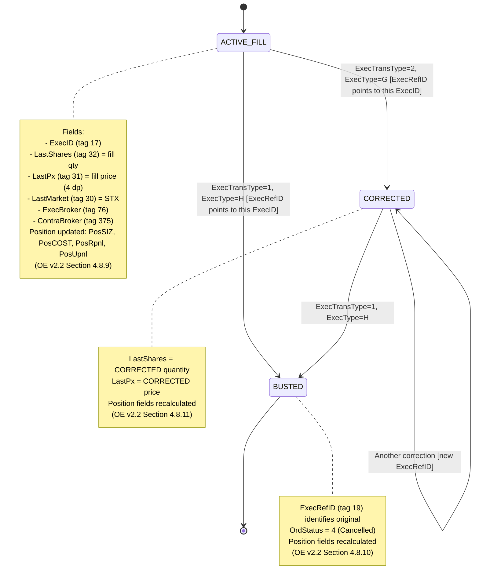

### 3.8 Cancel/Replace Request DFA

> Source: OE v2.2 Sections 4.7.2, 4.7.3, 4.8.5, 4.8.6

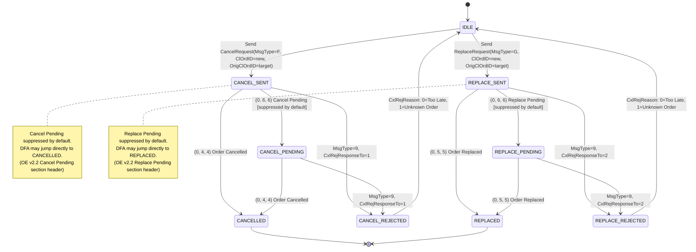

### 3.9 Trading Session DFA

> **What this is**: The trading day has phases — pre-market, opening auction, core trading, closing, and post-market. This DFA tracks which phase the market is currently in. It's global (not per-symbol) and affects what actions users can take. During PRE, orders can be entered but won't match. During CORE, orders match in real-time. During a HALT, nothing matches.
>
> **Why it matters for the UI**: The trading session phase should be prominently displayed. Users need to know if they're in pre-market (their orders will queue) vs. core trading (their orders may fill immediately). Circuit breaker thresholds should be shown as warning indicators.

> Source: FIX v8 Section 7.5

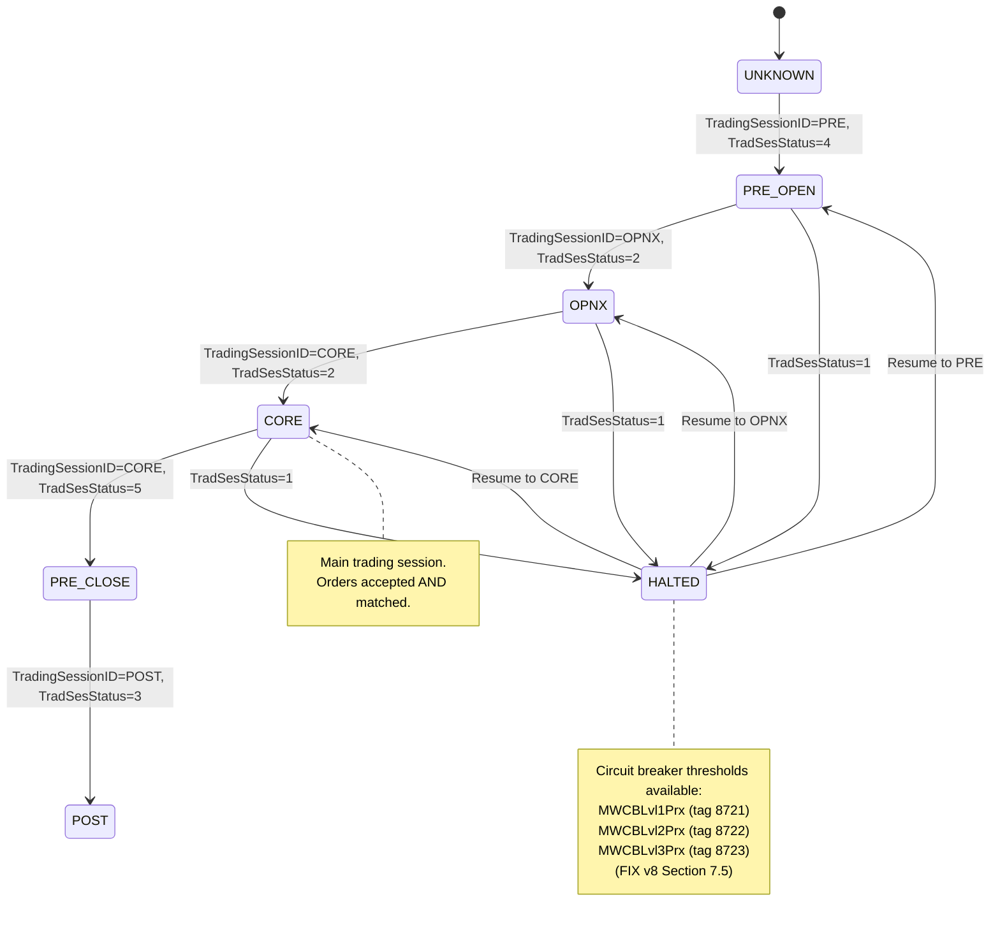

### 3.10 Security Trading Status DFA (Per Symbol)

> **What this is**: Unlike the trading session (which is market-wide), security status is per-symbol. Individual stocks can be halted while the rest of the market trades normally. This happens for news events, order imbalances, LULD (Limit Up Limit Down) volatility pauses, or circuit breakers. When a symbol is halted, orders are accepted but not matched. When it's in auction state, the exchange is collecting orders to determine a fair opening/reopening price.
>
> **Why it matters**: A halted symbol should be visually distinct on the user's screen — greyed out, with a halt reason badge. Users can still submit orders during a halt (they'll queue), but they need to know their order won't fill until trading resumes. The Short Sale Restriction (SSR) indicator should also be displayed — it affects whether sell-short orders are accepted.

> Source: FIX v8 Section 7.4

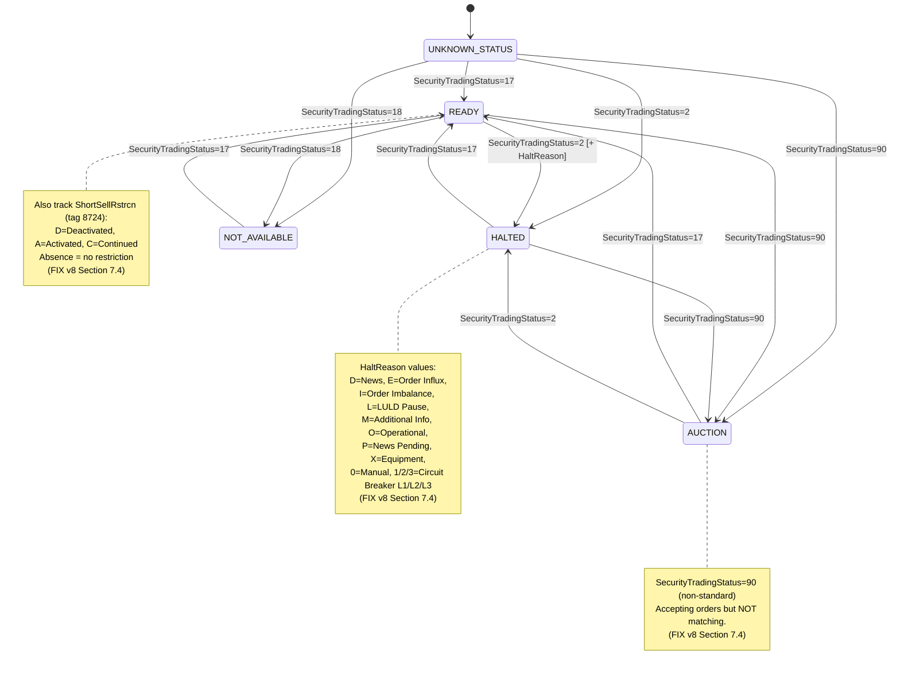

---

## 4. Session Management

> **Why this matters**: Each FIX session has specific handshake requirements. Get any parameter wrong and the connection is rejected or immediately dropped. The three feeds have subtly different requirements — the FIX v8 feed requires ResetSeqNumFlag=Y on every logon (unique to that feed), while the Order Entry feed doesn't even include that field. These differences must be hardcoded correctly in the gateway.

### 4.1 FIX Session Parameters Required at Connection

| Parameter | IOI v1.2 | FIX v8 | Order Entry v2.2 |
|---|---|---|---|
| BeginString (tag 8) | "FIX.4.2" | "FIX.4.2" | "FIX.4.2" |
| EncryptMethod (tag 98) | 0 (none) | 0 (none) | 0 (none) |
| HeartBtInt (tag 108) | Client dictates (seconds) | Client dictates (seconds) | Client dictates (seconds) |
| ResetSeqNumFlag (tag 141) | Optional | **REQUIRED = Y** | Not in Logon spec |
| SenderCompID (tag 49) | Assigned by server | Assigned by server | Assigned by tZERO |
| TargetCompID (tag 56) | Assigned by server | Assigned by server | Assigned by tZERO |
| TargetSubID (tag 57) | **Not present** | Optional, assigned by tZERO | Optional, assigned by tZERO |

### 4.2 Request ID Uniqueness Rules

> Source: FIX v8 Sections 6.1, 6.2, 6.3

All request IDs must be globally unique across these three namespaces:

| ID Field | Tag | Used In |
|---|---|---|
| MDReqID | 262 | MarketDataRequest (MsgType=V) |
| TradSesReqID | 335 | TradingSessionStatusRequest (MsgType=g) |
| SecurityStatusReqID | 324 | SecurityStatusRequest (MsgType=e) |

The same ID can be reused to unsubscribe (SubscriptionRequestType=2) from a previous subscription.

### 4.3 Order ID Rules

> Source: OE v2.2 Section 4.7.1 (highlighted in red)

| Rule | Constraint |
|---|---|
| ClOrdID length | Maximum 20 characters |
| ClOrdID format | **NO LEADING ZEROES** (will reject) |
| ClOrdID uniqueness | Must be unique per session (reuse same ID for cancel reference) |
| OrigClOrdID | Points to the ClOrdID of the order being cancelled/replaced |
| OrderID (tag 37) | tZERO internal ID — store on acceptance for all subsequent operations |

### 4.4 Heartbeat Management

All three sessions use the same heartbeat mechanism:
1. Client sets HeartBtInt on Logon (e.g., 30 seconds)
2. If no messages received within HeartBtInt, send TestRequest (MsgType=1)
3. Counterparty must respond with Heartbeat (MsgType=0) echoing TestReqID (tag 112)
4. If no response to TestRequest within reasonable timeout, consider connection lost

---

## 5. Disconnect and Recovery

> **Why this matters**: Network disconnects are inevitable. What happens next determines whether users see stale data, miss fills, or experience data loss. Each feed handles disconnects differently, and the application must implement the correct recovery procedure for each. The IOI feed replays everything from scratch. The FIX v8 feed requires you to re-subscribe manually. The Order Entry feed supports standard FIX gap recovery. Getting this wrong means users see phantom orders, stale prices, or missed fills.
>
> **The user should never know**: From the user's perspective, a brief "reconnecting..." indicator should appear and then disappear. They should never need to manually refresh or re-login. The WebSocket gateway's last-value cache ensures users see current data the instant they reconnect.

### 5.1 Recovery Behavior by Feed

| Feed | What Happens on Disconnect | Recovery Procedure | Source Reference |
|---|---|---|---|
| IOI v1.2 | Server cancels ALL client subscriptions | Reconnect -> Logon -> Send MarketDataRequest -> Receive full state replay ("as if first time connecting") -> Wait for "IOI REFRESH COMPLETE" heartbeat | IOI v1.2 Section 3 |
| FIX v8 | ALL subscriptions removed server-side. Session recovery NOT supported | Reconnect -> Logon with ResetSeqNumFlag=Y -> Re-send all MarketDataRequest / SecurityStatusRequest / TradingSessionStatusRequest -> Process snapshots to rebuild state | FIX v8 Section 3 |
| Order Entry | Standard FIX recovery (Resend Request) | Reconnect -> Logon -> Use MsgSeqNum to detect gaps -> Resend Request for missed messages -> Process execution reports to reconcile order state | OE v2.2 (standard FIX 4.2 behavior) |

### 5.2 Application-Level Recovery Strategy

When ANY upstream FIX session disconnects:

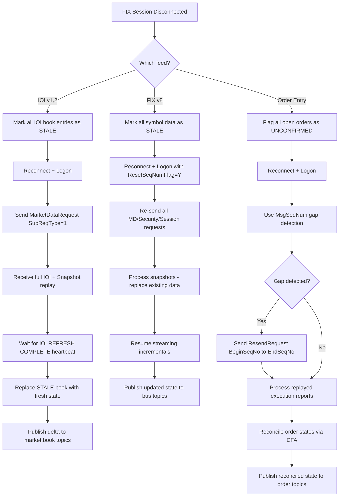

### 5.3 User-Facing Reconnect

When a user's WebSocket disconnects from the WebSocket Gateway:

1. Client reconnects to WebSocket Gateway
2. Client re-subscribes to previously watched symbols
3. Gateway delivers **last-value-cached** data immediately (from message bus LVC)
4. User sees current state without waiting for next tZERO update
5. Streaming updates resume from bus subscriptions

The user should NEVER need to know about FIX session state. The gateway abstracts all recovery.

---

## 6. Deduplication

> **Why this matters**: In a trading system, processing a message twice can mean showing a user a duplicate fill, double-counting volume, or displaying a ghost order. The FIX protocol has built-in dedup mechanisms (sequence numbers, PossDupFlag, PossResend), but each feed handles them differently. The FIX v8 feed can't even be resent — the server always responds with GapFill. The Order Entry feed supports real resends, so you might see the same execution report twice with PossDupFlag=Y. Our message bus adds its own idempotency layer on top of FIX-level dedup.

### 6.1 FIX-Level Deduplication

> Source: All three specs, Header Section (tags 34, 43, 97)

Three mechanisms exist in the FIX protocol for detecting duplicates:

| Mechanism | Tag | Logic |
|---|---|---|
| **MsgSeqNum** | 34 | Monotonically increasing. If you see a SeqNum you've already processed, it's a duplicate |
| **PossDupFlag** | 43 | If Y, this is a retransmission of a message sent earlier. Dedup by MsgSeqNum — same SeqNum, same content |
| **PossResend** | 97 | If Y, this message contains content already sent under a DIFFERENT SeqNum. Dedup by content (e.g., ExecID for fills, IOIid for IOIs) — different SeqNum, same payload |

### 6.2 Dedup Strategy by Feed

| Feed | Strategy | Key Fields for Dedup |
|---|---|---|
| IOI v1.2 | Track MsgSeqNum. On PossDupFlag=Y, discard if SeqNum already seen. On PossResend=Y, check IOIid to see if already applied | MsgSeqNum, IOIid |
| FIX v8 | **No resend possible** — server always sends GapFill. Dedup only needed for PossDupFlag on the rare retransmission. For incremental refreshes, MDEntryID (tag 278) is the trade-level dedup key | MsgSeqNum, MDEntryID |
| Order Entry | Track MsgSeqNum + ExecID. On PossDupFlag=Y, discard if SeqNum already processed. On PossResend=Y, check ExecID to see if fill already recorded | MsgSeqNum, ExecID (tag 17), ExecRefID (tag 19) |

### 6.3 Application-Level Deduplication

At the message bus level, each message carries an idempotency key:

| Bus Topic | Idempotency Key | Dedup Window |
|---|---|---|
| `market.book.{symbol}` | IOIid (from IOI feed) or `{symbol}:{side}:{price}` (from FIX v8) | Until replaced or deleted |
| `market.trade.{symbol}` | MDEntryID (tag 278) | Trading day |
| `market.quote.{symbol}` | `{symbol}:{side}` (last-value, always overwrite) | N/A — always latest |
| `market.snapshot.{symbol}` | `{symbol}:{entryType}` (last-value) | N/A — always latest |
| `order.{userId}.{clOrdId}` | ExecID (tag 17) | Order lifetime |
| `position.{userId}` | ExecID (tag 17) | Trading day |

### 6.4 Sequence Number Edge Cases

> Source: IOI v1.2 Section 3, FIX v8 Section 3

| Scenario | IOI v1.2 Behavior | FIX v8 Behavior | Order Entry Behavior |
|---|---|---|---|
| Incoming SeqNum < expected, PossDupFlag != Y | **Unrecoverable error. Connection DROPPED.** | Same (standard FIX) | Same (standard FIX) |
| Incoming SeqNum < expected, PossDupFlag = Y | Process as duplicate (discard) | Process as duplicate (discard) | Process as duplicate (discard) |
| Incoming SeqNum > expected | Issue Resend Request (BeginSeqNo..EndSeqNo) | Issue Resend Request (server responds GapFill) | Issue Resend Request (server processes normally) |
| Incoming SeqNum = expected | Normal processing | Normal processing | Normal processing |

---

## 7. Message Bus Envelope Specification

> **Why this matters**: The raw FIX messages from tZERO are protocol-specific — tag=value pairs with sequence numbers and checksums. Our internal bus needs a cleaner, self-describing format that any consumer (WebSocket gateway, logging system, analytics pipeline) can understand without knowing FIX. The envelope wraps every message with routing metadata (topic, source, timestamps) and an idempotency key for dedup. The payload contains the normalized trading data in a format ready for the frontend.

Every message on the internal bus uses a standardized envelope. This ensures consistent handling by all consumers.

### 7.1 Envelope Schema

```json
{
  "header": {
    "messageId": "uuid-v4",
    "topic": "market.trade.AAPL",
    "source": "fix-md-v8",
    "sourceSeqNum": 12345,
    "timestamp": "2026-05-08T14:30:00.123Z",
    "sourceTimestamp": "2026-05-08T14:30:00.100Z",
    "idempotencyKey": "trade-MDEntryID-abc123",
    "version": 1
  },
  "payload": {
    "symbol": "AAPL",
    "eventType": "TRADE",
    "data": { }
  }
}
```

### 7.2 Header Fields

| Field | Type | Description |
|---|---|---|
| `messageId` | UUID v4 | Globally unique message identifier, generated by gateway |
| `topic` | string | Bus topic this message is published to |
| `source` | enum | `ioi-v12`, `fix-md-v8`, `order-entry-v22` |
| `sourceSeqNum` | integer | Original FIX MsgSeqNum (tag 34) from upstream |
| `timestamp` | ISO 8601 | Time message entered the bus (our clock) |
| `sourceTimestamp` | ISO 8601 | SendingTime (tag 52) from upstream FIX message |
| `idempotencyKey` | string | Dedup key — consumers use this to detect duplicates |
| `version` | integer | Schema version for this message type |

### 7.3 Payload Schemas by Event Type

#### Market Data Events (from IOI v1.2 + FIX v8)

```json
{
  "symbol": "AAPL",
  "eventType": "SNAPSHOT",
  "data": {
    "open": 150.0000,
    "high": 152.5000,
    "low": 149.2500,
    "close": 151.7500,
    "previousClose": 150.5000,
    "volume": 1234567,
    "lastPrice": 151.8000,
    "lastSize": 100,
    "lastTradeTime": "2026-05-08T14:30:00.123Z",
    "initPrx": null
  }
}
```

```json
{
  "symbol": "AAPL",
  "eventType": "BOOK_UPDATE",
  "data": {
    "source": "ioi",
    "ioiId": "abcdef1234567890abcdef",
    "action": "NEW",
    "side": "BUY",
    "price": 151.5000,
    "size": 500
  }
}
```

```json
{
  "symbol": "AAPL",
  "eventType": "BOOK_UPDATE",
  "data": {
    "source": "fix",
    "action": "CHANGE",
    "side": "SELL",
    "price": 152.0000,
    "size": 300,
    "numOrders": 5
  }
}
```

```json
{
  "symbol": "AAPL",
  "eventType": "TRADE",
  "data": {
    "mdEntryId": "trade-12345",
    "price": 151.7500,
    "size": 200,
    "tradeCondition": null,
    "totalVolumeTraded": 1234767,
    "timestamp": "2026-05-08T14:30:00.100Z"
  }
}
```

```json
{
  "symbol": "AAPL",
  "eventType": "QUOTE",
  "data": {
    "bestBid": 151.5000,
    "bestBidSize": 500,
    "bestOffer": 152.0000,
    "bestOfferSize": 300,
    "quoteCondition": null
  }
}
```

#### Status Events (from FIX v8)

```json
{
  "symbol": "AAPL",
  "eventType": "SECURITY_STATUS",
  "data": {
    "tradingStatus": "HALTED",
    "haltReason": "LULD_PAUSE",
    "shortSellRestriction": "ACTIVATED"
  }
}
```

```json
{
  "eventType": "SESSION_STATUS",
  "data": {
    "sessionId": "CORE",
    "sessionStatus": "OPEN",
    "circuitBreakers": {
      "level1": 4500.00,
      "level2": 4250.00,
      "level3": 4000.00
    }
  }
}
```

#### Order Events (from Order Entry v2.2)

```json
{
  "userId": "user-12345",
  "clOrdId": "ORD1234567890",
  "eventType": "ORDER_ACCEPTED",
  "data": {
    "orderId": "TZERO-98765",
    "symbol": "AAPL",
    "side": "BUY",
    "orderQty": 100,
    "price": 151.5000,
    "ordType": "LIMIT",
    "timeInForce": "DAY",
    "leavesQty": 100,
    "cumQty": 0,
    "avgPx": 0.0000,
    "transactTime": "2026-05-08T14:30:00Z"
  }
}
```

```json
{
  "userId": "user-12345",
  "clOrdId": "ORD1234567890",
  "eventType": "EXECUTION",
  "data": {
    "execId": "EXEC-456",
    "execType": "PARTIAL_FILL",
    "lastShares": 50,
    "lastPx": 151.5000,
    "leavesQty": 50,
    "cumQty": 50,
    "avgPx": 151.5000,
    "lastMarket": "STX",
    "execBroker": "BROKER-1",
    "contraBroker": "BROKER-2",
    "position": {
      "size": 50,
      "costBasis": 7575.0000,
      "realizedPnl": 0.00,
      "unrealizedPnl": 0.00
    },
    "transactTime": "2026-05-08T14:30:01Z"
  }
}
```

---

## 8. Data Flow: tZERO to User Screen

> **Why this matters**: This section maps every pixel on the user's screen back to a specific FIX tag from a specific feed. If a product manager asks "where does the bid price come from?" or a developer asks "which topic should I subscribe to for the volume column?", this section gives the definitive answer. It eliminates guesswork during frontend implementation.

### 8.1 Overview Dashboard (All Symbols)

> **What the user sees**: A scrolling table of all tradeable symbols — similar to the Bloomberg MOST or a watchlist. Each row is one symbol. Columns show last price, change, OHLC, volume, and best bid/ask. This entire view is powered by the IOI v1.2 feed, which streams all symbols simultaneously after a single subscription request.

Data source: **IOI v1.2 feed**

What the user sees per symbol row:

| Column | Source Field | Source Message | Update Trigger |
|---|---|---|---|
| Symbol | tag 55 | IOI / Snapshot | Static |
| Last Price | MDEntryPx (tag 270) where MDEntryType=2 | Snapshot (W) | On trade |
| Change | Calculated: lastPrice - PreviousClosingPx (tag 9846) | Snapshot (W) | On trade |
| Change % | Calculated: change / PreviousClosingPx * 100 | Snapshot (W) | On trade |
| Open | MDEntryPx where MDEntryType=4 | Snapshot (W) | Once at open |
| High | MDEntryPx where MDEntryType=7 | Snapshot (W) | On new high |
| Low | MDEntryPx where MDEntryType=8 | Snapshot (W) | On new low |
| Close/Prev Close | PreviousClosingPx (tag 9846) | Snapshot (W) | Start of day |
| Volume | TotalVolumeTraded (tag 387) | Snapshot (W) | On trade |
| Bid | Best bid price from IOI book | IOI (MsgType=3) | On book change |
| Ask | Best ask price from IOI book | IOI (MsgType=3) | On book change |
| Bid Size | Best bid IOIShares from IOI book | IOI (MsgType=3) | On book change |
| Ask Size | Best ask IOIShares from IOI book | IOI (MsgType=3) | On book change |

### 8.2 Symbol Detail View

> **What the user sees**: When a user clicks on a symbol, they get the deep-dive view — full order book ladder, time & sales (individual trade prints), candlestick chart, trading status indicators, and auction/imbalance data. This view is powered by the FIX v8 feed, which is subscribed per-symbol only when the user opens the detail view (lazy subscription for bandwidth efficiency).

Data source: **FIX v8 feed** (subscribe per-symbol when user opens detail)

| Component | Source Field | Source Message | Update Trigger |
|---|---|---|---|
| Order Book (full depth) | MDEntryType 0/1, MDEntryPx, MDEntrySize, NumberOfOrders | Snapshot (W) + Incremental (X) | On book change |
| Best Bid/Offer | MDEntryType 0/1, MDEntryPx, MDEntrySize | Incremental (X) with MarketDepth=1 | On BBO change |
| Time & Sales | MDEntryType=2, MDEntryPx, MDEntrySize, MDEntryTime | Incremental (X) | On trade |
| Trade Conditions | TradeCondition (tag 277) | Incremental (X) | On trade |
| OHLC Bars | MDEntryType 4/5/7/8 | Snapshot (W) + Incremental (X) | On OHLC change |
| Volume | TotalVolumeTraded (tag 387) | Incremental (X) where MDEntryType=2 | On trade |
| Imbalance | MDEntryType=A, MDEntrySize, TradeCondition (P/Q) | Incremental (X) | On imbalance change |
| Theoretical Open | MDEntryType=y, MDEntryPx | Incremental (X) | During auction |
| Trading Status | SecurityTradingStatus (tag 326), HaltReason (tag 327) | Security Status (f) | On halt/resume |
| Short Sale Restriction | ShortSellRstrcn (tag 8724) | Security Status (f) | On SSR change |

### 8.3 Order Management View

> **What the user sees**: Their personal order blotter — open orders, fill history, current positions, and P&L. This is entirely private to each user (unlike market data which is shared). Each user's orders are routed through a single shared FIX session, multiplexed by ClOrdID. The position fields (PosSIZ, PosCOST, PosRpnl, PosUpnl) are recalculated by tZERO on every fill, bust, and correction — we don't need to calculate P&L ourselves.

Data source: **Order Entry v2.2 feed** (per-user, per-order)

| Component | Source Fields | Update Trigger |
|---|---|---|
| Open Orders | ClOrdID, Symbol, Side, OrderQty, Price, TimeInForce, LeavesQty, CumQty, AvgPx, OrdStatus | On any execution report |
| Order Status | ExecType (tag 150), OrdStatus (tag 39) | On any execution report |
| Fill Blotter | ExecID, LastShares, LastPx, LastMarket, TransactTime, ExecBroker, ContraBroker | On fill |
| Position | PosSIZ (9383), PosCOST (9384), PosRpnl (9385), PosUpnl (9389) | On fill/bust/correction |
| Reject Reason | OrdRejReason (tag 103) or CxlRejReason (tag 102) + Text (tag 58) | On reject |

---

## 9. Latency Budget

> **Why this matters**: In a trading application, latency is the difference between seeing the current price and seeing a stale price. At 1M concurrent users, every unnecessary millisecond multiplied across the fan-out creates a compounding delay. Our target is sub-100ms end-to-end — from the moment tZERO sends a price update to the moment it renders on the user's screen. InPlay is a high-volume trading platform (thousands of orders/sec during game events) with human-speed latency requirements (sub-100ms, not the microsecond targets of algorithmic HFT systems). Bloomberg Terminal targets similar latency for display-grade market data.

### 9.1 End-to-End Target: < 100ms from tZERO to User Screen

| Hop | Component | Target Latency | Notes |
|---|---|---|---|
| 1 | tZERO -> FIX Gateway (network) | < 1ms | Co-located or low-latency link |
| 2 | FIX Gateway parse + normalize | < 2ms | Binary FIX parsing, no disk I/O |
| 3 | Gateway -> Message Bus publish | < 2ms | In-memory pub/sub |
| 4 | Bus -> WebSocket Gateway (internal) | < 5ms | Same datacenter |
| 5 | WebSocket Gateway -> Client (network) | < 30ms | CDN/edge, geographic dependent |
| 6 | Client render | < 16ms | Single frame at 60fps |
| **Total** | | **< 56ms typical** | Buffer to 100ms for p99 |

### 9.2 Throughput Estimates at 1M Users

> **Open question for tZERO onboarding**: The 25,000 msg/sec estimate below is derived from assumed symbol count (~500) and assumed update rate (50/sec/symbol during active trading). These are reasonable estimates but not tZERO-published numbers. During onboarding, ask tZERO:
> 1. What is the peak aggregate message rate across IOI + FIX MD feeds for InPlay's symbol universe?
> 2. What is the peak per-symbol message rate during high-volatility events?
> 3. Does the rate vary significantly between NFL game days and off-days?
>
> The architecture has massive headroom (QuickFIX C++ parses millions of msg/sec, NATS handles 820K msg/sec), so even 10x the estimate would not stress the ingest pipeline. The fan-out side (NATS → WebSocket → 1M clients) is the real scaling challenge regardless of the upstream rate.

| Metric | Estimate | Rationale |
|---|---|---|
| Symbols watched per user (avg) | 10 | Watchlist + detail view |
| Unique symbols across all users | ~500 | tZERO symbol universe |
| Market updates per symbol per second (peak) | 50 | Active trading **(estimated — confirm with tZERO)** |
| Total upstream messages/sec from tZERO | 25,000 | 500 symbols * 50 updates **(estimated)** |
| Fan-out messages/sec to all users | 500M | 25K * 10 symbols * 1M users / 500 unique |
| WebSocket messages/sec per user (peak) | 500 | 10 symbols * 50 updates |

### 9.3 Optimization Strategies

| Strategy | Impact | Applicable to |
|---|---|---|
| **Conflation/Throttling** | Merge rapid updates into single frame updates (e.g., max 10 updates/sec per symbol to client) | Quotes, book depth |
| **Delta compression** | Only send changed fields, not full snapshots | All market data |
| **Last-value cache** | New subscribers get current state immediately, no wait | All topics |
| **Topic partitioning** | Partition by symbol hash for horizontal scaling | Message bus |
| **Binary encoding** | Protobuf/FlatBuffers instead of JSON on WebSocket | Client delivery |
| **Top-of-Book default** | Subscribe MarketDepth=1 unless user explicitly opens full depth | Per-symbol subscriptions |
| **Lazy symbol subscription** | Only subscribe to FIX v8 detail when user opens symbol view | FIX v8 per-symbol requests |
