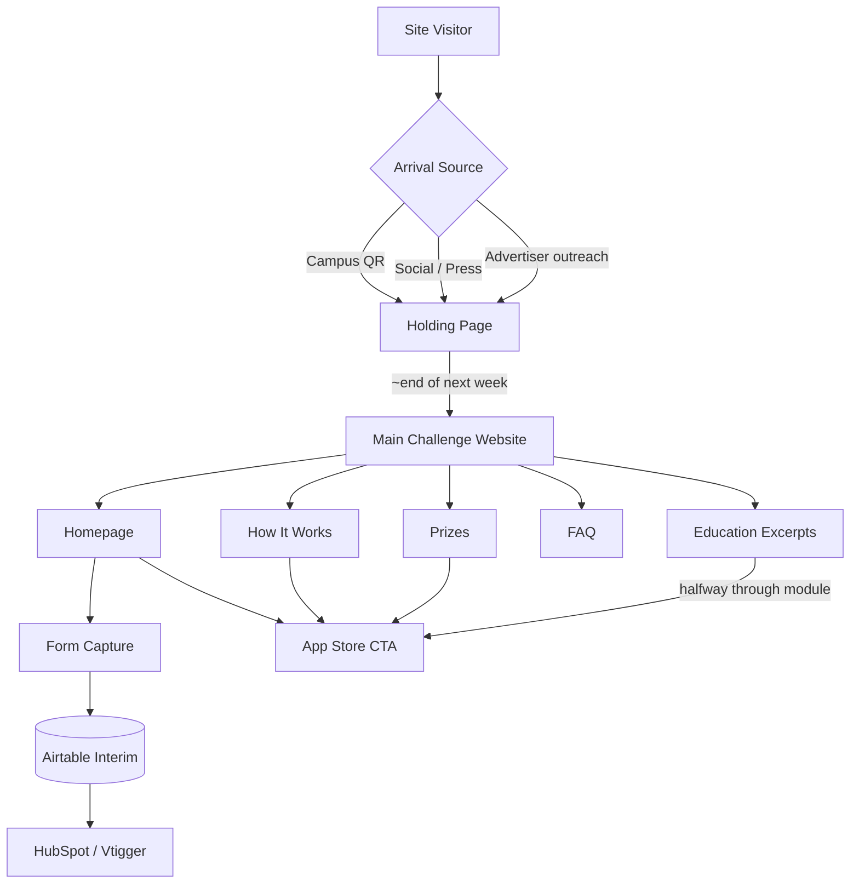
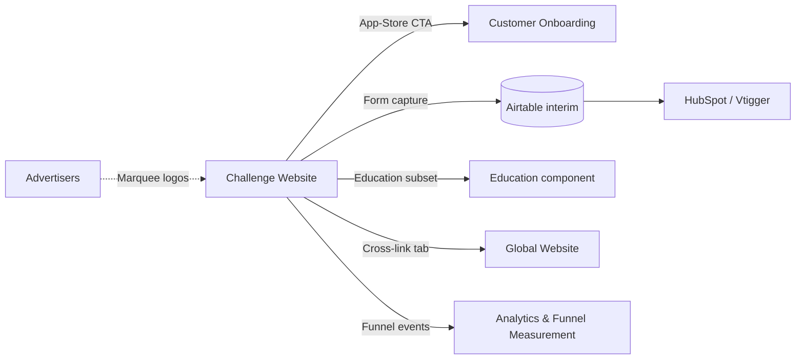

# InPlay Trading Challenge -- Challenge Website

> **Vision:** [[vision]]
> **Date:** 2026-05-14
> **Status:** Defined
> **Owner:** George Westbrook (engineering) / Skye Capazorio (content + brand alignment) / Brett StClair (client-facing)
> **Sources:** _[[meetings/06-05-2026-vision-workshop]], [[12-05-2026-onboarding-and-renewal-and-global-component]], [[meetings/14-05-2026-education-thirdspace-challenge-website]]_

---

## 1. What Does This Component Do?

**Functional purpose:**

The Challenge Website is the **pre-app funnel surface** for the InPlay Trading Challenge. Its single job is to convert curious visitors into app downloads. Edwin's framing in this session was decisive: _"This is a support page more than a destination page. I mean, as far as awareness... not for technical support of any kind."_ And: _"I think we'd rather have them get their information from the app. The more times they're on the app, the better it is for our advertising metrics."_

The site does **not** try to be the central content hub for InPlay (the analogy Skye rejected: _"I don't see the website becoming the central content hub for InPlay like it would be for Formula 1 for example, you know, where people are being driven to the website"_). It does not host the leaderboard. It does not show the live match tracker. It does not host the full education catalogue. Those surfaces are explicitly **too high-value** to leak from the app (Cody: _"It's too high value... we don't want any of that on the on the landing page"_).

What the website does provide:

- **Holding Page** -- the interim surface that goes live almost immediately (~15 May 2026, the day after this session) and replaces the existing legacy website (which is in the old brand colours -- green / black -- and tone). The holding page is a "Coming Soon" surface with a buy / sell / hold tease, the InPlay logo, and a form-capture field for early-interest registration. Stays live until the proper Challenge Website ships at the end of the following week.
- **Homepage** -- the main entry. Value proposition, marquee partner ticker, the visual brand promise. Pushes hard to the app store.
- **How It Works** -- explains the trading challenge enough for a college student or curious public visitor to understand and decide to download.
- **Prizes** -- the $5-25M prize pool, daily distribution model, the "what can I earn" answer.
- **FAQ** -- common questions, support-page tone (not technical support, but awareness support).
- **Education Excerpts** -- a curated subset of the Education component's reels exposed for pre-app visitors. Progressive disclosure: George's model was "halfway through module one, the page says 'go to the app to continue.'"
- **Form Capture** -- the holding-page mechanic that survives into the main site: a sign-up form that captures interested users and pipes them into the CRM (Airtable initially, HubSpot or Vtigger once Cody's team finalises CRM choice).

The website is co-deployed with -- but architecturally separate from -- the [[components/inplay-global-website/inplay-global-website|InPlay Global Website]]. George recommended separate URLs cross-linked via tabs, for SEO and content focus. Skye agreed.

**Audience for the site (distinct from the audience for the app):**

The site serves multiple inbound flows -- it is **not just** the college-student funnel:

1. **College students** arriving via Troy's campus presentations (QR codes pointing here)
2. **Advertisers** arriving because Skye has reached out -- Edwin: _"the advertisers are not going to go download the app to find out what this is all about first that Sky reaches out to. So, I wanted this to be like kind of a placeholder."_
3. **General public** stumbling across the site via social media, press, search
4. **Existing referrals** -- users referred by others who want to verify legitimacy before downloading

The advertiser flow specifically benefits from **marquee partner logos** visible on the page. Edwin: _"I also think our lead advertisers should be on this page as well. It gives them exposure but also legitimises us as a competition."_ Skye proposed a partner ticker at the top of the page.

```
Challenge Website
├── Holding Page                     (interim, ~15 May → end of next week)
│   ├── Coming Soon hero
│   ├── Buy / Sell / Hold tease
│   ├── Form capture (single form, advertiser / student flag)
│   └── New brand colours (not legacy green/black)
├── Homepage                          (main, end of next week)
│   ├── Hero + value prop
│   ├── Marquee partner ticker
│   ├── App store CTAs (iOS + Android)
│   └── Pushes hard to app download
├── How It Works
├── Prizes
├── FAQ
├── Education Excerpts                (curated subset from Education component)
└── Form Capture + CRM Bridge         (Airtable → HubSpot / Vtigger)
```

**Personas:**

> **Canonical audience definitions:** [[audiences]]

| Audience | How they use this component | What they need from it |
|---------|---------------------------|----------------------|
| **Crypto-Savvy Sports Trader** | Skims fast, verifies legitimacy via SEC / SIPC / T0 / Sport Radar mentions and partner logos, then downloads | Trust signals (SEC reg, SIPC, partners) above the fold. Direct app-store CTAs |
| **Analytical Fan / Armchair GM** | Hits the site after seeing a social post or friend referral. Wants to confirm "is this a real thing?" before downloading | Marquee partner logos for legitimacy. Clear "what can I win" framing on the Prizes page. App-store CTA |
| **Finance-Curious Student** | Hits the site via Troy's campus QR codes. May share with friends from this surface before downloading | Mobile-optimised. Fast download CTA. Social proof (campus tour photos? testimonials? gap). Some education excerpts to feel "I learned something already" |
| **Veteran Trader-Bettor** | Arrives via press / podcast / industry network. Wants to verify the SEC / T0 / Sport Radar partnerships are real before engaging | Partner logos, regulatory framing, links to detailed product info on the Global Website |
| **Advertisers** (not a vision-doc audience but explicitly addressed in this session) | Arrives via Skye / Cody outreach. Wants to validate the platform is real and serious before booking ad inventory | Marquee partner logos. Clear sense of "what's happening, who's behind it." Edwin: _"hey, what the f***** going on? Okay, they got this up. Great."_ |

---

## 2. What Needs to Happen?

**Functional requirements:**

_Holding Page (interim surface, live ~15 May):_

- Replaces the existing legacy InPlay site (which uses old green / black brand)
- "Coming Soon" hero with new brand colours
- Buy / Sell / Hold messaging element (the trading tease)
- InPlay logo
- Single form for data capture
- Form fields: first name, last name, optional mobile, email, business / college (single field), advertiser-or-student type flag
- Form submission stored in Airtable initially (CRM pending)
- Confirmation email fires on submission (manual or automated -- decision pending CRM choice)
- QR codes on Troy's campus presentations point here -- the URL behind the QR code is updatable so traffic re-routes seamlessly when the main site goes live
- Stays live until the main Challenge Website ships at end of the following week
- Skye / Edwin alignment required before publishing

_Homepage (main site, ships end of week following holding page):_

- Hero with value proposition and visual brand promise
- Marquee partner ticker / row of logos at the top of the page (lead advertisers + T0 + Sport Radar + Persona partnerships) -- Skye's proposal, Edwin endorsed _"100%"_
- App store CTAs (iOS + Android) prominently above the fold
- Brief explainer (what this is) -- enough to qualify a download, not the full pitch
- Trust signals: SEC regulation, SIPC insurance, partnerships
- Push hard to app download throughout

_How It Works:_

- Explains the trading challenge mechanic at a high level
- Path-dependent trading framing
- 100K InPlay dollars, real cash prizes
- 30-day season (NFL regular season scope -- confirm in vision context)
- Visual / video supporting material (potentially the hype video Edwin mentioned)
- CTA to app store

_Prizes:_

- $5-25M total prize pool framing
- Daily distribution model (~$200-250K per day)
- Three competition verticals (Best P&L, Risk-Adjusted, Comeback Trader)
- Daily / weekly / monthly / season-long leaderboard structure (described, not displayed live)
- Major event days (Thanksgiving, Christmas)
- CTA to app store

_FAQ:_

- Common questions: "What is this?", "Is it gambling?", "Is it free?", "Who is this for?", "When does it start?", "Where can I download?"
- Awareness support, not technical support
- Anticipates the questions Skye / Cody / Edwin field repeatedly

_Education Excerpts:_

- Curated subset of the Education component's reels
- High-level explainer videos -- the hype video, basics of buy / sell / long / short
- Progressive disclosure: George's _"as it gets to halfway through number one it could say if you want to carry on with this go to the app"_
- Drives download, doesn't substitute for the in-app experience

_Form Capture + CRM Bridge:_

- The holding-page form lives on as a capture mechanism on the main site
- Captures: first name, last name, optional mobile, email, business / college, type flag
- Data lands in Airtable initially (Brett's interim store)
- Pipes through to HubSpot or Vtigger once Cody's CRM strategy is locked
- Brett: _"We're just going to bang it into Air Table, store it there for you and then push that through to HubSpot once you guys are ready"_
- Automated welcome email once CRM is in place; manual until then

_Cross-cutting requirements:_

- Visual cohesion with [[components/inplay-global-website/inplay-global-website|Global Website]] and the mobile app -- _"feel like it's part of the same brand family"_ (Skye, vision-level)
- Architectural separation from the Global Website -- different URL, cross-linked via tabs (George recommended, Skye agreed)
- SEO-focused (custom tags per page, fast load, mobile-optimised)
- Mobile-responsive (most traffic will be mobile-first via social / QR codes)
- Feedback / review mechanism (similar to the one used elsewhere in the project) -- George flagged he can integrate

**Business rules and constraints:**

- **No live data** on the site -- no live leaderboard, no live match tracker, no live prices. Cody / Edwin agreed: too high-value to leak. Push everything to the app
- **No full education repo** -- curated subset only
- **No technical support function** on the site -- Edwin: _"not for technical support of any kind"_
- Brand cohesion required across Global Website + Challenge Website + mobile app
- The site is bare-minimum-enough-information-to-trigger-download, not a content hub
- The Global Website should have a "Challenges" tab that lists current + past + simultaneous challenges and links to this site (Skye's structural request)

**Edge cases and error states:**

- User submits form but unsubscribes immediately -- handle in CRM workflow (gap until CRM lands)
- Form fails to write to Airtable -- need retry / fallback ⚠️ **Gap**
- QR code link breaks during the holding-page → main-site transition -- Skye / Troy / Kevin coordination required to test before launch
- Partner logo on the marquee ticker for a partner that pulls out -- swap-out workflow ⚠️ **Gap**
- Mobile app not yet on the app store at launch -- holding-page CTA must lead to a "notify me" flow, not a broken store link
- Email collision (user submits same email twice) -- merge / overwrite / reject? ⚠️ **Gap**



---

## 3. How Should It Look and Feel?

**Design direction:**

Cohesive with the new InPlay brand family -- Skye described the brand direction at the vision level as "white background, clean, focus on mockups, easy on the eyes." The Challenge Website inherits that aesthetic and the Global Website's design language. The legacy site (green / black) is being explicitly retired in favour of the new brand identity.

Edwin's framing -- _"a support page more than a destination page"_ -- shapes the layout: clean, informational, low-density. Not a content-rich brand site. More like a beautifully-designed landing surface with just enough information to qualify and convert.

The marquee partner ticker is a hero element (Skye's proposal) -- communicates legitimacy at first glance. SEC / SIPC trust signals visible above the fold.

**Reference products:**

- **InPlay Global Website** (sibling component, in design) -- design language source
- **Robinhood landing page** -- minimal, fast, trust-signal-forward (informal reference)
- **Polymarket / Kalshi landing pages** -- comparable category, useful for differentiating against
- **Stripe / Linear marketing sites** -- aesthetic reference for clean, high-trust landing-page design
- **Anti-pattern: Formula 1 website** -- explicitly rejected as a model (Skye: _"I don't see the website becoming the central content hub for InPlay like it would be for Formula 1"_)

**Key UX principles:**

- App store CTA visible above the fold on every page
- Marquee partner logos high in the visual hierarchy (legitimacy)
- Mobile-first -- the majority of traffic arrives via social / QR
- Progressive disclosure on education excerpts: tease, then push to app
- No live data anywhere on the site (decision made in this session)
- Fast load -- SEO and conversion sensitive
- Cohesion with the Global Website + mobile app (brand family, not identical)

---

## 4. How Are We Going to Solve It?

| Capability | Build / Buy / Access | Provider / Approach | Rationale |
|-----------|---------------------|-------------------|-----------|
| Web framework | Build | Static site / React-based (consistent with prototype stack) | Fast load, SEO-friendly, mobile-responsive |
| Holding page deployment | Build | Mini CI/CD pipeline (Brett's son managing production / deployment) | Stand up immediately on InPlay's domain, replacing legacy site |
| Form capture | Build | Custom form → API → Airtable (interim) | Airtable selected as interim store while CRM strategy finalises |
| CRM integration | Buy | HubSpot or Vtigger (Cody's team deciding) | Welcome emails, promotional emails, automated workflows |
| Data extract for Skye / Cody | Build | Spreadsheet export from Airtable / database | Brett: _"we'll just do like a temporary store... bang it into Air Table, store it there for you and then push that through to HubSpot once you guys are ready"_ |
| QR code lifecycle | Build | URL-routable QR codes (backend URL can be updated without reprinting) | Skye flagged: campus presentation QR codes must keep working through holding → main-site transition |
| Marquee partner logos | Build | Static / dynamic ticker, manageable from admin | Edwin / Skye proposed feature |
| Video hosting (excerpts) | Access | YouTube Shorts (same pipeline as Education component) | Consistent with Education infrastructure choice |
| SEO meta tags + structured data | Build | InPlay internal | Per-page custom tags (George flagged separate URLs from Global Website preserve focused SEO) |
| Cross-link to Global Website | Build | Tab / button-based navigation between the two sites | George's recommendation: separate URLs cross-linked, not single-URL routing |
| Analytics + funnel measurement | Buy / Build | Hooks into the cross-cutting Analytics & Funnel Measurement concern (see components.md) | End-to-end CTA tracking is a cross-cutting concern |
| Feedback / review mechanism | Build | Similar to the in-product feedback mechanism George built | Captures inline reviewer comments during build phase |
| Brand assets | Internal | Brett's CI + Skye's brand work in progress | SVG logos prepared (transparent + non-transparent variants -- Brett confirmed) |

---

## 5. What Data Does It Need?

| Data | Direction | Source / Destination | Notes |
|------|-----------|---------------------|-------|
| Form submissions | In / Stored | Visitor → Challenge Website → Airtable (interim) → HubSpot / Vtigger | First name, last name, mobile (optional), email, business / college, type flag |
| Partner logo assets | In | Internal CMS / static asset folder | Marquee ticker content. Sponsor agreements drive what shows |
| Education excerpt videos | In | YouTube Shorts API (via Education component pipeline) | Curated subset only |
| QR code analytics | In | QR code platform (TBD) + site analytics | Track which presentation / source drove which conversions |
| Site analytics | In / Stored | Analytics & Funnel Measurement cross-cutting concern | Visitor counts, sources, conversion to download, conversion to onboarding |
| CRM events | Out | HubSpot / Vtigger | Welcome email, promotional emails, drip flows |
| App store deep links | Out | iOS App Store + Google Play | Direct download / install attribution |
| Prizes / How It Works copy | Stored | InPlay internal CMS or static markdown | Lives with the codebase; updates require a deploy |
| FAQ entries | Stored | InPlay internal CMS or static markdown | Same as above |

---

## 6. Who Can Access It?

| Persona / Role | Access level | Notes |
|---------------|-------------|-------|
| Unauthenticated public | Full read | Anyone with the URL |
| College students (Troy's presentations) | Full read + form capture | Primary intended flow during pre-launch |
| Advertisers (Skye / Cody outreach) | Full read + form capture (advertiser type flag) | Lead advertiser logos displayed on marquee |
| Existing referrals / press | Full read | Validation / legitimacy flow |
| InPlay staff | Admin (CMS) | Update copy, partner logos, FAQ entries, manage form submission queue |

---

## 7. How Do We Know It's Working?

- [ ] App store conversion rate from website visitors -- target TBD with Sky / Cody (gap)
- [ ] Form capture rate on holding page -- benchmark from campus presentation volume
- [ ] Email open + click rate on welcome emails (once CRM live)
- [ ] Holding-page → main-site transition preserves QR code conversion rate (no drop)
- [ ] Marquee partner logos load without lag, no broken images
- [ ] Bounce rate stays low (TBD threshold)
- [ ] Mobile vs desktop traffic split -- expect mobile-dominant given social / QR sources
- [ ] Time-to-first-byte and Lighthouse performance scores (SEO sensitive)
- [ ] Cross-link click-through to Global Website tracks coherent multi-site journey

---

## 8. Dependencies

**What this component needs:**

| Depends on | What we need | Blocking? |
|-----------|-------------|----------|
| Brand CI / design system | Logos, colours, typography, brand voice -- the new brand family that replaces the legacy green / black | Yes for main site, partially for holding page (which uses bare minimum) |
| Domain access | Brett's son needs access to InPlay's domains to deploy | Yes |
| Edwin's flyer (in progress) | Forms the baseline content for the main site -- Skye: _"that will form a substantial portion of the baseline for what the challenge website will be"_ | Yes for main-site content |
| Skye / Edwin content sign-off | Holding page copy + main-site copy alignment | Yes for publishing either |
| CRM choice (HubSpot or Vtigger) | Cody's team's decision | No -- Airtable bridges the gap |
| Education component | High-level explainer videos for the excerpts surface | No -- can launch with hype video alone |
| Global Website | Cross-link tab / button | No -- they ship in parallel |
| Marquee partners | Confirmed lead advertisers + locked partner logos | No -- can launch without, but Edwin / Skye want them for legitimacy |
| QR code URL update process | Troy / Kevin / Skye coordination to update backend URL when holding page goes live | Yes for clean campus-traffic transition |
| App store listings (iOS + Android) | Listed app for CTA to point to | No for holding page; Yes for main-site app-download flow |
| Hype video | The promotional video Edwin / Skye are working on with the production partner | No -- nice-to-have for homepage |
| Analytics & Funnel Measurement cross-cutting concern | Event schema for tracking conversion through the funnel | No -- can launch with basic analytics and layer in |

**What other components need from this one:**

- **Customer Onboarding** receives users who tap the app-store CTA -- the handoff from web to mobile is a key funnel join
- **Referral component** -- referral code links may land on the Challenge Website with the code embedded in the URL (decision pending; could also deep-link directly to app)
- **InPlay Global Website** cross-links to the Challenge Website via a "Challenges" tab (Skye's structural request)
- **Advertising (cross-cutting)** -- marquee partner logos here are the public-facing surface of advertiser relationships
- **Analytics & Funnel Measurement** -- this site is the top-of-funnel; conversion events drive the whole-funnel analytics

---

## 9. Priority

**Must-have at launch?** Two-stage launch:

**Stage 1 (immediate -- ~15 May):**
- **Holding Page is launch-required.** It replaces the legacy green / black site which is brand-inconsistent and tonally off. The holding page must be live before any meaningful social media activity, before more campus presentations, and before advertiser outreach scales. Skye: _"I would like that to be live tomorrow if we can just get consensus from everyone because then it allows us to start doing the pre-posting on social media."_

**Stage 2 (end of week following holding page):**
- **Main Challenge Website is launch-required** before the August launch of the trading challenge itself. The site is the public-facing face of the challenge and must be ready before Skye's media-space sales motion scales.

**Sequencing rationale:**

- Stage 1 (Holding Page) is **time-critical** -- it unblocks social media activity, ongoing campus traffic, and advertiser outreach
- The legacy site coming down + holding page going up must be coordinated with Troy / Kevin to keep QR codes live
- Stage 2 (Main Site) depends on Edwin's flyer (in progress) -- that flyer's content forms the baseline copy
- Skye: _"we are just finalizing a flyer, an information flyer that's going out. That I think will form a substantial portion of the baseline for what the challenge website will be"_
- Education excerpts can layer in progressively once Education component produces content
- Marquee partner logos go live as Skye / Cody close their leads
- Cross-link to Global Website coordinates with Global Website ship date

**Post-MVP (deferred or open):**

- Multiple-challenge support -- Skye: _"we might also have like simultaneous challenges happening at the same time"_ -- future challenges get listed under the Global Website's "Challenges" tab
- Past-challenges archive -- Skye flagged as a future state
- A/B testing infrastructure
- Per-region landing variants (US / UK / other)
- Live regulatory / availability indicator

---

## 10. Risks

**Abuse vectors:**

- Form spam / bots -- mitigation: captcha, rate limiting, server-side validation
- Email farming via fake submissions -- mitigation: email verification before adding to CRM
- Scraping of partner logos / content for misuse -- low risk but worth flagging

**Data risks:**

- Form data PII -- mitigation: encrypted at rest in Airtable / CRM, GDPR / CCPA compliant retention
- QR code transition risk -- if the URL behind a QR code doesn't update cleanly when the holding page goes live, campus traffic breaks
- CRM migration risk -- moving from Airtable to HubSpot / Vtigger without losing leads or duplicating records
- Brand inconsistency risk during transition -- legacy site, holding page, and main site all visible at once for short windows

**Compliance:**

- Form submission must comply with GDPR / CCPA / state privacy laws (right-to-deletion, consent to marketing)
- Marquee partner logos require partner approval (logo usage agreements)
- "Coming Soon" claims must not misrepresent launch date / features (FTC)
- Educational excerpts on the site are subject to the same "not financial advice" rule as the in-app Education component
- App store CTAs must comply with Apple / Google trademark guidelines

**Controls needed:**

- Captcha on form submission
- Email verification before adding to CRM
- Form data encryption at rest
- GDPR / CCPA-compliant retention + delete workflow
- Partner logo usage agreements signed before display
- "Not financial advice" disclaimer on the educational excerpts surface
- Audit log of CMS edits (who changed what, when)
- Backup / recovery for Airtable data before CRM migration

---

## Sub-Components

| Sub-Component | Overview | Status | Link |
|--------------|----------|--------|------|
| Holding Page | _(LIVE ~15 May 2026)_ Interim "Coming Soon" surface replacing legacy site, with form capture and new brand colours. Stays live until main site ships | Ready for build | [[sub-components/holding-page/holding-page]] |
| Homepage | Main entry surface: hero, value prop, marquee partner ticker, app-store CTAs, trust signals | Collecting | [[sub-components/homepage/homepage]] |
| How It Works page | Explains the trading challenge mechanic at a high level. Path-dependent framing. Hype video | Collecting | [[sub-components/how-it-works/how-it-works]] |
| Prizes page | $5-25M prize pool framing, daily distribution model, three competition verticals, major event days | Collecting | [[sub-components/prizes/prizes]] |
| FAQ page | Common-question support page (awareness, not technical support). Anticipates questions Skye / Cody / Edwin field repeatedly | Collecting | [[sub-components/faq/faq]] |
| Education Excerpts | Curated subset of the Education component's reels. Progressive disclosure ("halfway through → go to app") | Collecting | [[sub-components/education-excerpts/education-excerpts]] |
| Form Capture + CRM Bridge | Single form across holding + main site → Airtable (interim) → HubSpot / Vtigger (target CRM) | Ready for build | [[sub-components/form-capture-crm/form-capture-crm]] |

---

> **Update (12–17 June touchdowns):** **Rebuilt on a new template (12-06)** to enable **Google Analytics**, with a fresh deployment link issued; **Microsoft Clarity** heat-mapping is to be added across the sites. **Build priority (12-06):** "how to enter" first, then the **referral program**; the **prize-pool page is deferred** pending the numbers. Funnel principle: "two clicks away from trading", download CTAs that do not bombard. **Prize pool finalised (17-06):** **$21M base + $4M flex** (the flex is ad-revenue-dependent), giving the **"up to $25M"** messaging target the team wants to lead with. This reinforces the standing compliance rule, it is always "up to $25M", **never "guaranteed"** (see [[components/components#Cross-Cutting Concerns|Cybersecurity & Data-Handling]]). _Sources: [[12-06-2026-touchdown]], [[17-06-2026-touchdown]]. See [[digests/touchdowns-12-17-jun-2026]]._

## Diagrams

_Funnel diagram appears in Section 2. Sub-component tree appears in Section 1._



---

## Gaps and Questions for Next Call

### Gaps

- **Visual design / mockups** -- not produced in this session; awaiting Edwin's flyer + designer pass
- **Hype video** -- in production, no ETA in this session
- **CRM choice (HubSpot vs Vtigger)** -- Cody's team deciding
- **Specific app-store CTAs** -- pre-launch, app store listings not yet live
- **Marquee partner logos** -- list and order not finalised
- **FAQ content** -- not drafted; Skye to provide
- **Prizes page detail** -- prize schedule still being finalised by Edwin / Cody (per touchdown call -- "close of business Monday, maybe Tuesday")
- **Form spam protection** -- captcha / rate limiting not specified
- **Multi-challenge architecture** -- decision deferred to future state
- **QR code URL update mechanic** -- Troy / Kevin coordination needed before holding page ships
- **App-store-not-yet-live fallback** -- if holding page goes live before app is listed, what does the CTA do?
- **Domain access for Brett's son** -- needs Skye / Edwin / Cody action

### Questions for Edwin / Cody / Skye

1. When does the legacy InPlay site come down? (Same day as holding page goes up, or separately?)
2. Which CRM are we going with -- HubSpot or Vtigger?
3. For the marquee partner ticker -- confirmed partners to list at holding-page launch vs main-site launch?
4. App store listings -- timeline for both iOS and Android? Holding-page CTA depends on this
5. Edwin's flyer -- ETA for the designer pass and handover to Brett / George?
6. Hype video -- when does it land and is it for the holding page or the main site?
7. Skye -- where do we surface "challenges" listing on the Global Website (tab placement, content)?
8. Multiple simultaneous challenges -- in scope for the first build or strictly future state?
