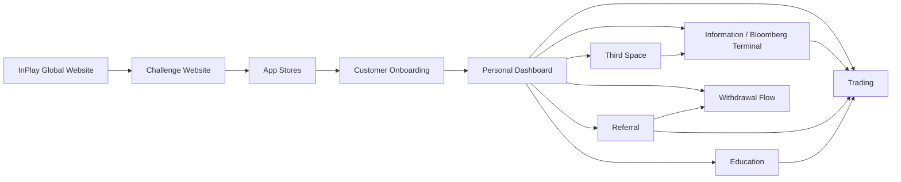

# InPlay Trading Challenge — Components

> **Vision:** [[vision]]

## Overview

**Twelve components.** Customer Onboarding, Referral, Information Layer, Education, Third Space, and Challenge Website are now `Defined` (full component docs). InPlay Global Website is `In Design` (active design work). Withdrawal Flow was surfaced in the 12-06-2026 call as a separate component — currently `Stub`. Trading remains `Collecting` despite having a fleshed-out doc (open data + UX questions outstanding). IPO Module is now `Defined` (26-05-2026 deep-dive) with all six sub-components decomposed into entity journeys; it's the gating event that issues every tradeable asset before secondary trading opens (open items: T0 ledger mechanics, unsold-share handling). Earnings Report was documented from the 27-05-2026 deep-dive — `Collecting`; it's the recurring tradable event (Tue NFL / Wed NCAA) where each team's off-field earnings (EST vs ACT) re-price the market, built on the off-field mechanic seeded at IPO.

## Component Map



## System Layout

```
┌─────────────────────────────────────────────────────────────────────┐
│                     CROSS-CUTTING: Advertising                      │
│         moment-based · geo-targeted · demographic-targeted          │
├─────────────────────────────────────────────────────────────────────┤
│                  CROSS-CUTTING: Push / CRM                          │
│        trading alerts · referral prompts · game reminders           │
├──────────────────────┬──────────────────────────────────────────────┤
│                      │                                              │
│   Web (Pre-App)      │   Mobile App                                 │
│                      │                                              │
│  ┌────────────────┐  │  ┌────────────────────────────────────────┐  │
│  │ InPlay Global  │  │  │       Customer Onboarding              │  │
│  │ Website        │  │  │  signup · KYC · account · referral code│  │
│  └──────┬─────────┘  │  └──────────────────┬─────────────────────┘  │
│         │            │                     │                        │
│  ┌──────▼─────────┐  │  ┌──────────────────▼─────────────────────┐  │
│  │ Challenge      │  │  │         Personal Dashboard             │  │
│  │ Website        │──┼─▶│  money · referrals · rankings · games  │  │
│  └────────────────┘  │  └──────┬────────┬────────┬────────┬──────┘  │
│                      │         │        │        │        │         │
│  (drives app         │  ┌──────▼─────┐ ┌▼──────┐ ┌▼─────┐ ┌▼─────┐ │
│   download &         │  │Information │ │Trading│ │Refer-│ │Third │ │
│   signup)            │  │/ Bloomberg │ │       │ │ral   │ │Space │ │
│                      │  │            │ │       │ │      │ │      │ │
│                      │  │• News feed │ │• Buy/ │ │• Code│ │• Chat│ │
│                      │  │• Market    │ │  sell │ │  gen │ │• Shar│ │
│                      │  │  data      │ │• Long/│ │• Dual│ │  ed  │ │
│                      │  │• Team page │ │  short│ │  side│ │  trad│ │
│                      │  │• Game page │ │• P&L  │ │  rew-│ │  es  │ │
│                      │  │• Stats     │ │• Port-│ │  ards│ │• Fan-│ │
│                      │  │• Leader-   │ │  folio│ │• Wall│ │  dom │ │
│                      │  │  boards    │ │• Wall-│ │  et  │ │      │ │
│                      │  │• Block     │ │  et   │ │• Soc-│ │      │ │
│                      │  │  alerts    │ │  mgmt │ │  ial │ │      │ │
│                      │  │            │ │       │ │  earn│ │      │ │
│                      │  │            │ │       │ │• Spon│ │      │ │
│                      │  └────────────┘ └───────┘ └──────┘ └──────┘ │
│                      │                                              │
│                      │  ┌────────────────────────────────────────┐  │
│                      │  │            Education                   │  │
│                      │  │  • Trading basics (buy/sell/long/short)│  │
│                      │  │  • Momentum, volatility, risk mgmt    │  │
│                      │  │  • 40,000 foot level — not granular   │  │
│                      │  │  • Financial literacy transfer         │  │
│                      │  └────────────────────────────────────────┘  │
│                      │                                              │
├──────────────────────┴──────────────────────────────────────────────┤
│                     EXTERNAL DEPENDENCIES                           │
│  ┌──────────┐  ┌──────────┐  ┌──────────┐  ┌──────────────────┐    │
│  │ Sport    │  │ T0       │  │ Persona  │  │ Brokerage        │    │
│  │ Radar    │  │ (ATS)    │  │ (KYC)    │  │ Partners         │    │
│  │ data     │  │ venue    │  │ identity │  │ (future: prod)   │    │
│  └──────────┘  └──────────┘  └──────────┘  └──────────────────┘    │
└─────────────────────────────────────────────────────────────────────┘
```

## Components

| Component | Overview | Key Elements | Status |
|-----------|----------|-------------|--------|
| **[[inplay-global-website/inplay-global-website\|InPlay Global Website]]** | Corporate website — brand presence, multisport positioning, advertiser-facing | Home, About, Advertising (live); Newsroom, Markets (hidden). Hero: animated price chart + multisport visuals. Hype video pending. Skye content lead, Max design | **In Design** |
| **[[challenge-website/challenge-website\|InPlay Challenge Website]]** | Pre-app funnel surface. Edwin: _"support page more than destination page"_ — push everything to the app | 7 sub-components: Holding Page (live ~15 May, replaces legacy green/black site), Homepage (marquee partner ticker), How It Works, Prizes, FAQ, Education Excerpts (curated subset, progressive disclosure), Form Capture+CRM (Airtable→HubSpot/Vtigger). **No live leaderboard or live match tracker on site** — too high value to leak. Separate URL from Global Website, cross-linked via tabs (SEO focus). Must feel cohesive with Global site and app. | **Defined** |
| **[[customer-onboarding/customer-onboarding\|Customer Onboarding]]** | Discovery → install → registration+KYC → wallet provisioning → trading | 5 sub-components: Discovery & App Acquisition, Registration+KYC, Wallet Provisioning (T0, pre-funded pool proposed), Holding State (gray out, never hide), Returning Login (T0 auth + device biometric). No SSO at launch. Email-only manual field. | **Defined** |
| **[[information-layer/information-layer\|Information / Bloomberg Terminal]]** | The data and intelligence layer -- the main stage of the app. Covers "Discover -> See -> Understand -> Decide" user journey | Six sub-components: Discovery/Home, Game Day Overview, Single Game Page, Team Page, Research Tab (undefined), Leaderboard. Consumes SR (sports data, match tracker, news) + T0 (prices, order book). Owns the cross-correlated volatility dataset (SR events x T0 prices). News feed, block trade alerts, leaderboards (3 verticals x 4 time horizons), proximity alerts | Defined |
| **[[ipo-module/ipo-module\|IPO Module]]** | The "Trading Challenge Draft" — how every tradeable asset is issued before secondary trading opens, plus season-end liquidation | 6 sub-components: Draft Board (Tinder/list/filter browse), Team IPO Detail, Primary Offering Execution (5M float, static ask, buy-only, no cap, 20% short holdback), Scheduling & Windows (72h, NCAA ~Aug 20 / NFL ~7d pre-Sept 9), Announcement & Countdown, Season-End Settlement. Issuer = team treasury (on-chain via T0). Seeds the off-field value mechanic that feeds Earnings Report | Defined |
| **[[earnings-report/earnings-report\|Earnings Report]]** | Recurring tradable event — each team company's off-field earnings (EST vs ACT) re-price the market weekly | 5 sub-components: Earnings Feed (batched Bloomberg-style release, Tue NFL / Wed NCAA), Report Card (EST/ACT + embedded trade), Off-Field Earnings Engine (½ on-field winner, $250/game volume-allocated), Historical Earnings & Chart Annotation, Alerts & Countdown. Built on the off-field mechanic seeded by IPO Module | Collecting |
| **Trading** | Trade execution and portfolio management | Buy/sell/long/short execution, order management, portfolio view, P&L tracking (daily/weekly/monthly), trading wallet (100K cap), referral wallet reload (below 25K trigger), position management (seconds to weeks), real-time during live games. Captures trade-with-location event for Referral eligibility rule. | Collecting |
| **[[referral/referral\|Referral]]** | Growth engine — viral referral mechanics, reward system, cash eligibility tracking | 7 sub-components: Code Lifecycle (lifetime-stable), Share Surfaces (link/QR/dot card/t-shirt/embedded-post), Bonus Campaigns (multipliers + cross-product), Cash Eligibility Tracking (transparent checklist), Social Engagement Credits (agent-detected), Sponsor Redemption (future), Donor/Group Accounts (exploratory). Owns cash-payout eligibility rules. | **Defined** |
| **[[third-space/third-space\|Third Space]]** | Community and social layer — stickiness, not core product | 7 sub-components: Game Day Chat (ephemeral, matchup-page, banter), Team/Favorites Chat (persistent, Reddit-style), Research AI Chat (NLP on Sport Radar stats, lives on research tab, Statmuse-style), Moderation System (user-appeals + AI layer, no active InPlay mod, "Zar" community moderators), Chat Admin Backend, plus future-state Sentiment/Data Packaging and Influencer Broadcast Channels. Open-source headless chat platform. InPlay owns all chat data. InPlay does NOT curate or summarise sentiment | **Defined** |
| **[[education/education\|Education]]** | Trading education — basics to get users started, TikTok-native format | 7 sub-components: Modules/Reels Viewer (TikTok-style scroll, 15-sec reels, captions), Quiz/Poll Layer (2-3 multi-choice questions gate reward), Reward Integration (referral wallet credit on completion), Progress Tracking (resume state), AI Chatbot Support (handles 75-85% L1 support — needs its own session per Cody), Education-on-Website (curated subset), Sponsor Ownership Layer (single advertiser owns module per period, embedded content, not programmatic). 12-15 modules total. YouTube Shorts API for video pipeline. Kevin owns content scope. Financial literacy transfer to traditional markets. Potential college syllabus integration | **Defined** |
| **Withdrawal Flow** _(new — surfaced 12-06-2026)_ | Conversion from InPlay$ to real cash — bank info capture, crypto wallet linking, 1099, eligibility verdict surfacing | Captured at first withdrawal request (not signup). Crypto wallet option via Coinbase (Iris conversation referenced). T0 cash wallet hosting. Receives eligibility verdict from Referral. Will be large. | Stub |

## Cross-Cutting Concerns

These are not standalone components — they overlay across multiple components:

- **Advertising / Ad Serving:**
  - Touches: websites, information, trading, referral, third space, education
  - Moment-based (touchdowns, interceptions), geo-targeted (within 3 miles), demographic-targeted (age ranges), time-targeted (post-game)
  - Sponsors own specific games, volatility moments, pages
  - **Packaging model (from 14-05-2026):** sold game-by-game in tier-block bundles. Three tiers (1/2/3) with minimum buys per tier — Edwin's framing: ~minimum 200 of ~2,100 games for top tier, 15+ for lower tiers (Cody). Brands purchase to be _adjacent to_ specific games + the moments-that-matter within those games. Tier 1 / Tier 2 / Tier 3 game classification plus Tier 1 / Tier 2 day classification (Thanksgiving > Sunday > Thursday Night Football). Special-event days (Thanksgiving 3 games, Christmas Netflix-streamed game) command premium
  - **Billing model:** minutes of engagement, not clicks/impressions. Engagement = time spent in interfaces brand is adjacent to (matchup view, team page click-through, etc.)
  - **Replay-persistent ads (George's idea):** ads stay on past-game pages so a user replaying a 6-week-old game still sees the ad — drives perceived value vs transient impressions
  - **Layer above games:** ownership of trading-challenge spaces (P&L, education modules, specific pages) sold separately from game-adjacent inventory
  - **Sponsor-owned education modules** — single advertiser owns a module for a fixed period (monthly+, not programmatic), content co-created. See Education component
  - **Education-on-tokenization angle (Edwin):** T0 partnership creates a valuable educational ad inventory around tokenization/blockchain literacy
  - **Mini-challenge-within-challenge** — premium event days may have own prize pools (Thanksgiving floated at $1M/game)
  - Sky's team selling, sales deck in progress, inventory map due end of week following 14-05-2026
  - Cody / Sky framing on counterintuitive game selection: 1-and-6 vs 1-and-6 games may have more volatility / trading activity than two Super Bowl contenders with strong defenses — flips conventional ad-sales narrative, helps NFL push eyeballs to "bad" games

- **Push Notifications / CRM:**
  - Touches: all components
  - Trading alerts, referral prompts, game reminders, leaderboard updates
  - Potential for sponsor-branded communications
  - Timing, content, and branding all still undefined

- **Personal Dashboard:**
  - Integration point — pulls from trading (money, P&L), information (schedule, rankings), referral (wallet balance + eligibility checklist), third space (activity)
  - Proximity indicators: "you're 112 places away from cashing"
  - The first thing users see on login — their money, their referrals, their rankings, their next opportunity

- **Analytics & Funnel Measurement** _(new — surfaced 12-06-2026):_
  - End-to-end CTA tracking: social engagement → ad serving → app install → onboarding → first trade → referral conversion → behavioural & lifetime value metrics
  - Touches: every customer-facing component plus advertising and push/CRM
  - Each component owns its segment of the funnel; this cross-cutting concern defines the joins
  - Needs a dedicated doc — flagged in [[customer-onboarding/customer-onboarding]] and [[referral/referral]]
  - Status: undefined — no decisions on tooling, event schema, or ownership yet

- **Cybersecurity & Data-Handling Framework** _(new — surfaced 12-06-2026):_
  - Troy flagged: _"the more data we collect, the more sensitive it gets and the more susceptible we are to cyber attacks."_
  - Specifically applies to: PII from Persona, biometric data, location data (Referral), bank info (Withdrawal Flow), wallet ledgers (T0)
  - Needs a dedicated architecture session
  - Status: undefined
