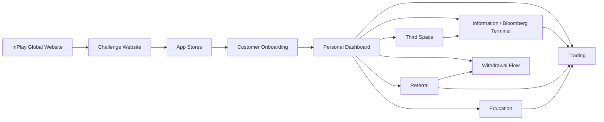

# InPlay Trading Challenge — Components

> **Vision:** [[vision]]

## Overview

**Ten components.** Customer Onboarding, Referral, and Information Layer are now `Defined` (full component docs). InPlay Global Website is `In Design` (active design work). Withdrawal Flow was surfaced in the 12-06-2026 call as a separate component — currently `Stub`. Others remain `Collecting`.

## Component Map



## System Layout

```
┌─────────────────────────────────────────────────────────────────────┐
│                     CROSS-CUTTING: Advertising                      │
│         moment-based · geo-targeted · demographic-targeted          │
├─────────────────────────────────────────────────────────────────────┤
│                  CROSS-CUTTING: Push / CRM                          │
│        trading alerts · referral prompts · game reminders           │
├──────────────────────┬──────────────────────────────────────────────┤
│                      │                                              │
│   Web (Pre-App)      │   Mobile App                                 │
│                      │                                              │
│  ┌────────────────┐  │  ┌────────────────────────────────────────┐  │
│  │ InPlay Global  │  │  │       Customer Onboarding              │  │
│  │ Website        │  │  │  signup · KYC · account · referral code│  │
│  └──────┬─────────┘  │  └──────────────────┬─────────────────────┘  │
│         │            │                     │                        │
│  ┌──────▼─────────┐  │  ┌──────────────────▼─────────────────────┐  │
│  │ Challenge      │  │  │         Personal Dashboard             │  │
│  │ Website        │──┼─▶│  money · referrals · rankings · games  │  │
│  └────────────────┘  │  └──────┬────────┬────────┬────────┬──────┘  │
│                      │         │        │        │        │         │
│  (drives app         │  ┌──────▼─────┐ ┌▼──────┐ ┌▼─────┐ ┌▼─────┐ │
│   download &         │  │Information │ │Trading│ │Refer-│ │Third │ │
│   signup)            │  │/ Bloomberg │ │       │ │ral   │ │Space │ │
│                      │  │            │ │       │ │      │ │      │ │
│                      │  │• News feed │ │• Buy/ │ │• Code│ │• Chat│ │
│                      │  │• Market    │ │  sell │ │  gen │ │• Shar│ │
│                      │  │  data      │ │• Long/│ │• Dual│ │  ed  │ │
│                      │  │• Team page │ │  short│ │  side│ │  trad│ │
│                      │  │• Game page │ │• P&L  │ │  rew-│ │  es  │ │
│                      │  │• Stats     │ │• Port-│ │  ards│ │• Fan-│ │
│                      │  │• Leader-   │ │  folio│ │• Wall│ │  dom │ │
│                      │  │  boards    │ │• Wall-│ │  et  │ │      │ │
│                      │  │• Block     │ │  et   │ │• Soc-│ │      │ │
│                      │  │  alerts    │ │  mgmt │ │  ial │ │      │ │
│                      │  │            │ │       │ │  earn│ │      │ │
│                      │  │            │ │       │ │• Spon│ │      │ │
│                      │  └────────────┘ └───────┘ └──────┘ └──────┘ │
│                      │                                              │
│                      │  ┌────────────────────────────────────────┐  │
│                      │  │            Education                   │  │
│                      │  │  • Trading basics (buy/sell/long/short)│  │
│                      │  │  • Momentum, volatility, risk mgmt    │  │
│                      │  │  • 40,000 foot level — not granular   │  │
│                      │  │  • Financial literacy transfer         │  │
│                      │  └────────────────────────────────────────┘  │
│                      │                                              │
├──────────────────────┴──────────────────────────────────────────────┤
│                     EXTERNAL DEPENDENCIES                           │
│  ┌──────────┐  ┌──────────┐  ┌──────────┐  ┌──────────────────┐    │
│  │ Sport    │  │ T0       │  │ Persona  │  │ Brokerage        │    │
│  │ Radar    │  │ (ATS)    │  │ (KYC)    │  │ Partners         │    │
│  │ data     │  │ venue    │  │ identity │  │ (future: prod)   │    │
│  └──────────┘  └──────────┘  └──────────┘  └──────────────────┘    │
└─────────────────────────────────────────────────────────────────────┘
```

## Components

| Component | Overview | Key Elements | Status |
|-----------|----------|-------------|--------|
| **[[inplay-global-website/inplay-global-website\|InPlay Global Website]]** | Corporate website — brand presence, multisport positioning, advertiser-facing | Home, About, Advertising (live); Newsroom, Markets (hidden). Hero: animated price chart + multisport visuals. Hype video pending. Skye content lead, Max design | **In Design** |
| **InPlay Challenge Website** | Landing page driving registration and app download | Hero, value prop, app store links, social proof, challenge countdown, must feel cohesive with Global site and app. Detail of app-install handoff lives here. | Collecting |
| **[[customer-onboarding/customer-onboarding\|Customer Onboarding]]** | Discovery → install → registration+KYC → wallet provisioning → trading | 5 sub-components: Discovery & App Acquisition, Registration+KYC, Wallet Provisioning (T0, pre-funded pool proposed), Holding State (gray out, never hide), Returning Login (T0 auth + device biometric). No SSO at launch. Email-only manual field. | **Defined** |
| **[[information-layer/information-layer\|Information / Bloomberg Terminal]]** | The data and intelligence layer -- the main stage of the app. Covers "Discover -> See -> Understand -> Decide" user journey | Six sub-components: Discovery/Home, Game Day Overview, Single Game Page, Team Page, Research Tab (undefined), Leaderboard. Consumes SR (sports data, match tracker, news) + T0 (prices, order book). Owns the cross-correlated volatility dataset (SR events x T0 prices). News feed, block trade alerts, leaderboards (3 verticals x 4 time horizons), proximity alerts | Defined |
| **Trading** | Trade execution and portfolio management | Buy/sell/long/short execution, order management, portfolio view, P&L tracking (daily/weekly/monthly), trading wallet (100K cap), referral wallet reload (below 25K trigger), position management (seconds to weeks), real-time during live games. Captures trade-with-location event for Referral eligibility rule. | Collecting |
| **[[referral/referral\|Referral]]** | Growth engine — viral referral mechanics, reward system, cash eligibility tracking | 7 sub-components: Code Lifecycle (lifetime-stable), Share Surfaces (link/QR/dot card/t-shirt/embedded-post), Bonus Campaigns (multipliers + cross-product), Cash Eligibility Tracking (transparent checklist), Social Engagement Credits (agent-detected), Sponsor Redemption (future), Donor/Group Accounts (exploratory). Owns cash-payout eligibility rules. | **Defined** |
| **Third Space** | Community and social layer — stickiness, not core product | Share executed trades (long/short), strategy discussion, fandom chat, social proofing, organic peer learning, meme-stock-style dynamics possible. Follow-individual mechanic surfaced (eToro / Polymarket / Kalshi pattern — Skye to share screenshots). InPlay does NOT curate or summarise sentiment | Collecting |
| **Education** | Trading education — basics to get users started, not in-depth training | Trading fundamentals (buy, sell, long, short), momentum trading, volatility, risk management basics. Edwin: "at a 40,000 foot level." Scope driven by market feedback — "let the market tell us what we're supposed to create." Financial literacy transfer to traditional markets. Potential college syllabus integration. Kevin now owns. Hosting decision pending (Global vs Challenge vs in-app) | Collecting |
| **Withdrawal Flow** _(new — surfaced 12-06-2026)_ | Conversion from InPlay$ to real cash — bank info capture, crypto wallet linking, 1099, eligibility verdict surfacing | Captured at first withdrawal request (not signup). Crypto wallet option via Coinbase (Iris conversation referenced). T0 cash wallet hosting. Receives eligibility verdict from Referral. Will be large. | Stub |

## Cross-Cutting Concerns

These are not standalone components — they overlay across multiple components:

- **Advertising / Ad Serving:**
  - Touches: websites, information, trading, referral, third space
  - Moment-based (touchdowns, interceptions), geo-targeted (within 3 miles), demographic-targeted (age ranges), time-targeted (post-game)
  - Sponsors own specific games, volatility moments, pages
  - Inventory management, sponsor packaging, reporting
  - Inventory model and packaging still undefined — Skye: "right now it's not defined"

- **Push Notifications / CRM:**
  - Touches: all components
  - Trading alerts, referral prompts, game reminders, leaderboard updates
  - Potential for sponsor-branded communications
  - Timing, content, and branding all still undefined

- **Personal Dashboard:**
  - Integration point — pulls from trading (money, P&L), information (schedule, rankings), referral (wallet balance + eligibility checklist), third space (activity)
  - Proximity indicators: "you're 112 places away from cashing"
  - The first thing users see on login — their money, their referrals, their rankings, their next opportunity

- **Analytics & Funnel Measurement** _(new — surfaced 12-06-2026):_
  - End-to-end CTA tracking: social engagement → ad serving → app install → onboarding → first trade → referral conversion → behavioural & lifetime value metrics
  - Touches: every customer-facing component plus advertising and push/CRM
  - Each component owns its segment of the funnel; this cross-cutting concern defines the joins
  - Needs a dedicated doc — flagged in [[customer-onboarding/customer-onboarding]] and [[referral/referral]]
  - Status: undefined — no decisions on tooling, event schema, or ownership yet

- **Cybersecurity & Data-Handling Framework** _(new — surfaced 12-06-2026):_
  - Troy flagged: _"the more data we collect, the more sensitive it gets and the more susceptible we are to cyber attacks."_
  - Specifically applies to: PII from Persona, biometric data, location data (Referral), bank info (Withdrawal Flow), wallet ledgers (T0)
  - Needs a dedicated architecture session
  - Status: undefined
