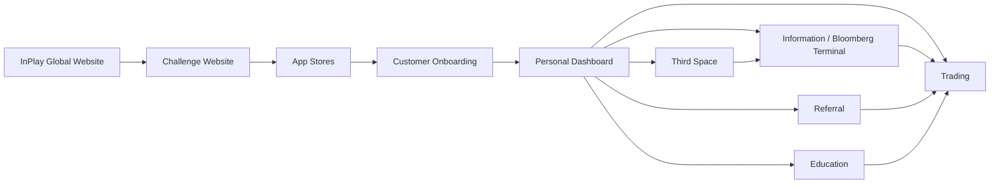

# InPlay Trading Challenge — Components

> **Vision:** [[vision]]

## Overview

Nine components identified from vision workshop. All currently in Collecting status.

## Component Map



## System Layout

```
┌─────────────────────────────────────────────────────────────────────┐
│                     CROSS-CUTTING: Advertising                      │
│         moment-based · geo-targeted · demographic-targeted          │
├─────────────────────────────────────────────────────────────────────┤
│                  CROSS-CUTTING: Push / CRM                          │
│        trading alerts · referral prompts · game reminders           │
├──────────────────────┬──────────────────────────────────────────────┤
│                      │                                              │
│   Web (Pre-App)      │   Mobile App                                 │
│                      │                                              │
│  ┌────────────────┐  │  ┌────────────────────────────────────────┐  │
│  │ InPlay Global  │  │  │       Customer Onboarding              │  │
│  │ Website        │  │  │  signup · KYC · account · referral code│  │
│  └──────┬─────────┘  │  └──────────────────┬─────────────────────┘  │
│         │            │                     │                        │
│  ┌──────▼─────────┐  │  ┌──────────────────▼─────────────────────┐  │
│  │ Challenge      │  │  │         Personal Dashboard             │  │
│  │ Website        │──┼─▶│  money · referrals · rankings · games  │  │
│  └────────────────┘  │  └──────┬────────┬────────┬────────┬──────┘  │
│                      │         │        │        │        │         │
│  (drives app         │  ┌──────▼─────┐ ┌▼──────┐ ┌▼─────┐ ┌▼─────┐ │
│   download &         │  │Information │ │Trading│ │Refer-│ │Third │ │
│   signup)            │  │/ Bloomberg │ │       │ │ral   │ │Space │ │
│                      │  │            │ │       │ │      │ │      │ │
│                      │  │• News feed │ │• Buy/ │ │• Code│ │• Chat│ │
│                      │  │• Market    │ │  sell │ │  gen │ │• Shar│ │
│                      │  │  data      │ │• Long/│ │• Dual│ │  ed  │ │
│                      │  │• Team page │ │  short│ │  side│ │  trad│ │
│                      │  │• Game page │ │• P&L  │ │  rew-│ │  es  │ │
│                      │  │• Stats     │ │• Port-│ │  ards│ │• Fan-│ │
│                      │  │• Leader-   │ │  folio│ │• Wall│ │  dom │ │
│                      │  │  boards    │ │• Wall-│ │  et  │ │      │ │
│                      │  │• Block     │ │  et   │ │• Soc-│ │      │ │
│                      │  │  alerts    │ │  mgmt │ │  ial │ │      │ │
│                      │  │            │ │       │ │  earn│ │      │ │
│                      │  │            │ │       │ │• Spon│ │      │ │
│                      │  └────────────┘ └───────┘ └──────┘ └──────┘ │
│                      │                                              │
│                      │  ┌────────────────────────────────────────┐  │
│                      │  │            Education                   │  │
│                      │  │  • Trading basics (buy/sell/long/short)│  │
│                      │  │  • Momentum, volatility, risk mgmt    │  │
│                      │  │  • 40,000 foot level — not granular   │  │
│                      │  │  • Financial literacy transfer         │  │
│                      │  └────────────────────────────────────────┘  │
│                      │                                              │
├──────────────────────┴──────────────────────────────────────────────┤
│                     EXTERNAL DEPENDENCIES                           │
│  ┌──────────┐  ┌──────────┐  ┌──────────┐  ┌──────────────────┐    │
│  │ Sport    │  │ T0       │  │ Persona  │  │ Brokerage        │    │
│  │ Radar    │  │ (ATS)    │  │ (KYC)    │  │ Partners         │    │
│  │ data     │  │ venue    │  │ identity │  │ (future: prod)   │    │
│  └──────────┘  └──────────┘  └──────────┘  └──────────────────┘    │
└─────────────────────────────────────────────────────────────────────┘
```

## Components

| Component | Overview | Key Elements | Status |
|-----------|----------|-------------|--------|
| **InPlay Global Website** | Corporate website — brand presence, investor-facing, links to challenge | Brand story, team, press, links to challenge website and app stores | Collecting |
| **InPlay Challenge Website** | Landing page driving registration and app download | Hero, value prop, app store links, social proof, challenge countdown, must feel cohesive with Global site and app | Collecting |
| **Customer Onboarding** | Signup → KYC → account creation → ready to trade | Signup form, KYC via Persona (age 18+, identity, no bots, US citizenship if required), 100K InPlay dollars credited, auto-generated referral code, referral code input for referee | Collecting |
| **[[information-layer/information-layer\|Information / Bloomberg Terminal]]** | The data and intelligence layer -- the main stage of the app. Covers "Discover -> See -> Understand -> Decide" user journey | Six sub-components: Discovery/Home, Game Day Overview, Single Game Page, Team Page, Research Tab (undefined), Leaderboard. Consumes SR (sports data, match tracker, news) + T0 (prices, order book). Owns the cross-correlated volatility dataset (SR events x T0 prices). News feed, block trade alerts, leaderboards (3 verticals x 4 time horizons), proximity alerts | Collecting |
| **Trading** | Trade execution and portfolio management | Buy/sell/long/short execution, order management, portfolio view, P&L tracking (daily/weekly/monthly), trading wallet (100K cap), referral wallet reload (below 25K trigger), position management (seconds to weeks), real-time during live games | Collecting |
| **Referral** | Growth engine — viral referral mechanics and reward system | Auto-generated referral codes, dual-sided reward (1,000 referrer / 500 referee on KYC completion), referral wallet (no cap, resets end of season), social media engagement credits (follow/comment = InPlay dollars), summer pre-launch program, bonus multiplier days (e.g., July 4th = 2x), sponsor redemption for large referral bank holders | Collecting |
| **Third Space** | Community and social layer — stickiness, not core product | Share executed trades (long/short), strategy discussion, fandom chat, social proofing, organic peer learning, meme-stock-style dynamics possible. InPlay does NOT curate or summarise sentiment | Collecting |
| **Education** | Trading education — basics to get users started, not in-depth training | Trading fundamentals (buy, sell, long, short), momentum trading, volatility, risk management basics. Edwin: "at a 40,000 foot level." Scope driven by market feedback — "let the market tell us what we're supposed to create." Financial literacy transfer to traditional markets. Potential college syllabus integration | Collecting |

## Cross-Cutting Concerns

These are not standalone components — they overlay across multiple components:

- **Advertising / Ad Serving:**
  - Touches: websites, information, trading, referral, third space
  - Moment-based (touchdowns, interceptions), geo-targeted (within 3 miles), demographic-targeted (age ranges), time-targeted (post-game)
  - Sponsors own specific games, volatility moments, pages
  - Inventory management, sponsor packaging, reporting
  - Inventory model and packaging still undefined — Skye: "right now it's not defined"

- **Push Notifications / CRM:**
  - Touches: all components
  - Trading alerts, referral prompts, game reminders, leaderboard updates
  - Potential for sponsor-branded communications
  - Timing, content, and branding all still undefined

- **Personal Dashboard:**
  - Integration point — pulls from trading (money, P&L), information (schedule, rankings), referral (wallet balance), third space (activity)
  - Proximity indicators: "you're 112 places away from cashing"
  - The first thing users see on login — their money, their referrals, their rankings, their next opportunity
