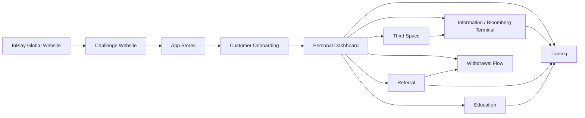

# InPlay Trading Challenge — Components

> **Vision:** [[vision]]

## Overview

**Thirteen components.** Customer Onboarding, Referral, Information Layer, Education, Third Space, and Challenge Website are now `Defined` (full component docs). **Market Maker added 2026-07-20** — the internal liquidity provider, promoted from a candidate trading sub-component after the 20-07 mechanics session with Edwin; currently `Collecting`, deep-dive scheduled Thu 23-07. InPlay Global Website is `In Design` (active design work). Withdrawal Flow was surfaced in the 12-06-2026 call as a separate component — currently `Stub`. Trading remains `Collecting` despite having a fleshed-out doc (open data + UX questions outstanding). IPO Module is now `Defined` (26-05-2026 deep-dive) with all six sub-components decomposed into entity journeys; it's the gating event that issues every tradeable asset before secondary trading opens (open items: T0 ledger mechanics, unsold-share handling). Earnings Report is now `Defined` (27-05-2026 deep-dive) with all five sub-components decomposed into entity journeys; it's the recurring tradable event (Tue NFL / Wed NCAA) where each team's off-field earnings (EST vs ACT) re-price the market, built on the off-field mechanic seeded at IPO (open items: volume-allocation gaming, EST methodology).

## Component Map



## System Layout

```
┌─────────────────────────────────────────────────────────────────────┐
│                     CROSS-CUTTING: Advertising                      │
│         moment-based · geo-targeted · demographic-targeted          │
├─────────────────────────────────────────────────────────────────────┤
│                  CROSS-CUTTING: Push / CRM                          │
│        trading alerts · referral prompts · game reminders           │
├──────────────────────┬──────────────────────────────────────────────┤
│                      │                                              │
│   Web (Pre-App)      │   Mobile App                                 │
│                      │                                              │
│  ┌────────────────┐  │  ┌────────────────────────────────────────┐  │
│  │ InPlay Global  │  │  │       Customer Onboarding              │  │
│  │ Website        │  │  │  signup · KYC · account · referral code│  │
│  └──────┬─────────┘  │  └──────────────────┬─────────────────────┘  │
│         │            │                     │                        │
│  ┌──────▼─────────┐  │  ┌──────────────────▼─────────────────────┐  │
│  │ Challenge      │  │  │         Personal Dashboard             │  │
│  │ Website        │──┼─▶│  money · referrals · rankings · games  │  │
│  └────────────────┘  │  └──────┬────────┬────────┬────────┬──────┘  │
│                      │         │        │        │        │         │
│  (drives app         │  ┌──────▼─────┐ ┌▼──────┐ ┌▼─────┐ ┌▼─────┐ │
│   download &         │  │Information │ │Trading│ │Refer-│ │Third │ │
│   signup)            │  │/ Bloomberg │ │       │ │ral   │ │Space │ │
│                      │  │            │ │       │ │      │ │      │ │
│                      │  │• News feed │ │• Buy/ │ │• Code│ │• Chat│ │
│                      │  │• Market    │ │  sell │ │  gen │ │• Shar│ │
│                      │  │  data      │ │• Long/│ │• Dual│ │  ed  │ │
│                      │  │• Team page │ │  short│ │  side│ │  trad│ │
│                      │  │• Game page │ │• P&L  │ │  rew-│ │  es  │ │
│                      │  │• Stats     │ │• Port-│ │  ards│ │• Fan-│ │
│                      │  │• Leader-   │ │  folio│ │• Wall│ │  dom │ │
│                      │  │  boards    │ │• Wall-│ │  et  │ │      │ │
│                      │  │• Block     │ │  et   │ │• Soc-│ │      │ │
│                      │  │  alerts    │ │  mgmt │ │  ial │ │      │ │
│                      │  │            │ │       │ │  earn│ │      │ │
│                      │  │            │ │       │ │• Spon│ │      │ │
│                      │  └────────────┘ └───────┘ └──────┘ └──────┘ │
│                      │                                              │
│                      │  ┌────────────────────────────────────────┐  │
│                      │  │            Education                   │  │
│                      │  │  • Trading basics (buy/sell/long/short)│  │
│                      │  │  • Momentum, volatility, risk mgmt    │  │
│                      │  │  • 40,000 foot level — not granular   │  │
│                      │  │  • Financial literacy transfer         │  │
│                      │  └────────────────────────────────────────┘  │
│                      │                                              │
├──────────────────────┴──────────────────────────────────────────────┤
│                     EXTERNAL DEPENDENCIES                           │
│  ┌──────────┐  ┌──────────┐  ┌──────────┐  ┌──────────────────┐    │
│  │ Sport    │  │ T0       │  │ Persona  │  │ Brokerage        │    │
│  │ Radar    │  │ (ATS)    │  │ (KYC)    │  │ Partners         │    │
│  │ data     │  │ venue    │  │ identity │  │ (future: prod)   │    │
│  └──────────┘  └──────────┘  └──────────┘  └──────────────────┘    │
└─────────────────────────────────────────────────────────────────────┘
```

## Components

| Component | Overview | Key Elements | Status |
|-----------|----------|-------------|--------|
| **[[inplay-global-website/inplay-global-website\|InPlay Global Website]]** | Corporate website — brand presence, multisport positioning, advertiser-facing | Home, About, Advertising (live); Newsroom, Markets (hidden). Hero: animated price chart + multisport visuals. Hype video pending. Skye content lead, Max design | **In Design** |
| **[[challenge-website/challenge-website\|InPlay Challenge Website]]** | Pre-app funnel surface. Edwin: _"support page more than destination page"_ — push everything to the app | 7 sub-components: Holding Page (live ~15 May, replaces legacy green/black site), Homepage (marquee partner ticker), How It Works, Prizes, FAQ, Education Excerpts (curated subset, progressive disclosure), Form Capture+CRM (Airtable→HubSpot/Vtigger). **No live leaderboard or live match tracker on site** — too high value to leak. Separate URL from Global Website, cross-linked via tabs (SEO focus). Must feel cohesive with Global site and app. | **Defined** |
| **[[customer-onboarding/customer-onboarding\|Customer Onboarding]]** | Discovery → install → registration+KYC → wallet provisioning → trading | 5 sub-components: Discovery & App Acquisition, Registration+KYC, Wallet Provisioning (T0, pre-funded pool proposed), Holding State (gray out, never hide), Returning Login (T0 auth + device biometric). No SSO at launch. Email-only manual field. | **Defined** |
| **[[information-layer/information-layer\|Information / Bloomberg Terminal]]** | The data and intelligence layer -- the main stage of the app. Covers "Discover -> See -> Understand -> Decide" user journey | Six sub-components: Discovery/Home, Game Day Overview, Single Game Page, Team Page, Research Tab (**Defined 26-06**, 3-tier paid build: pre-canned → saved-custom → AI companion; 99c→$14.99→$49.99 tiers, in-app payment; **pricing 22-07/24-07: four-tier ladder proposed (Free trial / Plus $24.99 / Pro $49.99 / Elite $79.99), tier prices under review, not a launch feature (target ~October); pre-canned report catalog supplied 24-07**), Leaderboard. Consumes SR (sports data, match tracker, news) + T0 (prices, order book). Owns the cross-correlated volatility dataset (SR events x T0 prices). News feed, block trade alerts, leaderboards (3 verticals x 4 time horizons), proximity alerts | Defined |
| **[[ipo-module/ipo-module\|IPO Module]]** | The "Trading Challenge Draft" — how every tradeable asset is issued before secondary trading opens, plus season-end liquidation | 6 sub-components: Draft Board (Tinder/list/filter browse), Team IPO Detail, Primary Offering Execution (5M float, static ask, buy-only, no cap, 20% short holdback), Scheduling & Windows (72h, NCAA ~Aug 20 / NFL ~7d pre-Sept 9), Announcement & Countdown, Season-End Settlement. Issuer = team treasury (on-chain via T0). Seeds the off-field value mechanic that feeds Earnings Report | Defined |
| **[[earnings-report/earnings-report\|Earnings Report]]** | Recurring tradable event — each team company's off-field earnings (EST vs ACT) re-price the market weekly | 5 sub-components: Earnings Feed (batched Bloomberg-style release, Tue NFL / Wed NCAA), Report Card (EST/ACT + embedded trade), Off-Field Earnings Engine (½ on-field winner, $250/game volume-allocated), Historical Earnings & Chart Annotation, Alerts & Countdown. Built on the off-field mechanic seeded by IPO Module | Defined |
| **Trading** | Trade execution and portfolio management | Buy/sell/long/short execution, order management, portfolio view, P&L tracking (daily/weekly/monthly), trading wallet (100K cap), referral wallet reload (below 25K trigger), position management (seconds to weeks), real-time during live games. Captures trade-with-location event for Referral eligibility rule. | Collecting |
| **[[referral/referral\|Referral]]** | Growth engine — viral referral mechanics, reward system, cash eligibility tracking | 7 sub-components: Code Lifecycle (lifetime-stable), Share Surfaces (link/QR/dot card/t-shirt/embedded-post), Bonus Campaigns (multipliers + cross-product), Cash Eligibility Tracking (transparent checklist), Social Engagement Credits (agent-detected), Sponsor Redemption (future), Donor/Group Accounts (exploratory). Owns cash-payout eligibility rules. | **Defined** |
| **[[third-space/third-space\|Third Space]]** | Community and social layer, stickiness, not core product | 7 sub-components: Game Day Chat (ephemeral, matchup-page, banter), Team/Favorites Chat (persistent, Reddit-style), Research AI Chat (NLP on Sport Radar stats, lives on research tab, Statmuse-style), Moderation System (user-appeals + AI layer, no active InPlay mod, "Zar" community moderators), Chat Admin Backend, plus future-state Sentiment/Data Packaging and Influencer Broadcast Channels. Open-source headless chat platform. InPlay owns all chat data. InPlay does NOT curate or summarise sentiment. **24-07 (Jared feedback):** Groups & Leagues (friend + influencer-hosted competitive groups, GameStock model) and a richer streak system flagged as feature direction, candidate sub-components (see [[third-space/third-space]]) | **Defined** |
| **[[education/education\|Education]]** | Trading education, the on-ramp for non-traders. **Launch format reset 22-06: card-based course library** (slideshow / whiteboard video + voiceover + text + quiz), not TikTok reels | 8 sub-components: Modules/Course Viewer (card library by tier, slideshow/whiteboard video + written version, landscape video / portrait quiz), Quiz/Poll Layer (2-3 MCQs gate reward, non-sequential, glossary swipe), Reward Integration (100 InPlay coins to referral wallet on pass, earn-once), Progress Tracking (completed grayed-but-visible, resume-to-point), Certification & Badges (tier certs, profile "Certs", clickable entry), AI Chatbot Support (**Phase 2, deferred**), Education-on-Website (curated subset + legal-reviewed FAQ/disclaimers), Sponsor Ownership Layer (slide-group-level sponsorship, skippable pre-video CPM). **36 modules across 3 tiers** (Beginner 16 / Intermediate 10 / Expert 10). AI-generated video, pilot 1-2 then replicate, hosted on the YouTube channel. Kevin owns content. Premium data resale + paid AI companion ruled out of scope, flagged for a Research Tab session | **Defined** _(22-06)_ |
| **[[market-maker/market-maker\|Market Maker]]** _(new, promoted 20-07-2026)_ | **Internal, not user-facing.** Synthetic market-maker entity in T0, posts two-sided resting liquidity in every team market, guarantees IPO fill (float warehousing), maintains orderly markets (price band + quote busting), and generates the behavioural dataset for production MMs. **Now also houses a second house agent, SNT-1 (Synthetic Noise Taker, Edwin 30-07):** a taker-only, non-participant account that crosses the spread with random noise so every book trades from IPO onward (see [[market-maker/systems/synthetic-noise-taker]]) | Unlimited buying power + short-locate exemption; market-state-driven quoting (reference price ± offsets, skew, randomizer); limit-orders-only with crossing; cancel-replace ~5–10×/sec; three liquidity sessions; CTS1/CTS2 price engines built by InPlay; ops via desktop app version (Kevin). Deep-dive Thu 23-07 | **Collecting** |
| **Withdrawal Flow** _(new — surfaced 12-06-2026)_ | Conversion from InPlay$ to real cash — bank info capture, crypto wallet linking, 1099, eligibility verdict surfacing | Captured at first withdrawal request (not signup). Crypto wallet option via Coinbase (Iris conversation referenced). T0 cash wallet hosting. Receives eligibility verdict from Referral. Will be large. | Stub |

## Cross-Cutting Concerns

These are not standalone components — they overlay across multiple components:

- **Advertising / Ad Serving:**
  - Touches: websites, information, trading, referral, third space, education
  - Moment-based (touchdowns, interceptions), geo-targeted (within 3 miles), demographic-targeted (age ranges), time-targeted (post-game)
  - Sponsors own specific games, volatility moments, pages
  - **Packaging model (from 14-05-2026):** sold game-by-game in tier-block bundles. Three tiers (1/2/3) with minimum buys per tier — Edwin's framing: ~minimum 200 of ~2,100 games for top tier, 15+ for lower tiers (Cody). Brands purchase to be _adjacent to_ specific games + the moments-that-matter within those games. Tier 1 / Tier 2 / Tier 3 game classification plus Tier 1 / Tier 2 day classification (Thanksgiving > Sunday > Thursday Night Football). Special-event days (Thanksgiving 3 games, Christmas Netflix-streamed game) command premium
  - **Billing model:** minutes of engagement, not clicks/impressions. Engagement = time spent in interfaces brand is adjacent to (matchup view, team page click-through, etc.)
  - **Replay-persistent ads (George's idea):** ads stay on past-game pages so a user replaying a 6-week-old game still sees the ad — drives perceived value vs transient impressions
  - **Layer above games:** ownership of trading-challenge spaces (P&L, education modules, specific pages) sold separately from game-adjacent inventory
  - **Sponsor-owned education modules** — single advertiser owns a module for a fixed period (monthly+, not programmatic), content co-created. See Education component
  - **Education-on-tokenization angle (Edwin):** T0 partnership creates a valuable educational ad inventory around tokenization/blockchain literacy
  - **Mini-challenge-within-challenge** — premium event days may have own prize pools (Thanksgiving floated at $1M/game)
  - Sky's team selling, sales deck in progress, inventory map due end of week following 14-05-2026
  - Cody / Sky framing on counterintuitive game selection: 1-and-6 vs 1-and-6 games may have more volatility / trading activity than two Super Bowl contenders with strong defenses — flips conventional ad-sales narrative, helps NFL push eyeballs to "bad" games
  - **Specialist ownership spaces (from 22-05-2026):** the offering is built around single-brand, season-long sponsorships of specific surfaces ("the trading challenge presented by Bank of America"). The 22-05 session defined **nine** spaces — title/IPO, leaderboard, P&L, trade-confirmation, referral, live-game-tracker, chat, education, buy-filled-notification — each getting a "presented by" lockup plus a **% share** of impressions, volatility moments, and halftime/game videos (e.g. title sponsor = 30% of each). Volatility moments + videos are allocated 100% across only the **seven** spaces that carry them (education and buy-filled-notification don't). ⚠️ The 26-05 IPO session reframed this as **ten "territories"** (T0 takes one) — 9-vs-10 count needs reconciling
  - **Four surfaces a brand appears in (22-05-2026):** (1) a **"presented by" sponsored unit** at page tops (fixed per season, doesn't rotate brands); (2) **volatility-moment brandings** (logo locks up with the price-spike marker; replay-persistent); (3) **halftime + end-game videos** (30-sec non-full-screen pop-ups); (4) **rolling in-content ad units** (15-sec ads in a scrolling ad block, not overlays) — the generalised inventory
  - **Billing model unresolved — impressions vs engagement-minutes (22-05-2026):** original 18bn-impression model flagged as unrealistic/"spammy" (≈one new ad every 3s) → reworked to ~480 impressions/user/week at 15s each → team is pivoting toward an **engagement-minutes / broadcast-minute** model (~$0.003/min; a sponsor owns a share of total eyeball-minutes). Two-tier inventory: ~30% reserved for specialists, ~70% generalised. Floated prices (all in flux): volatility moment **$750**, video **$2,000**, specialist ~**$6 CPM**, with a **60% package discount**
  - **Territory pricing (26-05-2026):** floor ~**$1.8M** + ceiling ~**$7–9M** scaling with delivered volume; title sponsor a further **+$1.8M**
  - **Ad-serving tech (22-05 / 27-05-2026):** experiences are **custom** (rich micro-moments, not standard IAB units) → **Google Ad Manager ruled out**. Stack centres on **Kevel** (custom ad server — sponsorships, per-minute, custom units via API) + **Booster** (turns commercial propositions into serving business rules + ad-ops/fill management). **Tracking/audit/fill-rate reconciliation is first-class** — no media owner hits ~70% fill, so under-fill handling must be designed in
  - **Sales motion pivot (27-05-2026):** the agency route (Omnicom) stalled — agencies won't risk an unproven, not-yet-built product for 20% commission. Strategy is now **go-direct to lower-hanging-fruit brands** that can't access premium NFL/NCAA inventory and sign off fast (AI startups e.g. 11 Labs / Whisper Flow, crypto, content creators, challenger brands e.g. BYD, founder-led). Premium brands + agencies are a later phase. ⚠️ **Credibility risk:** the model assumes ~1M users from day one but a first season starts at zero — the audience claim must survive media-buyer scrutiny
  - **Sponsor rewards & affiliate (26-05-2026, exploratory):** an in-app "sponsor rewards" repository where each sponsor posts media; engaging to completion was floated to grant referral$ — but Brett warned this is an "influenced impression" advertisers distrust, so it pivoted toward a no-reward / **affiliate rev-share** model (more a production-level revenue stream)
  - **Influence on app design:** until trading is live the navbar "trade" slot doubles as the IPO experience (advertising-relevant surface); ads should **animate in and persist** (not flash), and feel integrated/non-spammy ("less is more" — Edwin)
  - **⚠️ Stack reframed to SSP-first on AppLovin MAX (17-06-2026 — see [[advertising/advertising]] and the [[advertising/sub-components/programmatic-media-playbook/programmatic-media-playbook|Programmatic Media Playbook]]):** Brett's playbook sets the programmatic / generalised-inventory model. Start with **AppLovin MAX as both ad server and mediator**, plug **8–12 SSPs** in as adapters (day-one anchors: AppLovin MAX, AdMob, Liftoff, PubMatic), and **defer Kevel to phase 2** for moment-based sponsorships only. **There is still no Google Ad Manager.** This recasts the earlier "Kevel + Booster" framing: the **specialist sponsorship territories are the direct-sold motion** (house ads now, Kevel later), while the **SSP portfolio fills the generalised inventory**. The two need reconciling into one inventory map
  - **AI-agent ad-ops (17-06-2026):** run **one human campaign manager + an agentic AI workforce** (1-human + 9-agent model in the playbook) instead of a ~4.5-FTE team; cost target is to fit inside a **~20% margin** on ad revenue (open question in [[architecture/open-questions]])
  - **Impression model revised (17-06-2026):** ~**5 impressions/minute** for the core "degenerate trader" cohort (down from ~20/min), giving **~25B+ impressions** over a four-month season at ~10k concurrent active traders; **video** the priority unit (~$3.58 baseline eCPM). Tightens the earlier 18bn-impression debate
  - **AI brand-preview tool (15-06-2026):** Max demoed a tool where an advertiser pastes a URL/logo and AI previews their brand across ~10 in-app units; the link goes in outreach emails so advertisers self-serve a preview before a sales conversation
  - **Title-sponsor splash screen (15-06-2026):** a 2–3 second branded welcome screen on app open, dissolving into the main interface (see [[information-layer/information-layer]])
  - **GTM reframe (18-29 June — see [[digests/touchdowns-18-29-jun-2026]]):** SSP registration is **underway** (Brett standing up `novo@inplayglobal.com`, **MAX first → AdMob → 3 more**, test app loaded to start seeing ads; premium SSPs courted later). **Inventory-layering model:** ~**20–30% direct buy**, ~**15–20% premium programmatic** (agencies), ~**5% house ads**, with the **bulk filled via SSPs** — ~90% of media owners live on programmatic revenue. **Data play:** the audience/volatility dataset can be resold to targeters at a **~$2–5 markup** (production-stage). **Click-behaviour is unknown** (trading apps carry no ads → users not conditioned to click) — plan conservatively; Brett is building a **minutes→impressions forecast calculator** (due next touchdown) to replace the distrusted minute-to-impression conversion. **People decision:** point **Skye at user acquisition + brand**, not ad sales; **don't hire heavyweight media salespeople (~$350–380k) until ~500k users**. **AI brand-preview tool** to be restored to the challenge-site advertising page (Max — for the Mastercard demo)
  - **Outreach automation (18-06 / 24-06):** an **agentic 24/7 outreach workforce** (the same kind building the app) turns InPlay's **LinkedIn accounts + purchased domains** into a direct-advertising lead-gen pipeline (needs domains + LinkedIn access; offered free, Novo absorbs LLM cost). **B2B cold outreach** needs warm-up infra (**3 real-named mailboxes per domain**, **domain redirects** e.g. `getinplaytradingchallenge.com`, ~2–3 week warm-up + LinkedIn); **B2C** transactional email to the consented 600 signups can go now
  - **Media-plan calculator delivered + ad-server decision (13–17 Jul touchdowns):** Brett's bottom-up forecast model is live — per-page × persona build (degenerate / starter / returning), ~30% launch fill rate, **$1.47 blended CPM floor** (Edwin targets $4–6 blended by October), KYC-verified 1.15× / team-followed 1.1× uplifts, a **90/5/5 programmatic-direct-territory** starting split, and a **CTR-first philosophy** (complementary advertisers only, never competitors; 20s→15s rotation testing; human + agentic bidding agents adjusting floor/ceiling pricing ~every 5 min). **AppLovin MAX confirmed as the ad server; Kevel formally on hold** until direct deals land (1–2 week setup when triggered). Google/AdMob rules force a **30-second minimum ad refresh** — the 15s rotation plan is dead. **Watch Mode** is the new premium ad surface (~**720 impressions/game** target; transparent field-overlay logo; 30s videos inside the field outline during known stoppages only). **Direct-sale pilot construct:** $50k min / $250k max over 2–4 weeks with an earn-out guarantee; first two weeks may distribute **90% of ad revenue to users** (vs 65%) to prime engagement. **House-ads transition strategy:** house ads run from day one so switching on programmatic isn't a no-ads→ads flip; units include a **"What is InPlay?" hype-video ad + referral link** and an **education re-entry video ad** (15/30s, re-triggers on section re-entry for video CPM). IAB conformance: creatives scale by aspect ratio (exact pixel dims not required). See the [[advertising/sub-components/programmatic-media-playbook/programmatic-media-playbook|Programmatic Media Playbook]] update

- **Push Notifications / CRM:**
  - Touches: all components
  - Trading alerts, referral prompts, game reminders, leaderboard updates
  - Potential for sponsor-branded communications
  - **Three notification types named (20-07-2026):** system notifications, personalized notifications, and campaign-based notifications — how each is run and pushed is a this-week build focus (Brett). (Source: standup 2026-07-20)
  - **v1 vs v2 configurability (22-07-2026):** launch (v1) notifications are **not user-configurable** (lean minimal, assume fills are always wanted); v2 becomes configurable per favourites/watchlist to avoid over-pinging. Open item: the v1 default set and which events are always-on vs opt-in (see [[open-questions]]). (Source: standup 2026-07-22)
  - **CRM = HubSpot** (selected 18-05-2026; final contract stages, ~3-month evaluation; likely a 1:1 HubSpot onboarding partner providing API endpoints + tag manager/pixels). Lead-form data also held in an **Airtable mini-CRM** (dashboard + client access) and emailed to info@inplayglobal.com as a stopgap
  - **Newsletter → owned community channel (29-06-2026):** the **first outreach** to the 500–600 signups is **action-first** (download → KYC → refer; trading-challenge homepage content, hype video, $25M up top), **not** a traditional newsletter. A fuller **newsletter / community channel** (give-back content, tips, interviews — Brett's "Rebel Technologist" framing) is **deferred** to once there's something to give back. **T0 partnership press release** went out (8:30 ET, 30-06) with the link embedded on the website + first distribution. See [[digests/touchdowns-18-29-jun-2026]]
  - Timing, content, and branding still being defined

- **Personal Dashboard:**
  - Integration point — pulls from trading (money, P&L), information (schedule, rankings), referral (wallet balance + eligibility checklist), third space (activity)
  - Proximity indicators: "you're 112 places away from cashing"
  - The first thing users see on login — their money, their referrals, their rankings, their next opportunity

- **Analytics & Funnel Measurement** _(new — surfaced 12-06-2026):_
  - End-to-end CTA tracking: social engagement → ad serving → app install → onboarding → first trade → referral conversion → behavioural & lifetime value metrics
  - Touches: every customer-facing component plus advertising and push/CRM
  - Each component owns its segment of the funnel; this cross-cutting concern defines the joins
  - Needs a dedicated doc — flagged in [[customer-onboarding/customer-onboarding]] and [[referral/referral]]
  - **First tooling signal (12-06-2026):** **Google Analytics** on the rebuilt Challenge Website + **Microsoft Clarity** heat-mapping (session recording, scroll/click heat maps, dwell time) across the websites
  - **Advertiser-KPI question (15-06-2026):** buyers care about **cost-per-acquisition and impressions/CPM** far more than engagement-minutes ("they don't care about your minutes"); InPlay must prove out against standard IAB currency. Kevel and the SSP stack offer flexible tracking + API access for client-facing reporting. Open question in [[architecture/open-questions]]
  - Status: undefined — no decisions on event schema or ownership yet

- **Cybersecurity & Data-Handling Framework** _(new — surfaced 12-06-2026):_
  - Troy flagged: _"the more data we collect, the more sensitive it gets and the more susceptible we are to cyber attacks."_
  - Specifically applies to: PII from Persona, biometric data, location data (Referral), bank info (Withdrawal Flow), wallet ledgers (T0)
  - **Pre-deploy content/compliance control (10-06-2026):** an **agent team reviews all copy before any publish** — scanning sensitive/regulated terms (prize-money **guarantees**, securities-offer language) and blocking deploy until cleared. Triggered by an incident where a site-generation agent invented a "guaranteed prize money up to $25M" policy in the Global Website legal footer (the rule is always **"up to $25M", never "guaranteed"**). Legal disclaimers reviewed by external counsel (Marlin) for now-vs-launch scope; standard financial disclaimers required (no profit guarantee, past-performance, not-an-offer-to-sell-securities). See [[inplay-global-website/inplay-global-website]].
    - **Challenge-site legal/T&C (29-06-2026):** the terms / privacy / competition-rules pages are now **AI-drafted and populated** (previously placeholders). The control holds: AI can scaffold, but **external counsel (Marlin / Matt Vogler) must clear it before publish** — uncleared legal links are **disabled at go-live**. KYC opt-in copy added to signup. See [[challenge-website/challenge-website]] and [[digests/touchdowns-18-29-jun-2026]].
  - Needs a dedicated architecture session
  - Status: undefined

- **Data Replication & Derivative-Data Products** _(new, surfaced 22-07-2026):_
  - Plan to **replicate everything T0 stores** as a backup and to build **real-time derivative data products** on top (InPlay cannot depend on T0 latency for live derived data)
  - **Cold-storage after N days**; ~5–6yr regulatory retention. Brett flagged real compute/storage cost and non-monetisable "dead" data
  - No clean home today; candidate for a dedicated architecture concern doc. Touches T0 integration, Market Data Service, Research Tab (derivative products). See [[open-questions]]
  - Status: undefined _(raised 22-07-2026)_

- **Engagement Surfaces (Jared feedback)** _(new, surfaced 24-07-2026):_
  - App-shell and retention surfaces raised in Jared Sapirman's written feedback ([[jared-app-feedback-jul-2026]]): **Dynamic Island presence** (live price or logo, tap-to-return), a **richer streak system** (base multiplier + celebrated animation, fuller spec to follow), **public usernames** (with anti-impersonation guardrails), and a **Groups & Leagues** social layer (friend + influencer-hosted competition)
  - Homes span Third Space (social/streaks), Trader Profile (usernames), an app-shell surface (Dynamic Island) and frontend performance (~2s cold-start target). Flagged for a focused session, not yet componentised
  - Status: candidate, see [[open-questions]]
