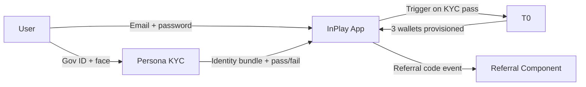
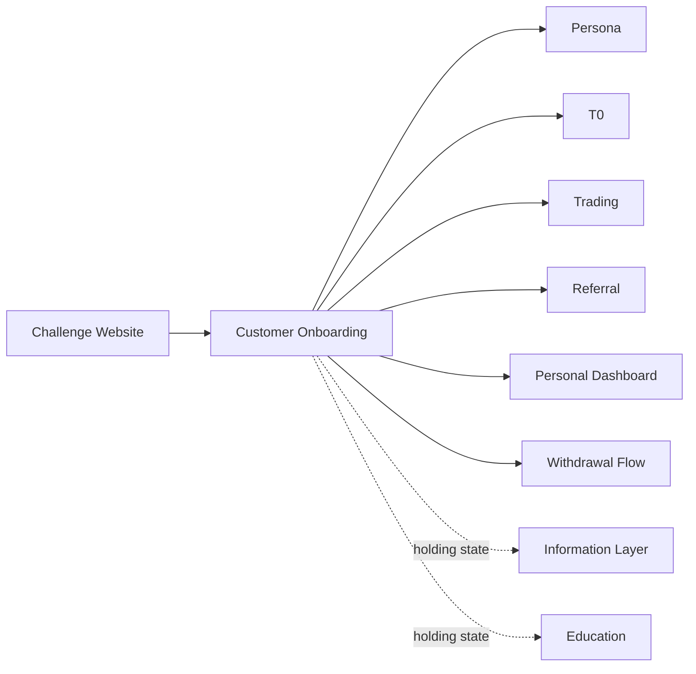

# InPlay Trading Challenge — Customer Onboarding

> **Vision:** [[vision]]
> **Audiences:** [[audiences]]
> **Date:** 2026-05-13
> **Status:** Defined
> **Owner:** Brett (client-facing) + George (engineering)
> **Sources:** _[[meetings/06-05-2026-vision-workshop]], [[12-05-2026-onboarding-and-renewal-and-global-component]]_

---

## 1. What Does This Component Do?

**Functional purpose:**

Customer Onboarding is the journey from "I just heard about InPlay" to "I'm logged in and trading." It spans discovery on the web, app download, registration combined with KYC verification, wallet provisioning by T0, the holding state during which wallets are being created, and the returning-user authentication flow. The product imperative is **three clicks or less to start trading** — Edwin: _"the fastest we can get them into the app the better."_ A user who hears about the challenge ten minutes before kickoff must be trading at kickoff. Failure here is fatal: _"the worst thing we could do is have someone try to sign up Sunday morning, say at 9:00 am, and they can't trade till Monday."_

The journey crosses three systems: the InPlay app (UI and product surface), **Persona** (the KYC vendor — gov-doc scan + biometric), and **T0** (the trading venue — manages all wallets and authentication credentials). The user should feel one seamless experience despite each system's constraints. Where T0's wallet creation takes time, the user does not wait on a blank screen — they enter a **holding state** with full browse-only access to the app while trading is grayed out.

Sub-component map:

```
Customer Onboarding
├── Discovery & App Acquisition       (landing page → app store → install)
├── Registration + KYC                 (email + password + Persona gov-doc + biometric, one combined step)
├── Wallet Provisioning                (T0 creates trading + referral + cash wallets)
├── Holding State                      (KYC passed, wallets pending — browse, trade grayed out)
└── Returning Login                    (T0-issued credentials + phone biometric auto-fill)
```

Some detail in Discovery & App Acquisition will live in [[components/challenge-website/challenge-website]] — the web entry point itself is a separate component. The handoff (web → app install) is the onboarding concern.

**Audiences:**

The flow is identical for all four audiences. The differences are **acquisition channel** and **trust-signal sensitivity**, not the onboarding mechanic itself. See [[audiences]] for full audience definitions.

| Audience | How they arrive | What they need from onboarding |
|---|---|---|
| Crypto-Savvy Sports Trader | X / Discord, prediction-market communities, podcasts, press | SEC / SIPC trust signals up front. KYC pattern they already know from Coinbase / Robinhood. Crypto wallet linking when they request payout (deferred to [[components/withdrawal-flow/withdrawal-flow]]). |
| Analytical Fan / Armchair GM | Friend referrals, social shares, gorilla marketing (t-shirt QR, viewing parties), Reddit, podcasts | No-friction signup. Consumer-recognisable KYC (gov ID + face scan). Clear "what's in it for me" framing on the referral popup. |
| Finance-Curious Student | Campus ambassadors, dot cards, alumni networks, university curriculum, TikTok / Instagram | Mobile-first, fast, fun. Familiar KYC mechanic. Referral incentive ("Get 1,000, Give 500") visible and unmissable. |
| Veteran Trader-Bettor | Press, podcasts, industry network, word of mouth | Speed. Won't be deterred by extra fields, but appreciates the lack of them. Mostly: don't waste their time. |

> **Delivery note (May touchdowns):** **Login + KYC + referral is the first-version priority** — captured early so users are onboarded ahead of the summer referral programme. If app-store approval isn't ready in time (the first 3× referral event is 21 June), the fallback is a **PWA** (same React Native codebase, possibly re-rendered as server-side NextJS; **Persona** KYC wired in, identical branding) so onboarding/referral can run without Apple/Android approval. _Identity verification is handled by **Persona** (already the documented KYC vendor) — it manages all gov-doc + biometric verification._ The pre-app **lead-capture form** fields (last name, phone, "university or company" open text) live on the **Challenge/Global website**, not the app's registration (which stays email-only + Persona). _Sources: [[15-05-2026-touchdown]], [[18-05-2026-touchdown]], [[28-05-2026-touchdown]]._

---

## 2. What Needs to Happen?

**Functional requirements:**

- User can discover the challenge via a mobile-optimised landing page accessible on desktop and mobile (detail in [[components/challenge-website/challenge-website]])
- Landing page hard-sells the app install (App Store / Play Store), with a desktop-to-mobile handoff fallback (email the install link)
- App on open detects whether the user is already registered: registered → login screen; new → registration
- Registration captures only **email + password** manually — every other identity field is captured by Persona from the government document
- Registration screen has an **optional referral code input** with deep-link support: clicking a referral link bypasses manual entry
- KYC happens immediately on registration — there is no separate "registered, awaiting KYC" state. Persona scans gov ID (passport or driver's licence), captures biometric face scan, returns name, address, location, age, citizenship, identity-match status
- KYC must complete in "a couple of minutes" (typical Persona turnaround)
- On KYC pass, T0 provisions three digital wallets: **trading** (100,000 InPlay$), **referral** (0), **cash** (0)
- During wallet provisioning (typically fast, worst case up to 24 hours), the user enters a **holding state**: full read-only access to the app (information layer, education, browse) but trading buttons **grayed out, not hidden**
- When a user taps a grayed-out trade button in the holding state, a message displays: _"account pending approval"_
- On wallet ready: trading enabled; referral code popup appears with copy button, share buttons (messages / email / socials), and "Get 1,000, Give 500" framing in InPlay orange
- Returning user logs in via T0-issued credentials (email + password); device biometric (FaceID / passkeys / Android equivalent) auto-fills credentials
- No SSO at launch (T0 manual account-creation step is incompatible). Magic link parked
- **No waitlist, ever** — Cody: _"weight lists really scared me. They are the death of social gaming apps."_


**Business rules and constraints:**

- Email is the only manually-entered profile field at signup
- Bank info, crypto wallet address, and 1099 tax info are captured **at first withdrawal**, not at signup — handled in [[components/withdrawal-flow/withdrawal-flow]]
- Cash wallet is held on the T0 chain (not on InPlay infrastructure). This intentionally avoids store-of-value licensing exposure in EMEA and other jurisdictions
- The cash wallet may also support crypto payout (Coinbase or similar) at withdrawal time, leveraging T0's wallet infrastructure
- Referral code generated for the new user is **lifetime-stable** — it never regenerates
- For a referrer to receive the 1,000 InPlay$ reward, the referee must complete **full KYC** — not just registration (rule from vision)
- T0 manages user authentication credentials (decision from this call — to confirm with T0 Friday)

**Edge cases and error states:**

- **Persona outage during signup** — fallback flow undefined. ⚠️ **Gap.** Brett raised: _"persona could go down, right? We need to think a bit about those kind of cycles."_
- **T0 wallet creation latency** — could be minutes or hours. Mitigation: pre-funded wallet pool. Cody's proposal, agreed in principle: T0 pre-creates 3,000–5,000 wallets at 100,000 InPlay$, assigned post-KYC. **Pending T0 cost confirmation in Friday session.**
- **High-volume signup spike** (Sunday morning before kickoff) — graceful degradation if pre-funded pool depletes. **No waitlist allowed.** Brett suggested a "weightless mode" placeholder — to design
- **KYC failed** — multiple open questions for InPlay team: do we let them retry? How many attempts? Soft fail (Persona uncertain) vs hard fail (gov doc rejected)? What support route exists? ⚠️ **Gap.**
- **Cyber / data sensitivity** — Troy flagged: _"the more data we collect, the more sensitive it gets and the more susceptible we are to cyber attacks."_

---

## 3. How Should It Look and Feel?

**Design direction:**

Speed-first, conversational, mobile-native. The user should feel they are getting into something fast, not filling out a form. Trust signals (SEC reg framing, SIPC, "first regulated sport") earn the right to ask for ID. Persona's gov-doc scan UX is the dominant moment — InPlay's job is to wrap it in a journey that feels intentional, not a compliance checkpoint.

The holding state must feel like a tour, not a waiting room — the user is browsing a working app, even if they can't trade yet.

**Reference products:**

⚠️ Limited explicit references named in this call. Adjacent references mentioned elsewhere:
- **Revolut** — Brett, in the referral context — staged onboarding incentives that escalate ($200 sign-up → $700–$800 over multiple steps including card-order + first transaction). Worth studying for **post-onboarding milestone framing**, not the signup itself
- **High-stakes fantasy** (Cody's prior experience) — defer bank info until withdrawal request. Onboarding stays light; the money-out moment carries the heavier compliance lift

**Gap for next call:** explicit onboarding references — Robinhood, Webull, Coinbase, Stake.

**Key UX principles:**

- **Three clicks or less to start trading** (Edwin, repeated multiple times)
- **One manual field at signup: email** — everything else flows from Persona
- **Never hide buttons during holding state — gray them out** (Edwin + Troy joint decision: _"so they can at least visually get an idea of what the experience might be"_)
- **No waitlist, ever** (Cody)
- **Speak to the audience before you ask for ID** — the value proposition lands first, then the gov-doc scan
- **The referral popup is part of the celebration moment, not a separate task** — copy + share buttons sit alongside the code on a single screen

---

## 4. How Are We Going to Solve It?

| Capability | Build / Buy / Access | Provider | Rationale |
|---|---|---|---|
| Identity verification (KYC) | Access | **Persona** | Selected vendor. Scans government doc (passport / driver's licence) + biometric face scan. Returns name, address, location, age, citizenship, identity-match. "Couple of minutes" turnaround (Cody, validated on other social gaming platforms). |
| Authentication & credentials | Access | **T0** | T0 owns login credentials (email + password). Confirmed in call, **to be validated with T0 Friday session**. No SSO at launch — T0 manual account creation step incompatible. |
| Wallet provisioning | Access | **T0** | T0 creates synthetic digital wallets on chain for all three balances: trading (100K InPlay$), referral, cash. Sim wallets behave like production. |
| Cash wallet hosting | Access | **T0** (decision moved mid-call from InPlay to T0) | T0 hosting the cash balance sidesteps store-of-value licensing exposure in EMEA and other jurisdictions. Removes a payment-processing partner conversation (Cody: _"one less partner we got to work with"_). Easier crypto / FX flexibility. |
| Pre-funded wallet pool | Build (on T0 side) | **T0** (Cody's proposal) | T0 pre-creates 3,000–5,000 wallets at 100K InPlay$, assigned to users post-KYC. Mitigates "Sunday 9am, kickoff at 1pm" scenario. Status: agreed in principle, **pending T0 cost confirmation Friday**. |
| Mobile app | Build | **Rebel / Novosapien** | Mobile-first, web-portable architecture. _"We're putting a lot of the Headspace mobile first, but it's easily portable into a web-based version as well."_ (George) |
| Landing page → app handoff | Build | Rebel / Novosapien | Desktop detection prompts app install; fallback emails the install link with deep-link to bypass referral code re-entry. Detail in [[components/challenge-website/challenge-website]]. |
| Device biometric auto-fill | Access (OS) | iOS Keychain / Android passkeys | Native phone-level facial recognition fills T0 credentials on returning login. No server-side biometric build needed at launch. Note: this is distinct from Persona's biometric, which is a one-time KYC artifact. |

---

## 5. What Data Does It Need?

| Data | Direction | Source / Destination | Notes |
|---|---|---|---|
| Email | In (user input) | App → T0 | Only manually-entered profile field at signup. |
| Password | In (user input) | App → T0 | T0 manages credentials (to be confirmed Friday). |
| Government ID image | In (Persona SDK) | Persona | Passport or driver's licence. Image held by Persona, not InPlay. |
| Biometric face scan (KYC) | In (Persona SDK) | Persona | One-time identity-match artifact. |
| First name, last name | Out (Persona) | Persona → InPlay | Returned post-KYC pass. Never separately captured. |
| Address, location (residence) | Out (Persona) | Persona → InPlay | Returned post-KYC. Required for compliance + location-during-trade rule (lives in [[components/referral/referral]]). |
| Age | Out (Persona) | Persona → InPlay | Used for 18+ gate. |
| Citizenship / jurisdiction | Out (Persona) | Persona → InPlay | Gates US-only vs global access. Global pending Marlin's regulatory ruling. |
| KYC pass/fail status | Out (Persona) | Persona → InPlay → T0 | Critical event. Triggers wallet provisioning. Webhook + retry contract needed. |
| Trading wallet (100K InPlay$) | Out (T0) | T0 → user account | Synthetic, on chain. From pre-funded pool. |
| Referral wallet (0) | Out (T0) | T0 → user account | Synthetic, on chain. |
| Cash wallet (0) | Out (T0) | T0 → user account | Synthetic, on chain. Will fund as user wins prizes. |
| Referral code (entered by referee) | In (user input or deep link) | App → InPlay | Optional. Deep link bypasses manual entry. Validated against existing codes. |
| Referral code (generated for new user) | Out | InPlay → user | Auto-generated, lifetime-stable. Triggered on KYC pass. Detail in [[components/referral/referral]]. |
| Bank info, crypto wallet, 1099 | — | — | Deferred to [[components/withdrawal-flow/withdrawal-flow]]. NOT captured at signup. |



---

## 6. Who Can Access It?

| Audience / Role | Access level | Notes |
|---|---|---|
| Anonymous visitor (pre-app) | Read-only landing page | Web only. Hard-sell for app install. Detail in [[components/challenge-website/challenge-website]]. |
| KYC-passed, pre-wallet (holding state) | Full app browse, **trading grayed out** | Information layer, education, browse — all open. Buy/Sell buttons visible but disabled. Tap → "account pending approval" message. |
| KYC-passed, wallet provisioned | Full app access | Trading enabled. Referral code popup fires once on first reach. |
| KYC-failed | ⚠️ **Open question** | Multiple unresolved questions — see Edge cases. Goes into Questions for InPlay. |

Note: registration and KYC happen in the same step, so there is no standalone "registered, awaiting KYC" access state.

---

## 7. How Do We Know It's Working?

> ⚠️ **These metrics are recommendations only.** The call did not define success metrics. Bring to next session for discussion.

- [ ] **Time-to-trade**: ≥90% of new signups complete registration + KYC + wallet provisioning + reach first viable trade screen in under 5 minutes (Edwin's "3 clicks or less" / "10 minutes before kickoff" made operational)
- [ ] **Completed onboarding → first trade panel metric**: ≥70% of users who complete onboarding execute their first trade within the same session. _Validates that onboarding hands them off into the trading experience effectively._
- [ ] **KYC pass rate**: ≥85% of started KYC flows pass on first attempt (industry baseline; below this signals friction, fraud, or audience mismatch)
- [ ] **Holding state retention**: <5% of users who enter holding state abandon before wallets ready (validates the gray-out + browse-only UX)
- [ ] **Referral code entry rate**: ≥40% of new signups enter a referral code (validates virality of the deep-link mechanism — feeds [[components/referral/referral]])
- [ ] **Pre-funded wallet pool depletion alert**: pool never drops below 25% capacity during peak signup periods (operational metric, jointly owned with T0)
- [ ] **Cyber / abuse signal**: <0.1% of accounts flagged for suspected bot/fraud post-KYC (validates Persona's effectiveness; addresses Troy's data-sensitivity concern)

### Cross-cutting: End-to-End Funnel Measurement

A broader measurement need surfaced in conversation: a single end-to-end CTA funnel from **first social engagement / ad serving → app install → onboarding → first trade → referral conversion → behavioural and lifetime value metrics**. Onboarding sits in the middle of this funnel; its metrics feed into the larger measurement plane.

This is a **cross-cutting concern** that does not belong solely to Onboarding — it overlaps Advertising, Push/CRM, Referral, Trading, and Personal Dashboard. ⚠️ **Recommend a dedicated cross-cutting Analytics & Funnel Measurement document.** Onboarding owns the segment of that funnel from app-install-event → wallet-ready event.

### Pre-Onboarding Funnel: Form Capture → CRM → App Install

A pre-app warm-lead funnel was scoped in 14-05-2026:

- The [[components/challenge-website/challenge-website\|Challenge Website]] (and its precursor Holding Page, live ~15 May) captures early-interest signups via a single form: first name, last name, optional mobile, email, business / college, advertiser-or-student type flag.
- Form data lands in **Airtable** initially (Brett's interim store), then pipes into **HubSpot or Vtigger** (Cody's team is choosing).
- Once CRM is live: automated welcome email on signup, promotional email drips, app-install prompts.
- Brett: _"We're just going to bang it into Airtable, store it there for you and then push that through to HubSpot once you guys are ready."_
- This pre-onboarding stage is upstream of the app-install event — these leads convert to Onboarding when they download the app and start the signup flow.
- The bridge between this CRM-tracked lead and the in-app onboarding event needs an identity-stitch (email match? UTM tracking? Other?) ⚠️ **Gap** — feeds the Analytics & Funnel Measurement cross-cutting concern.

---

## 8. Dependencies

**What Onboarding needs:**

| Depends on | What we need | Blocking? |
|---|---|---|
| **Persona** | KYC SDK + webhook for pass/fail status + retry semantics | **Yes** — core path |
| **T0** | Wallet provisioning API, auth credentials API, pre-funded wallet pool support | **Yes** — core path |
| **[[components/challenge-website/challenge-website\|Challenge Website]]** | Hands users into app install (deep linking, app-store handoff). Also runs the pre-onboarding form-capture funnel that feeds CRM warm-leads. | No — app-side can build first |
| **Referral component** | Lifetime-stable code generation; referral code lookup/validation on signup | No — can mock for early dev |
| **App store presence (iOS + Android)** | Approved listings | **Yes** — for end-to-end test |
| **Marlin's regulatory ruling** | US-only vs global jurisdiction confirmation | Partial — affects Persona config |

**What other components need from Onboarding:**

- **Trading** — authenticated session + wallet IDs + KYC-pass flag
- **Referral** — new-user-with-code-entry event (triggers 1,000/500 dual-sided reward)
- **Personal Dashboard** — account-ready state, identity, balances
- **Withdrawal Flow** — authenticated identity hand-off, KYC artifact for compliance audit
- **Information Layer** + **Education** — open to holding-state users (no auth gate beyond logged-in)



---

## 9. Priority

**Must-have at launch?** **Yes — non-negotiable.** No onboarding, no users.

**Sequencing rationale:** Build first. Onboarding gates every other component. Persona and T0 integration are the technical risk concentrators — they should be validated end-to-end as early as possible. The pre-funded wallet pool decision needs to happen with T0 in the Friday session before the implementation path is locked.

---

## 10. Risks

**Abuse vectors:**

- Bot signups to farm referral wallets — mitigated by Persona KYC (gov ID + biometric face-match)
- Multiple accounts per real person — Persona ID matching expected to prevent; **confirm with Persona**
- Referral chain fraud — lifetime-stable codes + KYC trigger for reward
- Stolen ID submissions — Persona's biometric face-match is the control

**Data risks:**

- More data captured = more cyber exposure. Troy explicit: _"I don't want us to be in the press on all this personal data being leaked. That's my biggest concern."_
- T0 holds the wallet ledger including the cash wallet — single point of failure for funds integrity
- Persona holds gov ID images + biometric — high-value breach target; we rely on their controls

**Compliance:**

- 18+ age verification (Persona)
- US-only vs global jurisdiction — pending Marlin's ruling
- KYC standards: AML, identity, sanctions (Persona's framework)
- Cash wallet on T0 chain — designed to avoid store-of-value licensing in EMEA / global
- PII handling — encryption at rest, retention windows, GDPR exposure if global
- Biometric data storage — local jurisdiction (Illinois BIPA in US, GDPR in EU)

**Controls needed:**

- Pre-funded wallet pool sizing + monitoring (joint with T0)
- Holding state UX: **gray out, never hide**
- Rate limiting on signup attempts per IP / device
- Persona webhook retry queue + dead-letter handling
- Persona outage fallback flow — **undefined, gap**
- Cyber / data-handling framework — Troy flagged the need for a dedicated session with the architecture team
- Audit logging of KYC events for compliance

---

## Sub-Components

| Sub-Component | Overview | Status | Link |
|---|---|---|---|
| Discovery & App Acquisition | Landing → app store → install. Detail also lives in [[components/challenge-website/challenge-website]]. | Collecting | _[[sub-components/discovery-and-app-acquisition]]_ |
| Registration + KYC | Email + password + optional referral code + Persona KYC (gov doc + biometric) in one combined step. T0 owns credentials. | Collecting | _[[sub-components/registration-and-kyc]]_ |
| Wallet Provisioning | T0 creates trading + referral + cash wallets, ideally from pre-funded pool. | Collecting | _[[sub-components/wallet-provisioning]]_ |
| Holding State | Post-KYC, pre-wallet. Full browse, trading grayed out. | Collecting | _[[sub-components/holding-state]]_ |
| Returning Login | T0-issued credentials + phone biometric auto-fill (FaceID / passkeys). | Collecting | _[[sub-components/returning-login]]_ |

---

## Open Questions for Next Call (InPlay team)

### Persona (vendor) integration
- Outage fallback flow — what does the user see if Persona is down mid-signup?
- KYC failure handling — retry policy? Soft fail (Persona uncertain) vs hard fail (rejected)? Support route? Communicate to user how?
- Biometric data jurisdiction — Illinois BIPA, GDPR — where do we host?

### T0 integration (cover in Friday session)
- Authentication model — session token? Proxied through InPlay or direct app-to-T0?
- Credential ownership — does T0 store email + password, or do we?
- Pre-funded wallet pool — cost per pre-created wallet? Refresh cadence? Capacity target?
- Wallet creation latency — typical and worst-case timings
- SSO — could it ever be enabled (would require non-manual account creation on T0 side)?
- Migration path if we outgrow T0's 30,000-account current footprint

### Withdrawal flow (separate component, not in this call)
- Bank info capture journey — what fields, when, validation?
- Crypto wallet linking — which providers (Coinbase referenced via Iris)? UX flow?
- 1099 / tax capture — when, how, integration?
- Minimum withdrawal threshold?
- Withdrawal eligibility gates (linked to [[components/referral/referral]] — Edwin's 10-referrals + location rule)

### Cross-cutting
- End-to-end CTA funnel — recommend dedicated **Analytics & Funnel Measurement** doc covering social engagement → install → onboard → first trade → referral conversion → LTV
- Cyber / data-handling framework — Troy flagged dedicated session needed with architecture team
- Onboarding reference products — Robinhood, Webull, Coinbase, Stake — pick 2–3 to study

### Audience-specific
- Crypto-Savvy Sports Trader payout preference confirmation (via Iris)
- Global availability — pending Marlin

---

## Diagrams Index

- Section 2 — onboarding journey flowchart (Mermaid `graph TD`)
- Section 5 — data flow diagram (Mermaid `graph LR`)
- Section 8 — dependencies graph (Mermaid `graph LR`)
