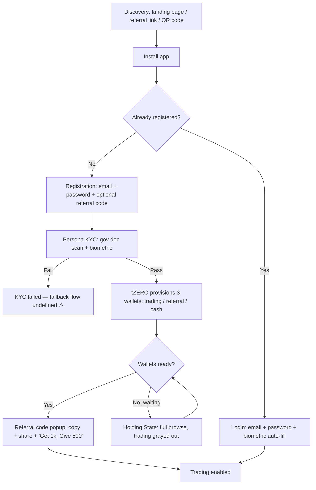
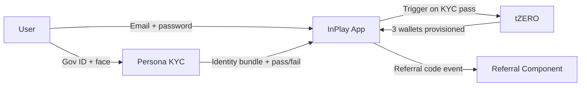
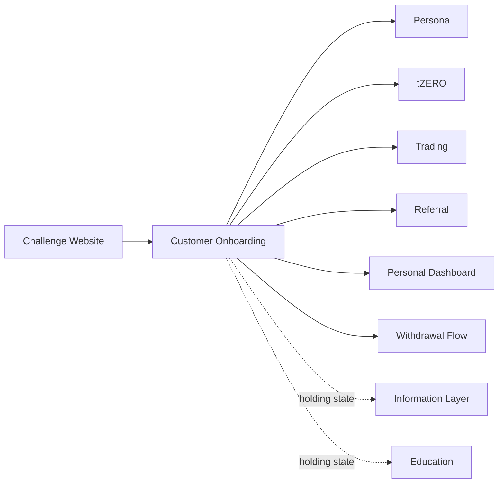

# InPlay Trading Challenge — Customer Onboarding

> **Vision:** [[vision]]
> **Audiences:** [[audiences]]
> **Date:** 2026-05-13
> **Status:** Defined
> **Owner:** Brett (client-facing) + George (engineering)
> **Sources:** _[[meetings/06-05-2026-vision-workshop]], [[12-05-2026-onboarding-and-renewal-and-global-component]]_

---

## 1. What Does This Component Do?

**Functional purpose:**

Customer Onboarding is the journey from "I just heard about InPlay" to "I'm logged in and trading." It spans discovery on the web, app download, registration combined with KYC verification, wallet provisioning by tZERO, the holding state during which wallets are being created, and the returning-user authentication flow. The product imperative is **three clicks or less to start trading** — Edwin: _"the fastest we can get them into the app the better."_ A user who hears about the challenge ten minutes before kickoff must be trading at kickoff. Failure here is fatal: _"the worst thing we could do is have someone try to sign up Sunday morning, say at 9:00 am, and they can't trade till Monday."_

The journey crosses three systems: the InPlay app (UI and product surface), **Persona** (the KYC vendor — gov-doc scan + biometric), and **tZERO** (the trading venue — manages all wallets and authentication credentials). The user should feel one seamless experience despite each system's constraints. Where tZERO's wallet creation takes time, the user does not wait on a blank screen — they enter a **holding state** with full browse-only access to the app while trading is grayed out.

Sub-component map:

```
Customer Onboarding
├── Discovery & App Acquisition       (landing page → app store → install)
├── Registration + KYC                 (email + password + Persona gov-doc + biometric, one combined step)
├── Wallet Provisioning                (tZERO creates trading + referral + cash wallets)
├── Holding State                      (KYC passed, wallets pending — browse, trade grayed out)
└── Returning Login                    (tZERO-issued credentials + phone biometric auto-fill)
```

Some detail in Discovery & App Acquisition will live in [[components/challenge-website/challenge-website]] — the web entry point itself is a separate component. The handoff (web → app install) is the onboarding concern.

> ⚠ **The map above assumes one path. As of 03-08 there are three** — Trader
> Full, Trader Medium and Trader Light — and a **first-open explainer tour plus
> a fork screen** now sit ahead of Registration + KYC. Registration + KYC
> branches by tier, Wallet Provisioning is blocked for Trader Light by tZERO's
> 18+ date-of-birth validation, and Holding State only applies to the KYC'd
> tiers. See the two update blocks below and
> [[compliance/eligibility-and-age-gating]]. Redrawing the sub-component map
> properly needs a focused session, not a digest.

**Audiences:**

The flow is identical for all four audiences. The differences are **acquisition channel** and **trust-signal sensitivity**, not the onboarding mechanic itself. See [[audiences]] for full audience definitions.

| Audience | How they arrive | What they need from onboarding |
|---|---|---|
| Crypto-Savvy Sports Trader | X / Discord, prediction-market communities, podcasts, press | SEC / SIPC trust signals up front. KYC pattern they already know from Coinbase / Robinhood. Crypto wallet linking when they request payout (deferred to [[components/withdrawal-flow/withdrawal-flow]]). |
| Analytical Fan / Armchair GM | Friend referrals, social shares, gorilla marketing (t-shirt QR, viewing parties), Reddit, podcasts | No-friction signup. Consumer-recognisable KYC (gov ID + face scan). Clear "what's in it for me" framing on the referral popup. |
| Finance-Curious Student | Campus ambassadors, dot cards, alumni networks, university curriculum, TikTok / Instagram | Mobile-first, fast, fun. Familiar KYC mechanic. Referral incentive ("Get 1,000, Give 500") visible and unmissable. |
| Veteran Trader-Bettor | Press, podcasts, industry network, word of mouth | Speed. Won't be deterred by extra fields, but appreciates the lack of them. Mostly: don't waste their time. |

> **Delivery note (May touchdowns):** **Login + KYC + referral is the first-version priority** — captured early so users are onboarded ahead of the summer referral programme. If app-store approval isn't ready in time (the first 3× referral event is 21 June), the fallback is a **PWA** (same React Native codebase, possibly re-rendered as server-side NextJS; **Persona** KYC wired in, identical branding) so onboarding/referral can run without Apple/Android approval. _Identity verification is handled by **Persona** (already the documented KYC vendor) — it manages all gov-doc + biometric verification._ The pre-app **lead-capture form** fields (last name, phone, "university or company" open text) live on the **Challenge/Global website**, not the app's registration (which stays email-only + Persona). _Sources: [[15-05-2026-touchdown]], [[18-05-2026-touchdown]], [[28-05-2026-touchdown]]._
>
> **Update (1–8 June touchdowns):** **Persona contract SIGNED** (was "in legal review") — implementation begins on intro to their tech engineer; **still awaiting API keys** to wire into the flow. The **onboarding flow is now built into the app** (Hassan): create-account → optional referral-code entry → Persona ID check (placeholder until keys land) → approved → QR/referral screen → into app. **KYC is required in the first iteration** (not optional) — the first version is referrals + wallet + signup + KYC + some live data, not full in-app trading. **Persona speed validated:** gov-ID + face-scan ~99.5% AI-automated, approval in seconds. **App stores:** **Google Play set up** (verification = identity + org-website + phone, via `appdevelopment@inplayglobal.com`); **Apple developer account reset to the beginning** — Apple must call/email **Edwin** to approve **Troy as company signatory** before the dev agreement can be signed and the team added (~48–72h last time). **Demoed 10-06** (Hassan): full flow is email → password → referral-code entry (deep-link via QR being wired) → Persona ID check → **pass/reject** → face scan (**~2–3s callback**) → QR/referral screen → into app; Persona **implementation engineer onboard for ~8 weeks**. _Sources: [[03-06-2026-touchdown]], [[05-06-2026-touchdown]], [[08-06-2026-touchdown]], [[10-06-2026-Touchdown]]._
>
> **Update (12–17 June touchdowns):** **Onboarding flow locked (17-06):** create account, then an **email verification code** (auto-fills on mobile), then the **Persona ID check**, then the user lands inside the app on the **IPO page** (first action is browse and buy, buy-only during the IPO phase). **Persona is effectively done (12-06)** and the tZERO-side wallet allocation is "grab an ID from the pool and allocate"; a details call with the tZERO engineers (Hassan / Abhishek) was set for the following week. **Wallet allocation can be day-before, not at signup (17-06):** wallet IDs do not need to be provisioned during onboarding. They can be allocated the **day before trading starts** by feeding a small payload to tZERO, which returns a pre-generated wallet ID (Troy has set up the wallets); this is off the pre-launch critical path. **Launch blocker = the Apple developer account (17-06):** the single biggest gating item for the pre-launch app; target end-of-June to early-July if Apple approval clears, with Google Play running in parallel. _Sources: [[12-06-2026-touchdown]], [[17-06-2026-touchdown]]. See [[digests/touchdowns-12-17-jun-2026]]._

> **Update (18–29 June touchdowns):** **App-store status (24-06):** **Apple is moving again** — the $99/yr developer fee paid and the app processing ("we figured out where everything was sitting"); **Android Play Store verification is stuck** on **website + phone-number verification** (requires **owner**, not admin, access — the Novo team are admins; Brett offered Play Store contacts to unstick it). Continues the standing "**Apple developer account = launch blocker**". **TestFlight up (26-06):** a build is running; distribution needs each tester's **Apple ID** (up to **100 users**), not device IMEIs. The **pre-launch build strips functionality** (first-time user, referrals, IPO browse) and **removes the demo ad units** (demo ads stay on a separate branch for sales demos, not the production app); PWA vs TestFlight builds are being **synced** so education etc. appears consistently. **Referral program now runs through the challenge website with full KYC (24-06)** — the web KYC is the gate that powers the referral activation. **KYC opt-in (29-06):** signup copy should explicitly read as **opting in** to communications. _Sources: [[24-06-2026-touchdown]], [[26-06-2026-ai-agent-research-component]], [[29-06-2026-touchdown]]. See [[digests/touchdowns-18-29-jun-2026]]._

> **Update (23-07-2026, _[[23-07-2026-tZERO-weekly]]_):** **Same initial capital of 100K InPlay$ for all users reconfirmed** (every account is treated equally, Troy). **Payouts/subscriptions processor: Pay.com** is the leading vendor, with a **redundant processor** in discussion for cash-out optionality; requires **no tZERO direction** for launch. (Payout mechanics themselves live in [[components/withdrawal-flow/withdrawal-flow]]; Pay.com is recorded as an integration in [[integrations]].)

> **Update (24-07-2026, _[[24-07-2026-touchdown]]_):** **KYC-less app variant being scoped, but de-prioritised for launch.** George is investigating a **no-KYC version of the app** (the effort/lift, and whether it needs a **fresh Apple review**). Edwin: **not** the highest priority, launch readiness (trading) comes first. Troy: it is **not needed until the first/second week of September**, when the **first academic presentation** runs, so there is roughly **a month** to solve it; the KYC-less path is intended as a **different login route for the academic portion** of the competition. Immediate priority remains getting the **trading functionality pushed, tested, and live for the 22nd** (Aug 22 sim launch, see [[23-07-2026-tZERO-weekly]]).

> ### ⚠ Update (03-08 / 07-08 touchdowns): onboarding is now **three tiers**, not one
>
> The single "sign up → Persona KYC → trade" path is superseded. The KYC-less
> variant scoped on 24-07 has been promoted from an academic-only side door into
> **the main funnel's first stage**. Rules and legal reasoning live in
> [[compliance/eligibility-and-age-gating]]; the journeys are this component's.
>
> **Why it changed.** Two forcing problems, both surfaced 03-08. First, KYC is
> killing conversion: Edwin's own brother-in-law and sister-in-law reached the
> KYC step and stopped, having previously had their identities stolen; signups
> sat at ~118, majority friends and family. Second, Troy's university programme
> is full of **international students** who are not US tax residents and can
> never receive a cash payout, so gating them behind full KYC excludes them for
> no benefit. Edwin: _"in order to qualify for any money payouts, you're going
> to have to fill out the KYC. That's a must. Now if you want to trade on the
> public forum, the one with no money, no rewards, you should be able to do that
> too."_
>
> **The three tiers (named 07-08).** George's names, with Troy's legal framing
> alongside:
>
> | Tier | Who | Verification | Cash prizes | Legal framing (Troy) |
> |---|---|---|---|---|
> | **Trader Full** | US tax resident, 18+ | Full Persona KYC | **Yes** | Skill-based trading competition |
> | **Trader Medium** | International student / non-US-tax-resident, 18+ | Persona KYC, identity only | No | Educational purposes |
> | **Trader Light** | Anyone 13+ | **Email only** + a 13+ attestation | No | Entertainment purposes only |
>
> **Persona now has two KYC paths** (07-08): one for tax residents, one for
> non-tax-residents. Spoken to already.
>
> **Everyone still gets an account and can trade.** Troy: _"Everyone can get an
> account. It's a simulator. The only people that can get cash payouts are
> people that go through the full KYC and validate that they're 18 and over."_
> Edwin's funnel logic: free play → taste it → give KYC for cash → eventually
> open a real brokerage account. _"The KYC thing right in your face just to
> start out is putting people off before they get a taste of the app."_
>
> **⚠ Hard blocker — tZERO's onboarding API (07-08).** tZERO already relax
> validation on most of their ~20 onboarding fields for InPlay (we send three).
> **Date of birth is still mandatory and must be 18+**, so a Trader Light user
> cannot be allocated a tZERO account ID or wallet ID, and therefore cannot
> trade at all. The ask — turn off DOB validation the way the other fields were
> turned off — is with tZERO via the shared Slack channel. Until it lands,
> Trader Light does not exist. Tracked as G1 in
> [[compliance/eligibility-and-age-gating]].
>
> **Ad consequence.** Non-signed-in and non-KYC users may only be served
> **under-18-safe inventory** — no alcohol, no gambling adjacency (George,
> 03-08). Constraint on [[advertising/advertising]].
>
> **App-store rating** should be set to **13+** so parental controls can block
> upstream (Troy, 07-08).
>
> **Long-term warning on file (Brett, 29-07).** A mixed population of
> not-logged-in, logged-in-not-KYC'd and KYC'd users is exactly the problem
> Google spent ~two years and enormous engineering resource solving after
> acquiring products with no login. It bites on ad targeting, house ads,
> impression tracking and upsell: a not-logged-in user still has to be served
> something, still has to be tracked, and still has to be pushed through to the
> next tier. Brett's framing: rolling users in tier by tier is probably right
> for now, but the difficulty is getting anyone to move **up** a tier once
> they're comfortable — the Robinhood problem. Recorded as a known future cost,
> not a launch blocker.
>
> _Sources: [[03-08-2026-touchdown]], [[07-08-2026-touchdown]],
> [[29-07-2026-touchdown]]._

> ### ⭐ Update (26-08-2026): the KYC-less path is BUILT, and the demo produced four changes
>
> Hasan demoed the no-verification path end to end on the 26-08 touchdown. **It
> works.** The flow is unchanged until near the end: date of birth, email,
> verification code, create account. The identity check then appears with a skip,
> and the user can trade **without an ID document or a face scan**.
>
> The call turned into a live design review. **Four changes came out of it.**
>
> **1. The skip is buried and must move.** _"I'll do it later"_ sits below the
> fold. Cody and Troy both want it **at the top, or as a popup**. Troy's reasoning
> is the part to keep: _"people will be like ugh because they don't even know that
> that's even an option at that point and they may just give up and not even
> scroll."_ A skip nobody finds is not a skip.
>
> **2. The fork becomes its own screen, straight after the email code.** Cody
> pointed back at Edwin's own example: the user lands on a page and **chooses
> their route**, rather than discovering the choice buried inside a verification
> screen. Kevin: _"once you put that in and then click next, it should bring you to
> this page here now, and then you can pick either one of those."_ Troy agreed and
> gave the principle: _"if we can remove a couple hops because we want them to get
> to the screen so they can see the screen as soon as possible."_ Hasan confirmed
> it can work that way.
>
> ⚠ **Note the relationship to the 17-08 screen.** That call put a **choice of
> three competitions** on first open. This one puts a **verify-or-not fork**
> straight after the email code. They are two different forks, one level apart,
> and **nobody has reconciled them into a single first-run sequence**. Worth
> settling before more screens are built on either.
>
> **3. The word "simulated" goes in front of "trading" everywhere.** Cody:
> _"start trading now… that seems to me reads like regulatory brokerage account or
> maybe too close to it."_ Troy: _"Put simulated in there. Activate simulated
> trading."_ Kevin: _"pretty much just add simulated in before trading and pretty
> much everything should be good."_ **This is a compliance copy rule, not a
> preference.** Recorded in [[compliance/regulatory-positioning]].
>
> **4. "KYC" comes out of the interface.** Troy: _"KYC is not a term that really
> resonates with everyone."_ The group worked through "get identity verified", "get
> ID verified" and (Jared, joking) "IDification", and landed on the shortest
> version:
>
> | Option | Label |
> |---|---|
> | Verify | **"Get verified"** |
> | Skip | **"Start trading without verification"** |
>
> Troy's argument for dropping "ID": _"we don't even have to put ID in there
> because it says you need to be of these ages. So that's what you're doing the
> verification for. It's pretty implicit."_
>
> #### Defects and asks from the same demo
>
> - ⚠ **Date of birth is in the wrong order.** The field shows **day before
>   month**; US users expect month first (Jared). George accepted it on the spot.
> - **SMS verification instead of email code** (Jared), and he brought the user
>   research with him: people do not want to leave the app, and the Gmail autofill
>   prompt is unreliable, _"that didn't pop up on mine. That didn't pop up on my
>   friends either."_ George: doable via **Twilio**, needs the organisation set up
>   and verified, _"not a done in a day"_. **Recorded as an improvement, not
>   committed.**
> - **Apple and Google one-click sign-in** (Troy), for the future to-do list.
>   George: doable, provider choice needed, and Google's own verification process
>   is arduous and video-based, _"one of the things that we can't speed up with
>   AI."_
> - **A first-run step-by-step guide**, as Edwin had demonstrated, is on Novo's
>   list with George targeting **end of that week**.
>
> _Source: [[26-08-2026-touchdown]]._

> ### ⚠ Update (24-08-2026): removing the KYC layer is the single gate on Thursday
>
> Troy, on the 24-08 touchdown: _"Let's focus on removing the KYC layer right now.
> That's the highest priority right now is to get that lifted as fast as
> possible."_ George had already described the work as _"not a turn it on"_ job,
> but committed to it _"over the next day or two"_.
>
> **The sequence Troy set out:**
>
> | When | What |
> |---|---|
> | Wednesday 26 August, evening | **IPO window closes** |
> | **Thursday 27 August** | **Secondary trading opens.** The KYC layer needs to be gone by here |
> | Saturday 29 August | First games |
>
> The two-day gap between trading opening and the first games is **deliberate**:
> _"we wanted to have a couple days again just so that in case anything was wrong,
> it wasn't fully visible to the whole universe yet."_
>
> This is the moment the three-tier decision of 03-08 / 07-08 stops being a model
> and becomes the critical path. What was scoped on 24-07 as a KYC-less side door
> for the academic programme, then promoted on 03-08 into the main funnel's first
> stage, is now **the single piece of work standing between the product and its
> trading launch**.
>
> Two things to hold on to while it lands:
>
> - **The gate being lifted is the trading gate, not the payout gate.** Cash
>   prizes still require full Persona KYC and US tax residency. Nothing here
>   touches [[compliance/eligibility-and-age-gating]]'s payout rules.
> - **The tZERO date-of-birth blocker (G1) is the thing to verify.** As of 07-08,
>   tZERO's onboarding API still required a date of birth of 18 plus, which meant
>   a Trader Light user could not be allocated a wallet and therefore could not
>   trade at all. 14-08 recorded that tZERO **will** remove the 18 plus
>   requirement. ⚠ The 24-08 call never mentions it, so **confirm G1 is actually
>   closed before treating Thursday as safe**.
>
> _Source: [[24-08-2026-touchdown]]._

> ### Update (17-08-2026): the first screen is a choice of three competitions
>
> Edwin's simplest statement yet of what first open has to do, and it is a
> requirement for the 22nd rather than a direction of travel. When someone
> downloads the app they choose between **three** things, and it has to be
> immediately legible:
>
> 1. **The free competition**, 13 plus, no cash prizes
> 2. **Private competitions**, the group and campus challenges
> 3. **The prize competition**, the verified cash-eligible one
>
> His words: _"we have to have the three items there to choose from. It's got to
> be really simple. Choose your competition."_ This is the fork screen from
> 07-08, now with three doors rather than two, and it is where the three account
> tiers become a user-facing choice rather than an internal model.
>
> Note what it depends on: **private competitions are one of the three doors**,
> which pulls the group and micro-challenge work forward from a Q1 item into the
> first screen of the app. The backend for it largely exists (see
> [[information-layer/sub-components/leaderboard/leaderboard]]), but the join
> mechanics do not.
>
> Also agreed on the same call: the **testing-the-waters disclosure** appears on
> this selection screen and behind an info button elsewhere, rather than on every
> surface as Edwin's prototype had it. See [[compliance/regulatory-positioning]].
>
> _Source: [[17-08-2026-touchdown]]._

> ### ⚠ Update (12-08-2026): the sign-up wall is now the headline commercial risk
>
> Edwin, having done demos and watched real people try to join: **he expects to
> lose half or more of downloads at the wall**, whichever wall it is. _"Whether
> it's an email, whether it's KYC, whatever. If that's the first thing you see,
> people are telling me they're not doing it."_ He named two family members who
> refused outright after previous identity theft, and described his own failed
> attempt to sign up with a second email, twenty minutes of a government ID not
> being accepted before he gave up.
>
> **Part of the fear is a version confusion, and that matters.** Troy tested the
> **App Store build** the night before and registered his son with **an email
> address and nothing else**, landing straight in the app, with KYC offered
> afterwards as the route to cash prizes. That is exactly the intended shape.
> Edwin had been testing the **TestFlight build**, which behaves differently.
> Troy's summary: _"we're between two worlds right now"_, and moving between
> them requires deleting one build before installing the other. Worth being
> precise about which build any feedback refers to from here on.
>
> **The walkthrough is named as the key blocker**, by Jared and George
> independently. Jared: a user downloads, is asked to create an account before
> anything, and has no idea what they are creating it for. He asked directly
> whether the explainer can come **before** account creation rather than after.
>
> **Edwin's four questions**, which he wants answered on first open, and which
> are the clearest statement yet of what the tour has to do:
>
> 1. What did I just download?
> 2. How does it work?
> 3. What is different about this from everything else?
> 4. What is in it for me?
>
> His framing of why it matters: a referral has to be _"download this app, it's
> awesome"_ and nothing more, because nobody is going to give a referred user
> half an hour of explanation. The app itself has to carry that job. And with
> real marketing money about to go in, the cost of failing is concrete: _"let's
> say we put up 500k over the next two weeks and that gets us 50,000 people who
> go to download. What are we going to lose because they don't know?"_
>
> **tZERO have moved on the 18+ requirement** (George, 12-08, after speaking to
> them the previous day): _"they said it shouldn't be an issue removing the over
> 18 thing."_ The check is only needed for users receiving payouts. The KYC flow
> now branches on US tax residency, and asks over-18s whether they want to
> participate in the challenge.
>
> _Source: [[12-08-2026-touchdown]]._

> ### Update (07-08-2026): first-open tour + the fork screen
>
> Edwin built a UI prototype over ~30 hours and ~80 iterations, and named one
> piece of it **non-negotiable**: _"when the app is opened, we need the talk
> basically of what the f\*\*\* they're looking at. That is a non-negotiable. We
> need to get that in as soon as possible."_
>
> Today the first screen a new user sees is a stadium image and a referral bank,
> which tells a referred user nothing about what InPlay is. The replacement is a
> **four-card explainer carousel**:
>
> 1. **Trade sports for free** — what the app is
> 2. **You own the company, not the bet** — what a team company is
> 3. **Why it's different** — four tabs
> 4. **Your opportunity** — $100,000 InPlay dollars, free to play, no deposit
>    ever, trade live games play-by-play, real cash prizes if verified, plus
>    partner logos as qualification
>
> Then the **fork screen**, which is where the three tiers become visible to the
> user: **left** = no cash prizes, 13+, join with an email; **right** = get
> verified with Persona. Edwin, on the users who refuse ID: _"there's too many
> of these people are like, they want to steal my thoughts… I want those out."_
>
> Also in the prototype: a **per-tab tour** for each surface, and a **rewarded
> ad** — watch 30 seconds, earn 100 InPlay dollars — positioned as a recovery
> mechanic for users having a bad trading day (see
> [[advertising/advertising]]). Copy change: "trading capital" becomes
> **"trading reserve"**.
>
> Priority context: George confirmed front-end changes of this shape are days,
> not weeks; the back-test lab in the same prototype is **not** achievable
> before launch. _Source: [[07-08-2026-touchdown]]._

> **Adoption snapshot (24-07-2026):** on **Wed 22-07 there were 37 first-time downloads** (a reporting lag means 23-07/24-07 are not yet known); running total logged-in ~130. Cody: **83 approved KYCs** (up from 64), so ~19 of the 37 had passed KYC, but some downloads are **already-KYC'd** people (the team, family members), so genuinely-new signups are lower still. A **newsletter goes out 24-07** to re-engage prior signups; Hasan exporting an updated registrations CSV (~25 more via email). Edwin pushing app signups hard (< 1 month to launch).

---

## 2. What Needs to Happen?

**Functional requirements:**

- User can discover the challenge via a mobile-optimised landing page accessible on desktop and mobile (detail in [[components/challenge-website/challenge-website]])
- Landing page hard-sells the app install (App Store / Play Store), with a desktop-to-mobile handoff fallback (email the install link)
- App on open detects whether the user is already registered: registered → login screen; new → registration
- Registration captures only **email + password** manually — every other identity field is captured by Persona from the government document
- Registration screen has an **optional referral code input** with deep-link support: clicking a referral link bypasses manual entry
- KYC happens immediately on registration — there is no separate "registered, awaiting KYC" state. Persona scans gov ID (passport or driver's licence), captures biometric face scan, returns name, address, location, age, citizenship, identity-match status
- KYC must complete in "a couple of minutes" (typical Persona turnaround)
- On KYC pass, tZERO provisions three digital wallets: **trading** (100,000 InPlay$), **referral** (0), **cash** (0)
- During wallet provisioning (typically fast, worst case up to 24 hours), the user enters a **holding state**: full read-only access to the app (information layer, education, browse) but trading buttons **grayed out, not hidden**
- When a user taps a grayed-out trade button in the holding state, a message displays: _"account pending approval"_
- On wallet ready: trading enabled; referral code popup appears with copy button, share buttons (messages / email / socials), and "Get 1,000, Give 500" framing in InPlay orange
- Returning user logs in via tZERO-issued credentials (email + password); device biometric (FaceID / passkeys / Android equivalent) auto-fills credentials
- No SSO at launch (tZERO manual account-creation step is incompatible). Magic link parked
- **No waitlist, ever** — Cody: _"weight lists really scared me. They are the death of social gaming apps."_



**Business rules and constraints:**

- Email is the only manually-entered profile field at signup
- Bank info, crypto wallet address, and 1099 tax info are captured **at first withdrawal**, not at signup — handled in [[components/withdrawal-flow/withdrawal-flow]]
- Cash wallet is held on the tZERO chain (not on InPlay infrastructure). This intentionally avoids store-of-value licensing exposure in EMEA and other jurisdictions
- The cash wallet may also support crypto payout (Coinbase or similar) at withdrawal time, leveraging tZERO's wallet infrastructure
- Referral code generated for the new user is **lifetime-stable** — it never regenerates
- For a referrer to receive the 1,000 InPlay$ reward, the referee must complete **full KYC** — not just registration (rule from vision)
- tZERO manages user authentication credentials (decision from this call — to confirm with tZERO Friday)

**Edge cases and error states:**

- **Persona outage during signup** — fallback flow undefined. ⚠️ **Gap.** Brett raised: _"persona could go down, right? We need to think a bit about those kind of cycles."_
- **tZERO wallet creation latency** — could be minutes or hours. Mitigation: pre-funded wallet pool. Cody's proposal, agreed in principle: tZERO pre-creates 3,000–5,000 wallets at 100,000 InPlay$, assigned post-KYC. **Pending tZERO cost confirmation in Friday session.**
- **High-volume signup spike** (Sunday morning before kickoff) — graceful degradation if pre-funded pool depletes. **No waitlist allowed.** Brett suggested a "weightless mode" placeholder — to design
- **KYC failed** — multiple open questions for InPlay team: do we let them retry? How many attempts? Soft fail (Persona uncertain) vs hard fail (gov doc rejected)? What support route exists? ⚠️ **Gap.**
- **Cyber / data sensitivity** — Troy flagged: _"the more data we collect, the more sensitive it gets and the more susceptible we are to cyber attacks."_

---

## 3. How Should It Look and Feel?

**Design direction:**

Speed-first, conversational, mobile-native. The user should feel they are getting into something fast, not filling out a form. Trust signals (SEC reg framing, SIPC, "first regulated sport") earn the right to ask for ID. Persona's gov-doc scan UX is the dominant moment — InPlay's job is to wrap it in a journey that feels intentional, not a compliance checkpoint.

The holding state must feel like a tour, not a waiting room — the user is browsing a working app, even if they can't trade yet.

**Reference products:**

⚠️ Limited explicit references named in this call. Adjacent references mentioned elsewhere:
- **Revolut** — Brett, in the referral context — staged onboarding incentives that escalate ($200 sign-up → $700–$800 over multiple steps including card-order + first transaction). Worth studying for **post-onboarding milestone framing**, not the signup itself
- **High-stakes fantasy** (Cody's prior experience) — defer bank info until withdrawal request. Onboarding stays light; the money-out moment carries the heavier compliance lift

**Gap for next call:** explicit onboarding references — Robinhood, Webull, Coinbase, Stake.

**Key UX principles:**

- **Three clicks or less to start trading** (Edwin, repeated multiple times)
- **One manual field at signup: email** — everything else flows from Persona
- **Never hide buttons during holding state — gray them out** (Edwin + Troy joint decision: _"so they can at least visually get an idea of what the experience might be"_)
- **No waitlist, ever** (Cody)
- **Speak to the audience before you ask for ID** — the value proposition lands first, then the gov-doc scan
- **The referral popup is part of the celebration moment, not a separate task** — copy + share buttons sit alongside the code on a single screen

---

## 4. How Are We Going to Solve It?

| Capability | Build / Buy / Access | Provider | Rationale |
|---|---|---|---|
| Identity verification (KYC) | Access | **Persona** | Selected vendor. Scans government doc (passport / driver's licence) + biometric face scan. Returns name, address, location, age, citizenship, identity-match. "Couple of minutes" turnaround (Cody, validated on other social gaming platforms). |
| Authentication & credentials | Access | **tZERO** | tZERO owns login credentials (email + password). Confirmed in call, **to be validated with tZERO Friday session**. No SSO at launch — tZERO manual account creation step incompatible. |
| Wallet provisioning | Access | **tZERO** | tZERO creates synthetic digital wallets on chain for all three balances: trading (100K InPlay$), referral, cash. Sim wallets behave like production. |
| Cash wallet hosting | Access | **tZERO** (decision moved mid-call from InPlay to tZERO) | tZERO hosting the cash balance sidesteps store-of-value licensing exposure in EMEA and other jurisdictions. Removes a payment-processing partner conversation (Cody: _"one less partner we got to work with"_). Easier crypto / FX flexibility. |
| Pre-funded wallet pool | Build (on tZERO side) | **tZERO** (Cody's proposal) | tZERO pre-creates 3,000–5,000 wallets at 100K InPlay$, assigned to users post-KYC. Mitigates "Sunday 9am, kickoff at 1pm" scenario. Status: agreed in principle, **pending tZERO cost confirmation Friday**. |
| Mobile app | Build | **Rebel / Novosapien** | Mobile-first, web-portable architecture. _"We're putting a lot of the Headspace mobile first, but it's easily portable into a web-based version as well."_ (George) |
| Landing page → app handoff | Build | Rebel / Novosapien | Desktop detection prompts app install; fallback emails the install link with deep-link to bypass referral code re-entry. Detail in [[components/challenge-website/challenge-website]]. |
| Device biometric auto-fill | Access (OS) | iOS Keychain / Android passkeys | Native phone-level facial recognition fills tZERO credentials on returning login. No server-side biometric build needed at launch. Note: this is distinct from Persona's biometric, which is a one-time KYC artifact. |

---

## 5. What Data Does It Need?

| Data | Direction | Source / Destination | Notes |
|---|---|---|---|
| Email | In (user input) | App → tZERO | Only manually-entered profile field at signup. |
| Password | In (user input) | App → tZERO | tZERO manages credentials (to be confirmed Friday). |
| Government ID image | In (Persona SDK) | Persona | Passport or driver's licence. Image held by Persona, not InPlay. |
| Biometric face scan (KYC) | In (Persona SDK) | Persona | One-time identity-match artifact. |
| First name, last name | Out (Persona) | Persona → InPlay | Returned post-KYC pass. Never separately captured. |
| Address, location (residence) | Out (Persona) | Persona → InPlay | Returned post-KYC. Required for compliance + location-during-trade rule (lives in [[components/referral/referral]]). |
| Age | Out (Persona) | Persona → InPlay | Used for 18+ gate. |
| Citizenship / jurisdiction | Out (Persona) | Persona → InPlay | Gates US-only vs global access. Global pending Marlin's regulatory ruling. |
| KYC pass/fail status | Out (Persona) | Persona → InPlay → tZERO | Critical event. Triggers wallet provisioning. Webhook + retry contract needed. |
| Trading wallet (100K InPlay$) | Out (tZERO) | tZERO → user account | Synthetic, on chain. From pre-funded pool. |
| Referral wallet (0) | Out (tZERO) | tZERO → user account | Synthetic, on chain. |
| Cash wallet (0) | Out (tZERO) | tZERO → user account | Synthetic, on chain. Will fund as user wins prizes. |
| Referral code (entered by referee) | In (user input or deep link) | App → InPlay | Optional. Deep link bypasses manual entry. Validated against existing codes. |
| Referral code (generated for new user) | Out | InPlay → user | Auto-generated, lifetime-stable. Triggered on KYC pass. Detail in [[components/referral/referral]]. |
| Bank info, crypto wallet, 1099 | — | — | Deferred to [[components/withdrawal-flow/withdrawal-flow]]. NOT captured at signup. |



---

## 6. Who Can Access It?

| Audience / Role | Access level | Notes |
|---|---|---|
| Anonymous visitor (pre-app) | Read-only landing page | Web only. Hard-sell for app install. Detail in [[components/challenge-website/challenge-website]]. |
| KYC-passed, pre-wallet (holding state) | Full app browse, **trading grayed out** | Information layer, education, browse — all open. Buy/Sell buttons visible but disabled. Tap → "account pending approval" message. |
| KYC-passed, wallet provisioned | Full app access | Trading enabled. Referral code popup fires once on first reach. |
| KYC-failed | ⚠️ **Open question** | Multiple unresolved questions — see Edge cases. Goes into Questions for InPlay. |

Note: registration and KYC happen in the same step, so there is no standalone "registered, awaiting KYC" access state.

---

## 7. How Do We Know It's Working?

> ⚠️ **These metrics are recommendations only.** The call did not define success metrics. Bring to next session for discussion.

- [ ] **Time-to-trade**: ≥90% of new signups complete registration + KYC + wallet provisioning + reach first viable trade screen in under 5 minutes (Edwin's "3 clicks or less" / "10 minutes before kickoff" made operational)
- [ ] **Completed onboarding → first trade panel metric**: ≥70% of users who complete onboarding execute their first trade within the same session. _Validates that onboarding hands them off into the trading experience effectively._
- [ ] **KYC pass rate**: ≥85% of started KYC flows pass on first attempt (industry baseline; below this signals friction, fraud, or audience mismatch)
- [ ] **Holding state retention**: <5% of users who enter holding state abandon before wallets ready (validates the gray-out + browse-only UX)
- [ ] **Referral code entry rate**: ≥40% of new signups enter a referral code (validates virality of the deep-link mechanism — feeds [[components/referral/referral]])
- [ ] **Pre-funded wallet pool depletion alert**: pool never drops below 25% capacity during peak signup periods (operational metric, jointly owned with tZERO)
- [ ] **Cyber / abuse signal**: <0.1% of accounts flagged for suspected bot/fraud post-KYC (validates Persona's effectiveness; addresses Troy's data-sensitivity concern)

### Cross-cutting: End-to-End Funnel Measurement

A broader measurement need surfaced in conversation: a single end-to-end CTA funnel from **first social engagement / ad serving → app install → onboarding → first trade → referral conversion → behavioural and lifetime value metrics**. Onboarding sits in the middle of this funnel; its metrics feed into the larger measurement plane.

This is a **cross-cutting concern** that does not belong solely to Onboarding — it overlaps Advertising, Push/CRM, Referral, Trading, and Personal Dashboard. ⚠️ **Recommend a dedicated cross-cutting Analytics & Funnel Measurement document.** Onboarding owns the segment of that funnel from app-install-event → wallet-ready event.

### Pre-Onboarding Funnel: Form Capture → CRM → App Install

A pre-app warm-lead funnel was scoped in 14-05-2026:

- The [[components/challenge-website/challenge-website\|Challenge Website]] (and its precursor Holding Page, live ~15 May) captures early-interest signups via a single form: first name, last name, optional mobile, email, business / college, advertiser-or-student type flag.
- Form data lands in **Airtable** initially (Brett's interim store), then pipes into **HubSpot or Vtigger** (Cody's team is choosing).
- Once CRM is live: automated welcome email on signup, promotional email drips, app-install prompts.
- Brett: _"We're just going to bang it into Airtable, store it there for you and then push that through to HubSpot once you guys are ready."_
- This pre-onboarding stage is upstream of the app-install event — these leads convert to Onboarding when they download the app and start the signup flow.
- The bridge between this CRM-tracked lead and the in-app onboarding event needs an identity-stitch (email match? UTM tracking? Other?) ⚠️ **Gap** — feeds the Analytics & Funnel Measurement cross-cutting concern.

---

## 8. Dependencies

**What Onboarding needs:**

| Depends on | What we need | Blocking? |
|---|---|---|
| **Persona** | KYC SDK + webhook for pass/fail status + retry semantics | **Yes** — core path |
| **tZERO** | Wallet provisioning API, auth credentials API, pre-funded wallet pool support | **Yes** — core path |
| **[[components/challenge-website/challenge-website\|Challenge Website]]** | Hands users into app install (deep linking, app-store handoff). Also runs the pre-onboarding form-capture funnel that feeds CRM warm-leads. | No — app-side can build first |
| **Referral component** | Lifetime-stable code generation; referral code lookup/validation on signup | No — can mock for early dev |
| **App store presence (iOS + Android)** | Approved listings | **Yes** — for end-to-end test |
| **Marlin's regulatory ruling** | US-only vs global jurisdiction confirmation | Partial — affects Persona config |

**What other components need from Onboarding:**

- **Trading** — authenticated session + wallet IDs + KYC-pass flag
- **Referral** — new-user-with-code-entry event (triggers 1,000/500 dual-sided reward)
- **Personal Dashboard** — account-ready state, identity, balances
- **Withdrawal Flow** — authenticated identity hand-off, KYC artifact for compliance audit
- **Information Layer** + **Education** — open to holding-state users (no auth gate beyond logged-in)



---

## 9. Priority

**Must-have at launch?** **Yes — non-negotiable.** No onboarding, no users.

**Sequencing rationale:** Build first. Onboarding gates every other component. Persona and tZERO integration are the technical risk concentrators — they should be validated end-to-end as early as possible. The pre-funded wallet pool decision needs to happen with tZERO in the Friday session before the implementation path is locked.

---

## 10. Risks

**Abuse vectors:**

- Bot signups to farm referral wallets — mitigated by Persona KYC (gov ID + biometric face-match)
- Multiple accounts per real person — Persona ID matching expected to prevent; **confirm with Persona**
- Referral chain fraud — lifetime-stable codes + KYC trigger for reward
- Stolen ID submissions — Persona's biometric face-match is the control

**Data risks:**

- More data captured = more cyber exposure. Troy explicit: _"I don't want us to be in the press on all this personal data being leaked. That's my biggest concern."_
- tZERO holds the wallet ledger including the cash wallet — single point of failure for funds integrity
- Persona holds gov ID images + biometric — high-value breach target; we rely on their controls

**Compliance:**

- 18+ age verification (Persona)
- US-only vs global jurisdiction — pending Marlin's ruling
- KYC standards: AML, identity, sanctions (Persona's framework)
- Cash wallet on tZERO chain — designed to avoid store-of-value licensing in EMEA / global
- PII handling — encryption at rest, retention windows, GDPR exposure if global
- Biometric data storage — local jurisdiction (Illinois BIPA in US, GDPR in EU)

**Controls needed:**

- Pre-funded wallet pool sizing + monitoring (joint with tZERO)
- Holding state UX: **gray out, never hide**
- Rate limiting on signup attempts per IP / device
- Persona webhook retry queue + dead-letter handling
- Persona outage fallback flow — **undefined, gap**
- Cyber / data-handling framework — Troy flagged the need for a dedicated session with the architecture team
- Audit logging of KYC events for compliance

---

## Sub-Components

| Sub-Component | Overview | Status | Link |
|---|---|---|---|
| Discovery & App Acquisition | Landing → app store → install. Detail also lives in [[components/challenge-website/challenge-website]]. | Collecting | _[[sub-components/discovery-and-app-acquisition]]_ |
| Registration + KYC | Email + password + optional referral code + Persona KYC (gov doc + biometric) in one combined step. tZERO owns credentials. | Collecting | _[[sub-components/registration-and-kyc]]_ |
| Wallet Provisioning | tZERO creates trading + referral + cash wallets, ideally from pre-funded pool. | Collecting | _[[sub-components/wallet-provisioning]]_ |
| Holding State | Post-KYC, pre-wallet. Full browse, trading grayed out. | Collecting | _[[sub-components/holding-state]]_ |
| Returning Login | tZERO-issued credentials + phone biometric auto-fill (FaceID / passkeys). | Collecting | _[[sub-components/returning-login]]_ |

---

## Open Questions for Next Call (InPlay team)

### Persona (vendor) integration
- Outage fallback flow — what does the user see if Persona is down mid-signup?
- KYC failure handling — retry policy? Soft fail (Persona uncertain) vs hard fail (rejected)? Support route? Communicate to user how?
- Biometric data jurisdiction — Illinois BIPA, GDPR — where do we host?

### tZERO integration (cover in Friday session)
- Authentication model — session token? Proxied through InPlay or direct app-to-tZERO?
- Credential ownership — does tZERO store email + password, or do we?
- Pre-funded wallet pool — cost per pre-created wallet? Refresh cadence? Capacity target?
- Wallet creation latency — typical and worst-case timings
- SSO — could it ever be enabled (would require non-manual account creation on tZERO side)?
- Migration path if we outgrow tZERO's 30,000-account current footprint

### Withdrawal flow (separate component, not in this call)
- Bank info capture journey — what fields, when, validation?
- Crypto wallet linking — which providers (Coinbase referenced via Iris)? UX flow?
- 1099 / tax capture — when, how, integration?
- Minimum withdrawal threshold?
- Withdrawal eligibility gates (linked to [[components/referral/referral]] — Edwin's 10-referrals + location rule)

### Cross-cutting
- End-to-end CTA funnel — recommend dedicated **Analytics & Funnel Measurement** doc covering social engagement → install → onboard → first trade → referral conversion → LTV
- Cyber / data-handling framework — Troy flagged dedicated session needed with architecture team
- Onboarding reference products — Robinhood, Webull, Coinbase, Stake — pick 2–3 to study

### Audience-specific
- Crypto-Savvy Sports Trader payout preference confirmation (via Iris)
- Global availability — pending Marlin

---

## Diagrams Index

- Section 2 — onboarding journey flowchart (Mermaid `graph TD`)
- Section 5 — data flow diagram (Mermaid `graph LR`)
- Section 8 — dependencies graph (Mermaid `graph LR`)
