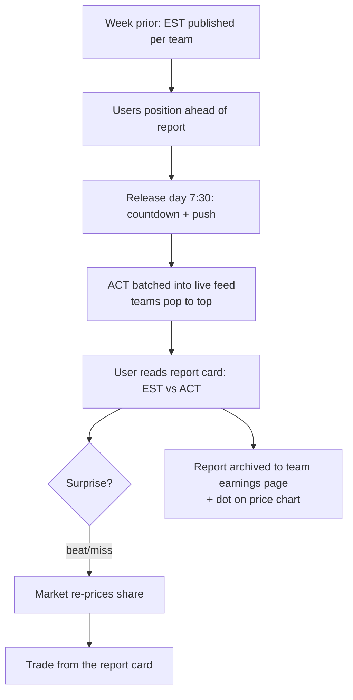
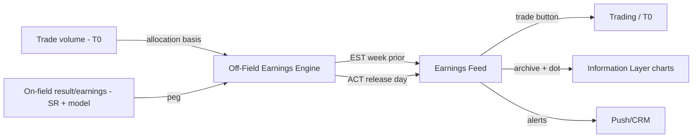
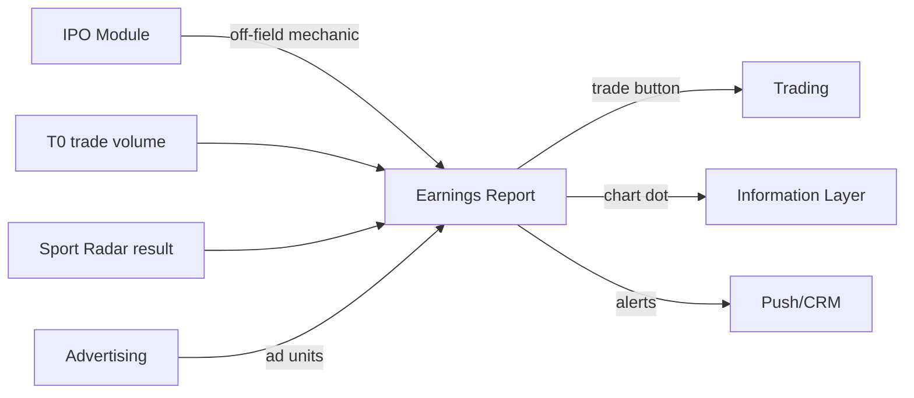

# InPlay Trading Challenge — Earnings Report

> **Vision:** [[vision]]
> **Audiences:** [[audiences]]
> **Date:** 2026-05-27
> **Status:** Defined
> **Owner:** Edwin (client-facing — mechanics owner) + George (engineering) + Cody (trading/UX)
> **Sources:** _[[meetings/27-05-2026-Earnings-report]], [[06-05-2026-vision-workshop]]_

---

## 1. What Does This Component Do?

**Functional purpose:**

The Earnings Report is the recurring **tradable event** that gives every team company a weekly heartbeat. Where the [[ipo-module]] issues each team's stock once at the start of the season, the Earnings Report is what keeps that stock alive between games — a scheduled release of each team company's **off-field earnings** that re-prices the market on a fixed cadence. It turns InPlay's proprietary off-field revenue mechanic into a Bloomberg-terminal-style event the whole user base trades against at the same moment.

The mechanic is borrowed directly from real equity markets. Each team company has an **off-field earnings** figure — the marketing/engagement revenue allocated to it (built on the $250/game pool, distributed by share of trade volume, seeded at IPO; see [[ipo-module]]). The off-field earnings total for a game is **half the on-field winner's earnings**. Every report carries **two numbers: an Estimate (EST)**, published the week before, and an **Actual (ACT)**, released on the day. The gap between them is the trade — if a team is expected to earn $0.50 off-field and reports $2.20, that's a material surprise that re-prices the stock. Crucially the price move is **not the raw number** but what the **market interprets** from it: expectations roll forward (a big beat lifts next week's expectation), and the on-field result colours it too (winning ugly vs convincingly). Edwin: _"there's no binary outcome with any of the valuation model other than the conclusion of the event."_

The user experience is built to feel explosive. Reports are **batched and fired all at once** at release time (7:30) — Tuesday for NFL, Wednesday for NCAA — into a **Bloomberg-style feed** where teams "bing bing bing" pop to the top, fast and exciting, exactly like a trader watching non-farm-payrolls print. Users land on the feed (reached from the More menu, a reports tab on the trade page, or a team/game page), with their **favourites/portfolio pinned to the top**, search and conference filters below. Each report is a **graphical, punchy card** (not dense Bloomberg text) with an **embedded trade button** — read the Bills' beat, trade the Bills two clicks away. Afterwards, each team company keeps its **own earnings page** as a historical archive, and every report leaves a coloured **dot on the price chart** (distinct from the gameplay volatility dot) so a user scrolling chart history can see "missed earnings by $0.50" and how the market priced it.

```
Earnings Report
├── Earnings Feed / Release Page
│   ├── Batched 7:30 release (Tue NFL / Wed NCAA)
│   ├── Pop-to-top live behaviour (Bloomberg-style)
│   ├── Favourites/portfolio pinned · search · conference filters
│   └── Alphabetical default order
├── Earnings Report Card
│   ├── EST vs ACT (two numbers)
│   ├── Graphical / "sexy" presentation
│   └── Embedded trade button (2 clicks to trade)
├── Off-Field Earnings Engine
│   ├── EST published week prior
│   ├── ACT on release day
│   └── ½ on-field winner earnings · $250/game volume-allocated
├── Historical Earnings & Chart Annotation
│   ├── Per-team-company earnings archive page
│   └── Coloured earnings dot on price chart
└── Earnings Alerts & Countdown
    ├── Push notification on release
    └── Countdown to the release moment
```

**Personas:**

| Persona | How they use this component | What they need from it |
|---------|---------------------------|----------------------|
| **Veteran Trader-Bettor** (Edwin's profile) | Trades the release like non-farm payrolls — watches the batched print, reacts in seconds to EST-vs-ACT surprises | A fast, dense, real-time feed; precise EST/ACT numbers; instant trade-from-report |
| **Analytical Fan / Armchair GM** | Forms a view on which teams will beat or miss off-field expectations and positions ahead of the report | Clear expectations vs actuals; historical earnings to judge a team's pattern; reasoning context |
| **Finance-Curious Student** | Learns how an "earnings surprise" moves price; reacts via favourites + push alerts | Favourites pinned to top, push alert, graphical/legible cards |
| **Crypto-Savvy Sports Trader** | Treats it as a recurring volatility event to trade around | Reliable schedule, countdown, immediate liquidity to act on the move |

---

## 2. What Needs to Happen?

**Functional requirements:**

- Compute and publish an **EST (estimate)** off-field earnings for each team company **the week before** the report.
- Compute and release the **ACT (actual)** off-field earnings on **release day** (Tue NFL / Wed NCAA), batched at the release time.
- Display all reports in a **live feed** that updates fast at release (teams pop to the top), with **favourites/portfolio pinned**, **search**, **conference filters**, and **alphabetical** default order.
- Render each report as a **graphical card** showing EST vs ACT, with an **embedded trade button** that opens trading for that team.
- Maintain a **per-team-company earnings archive page** (browse historical reports).
- Place a distinct coloured **earnings dot** on the team's price chart marking each report (cross-reference [[information-layer]]).
- Send a **push notification** and show a **countdown** to the release moment.
- Make the component reachable from **More**, the **trade page reports tab**, and **team/game pages** — but no more than ~two primary routes (avoid users getting lost).



**Business rules and constraints:**

- Off-field earnings total for a game = **half the on-field winner's earnings**.
- Off-field allocation built on the **$250/game pool, distributed by share of trade volume** (seeded at IPO — see [[ipo-module]]).
- Every report has exactly **two figures: EST and ACT**.
- Price impact is **market-determined**, not a fixed function of the number; expectations carry forward week to week.
- Reports are **batched** (not trickled) and released on a fixed schedule (Tue NFL / Wed NCAA).
- **Free** in the trading challenge (production may differ).

**Edge cases and error states:**

- **No trade volume on a game** → how is the $250 off-field pool allocated when volume is zero/negligible? *Open.*
- **EST/ACT for a team with no game that week** (bye week) → is there still a report? *Open.*
- **Release-time load spike** — the whole user base hits the feed + trades at 7:30; must withstand the burst.
- **Late/failed actual** for a team → report must not show a stale/blank ACT silently.

---

## 3. How Should It Look and Feel?

**Design direction:** Borrow the **energy** of a Bloomberg earnings feed — fast, batched, reports popping to the top in real time — but **not its density**. Where a real terminal is structured monospace text, InPlay's reports should be **graphical, punchy, and "sexy"** (Brett), more like an exciting flyer per event than a data dump. The release moment should feel like a countdown-driven event ("8 seconds… 7, 6, 5").

**Reference products:**
- **Bloomberg terminal earnings feed** — for the batched, pop-to-top live behaviour and the EST-vs-ACT framing (take the energy, leave the density).
- **Squawk-box / non-farm-payroll release UX** — Edwin's mental model for the explosive scheduled-release moment.
- The IPO **swipe/list** browse pattern (see [[ipo-module]] / draft-board) — reuse for consistency.

**Key UX principles for this component:**
- **Make the surprise legible** — EST vs ACT must read instantly; the "beat/miss" is the whole point.
- **Two clicks to trade** — every report card carries a trade affordance.
- **Favourites first** — a user's teams/portfolio pin to the top so they see what affects them.
- **Event, not archive** — at release it feels live and urgent; the historical view is a separate, calmer surface.
- **Don't over-route** — reachable a couple of ways, not five (Cody: avoid users getting lost).

---

## 4. How Are We Going to Solve It?

| Capability | Build / Buy / Access | Provider / Approach | Rationale |
|-----------|---------------------|-------------------|-----------|
| Off-field earnings calculation (EST + ACT) | Build | InPlay model | Proprietary mechanic (½ on-field winner, $250/game volume-allocated); core IP |
| Trade-volume input (for allocation) | Access | T0 / trading data | Allocation depends on each team's share of matchup trade volume |
| On-field earnings / result input | Access | Sport Radar + InPlay model | The off-field figure is pegged to the on-field winner's earnings |
| Live batched feed (pop-to-top at release) | Build | InPlay app | No off-the-shelf equivalent for this event UX; must handle release burst |
| Trade-from-report | Build + Access | InPlay app + T0 trading | Embedded trade button reuses the Trading execution path |
| Chart dot annotation | Build | InPlay app (Information Layer charts) | Cross-component feature on the price chart |
| Push + countdown | Build + Access | In-app + Push/CRM | Reuses Push/CRM cross-cutting infrastructure |
| Ad insertion into earnings page | Access | Ad server (Advertising cross-cutting) | Edwin wants marketing partners on this high-traffic page |



---

## 5. What Data Does It Need?

| Data | Direction | Source / Destination | Notes |
|------|-----------|---------------------|-------|
| Trade volume per team per matchup | In | T0 / trading data | Allocation basis for the $250/game off-field pool |
| On-field result / winner earnings | In | Sport Radar + InPlay model | Off-field total = ½ on-field winner earnings |
| Estimate (EST) | Out / Stored | InPlay model | Published the week prior |
| Actual (ACT) | Out / Stored | InPlay model | Released on the day, batched |
| Favourites / portfolio | In | User / [[information-layer]] | Pins relevant reports to the top |
| Historical reports per team | Stored | InPlay | Per-team-company earnings archive |
| Chart annotation (earnings dot) | Out | → [[information-layer]] price chart | Distinct colour from gameplay volatility dot |
| Release schedule | In | InPlay | Tue NFL / Wed NCAA, 7:30 batch |

---

## 6. Who Can Access It?

| Persona / Role | Access level | Notes |
|---------------|-------------|-------|
| All four user audiences | Full | Free in the trading challenge; reading + trade-from-report |
| Pre-KYC / unfunded user | View only (if at all) | Can't trade the report without a funded wallet |
| Production users (future) | Possibly gated/paid | Edwin: in production it "could be different"; challenge is free |

---

## 7. How Do We Know It's Working?

- [ ] High proportion of active users open the earnings feed on release day (engagement spike at 7:30).
- [ ] Measurable **trade volume spike** around each release (the report is generating the intended tradable event).
- [ ] Trade-from-report conversion — users who read a card and trade it within two clicks.
- [ ] EST vs ACT is understood — users react in the expected direction to beats/misses.
- [ ] Feed withstands the release burst with no latency/outage at 7:30.
- [ ] Historical earnings pages and chart dots are used when researching teams.

---

## 8. Dependencies

**What this component needs:**

| Depends on | What we need | Blocking? |
|-----------|-------------|----------|
| [[ipo-module]] | The off-field value mechanic ($250/game, volume-allocated) seeded at IPO | Yes (conceptual basis) |
| T0 / trading data | Per-team trade volume for allocation | Yes |
| Sport Radar + InPlay model | On-field result / winner earnings | Yes |
| Trading | Execution path for the embedded trade button | Yes |
| [[information-layer]] | Price charts (for the earnings dot) + favourites/portfolio | No — can ship feed first, annotate later |
| Push/CRM (cross-cutting) | Release alerts + countdown delivery | No |
| Advertising (cross-cutting) | Ad insertion on the earnings page | No |

**What other components need from this one:**

- **Trading** sees the volatility/volume spike this event generates.
- **[[information-layer]]** consumes the **earnings dot** annotation for its charts.
- **[[ipo-module]]** (season-end settlement) — the off-field earnings accrued across the season inform final value; see [[ipo-module]] `season-end-settlement`.



---

## 9. Priority

**Must-have at launch?** **Yes — needed shortly after the IPO/secondary market opens.** The Earnings Report is what makes holding a stock between games worthwhile; without it, off-field value is an abstract IPO input with no recurring tradable expression. The first report cycle must be live in the opening weeks of the season.

**Sequencing rationale:** Conceptually downstream of the [[ipo-module]] (which seeds the off-field mechanic) and dependent on the Trading execution path and trade-volume data. Build after the IPO/secondary market is functioning but before the first scheduled report week. The Off-Field Earnings Engine (the calculation) is the long-pole and the proprietary core — de-risk it early; the graphical feed UX can iterate.

---

## 10. Risks

**Abuse vectors:**
- **Volume-allocation gaming** — because off-field earnings are allocated by share of trade volume, coordinated wash-trading on a matchup could inflate a team's off-field earnings and pre-position for the beat. This is a serious incentive loop to close.
- **Front-running the EST→ACT** — if the actual is derivable/leakable before release, users could trade ahead.

**Data risks:**
- **EST/ACT integrity** — a wrong earnings number directly mis-prices the market and erodes trust (echoes Edwin's Polymarket $900 horror story).
- **Stale/blank actuals** — a failed or late ACT shown silently misleads traders mid-event.
- **Volume-data quality** from T0 feeding the allocation.

**Compliance:**
- Even simulated, this is an "earnings release" mechanic; the EST/ACT and its market impact should be clearly framed as a game construct, not investment guidance — InPlay does not advise (vision-level constraint).

**Controls needed:**
- **Wash-trading / volume-manipulation detection** on the matchup volume that feeds allocation.
- Lock and embargo the ACT until the scheduled release; no early exposure.
- Clear EST/ACT provenance + a visible "pending/failed" state rather than silent blanks.
- Load/burst hardening for the 7:30 batched release.

---

## Sub-Components

| Sub-Component | Overview | Status | Link |
|--------------|----------|--------|------|
| Earnings Feed / Release Page | Batched Bloomberg-style live feed; pop-to-top; favourites pinned, search, conference filters, alphabetical default | Defined | [[sub-components/earnings-feed/earnings-feed]] |
| Earnings Report Card | Individual team report: EST vs ACT, graphical presentation, embedded trade button | Defined | [[sub-components/earnings-report-card/earnings-report-card]] |
| Off-Field Earnings Engine | Computes EST (week prior) + ACT (release day); ½ on-field winner, $250/game volume-allocated | Defined | [[sub-components/off-field-earnings-engine/off-field-earnings-engine]] |
| Historical Earnings & Chart Annotation | Per-team-company earnings archive + coloured earnings dot on the price chart | Defined | [[sub-components/historical-earnings/historical-earnings]] |
| Earnings Alerts & Countdown | Push notification on release + countdown to the release moment | Defined | [[sub-components/earnings-alerts/earnings-alerts]] |

---

> **Update (12–17 June touchdowns):** **Placement finalised (15-06):** the earnings report gets its **own page** (reached from the more / discover area) **plus an embedded earnings box** on each team page, with the **trade button kept accessible**. A **push notification fires ~15 minutes before** the release, consistent with the existing batched-release feed design. Note: the **synthetic off-field** number used for pre-launch IPO pricing (ad-spend-based, see [[ipo-module/ipo-module]]) is a preview input only; the live off-field earnings engine ($250/game pool, ½ on-field winner) is unchanged. _Sources: [[15-06-2026-touchdown]]. See [[digests/touchdowns-12-17-jun-2026]]._

## Gaps and Questions for Next Call

### Gaps
- **Zero/low-volume allocation** — how the $250 off-field pool splits when a matchup has little trade volume.
- **Bye weeks** — is there a report for a team not playing that week?
- **EST methodology** — exactly how the estimate is produced (and how defensible it is), since the EST→ACT gap is the whole trade.
- **Information Layer boundary** — the feed is standalone, but the chart-dot and favourites integration are Information Layer surfaces; confirm the contract.
- **Look-and-feel** — direction is set (graphical Bloomberg-energy) but no mockups yet.
- **Risk depth** — wash-trading/volume-manipulation only flagged, not designed against.

### Questions for next call
- Confirm "off-field = ½ on-field winner earnings" and the $250/game volume-allocation as final for the challenge.
- Confirm release schedule (Tue NFL / Wed NCAA, 7:30) and whether estimates publish a fixed N days prior.
- How is the EST produced — model, manual, or hybrid? Who owns it?
- What anti-manipulation controls are acceptable on the volume that feeds allocation?
- Cross-reference: confirm ad insertion on the earnings page is owned by **Advertising**.
