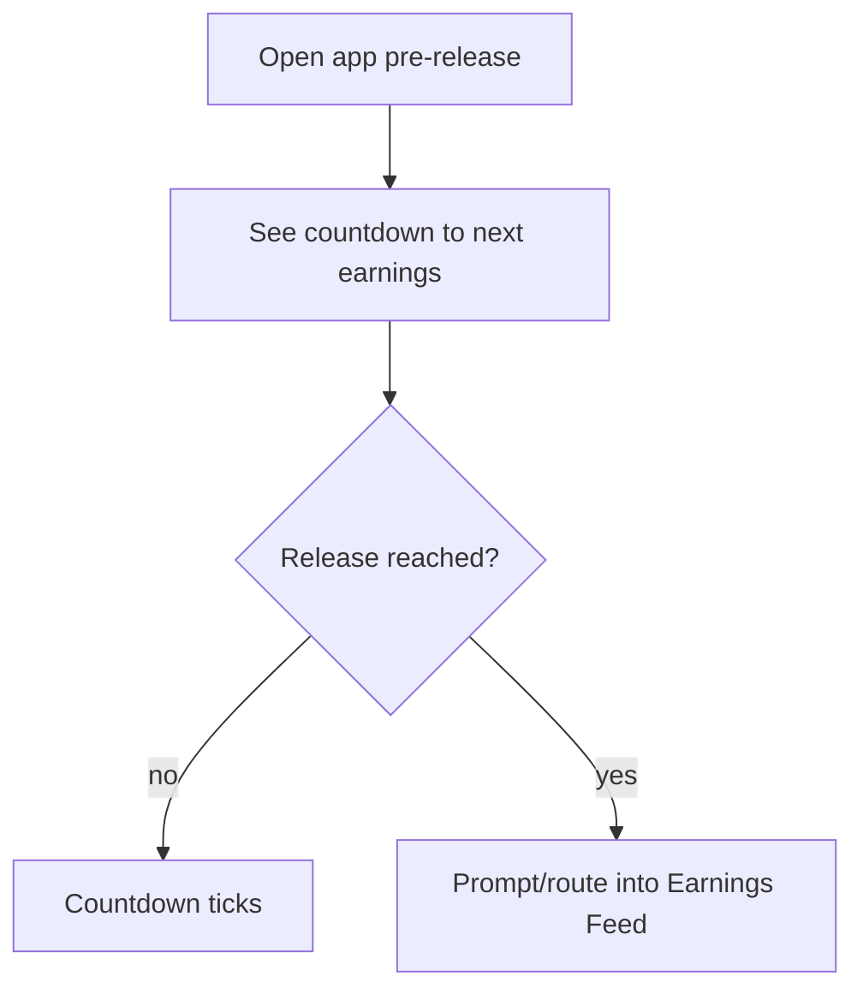
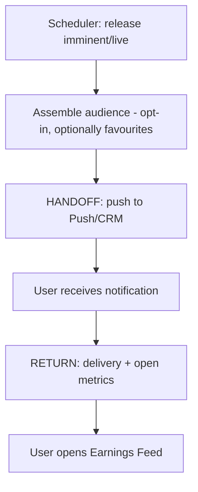

# InPlay Trading Challenge — Earnings Alerts & Countdown

> **Component:** [[earnings-report]]
> **Date:** 2026-05-27
> **Status:** Defined
> **Owner:** Edwin (client-facing) + Skye (comms/GTM) + George (engineering)
> **Sources:** _[[meetings/27-05-2026-Earnings-report]]_

---

## 1. What Does This Sub-Component Do?

**Functional purpose:**

Earnings Alerts & Countdown is the layer that makes the weekly earnings release feel like an *event* and pulls users back into the app at the right moment. The Earnings Report is a recurring, scheduled, batched release (7:30; Tue NFL / Wed NCAA) — its trading value depends on the user base showing up *as it drops*. This sub-component owns that pull: a **push notification** at (and just before) release, and an in-app **countdown** to the moment.

Edwin's mental model is the trading-floor squawk box: _"they'll count down… you have like 8 seconds… seven, six, five,"_ — that instant when everything reports at once is explosive and fun to trade. Translating that to the app means a visible countdown and a punctual push that says "earnings are dropping." It is heavily entwined with the **Push/CRM cross-cutting concern** (which owns delivery) and shares the pattern of the IPO's announcement/countdown sub-component — this one is the recurring, weekly variant tied to the report cadence.

**Entities that interact with it:**

- **Comms agent (system)** — schedules and fires the pre-release and at-release notifications. Event-driven.
- **User** — receives the push and sees the in-app countdown.

---

## 2. What Needs to Happen?

**Functional requirements:**

- Show an in-app **countdown** to the next earnings release.
- Fire a **push notification** at (and optionally shortly before) the release moment.
- Tie alerts to the report **cadence** (Tue NFL / Wed NCAA, 7:30).
- Respect push **opt-in/consent**; degrade to in-app countdown if disabled.
- Optionally personalise ("your favourite teams report in 10 min").

**Business rules:**

- Cadence-driven, recurring weekly (not a one-off like the IPO announcement).
- Delivery uses the shared Push/CRM infrastructure.
- Frequency must respect consent and avoid over-notifying.

**Edge cases:**

- **Notifications disabled** → rely on the in-app countdown only.
- **Schedule change** → countdown + alert must re-anchor to the new release time.
- **No relevant teams for a user** → generic vs personalised alert decision.

---

## 3. Entity Journeys

### 3a. Isolated Journeys

#### Journey 1: See the countdown and arrive at release

**Entity:** User

**Input:** User opens the app in the run-up to a release.

**Outcome:** User knows when earnings drop and lands on the [[earnings-feed]] at release.

**Steps:**

**Acceptance criteria:**
- [ ] A countdown to the next release is visible in-app.
- [ ] At release the user is routed/prompted to the live feed.
- [ ] Countdown re-anchors if the schedule changes.

### 3b. Cross-Component Journeys

#### Journey 1: Fire the release push notification

**Entity:** Comms agent (system)

**Input:** Scheduler signals the earnings release is imminent / live.

**Handoff point:** Earnings Report → Push/CRM. State passed: audience (optionally favourite-based), message, channel, send time. Delivery owned by Push/CRM.

**Components involved:** Earnings Report → Push/CRM → user devices

**Outcome:** Opted-in users get a timely push and return to the app for the release.

**Steps:**

**Acceptance criteria:**
- [ ] A push fires at (and optionally just before) the scheduled release.
- [ ] Targeting respects push opt-in/consent.
- [ ] Optional personalisation by favourite teams.
- [ ] Delivery/opens are measurable (app-open spike at release).

---

## 4. Look and Feel (Optional)

**Design specifics:** The in-app countdown should feel like **event hype** — prominent near release, conveying the "8… 7… 6…" explosive-moment energy. Push copy is punchy and time-specific ("NFL earnings drop in 10 min").

**UX principles specific to this sub-component:**
- **Build anticipation, don't spam** — one or two well-timed alerts, not a barrage.
- **Unmistakable at release** — the user should know the instant reports are live.

---

## 5. Data Requirements

| What | Direction | Description | Source / Destination |
|------|-----------|------------|---------------------|
| Release schedule | In | Next release time | [[earnings-report]] / scheduler |
| Audience / opt-in status | In | Who to notify, consent | Customer Onboarding / CRM |
| Favourites (optional) | In | For personalised alerts | [[information-layer]] |
| Countdown state | Out | Time-to-release shown in-app | → UI |
| Delivery + open metrics | Out | Sends, opens, app-open spike | Push/CRM analytics |

---

## 6. Dependencies

| Depends on | What we need | Blocking? |
|-----------|-------------|----------|
| Scheduler / [[earnings-report]] | Release times | Yes |
| Push/CRM (cross-cutting) | Delivery infrastructure | Yes (for push) |
| Customer Onboarding / CRM | Audience + consent | Yes (for targeting) |
| [[information-layer]] | Favourites for personalisation | No |

**What siblings or other components need from this one:**

- Drives traffic into [[earnings-feed]] at release.

---

## 7. Risks

**Specific risks:**
- **Late/missed alert** — a scheduled event with poor notification means low turnout at the most tradable moment.
- **Over-notification** — erodes trust, drives opt-outs.
- **Stale targeting** — alerting users who can't act, or missing favourite-holders.

**Controls to build into the journeys:**
- Schedule-driven triggers (no manual-send risk); re-anchor on schedule change.
- Respect consent; frequency caps.
- Optional favourite-based personalisation to keep alerts relevant.

---

## 8. Priority

**Must-have at launch?** Yes for the **release push** basics — the event needs an audience at 7:30. Countdown polish and personalisation can iterate.

**Sequencing rationale:** Depends on the scheduler/release times and the Push/CRM cross-cutting infrastructure. Can be built in parallel and integrated once the release schedule is firm. Shares patterns with the IPO Module's announcement/countdown sub-component — reuse where possible.

---

## Sub-Sub-Components

Leaf node — no further decomposition needed. Delivery mechanics belong to the Push/CRM cross-cutting concern.
