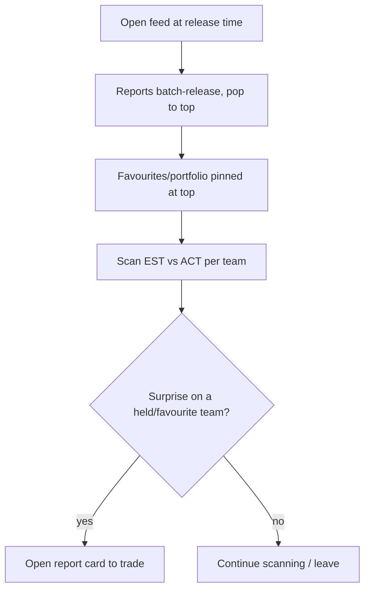
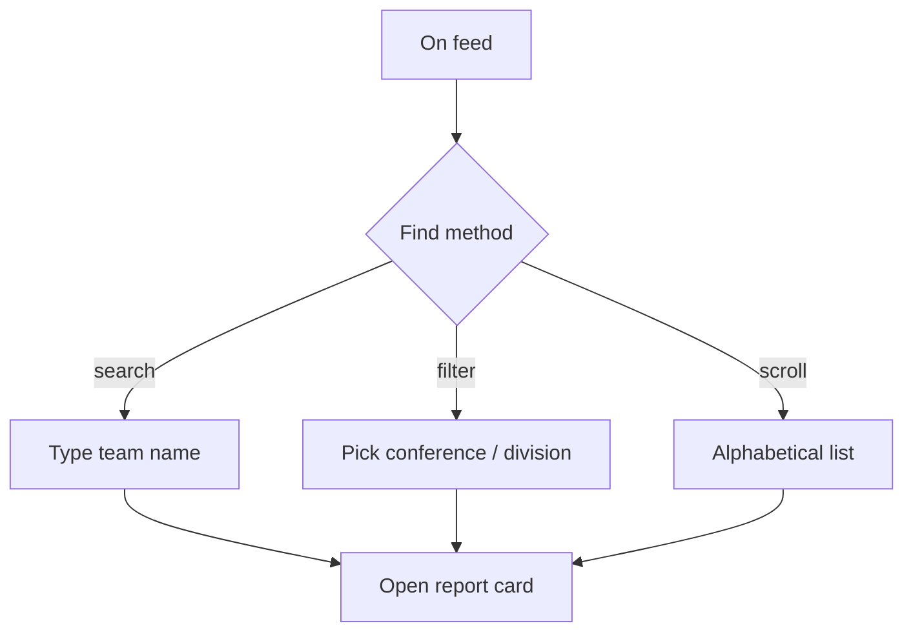

# InPlay Trading Challenge — Earnings Feed / Release Page

> **Component:** [[earnings-report]]
> **Date:** 2026-05-27
> **Status:** Defined
> **Owner:** Edwin (client-facing — mechanics) + George (engineering) + Cody (trading/UX)
> **Sources:** _[[meetings/27-05-2026-Earnings-report]]_

---

## 1. What Does This Sub-Component Do?

**Functional purpose:**

The Earnings Feed is the live release surface of the Earnings Report — the Bloomberg-terminal-style page users land on when off-field earnings drop. At the scheduled release time (7:30, Tuesday for NFL / Wednesday for NCAA) every team company's actual report is **batched and fired at once**, and the feed comes alive: reports "bing bing bing" pop to the top in fast succession, exactly like a trader watching non-farm-payrolls print. It is the moment that turns the off-field mechanic into a shared, explosive trading event.

The feed is built so a user immediately sees what matters to *them*. Their **favourites/portfolio pin to the top**; everything else sits below in **alphabetical** order (Edwin's chosen default). A **search bar** and **conference filters** (essential for the ~131 NCAA teams) let users jump to specific teams. Each row is an [[earnings-report-card]] the user can open and trade from. The feed is reached a couple of ways — the More menu and a reports tab on the trade page — but deliberately not over-routed (Cody: "two is enough, or users get lost").

**Entities that interact with it:**

- **User (verified, funded)** — watches the live release, finds their teams, opens reports to trade. All four audiences; the Veteran trades the print in real time, casual users rely on favourites-to-top.

---

## 2. What Needs to Happen?

**Functional requirements:**

- At the scheduled release time, **batch-release all team reports** into the feed at once.
- Show a **live pop-to-top** behaviour as reports land (fast, sequential).
- **Pin favourites/portfolio** teams to the top of the feed.
- Order the remainder **alphabetically** by default.
- Provide a **search bar** and **conference filters** (NCAA conference / NFL division).
- Render each entry as an [[earnings-report-card]] that opens/trades.
- Be reachable from the **More** menu and a **trade-page reports tab** (limited routes).

**Business rules:**

- Release schedule: **Tue NFL / Wed NCAA**, batched at the release time (7:30).
- Reports are released **all at once**, not trickled.
- Free to view in the trading challenge.

**Edge cases:**

- **Release-time burst** — the whole user base hits the feed simultaneously; must not degrade.
- **A team's actual is late/failed** → show a clear pending/failed state, not a silent blank (see [[off-field-earnings-engine]]).
- **User has no favourites** → feed falls back to alphabetical only.
- **Empty conference filter** → clean empty state.

---

## 3. Entity Journeys

### 3a. Isolated Journeys

#### Journey 1: Watch the batched release

**Entity:** User (verified, funded)

**Input:** User opens the earnings feed at/around release time.

**Outcome:** User sees their relevant reports first and identifies which teams beat or missed.

**Steps:**

**Acceptance criteria:**
- [ ] All reports release in a single batch at the scheduled time.
- [ ] Reports visibly pop to the top as they land (live behaviour).
- [ ] Favourites/portfolio teams appear pinned above the rest.
- [ ] Remaining teams are ordered alphabetically by default.
- [ ] The feed remains responsive under the release-time load burst.

#### Journey 2: Find a specific team's report

**Entity:** User (verified, funded)

**Input:** User wants a particular team not in their favourites.

**Outcome:** User locates and opens that team's report.

**Steps:**

**Acceptance criteria:**
- [ ] Search returns the team's report quickly.
- [ ] Conference/division filters narrow the feed correctly.
- [ ] Alphabetical scroll works across the full universe (incl. ~131 NCAA).

### 3b. Cross-Component Journeys

_None originate here. Trading happens via [[earnings-report-card]] (same component → Trading). Favourites/portfolio data is read from [[information-layer]]._

---

## 4. Look and Feel

**Design specifics for this sub-component:** A **live, energetic list** that updates in real time at release — pop-to-top motion, fast cadence. Take the *energy* of a Bloomberg earnings feed, not its dense monospace text. Favourites sit in a pinned zone at top; search + filter chips at the very top.

**Reference products / screen-grabs:**
- **Bloomberg terminal earnings feed** — pop-to-top live behaviour (George had a screenshot reference).
- Squawk-box / non-farm-payroll release feel — the explosive moment.

**UX principles specific to this sub-component:**
- **Favourites first** — surface what affects the user immediately.
- **Live and urgent** at release; calm browsing is the historical view's job ([[historical-earnings]]).
- **Don't over-route** — a couple of entry points only.

---

## 5. Data Requirements

| What | Direction | Description | Source / Destination |
|------|-----------|------------|---------------------|
| Batched actual reports | In | All team ACTs at release | [[off-field-earnings-engine]] |
| Estimates (EST) | In | Shown alongside actuals | [[off-field-earnings-engine]] |
| Favourites / portfolio | In | Pin-to-top set | [[information-layer]] / user |
| Conference/division metadata | In | Filter grouping | Sport Radar / InPlay |
| Release schedule / time | In | When the batch fires | [[earnings-report]] / scheduler |

---

## 6. Dependencies

| Depends on | What we need | Blocking? |
|-----------|-------------|----------|
| [[off-field-earnings-engine]] | The batched EST/ACT to display | Yes |
| [[earnings-report-card]] | The card rendering + trade entry | Yes |
| [[information-layer]] | Favourites/portfolio set | No — can default to alphabetical |
| Scheduler | Release timing | Yes |

**What siblings or other components need from this one:**

- It is the primary container — [[earnings-report-card]] renders within it.

---

## 7. Risks

**Specific risks:**
- **Release-burst overload** — synchronized 7:30 traffic spike could degrade or crash the feed at the worst moment.
- **Stale/blank actuals** surfacing silently if the engine is late.
- **Discovery bias** — alphabetical/favourites ordering may bury non-favourite movers.

**Controls to build into the journeys:**
- Burst-hardening / load testing for the batched release.
- Explicit pending/failed states for missing actuals.
- Consider a "biggest movers" surfacing alongside favourites/alphabetical.

---

## 8. Priority

**Must-have at launch?** Yes — it's the surface the whole event happens on.

**Sequencing rationale:** Build alongside [[earnings-report-card]] and [[off-field-earnings-engine]] (the feed is meaningless without computed reports to show). Must be load-tested before the first scheduled release week.

---

## Sub-Sub-Components

Leaf node — no further decomposition needed. The browse/search/filter behaviours are journeys on one feed, not separable parts.
