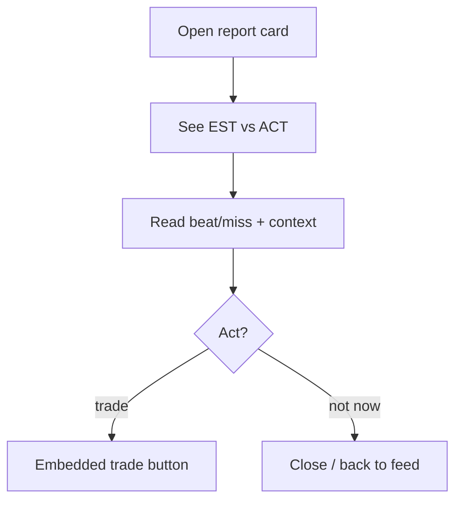
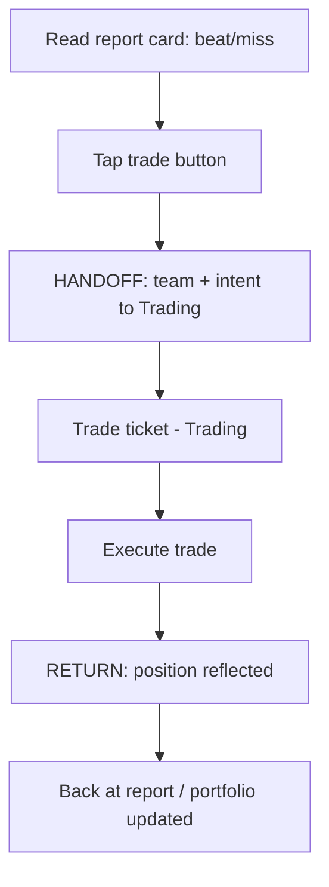

# InPlay Trading Challenge — Earnings Report Card

> **Component:** [[earnings-report]]
> **Date:** 2026-05-27
> **Status:** Defined
> **Owner:** Edwin (client-facing — mechanics) + George (engineering) + Cody (trading/UX)
> **Sources:** _[[meetings/27-05-2026-Earnings-report]]_

---

## 1. What Does This Sub-Component Do?

**Functional purpose:**

The Earnings Report Card is the individual team company's report — the atomic unit users actually read and act on. It presents the team's off-field earnings as **two numbers: the Estimate (EST)** published the week before and the **Actual (ACT)** released on the day — so the user can instantly read the **beat or miss** that is driving the price. Edwin's framing: _"two numbers. You'll have an estimate… and actual."_

It is deliberately **graphical and punchy**, not dense Bloomberg text (Brett: _"really sexy and graphical… short punchy, more like a flyer"_) — each card communicates one exciting event. Critically, every card carries an **embedded trade button**: a user reading the Bills' beat can trade the Bills without leaving the card — "every page is going to be two clicks away from trade." The card appears in three places: in the [[earnings-feed]] at release, on the team's [[historical-earnings]] page, and (per the room) reachable from team and game-day pages in the [[information-layer]]. Cody also noted the trade-from-report doubles as a signal that **confirms intent for the AI model**.

**Entities that interact with it:**

- **User (verified, funded)** — reads EST vs ACT and trades from the card.

---

## 2. What Needs to Happen?

**Functional requirements:**

- Display the team's **EST** and **ACT** off-field earnings clearly (the beat/miss must read instantly).
- Present the card **graphically** (not as dense text) — punchy and event-like.
- Provide an **embedded trade button** that opens trading for that team (two clicks to trade).
- Be renderable in multiple contexts: [[earnings-feed]], [[historical-earnings]] page, team/game pages.
- Convey that the price impact is **market-interpreted**, not a fixed function of the number (context, not a hard formula readout).

**Business rules:**

- Each report = exactly two figures (EST, ACT).
- Off-field figure derives from [[off-field-earnings-engine]] (½ on-field winner, volume-allocated).
- Trade-from-card uses the standard Trading execution path.

**Edge cases:**

- **ACT not yet released** (pre-release / estimate-only) → show EST with a clear "actual pending" state.
- **Failed/missing ACT** → explicit error state, never a silent blank.
- **Team's market is halted / not yet trading** → trade button reflects unavailable state.

---

## 3. Entity Journeys

### 3a. Isolated Journeys

#### Journey 1: Read a report card

**Entity:** User (verified, funded)

**Input:** User opens a team's report (from feed, history, or a team page).

**Outcome:** User understands whether the team beat or missed and what it implies for price.

**Steps:**

**Acceptance criteria:**
- [ ] EST and ACT are both shown, with the beat/miss legible at a glance.
- [ ] The card is graphical and punchy, not a wall of text.
- [ ] An "actual pending" state is shown before release; a clear error state if the actual fails.
- [ ] A trade affordance is present on the card.

### 3b. Cross-Component Journeys

#### Journey 1: Trade directly from the report

**Entity:** User (verified, funded)

**Input:** User taps the trade button on a report card after reading the beat/miss.

**Handoff point:** Earnings Report → Trading. State passed: team, and the context that the user is acting on this report (signal for the AI model). On return, the user expects their position reflected.

**Components involved:** Earnings Report → Trading → (back to) Earnings Report / portfolio

**Outcome:** User trades the team straight off the report, two clicks away.

**Steps:**

**Acceptance criteria:**
- [ ] Trade is reachable within two clicks of reading the report.
- [ ] The correct team and the report context carry across the handoff.
- [ ] The intent is captured as a signal for the AI model.
- [ ] The resulting position is reflected on return.

---

## 4. Look and Feel

**Design specifics for this sub-component:** A **graphical event card** — large, clear EST vs ACT with an obvious beat/miss treatment (colour/arrow), team identity, and a prominent trade button. Closer to a hype flyer than a spreadsheet row.

**Reference products / screen-grabs:**
- Sports-app "result" cards — for the punchy, graphical single-event feel.
- Brokerage earnings beat/miss visualisations — for the EST-vs-ACT framing (simplified).

**UX principles specific to this sub-component:**
- **Beat/miss legible in one glance** — the surprise is the whole point.
- **Trade is one tap away** — never make the user hunt to act.
- **Graphical over textual** — one exciting event per card.

---

## 5. Data Requirements

| What | Direction | Description | Source / Destination |
|------|-----------|------------|---------------------|
| EST | In | Estimate published week prior | [[off-field-earnings-engine]] |
| ACT | In | Actual released on the day | [[off-field-earnings-engine]] |
| Team identity | In | Which team company | [[earnings-feed]] / context |
| Trade intent + context | Out | Signal passed to Trading + AI model | Trading |
| Market/trading availability | In | Whether the team is tradeable now | Trading / [[ipo-module]] (post-IPO) |

---

## 6. Dependencies

| Depends on | What we need | Blocking? |
|-----------|-------------|----------|
| [[off-field-earnings-engine]] | EST + ACT figures | Yes |
| Trading | Execution path for the embedded trade | Yes |
| [[earnings-feed]] | Primary render context | No |
| [[information-layer]] | Team/game-page render contexts | No |

**What siblings or other components need from this one:**

- [[earnings-feed]] and [[historical-earnings]] render this card.
- Trading receives the trade-from-report intent (and AI-model signal).

---

## 7. Risks

**Specific risks:**
- **Misread numbers** — if EST/ACT presentation is ambiguous, users trade the wrong direction.
- **Wrong figure** propagated from the engine directly mis-prices user decisions.
- **Trade-button mis-fire** — wrong team/context passed to Trading.

**Controls to build into the journeys:**
- Unambiguous beat/miss treatment with EST and ACT both labelled.
- Explicit pending/failed states; never show a blank as a number.
- Verify team/context integrity across the trade handoff.

---

## 8. Priority

**Must-have at launch?** Yes — it's the unit users read and trade. The feed exists to show these.

**Sequencing rationale:** Build with [[earnings-feed]] and [[off-field-earnings-engine]]. The trade-from-card path depends on the Trading execution being available.

---

## Sub-Sub-Components

Leaf node — no further decomposition needed.
