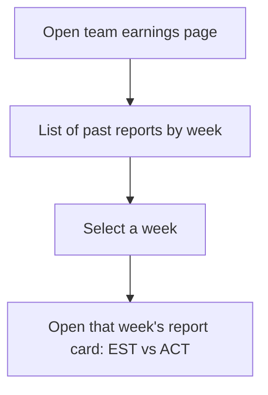
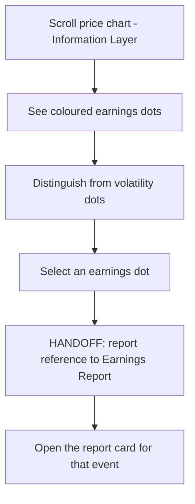

# InPlay Trading Challenge — Historical Earnings & Chart Annotation

> **Component:** [[earnings-report]]
> **Date:** 2026-05-27
> **Status:** Defined
> **Owner:** Edwin (client-facing) + George (engineering)
> **Sources:** _[[meetings/27-05-2026-Earnings-report]]_

---

## 1. What Does This Sub-Component Do?

**Functional purpose:**

Historical Earnings & Chart Annotation is the persistent, after-the-event side of the Earnings Report — the calm archive that complements the explosive live [[earnings-feed]]. Where the feed is a one-day-a-week moment, this sub-component makes every past report durably available and ties it to the price history so users can study how earnings moved the market.

It has two parts. First, **each team company gets its own earnings report page** — a historical archive where a user can go back and read prior weeks' EST/ACT reports (Edwin: _"each team company will have its earnings report page… historically you could go back and look at it"_). Second, **every report leaves a coloured dot on the team's price chart** — distinct from the gameplay volatility dot — so when a user scrolls back through chart history they can see exactly where an earnings event hit and how the market priced it (Edwin: _"they missed earnings by 50 cents… here's what the market priced"_). Because the price impact is market-interpreted rather than linear, the dot tells the story the raw number alone can't. The chart itself lives in the [[information-layer]], so this sub-component contributes an annotation contract to those charts.

**Entities that interact with it:**

- **User (verified, funded)** — browses a team's earnings history; reads earnings dots while studying the price chart.

---

## 2. What Needs to Happen?

**Functional requirements:**

- Provide a **per-team-company earnings page** listing that team's historical EST/ACT reports.
- Let a user open any past report (renders an [[earnings-report-card]]).
- Place a **coloured earnings dot** on the team's price chart at each report point.
- Make the earnings dot **visually distinct** from the gameplay/volatility dot.
- On selecting a dot, surface the corresponding report (beat/miss + market reaction context).

**Business rules:**

- Reports persist for historical access (retained across the season).
- The earnings dot colour/style differs from the volatility-moment dot.
- Price impact shown is market-driven, not an exact function of the EST/ACT gap.

**Edge cases:**

- **Team with many reports** → history must paginate/scroll cleanly across a full season.
- **Overlapping dots** (earnings + volatility moment near the same time) → must remain distinguishable on the chart.
- **Pre-first-report team** → empty history state.

---

## 3. Entity Journeys

### 3a. Isolated Journeys

#### Journey 1: Browse a team's earnings history

**Entity:** User (verified, funded)

**Input:** User opens a team company's earnings page.

**Outcome:** User can read any prior week's report for that team.

**Steps:**

**Acceptance criteria:**
- [ ] Each team company has a dedicated earnings history page.
- [ ] Past reports are listed by week and openable.
- [ ] An empty state shows for teams with no reports yet.

### 3b. Cross-Component Journeys

#### Journey 1: Read the earnings dot on the price chart

**Entity:** User (verified, funded)

**Input:** User scrolls a team's price chart in the Information Layer.

**Handoff point:** Earnings Report → Information Layer chart. State passed: earnings-event markers (time + report reference). On selecting a dot, the user expects the relevant report.

**Components involved:** Information Layer (chart) ↔ Earnings Report (annotation + report)

**Outcome:** User sees where earnings events hit the price and can open the underlying report.

**Steps:**

**Acceptance criteria:**
- [ ] Earnings events render as dots on the price chart at the correct time.
- [ ] Earnings dots are visually distinct from gameplay/volatility dots.
- [ ] Selecting a dot opens the corresponding report.

---

## 4. Look and Feel

**Design specifics for this sub-component:** A **calm, browsable archive** (contrast with the live feed) — a clean per-team list of weekly reports. On the chart, a **distinct dot colour/shape** for earnings events, legible even when near volatility dots.

**Reference products / screen-grabs:**
- Brokerage "earnings on chart" markers — for the dot-on-timeline pattern.
- The existing Information Layer chart with volatility-moment dots — extend, don't duplicate.

**UX principles specific to this sub-component:**
- **Distinct from live** — history is for study, not urgency.
- **One glance to the story** — a dot should tell "earnings hit here" and open the detail.
- **Visually separable markers** — earnings vs volatility must never be confused.

---

## 5. Data Requirements

| What | Direction | Description | Source / Destination |
|------|-----------|------------|---------------------|
| Historical reports per team | In / Stored | Past EST/ACT by week | [[off-field-earnings-engine]] / archive |
| Earnings-event markers | Out | Time + report reference for chart dots | → [[information-layer]] chart |
| Price chart | In | The chart the dots annotate | [[information-layer]] |
| Report reference | Out | Link from a dot to its report card | [[earnings-report-card]] |

---

## 6. Dependencies

| Depends on | What we need | Blocking? |
|-----------|-------------|----------|
| [[off-field-earnings-engine]] | Persisted historical EST/ACT | Yes |
| [[information-layer]] | Price chart to annotate + dot rendering | Yes (for chart annotation) |
| [[earnings-report-card]] | Card to render past/linked reports | Yes |

**What siblings or other components need from this one:**

- [[information-layer]] consumes the earnings-event markers as a chart-annotation contract.

---

## 7. Risks

**Specific risks:**
- **Marker confusion** — earnings vs volatility dots blurring undermines chart readability.
- **History integrity** — archived reports must match what was released live (no silent retro-edits).
- **Chart clutter** — too many markers over a season degrade the chart.

**Controls to build into the journeys:**
- Enforce distinct dot styling and a legend.
- Treat archived reports as immutable records of what was released.
- Consider density management (cluster/zoom) for long seasons.

---

## 8. Priority

**Must-have at launch?** Partially — the **per-team history** is valuable but can follow the live feed; the **chart dot** depends on Information Layer chart work and can be a fast-follow.

**Sequencing rationale:** Depends on [[off-field-earnings-engine]] persisting reports and on the [[information-layer]] charts. Build after the live release path works; the chart annotation lands when the Information Layer chart is ready.

---

## Sub-Sub-Components

Leaf node — no further decomposition needed.
