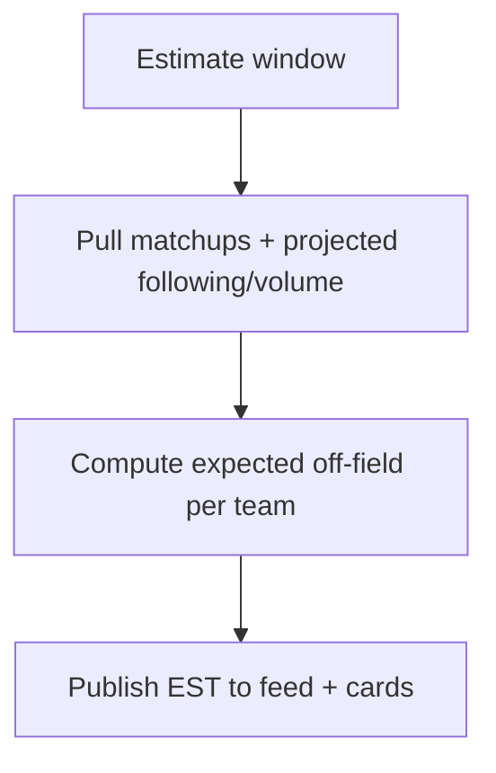
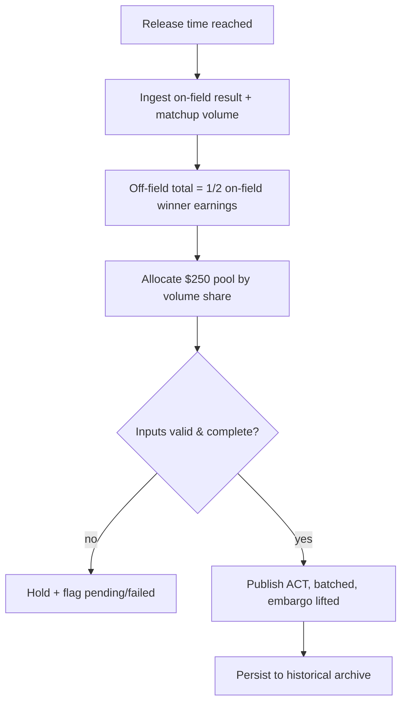

# InPlay Trading Challenge — Off-Field Earnings Engine

> **Component:** [[earnings-report]]
> **Date:** 2026-05-27
> **Status:** Defined
> **Owner:** Edwin (client-facing — mechanics owner) + Cody (model) + George (engineering)
> **Sources:** _[[meetings/27-05-2026-Earnings-report]]_

---

## 1. What Does This Sub-Component Do?

**Functional purpose:**

The Off-Field Earnings Engine is the calculation core of the Earnings Report — the proprietary model that produces the numbers the whole market trades on. It is an agent/system sub-component with no direct UI; its outputs are what [[earnings-feed]] and [[earnings-report-card]] render.

For each team company it produces two figures on a weekly cadence: an **Estimate (EST)**, published the week before the report, and an **Actual (ACT)**, computed and released on the day (7:30; Tue NFL / Wed NCAA). The off-field earnings are built on the mechanic seeded at IPO (see [[ipo-module]]): a **$250/game off-field pool, allocated by each team's share of the matchup's trade volume**, with the off-field earnings total for a game equal to **half the on-field winner's earnings**. Edwin's worked example: Dallas (huge following) might be expected to earn ~$2 off-field versus Cincinnati's ~$0.50 — and a flip-flop in those numbers materially moves share value. With 5M shares outstanding, a $1–2 swing implies **$5–10M of equity changing hands** per report.

A defining property: the engine produces the *earnings number*, but the **price impact is market-driven, not linear**. Expectations roll forward — a big beat raises next week's expectation — and the on-field result colours interpretation (winning convincingly vs ugly). The engine's job is accurate, defensible EST/ACT figures; the market does the pricing.

**Entities that interact with it:**

- **Earnings engine (system/agent)** — computes and publishes EST and ACT. No direct user interaction.
- Downstream consumers: [[earnings-feed]], [[earnings-report-card]], [[historical-earnings]].

---

## 2. What Needs to Happen?

**Functional requirements:**

- Compute an **EST** off-field earnings per team company and **publish it the week prior**.
- Compute the **ACT** off-field earnings per team company and **release it batched** at the scheduled time.
- Allocate the **$250/game off-field pool by share of matchup trade volume**.
- Peg the off-field earnings total to **half the on-field winner's earnings**.
- Expose both figures to the feed/cards and persist them for the [[historical-earnings]] archive.
- **Embargo the ACT** until the scheduled release (no early exposure).

**Business rules:**

- Off-field total per game = **½ on-field winner earnings**.
- Allocation basis = **share of trade volume** on that matchup.
- Two figures per report: EST (week prior) and ACT (release day).
- Cadence: Tue NFL / Wed NCAA, batched.

**Edge cases:**

- **Zero/low matchup volume** → how is the $250 pool allocated? *Open — needs a rule.*
- **Bye week / no game** → is an EST/ACT produced at all? *Open.*
- **Late on-field result or volume data** → ACT computation must handle delayed inputs without publishing a wrong number.
- **Manipulated volume** (wash trading) → allocation could be gamed (see Risks).

---

## 3. Entity Journeys

### 3a. Isolated Journeys

#### Journey 1: Publish the weekly estimate (EST)

**Entity:** Earnings engine (system)

**Input:** Scheduled estimate window (week prior to the report).

**Outcome:** Each team company has a published EST off-field earnings.

**Steps:**

**Acceptance criteria:**
- [ ] An EST is produced for each scheduled team company.
- [ ] EST is published the week prior (fixed lead time).
- [ ] The estimate basis (½ on-field winner, volume-allocated) is applied consistently.

#### Journey 2: Compute and batch the actual (ACT)

**Entity:** Earnings engine (system)

**Input:** Release time reached; on-field results and matchup trade volume available.

**Outcome:** Each team's ACT is computed and batch-released to the feed.

**Steps:**

**Acceptance criteria:**
- [ ] Off-field total equals half the on-field winner's earnings.
- [ ] The $250/game pool is allocated by each team's share of matchup trade volume.
- [ ] ACT is embargoed until the scheduled release, then batch-published.
- [ ] Incomplete inputs produce a pending/failed state, never a wrong number.
- [ ] Every ACT is persisted to the historical archive.

### 3b. Cross-Component Journeys

_Inputs cross in from Trading (volume) and Sport Radar/IPO model (on-field result, $250 mechanic). Documented as dependencies rather than user journeys — this is a backend engine._

---

## 4. Look and Feel (Optional)

_No UI. Outputs are rendered by [[earnings-feed]] and [[earnings-report-card]]._

---

## 5. Data Requirements

| What | Direction | Description | Source / Destination |
|------|-----------|------------|---------------------|
| Matchup trade volume | In | Per-team share of a matchup's volume | Trading / T0 |
| On-field result / winner earnings | In | Peg for the off-field total | Sport Radar + IPO valuation model |
| $250/game off-field pool rule | In | Allocation pool per game | [[ipo-module]] mechanic |
| EST | Out / Stored | Estimate, week prior | → feed/cards, archive |
| ACT | Out / Stored | Actual, release day | → feed/cards, archive |
| Release schedule | In | Tue NFL / Wed NCAA, 7:30 | Scheduler |

---

## 6. Dependencies

| Depends on | What we need | Blocking? |
|-----------|-------------|----------|
| Trading / T0 | Matchup trade volume (allocation basis) | Yes |
| Sport Radar + IPO model | On-field result / winner earnings | Yes |
| [[ipo-module]] | The $250/game off-field mechanic it builds on | Yes (conceptual) |
| Scheduler | EST/ACT timing + embargo | Yes |

**What siblings or other components need from this one:**

- [[earnings-feed]], [[earnings-report-card]], and [[historical-earnings]] all consume its EST/ACT outputs.

---

## 7. Risks

**Specific risks:**
- **Volume-allocation gaming (wash trading)** — because off-field earnings are allocated by share of trade volume, coordinated self-trading on a matchup could inflate a team's earnings, and a group could pre-position for the engineered beat. The core exploit loop of this component.
- **EST/ACT integrity** — a wrong figure directly mis-prices the whole market and destroys trust.
- **Early ACT exposure** — if the actual leaks before embargo, users front-run the release.
- **Input lateness** — computing on incomplete volume/result data yields wrong actuals.

**Controls to build into the journeys:**
- **Wash-trade / volume-manipulation detection** on the matchup volume feeding allocation (exclude or flag suspicious volume).
- Strict **embargo** on the ACT until scheduled release.
- Validate input completeness before publishing; pending/failed state otherwise.
- Auditable record of how each EST/ACT was derived.

---

## 8. Priority

**Must-have at launch?** Yes — and it's the **long-pole**: the proprietary calculation everything else renders. No engine, no reports.

**Sequencing rationale:** Build first among the Earnings Report sub-components; the feed and cards have nothing to show without it. De-risk the allocation model and its inputs (trade volume, on-field peg) early, and design the anti-manipulation controls alongside, not after.

---

## Sub-Sub-Components

Leaf node — no further decomposition needed.
