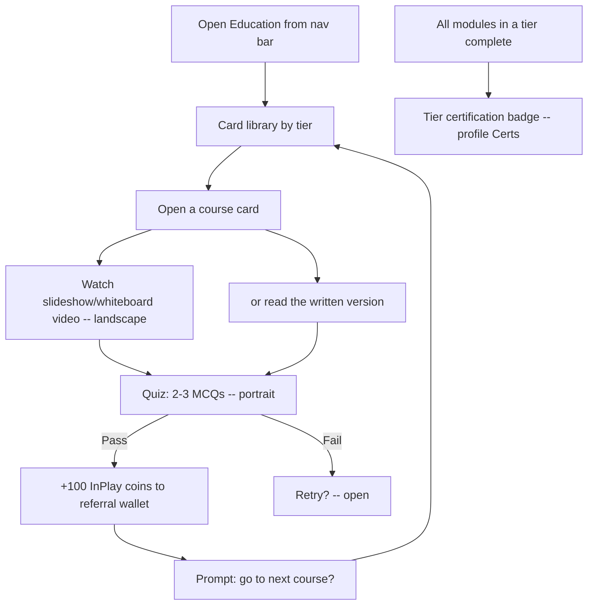
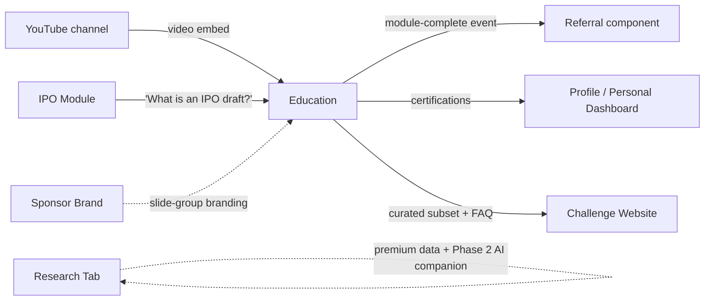

# InPlay Trading Challenge -- Education

> **Vision:** [[vision]]
> **Date:** 2026-06-22
> **Status:** Defined _(updated 22-06-2026: launch format reset from TikTok reels to a card-based course experience)_
> **Owner:** Kevin (content + scope) / George Westbrook (engineering + UI) / Brett StClair (client-facing) / Edwin (commercial + depth)
> **Sources:** _[[meetings/06-05-2026-vision-workshop]], [[meetings/14-05-2026-education-thirdspace-challenge-website]], [[meetings/22-06-2026-education-component]]_

---

## 1. What Does This Component Do?

**Functional purpose:**

The Education component is the on-ramp for non-traders: anyone who has never traded stocks before. It teaches the basics, how to buy, how to sell, what long and short mean, what an IPO draft is, how price discovery works on the InPlay exchange, so the Analytical Fan and Finance-Curious Student can reach the trading screen and understand what they are looking at. Edwin set the depth for the entry tier: _"at a 40,000 foot level. Not narrowed into any of the more granular detail."_

The 22 June deep-dive **reset the launch format**. The original TikTok-style 15-second vertical-reel design was judged too much to build for launch (George: the reel direction is _"too much for for launch... whereas more of like a traditional education aspect where there's some text, there's some videos, there's a quiz"_). The launch experience is now a **card-based course library**. The user opens Education from the navigation bar and sees **cards grouped into sections (tiers)**. They click a card, the course opens, they watch a short **slideshow / whiteboard video with voiceover** (or read the written version of the same content), then take a short quiz. On passing, **100 InPlay coins credit to the referral wallet** and they are offered the next course. The TikTok-reel format is parked as a possible future / v2 direction, not the launch spec.

The catalogue is **36 modules across three tiers**: **Beginner (16), Intermediate (10), Expert (10)**. Beginner is the 40,000-foot on-ramp; Intermediate and Expert go deeper for users who want to upskill. Content spans a securities glossary, buy/sell, long/short, the IPO draft, earnings, volatility, risk, and momentum. Modules are **not gated in sequence**, a user can jump to any module at any time (Edwin: _"you want anyone to be able to go wherever they want... no limit"_), the only thing that is sequenced is reward accrual and tier certification.

Completing every module in a tier earns a **certification badge**, surfaced in a "Certs" section on the user's profile. The content repository also backs a future **AI chatbot** for L1 support, which the session **deferred to Phase 2** (the launch app ships no in-app chatbot). A curated subset of high-level content, plus a separate FAQ / disclaimers layer, is exposed on the **Challenge Website** for the curious public, always funnelling toward the app.

> **Scope boundary (22-06):** the session drifted into reselling premium Sport Radar data and a paid AI companion with tiered pricing. That belongs to **Research Tab** (Information Layer), not Education, and is flagged for its own session _[⚠ open, see [[open-questions]]]_. Education's only AI surface is the deferred L1-support chatbot below.

```
Education
├── Modules / Course Viewer        (card library by tier; slideshow/whiteboard video + text; landscape video, portrait quiz)
├── Quiz / Poll Layer              (2-3 multi-choice questions, gates reward; non-sequential; glossary swipe)
├── Reward Integration             (100 InPlay coins to referral wallet on quiz pass, earn-once)
├── Progress Tracking              (completed modules grayed-but-visible, current highlighted, resume-to-point)
├── Certification & Badges         (tier certs, profile "Certs" section, clickable badge entry points)
├── AI Chatbot Support             (L1 support over the education repo — PHASE 2, deferred)
├── Education-on-Website           (curated subset + separate FAQ/disclaimers, legal-reviewed)
└── Sponsor Ownership Layer        (slide-group-level sponsorship, skippable pre-video CPM, co-created content)
```

**Personas:**

> **Canonical audience definitions:** [[audiences]]

| Audience | How they use this component | What they need from it |
|---------|---------------------------|----------------------|
| **Crypto-Savvy Sports Trader** | Skips most of it. May dip into the IPO-draft or order-book modules if InPlay's specifics differ from Polymarket / Kalshi | Freedom to jump straight to any module (non-sequential) and not be gated on tutorials they don't need |
| **Analytical Fan / Armchair GM** | Primary audience. Knows sports cold, doesn't know trading. Will work the Beginner tier if the content is short and clean | Snackable courses, a clear path through the tier, referral dollars so it feels rewarding, not homework |
| **Finance-Curious Student** | Primary audience. Treats education as a credibility builder and may share a completion / certification on social. Likely to engage with sponsor-owned content from brands they recognise | Polished, native-feeling slideshow content, visible progress, a **certification badge** to show off |
| **Veteran Trader-Bettor** | Will not engage with modules. Was the candidate user for the deferred AI chatbot | Phase 1: nothing. Phase 2: an AI chatbot that answers InPlay-specific questions without making them watch a course |

---

## 2. What Needs to Happen?

**Functional requirements:**

_Course library and viewer:_

- User launches Education from a dedicated icon in the navigation bar
- Education presents **cards grouped into sections / tiers** (Beginner, Intermediate, Expert)
- User clicks a card, the course opens
- Each course has a short **slideshow / whiteboard video with voiceover** and a **written version of the same content** (two consumption modes: watch the video then take the quiz, or read through everything then take the quiz)
- Video plays in **landscape** (user turns the phone), the quiz returns to **portrait**
- Catalogue is **36 modules across three tiers**: Beginner 16, Intermediate 10, Expert 10
- Content covers: securities glossary, buy/sell, long/short, the IPO draft, earnings, 100K starting balance, risk, momentum, volatility
- Modules are **non-sequential**, the user can open any module at any time

_Quiz / poll gate:_

- At the end of a course, the user takes a short quiz (2-3 multiple-choice questions)
- Passing the quiz is what unlocks the reward (a view alone does not credit, Cody's verification logic carries over)
- On passing, a brief celebration fires and the user is prompted "go to your next course?"
- A **glossary of terms** is reachable by swiping right at the end of a module

_Reward:_

- On quiz pass, **100 InPlay coins credit to the user's referral wallet** (referral credits, not trading dollars)
- Reward is **earn-once per module** (retaking a passed module for review does not pay again, Kevin: _"once they earn it they earn it back"_)

_Progress and resume:_

- Progress is stored server-side, account-pinned
- Completed modules are **grayed but still visible** (not hidden), so a user on module 8 can go back and re-read "what is a security?" from module 2 (Kevin: _"you never want to close out the education piece"_)
- The current module is highlighted, the user resumes at the point they left a course

_Certification and badges:_

- Completing every module in a tier awards a **certification** for that tier
- Certifications surface in a **"Certs" section on the profile**, all badges visible (grayed when unearned, filled when earned) so the roadmap is clear
- A badge is **clickable**, acting as a second entry point into that tier's courses

_AI chatbot support (Phase 2, deferred):_

- A conversational L1-support layer over the education repository (plus Sport Radar stats for stats-driven questions, Statmuse-style)
- Target: handle 75-85% of L1 questions without escalation (Cody)
- **Not in the launch app**, scoped for Phase 2 with its own design pass (guardrails, token-burn controls, escalation)

_Education on the Challenge Website:_

- A curated subset of high-level content is exposed on the Challenge Website (taste, not substitute for the app)
- A **separate FAQ / disclaimers layer** (what is a security, how InPlay is regulated, standard disclaimers) sits outside the education modules and is **legal-reviewed before publish** (Brian, Kevin owns the follow-up)
- Web content needs **OG / social-card metadata** for sharing

_Sponsor ownership:_

- Sponsorship operates at the **slide-group level**, a sponsor brands a section of content rather than owning a whole module exclusively (Edwin: _"each particular slide group sponsored by somebody"_)
- **Skippable** pre-video ads only (no forced 30-second pre-roll), as a video-CPM surface (Kevin)
- Content co-created with the sponsor, branding embedded, FTC disclosure required
- A **rotating sponsor splash screen** on app open (equal exposure across sponsors) was floated and sits on the backlog

**Business rules and constraints:**

- Content stays at "40,000 feet" for Beginner, basics only, no advice, no recommendations
- Language uses "earn" not "win" (project-wide regulatory rule)
- Reward credits only on quiz pass, not on view, and only once per module
- Education is free in the trading challenge
- Sponsor branding is embedded and co-created, not programmatically rotated inside a module
- The deferred AI chatbot stays inside the education scope, references the repo, gives no trading advice
- FAQ / disclaimer copy on the website is legal-reviewed before publish

**Edge cases and error states:**

- User fails the quiz, retry immediately, cooldown, or re-watch required? _[⚠ open, see [[open-questions]]]_
- KYC-pending (holding-state) user completes a quiz, does the reward accrue or hold until KYC clears? _[⚠ open, see [[open-questions]]]_
- Video fails to load on low bandwidth, fallback to the written version (the two-mode design helps here, but the trigger is unspecified)
- Sponsor pulls out mid-period, what backfills the slide group? _[⚠ open, see [[open-questions]]]_
- Production quality of AI-generated video is below bar, the pilot-then-replicate plan is the mitigation (see §4)



---

## 3. How Should It Look and Feel?

**Design direction:**

Clean and low-distraction. Edwin's framing: _"almost like a PowerPoint slideshow... where the words are on the background... there isn't much more to it. No distraction."_ Kevin's alternative visual is a **whiteboard** style, _"whiteboarded out with the concepts as if you were watching a live class."_ Either way the launch aesthetic is a **slideshow / whiteboard video with voiceover and on-screen text**, browsed through a **card library**, not a TikTok feed.

The TikTok-reel format (15-second vertical reels, swipe-scroll) is **parked as a possible future / v2 direction**, it was explicitly judged too heavy to build for launch.

Brett's anti-pattern still holds: not Udemy. _"Keep it lightweight so it's not one of those Udemy style kill me forces."_ No long-form lectures, no 20-question banks.

Certification and badges lean into a simple reward instinct (Kevin: _"people love badges for whatever reason"_), all badges visible, grayed until earned, clickable into the course.

**Reference products:**

- **Slideshow / whiteboard explainer** -- primary launch aesthetic (Edwin / Kevin)
- **Investopedia** -- content packaging and structure reference (Cody, sent to Kevin)
- **CBOE Institute** -- educational packaging for options retail (Cody)
- **Kaplan / STC / CFA Institute** -- securities-education content and potential partnership / certification model (Kevin reaching out, no responses yet)
- **Statmuse** -- NLP short-answer model for the Phase 2 AI chatbot (Cody)
- **TikTok / Instagram Reels** -- the parked v2 aesthetic, not the launch format
- **Anti-pattern: Udemy** -- too long, too formal for this audience

**Key UX principles:**

- Card library grouped by tier, click a card to open a course
- Short video, landscape playback, portrait quiz
- Two ways through a course: watch the video or read the text
- Completed modules grayed but never hidden, current module highlighted
- Certification badge is a moment and a flex, surfaced on the profile
- Brand-owned content feels like the sponsor's own channel, not a banner next to neutral content
- Progress is visible but not nagging

---

## 4. How Are We Going to Solve It?

| Capability | Build / Buy / Access | Provider / Approach | Rationale |
|-----------|---------------------|-------------------|-----------|
| Video creation | Build (AI-assisted) | AI-generated **slideshow / whiteboard video + AI voiceover + on-screen text** | Fast to produce and easy for sponsors to swap branding on. George: feasible with AI, _"it's just a matter of how long... and what's the quality going to come out like?"_ |
| Video production approach | Build (phased) | **Pilot 1-2 modules fully, validate, then replicate across all 36** | De-risks quality and timeline before committing weeks. George: _"get all 16 modules on the beginner... in their condensed format but not validated content... see what it might look like in one or two with videos and the quiz"_ |
| Video hosting | Access | **YouTube channel** (videos live on the InPlay YouTube channel, embedded in-app) | Reuses YouTube serving and doubles as a distribution / SEO channel |
| Course library UI | Build | InPlay internal | Card library grouped by tier, course view, landscape video + portrait quiz. ~1 to 1.5 weeks for the Phase 1 UI (George) |
| Written content | Build | Kevin (content) | Condensed text version of every module, mobile-formatted, two-mode consumption. Beginner/Intermediate/Expert documents in progress |
| Quiz / poll engine | Build | InPlay internal | 2-3 MCQs per module, pass/fail, reward trigger, glossary swipe |
| Progress tracking | Build | InPlay internal (PostgreSQL) | Server-side, account-pinned, completed grayed-but-visible, resume-to-point |
| Reward credit | Build (integration) | InPlay internal -> Referral component | Module-complete event credits 100 InPlay coins to the referral wallet, earn-once |
| Certification & badges | Build | InPlay internal | Tier certs, profile "Certs" surface, clickable badge entry points |
| AI chatbot support | **Defer to Phase 2** | InPlay internal -- dedicated design pass | References the education repo + Sport Radar; guardrails and token-burn controls scoped in Phase 2 |
| Website subset + FAQ | Build | Static export of selected content + a legal-reviewed FAQ/disclaimers layer | Public funnel taster; FAQ/disclaimers reviewed (Brian) before publish; OG/social-card metadata |
| Sponsor content management | Build | InPlay internal (CMS) | Slide-group sponsor metadata, branding overlay, skippable pre-video unit, co-created content workflow |

---

## 5. What Data Does It Need?

| Data | Direction | Source / Destination | Notes |
|------|-----------|---------------------|-------|
| Module videos | In | YouTube (InPlay channel) | Slideshow/whiteboard + voiceover, embedded in-app |
| Module written content | Stored | InPlay internal | Text version of each module, mobile-formatted |
| Module metadata | Stored | InPlay internal | Module ID, tier, order, title, sponsor (if any), associated quiz ID, glossary |
| Quiz questions and answers | Stored | InPlay internal | Per module: 2-3 multi-choice questions, correct answer |
| User progress | Stored | InPlay internal (server-side, account-pinned) | Modules complete, current module, resume point, timestamps |
| Quiz attempt log | Stored | InPlay internal | Question, chosen answer, pass/fail, timestamp |
| Module completion event | Out | Referral component | Credits 100 InPlay coins to the referral wallet, earn-once |
| Certification state | Stored | InPlay internal | Per-tier completion, badges earned, surfaced on profile |
| Sponsor metadata | Stored | InPlay internal | Sponsor, period, slide groups owned, branding assets, skippable pre-video asset |
| Website subset + FAQ | Out | Challenge Website | Curated content + legal-reviewed FAQ/disclaimers + OG metadata |
| Sport Radar stats (Phase 2 chatbot) | In | Sport Radar API | Only for the deferred AI chatbot, not launch Education |

---

## 6. Who Can Access It?

| Persona / Role | Access level | Notes |
|---------------|-------------|-------|
| Fully onboarded users | Full | All tiers, quizzes, rewards, certifications |
| KYC-pending (holding state) users | Browse | Can open courses, reward accrual vs hold until KYC clears is open _[⚠ see [[open-questions]]]_ |
| Pre-onboarded / public (web only) | Subset | Curated content + FAQ/disclaimers on the Challenge Website, no in-app access |
| Sponsor admin users | Manage own slide groups | Through a sponsor portal -- post-MVP, no decision this session |

Education is **free** in the trading challenge (the premium / paid surfaces discussed belong to Research Tab, not here).

---

## 7. How Do We Know It's Working?

- [ ] At least 60% of newly onboarded users open Education within their first session
- [ ] At least 40% of users who open Education complete at least one module
- [ ] Average modules completed per user reaches 4+ within the first week of active use
- [ ] At least 20% of users earn the **Beginner-tier certification** during the challenge
- [ ] Quiz pass rate per module sits in the 70-90% band (below 70% the module needs rework, above 95% the quiz is too easy)
- [ ] Drop-off per slide / per course is identifiable so weak content surfaces for rework
- [ ] (Phase 2) AI chatbot resolves 75-85% of L1 support questions without escalation (Cody's target)
- [ ] Sponsor recall lift, A/B on sponsored vs non-sponsored slide groups

---

## 8. Dependencies

**What this component needs:**

| Depends on | What we need | Blocking? |
|-----------|-------------|----------|
| YouTube (hosting) | Video serving + in-app embed | No, alternative hosts exist |
| Customer Onboarding | Authenticated identity for progress + certs | Yes |
| Referral component | Referral wallet write API to credit 100 coins on completion | No, can stub during build |
| Video production pipeline (AI) | Validated quality + timeline from the 1-2 module pilot | ⚠️ Gating risk for "videos at launch" _[see [[open-questions]]]_ |
| Content (Kevin) | Condensed written content for 36 modules across 3 tiers | Yes for the written/UI path |
| Legal review (Brian) | Sign-off on website FAQ / disclaimers before publish | No for in-app modules, Yes for website FAQ |
| Information Layer / IPO Module | "What is an IPO draft?" routes into the IPO-draft module | No |
| Research Tab (Information Layer) | Owns the premium-data / paid AI-companion thread that surfaced here | Out of scope, separate session |
| Sport Radar API | Stats for the Phase 2 chatbot only | No for launch |

**What other components need from this one:**

- **Referral component** listens for module-complete events to credit the referral wallet
- **Challenge Website** subscribes to the curated subset (and hosts the separate FAQ/disclaimers)
- **Trading** and **Information Layer** link into specific modules from unfamiliar terms (e.g. a long/short tooltip, the "What is an IPO draft?" link from [[ipo-module]])
- **Customer Onboarding** may surface Education in the holding state while users wait for KYC, decision pending

---

## 9. Priority

**Must-have at launch? Yes, partially.** Education is a launch requirement for two reasons:

1. **App-store gating.** Cody: the stores _"will decline it... they see it as a scam"_ without substantive content, and education modules are part of that substance.
2. **User activation.** The Analytical Fan and Finance-Curious Student are not traders, without education they hit the trading screen, do not understand long/short, and bounce.

**Sequencing rationale (Phase 1 / launch):**

- The **Beginner tier** card library, written content, and quizzes are the launch core, with **1-2 modules fully video-produced** to validate the pipeline before replicating
- Quiz layer launches with the modules (it gates the reward)
- Reward integration and progress tracking are launch-required
- **Certification & badges** ship with the tier structure (the certification is the payoff of completing a tier)
- Website curated subset launches alongside the Challenge Website, the FAQ/disclaimers layer is a parallel legal-reviewed track

**Phase 2 / deferred:**

- **AI chatbot support** (dedicated design pass: guardrails, token-burn controls, escalation)
- **Premium data / paid AI companion / tiered pricing**, owned by **Research Tab**, scoped in its own session _[⚠ see [[open-questions]]]_
- Full video production across all 36 modules (after the pilot validates quality and timeline)
- Sponsor portal (self-service for sponsors), sponsor slide-group sales layer in as they close
- Personalised education journey ("meeting the trader where they're at"), future state
- Kaplan / STC / CFA content or certification partnerships, exploratory

---

## 10. Risks

**Abuse vectors:**

- Users gaming quizzes to farm referral credit (mitigation: KYC gate on payout, earn-once per module, quiz throttling)
- Bots scripting through courses for rewards (mitigation: Persona KYC, behavioural detection)
- Sponsor content drifting from neutral education into pure advertising (regulatory and credibility risk)

**Delivery risks:**

- **AI-generated video quality / timeline unproven**, the 1-2 module pilot is the gate, if it slips, launch ships the written/quiz path first and adds video after (George flagged video as lower priority than other pre-launch work if it runs long)
- Content not yet validated, the condensed modules are drafted but unreviewed for accuracy
- (Phase 2) premium-data / chatbot **LLM token-burn** if users issue rogue queries, guardrails needed, scoped to the Research session

**Data risks:**

- User progress data loss leads to re-doing completed modules (mitigation: server-side, account-pinned)
- Sport Radar stats stale in the Phase 2 chatbot

**Compliance:**

- **NOT financial advice**, strict line between basics and recommendations. Edwin's rule: _"I want users to make their own journey"_
- **Sponsor disclosure**, FTC-clear "Sponsored by [Brand]" on sponsored slide groups
- **Quiz-rewards as promotion**, crediting referral dollars for completing a quiz may trigger state-by-state promotion / sweepstakes rules, needs legal review
- **Website FAQ / disclaimers** legal-reviewed before publish (Brian)
- **(Phase 2) AI chatbot guardrails**, refuses advice and tips, references the education repo only

**Controls needed:**

- "Educational content, not financial advice" disclaimer on every module
- "Sponsored by [Brand]" disclosure on every sponsored slide group
- Quiz attempt throttling and earn-once-per-module reward cap
- Content review (legal + product) before publishing a module
- Sponsor content review before publishing a sponsored slide group
- Phase 2 chatbot guardrails + token-burn controls

---

## Sub-Components

> Sub-component docs are not written yet, they are extracted via `/product-sub-component`. Listed here as the agreed bucketing (Link column shows status until each doc exists).

| Sub-Component | Overview | Status | Doc |
|--------------|----------|--------|-----|
| Modules / Course Viewer | Card library grouped by tier, slideshow/whiteboard video + voiceover with a written version, landscape video / portrait quiz, two consumption modes | Collecting | _pending /product-sub-component_ |
| Quiz / Poll Layer | 2-3 multi-choice questions at the end of a course, gates the reward, non-sequential access, glossary on swipe-right | Collecting | _pending /product-sub-component_ |
| Reward Integration | On quiz pass: celebration + **100 InPlay coins to the referral wallet**, earn-once per module, via the Referral component | Collecting | _pending /product-sub-component_ |
| Progress Tracking | Server-side, account-pinned. Completed modules grayed-but-visible, current highlighted, resume-to-point | Collecting | _pending /product-sub-component_ |
| Certification & Badges | Tier certifications, profile "Certs" section, badges visible (grayed/earned), clickable as a course entry point | Collecting | _pending /product-sub-component_ |
| AI Chatbot Support | Conversational L1 support over the education repo + Sport Radar (Statmuse-style). **Phase 2 / deferred**, own design pass | Deferred (Phase 2) | _pending /product-sub-component_ |
| Education-on-Website | Curated high-level subset on the Challenge Website + a separate legal-reviewed FAQ/disclaimers layer + OG metadata | Collecting | _pending /product-sub-component_ |
| Sponsor Ownership Layer | Slide-group-level sponsorship, skippable pre-video CPM unit, co-created embedded branding, FTC disclosure, rotating splash on the backlog | Collecting | _pending /product-sub-component_ |

---

## Source Content (Written Guides)

> Raw written content drafted by Kevin (the "Module written content" referenced in §4 / §5). Stored as reference, not yet processed into sub-component docs. Converted from .docx on 2026-06-22.

| Guide | Tier | Status | Doc |
|-------|------|--------|-----|
| Beginner Trading Guide | Beginner (16 modules) | Raw, unprocessed | [[beginner-trading-guide]] |
| Intermediate Trading Guide | Intermediate (10 modules) | Raw, unprocessed | [[intermediate-trading-guide]] |
| Expert Trading Guide | Expert (10 modules) | Raw, unprocessed | [[expert-trading-guide]] |

---

> **Update (22 June, Education component deep-dive):** This session **reset the launch design** and the body above has been rewritten accordingly. Headlines: launch format moved from **TikTok 15-sec reels to a card-based course library** with **slideshow / whiteboard videos + voiceover + text + quiz** (reels parked as possible v2), catalogue set at **36 modules across Beginner (16) / Intermediate (10) / Expert (10)**, **non-sequential** access, completed modules **grayed-but-visible**, reward fixed at **100 InPlay coins (referral credits) per module, earn-once**, an **in-module glossary** (swipe right), a new **Certification & Badges** sub-component (profile "Certs"), the **AI chatbot deferred to Phase 2**, sponsorship reframed to the **slide-group level** with skippable pre-video CPM, and a production approach of **AI-generated slideshow video, pilot 1-2 modules then replicate**, hosted on the YouTube channel. Premium Sport Radar data resale + paid AI companion were ruled **out of Education scope** and flagged for a **Research Tab** session. _Source: [[meetings/22-06-2026-education-component]]. See also the prior touchdown context in [[digests/touchdowns-12-17-jun-2026]]._
>
> **Update (12-17 June touchdowns, superseded by 22-06):** The delivery format was still open across these touchdowns (TikTok video + AI voice + code-gen animation + podcast, brand-owned modules). The 22 June deep-dive resolved it (see above). Kept for traceability. _Sources: [[12-06-2026-touchdown]], [[17-06-2026-touchdown]]._

## Diagrams

_Sub-component tree appears in Section 1. Functional flow appears in Section 2._



---

## Gaps and Questions for Next Call

### Gaps

- **Quiz failure UX:** retry immediately, cooldown, or re-watch required? Still not decided
- **Holding-state reward:** does a KYC-pending user accrue the 100 coins or are they held until KYC clears?
- **Video production validation:** quality and timeline from the 1-2 module pilot (the gate on shipping video at launch)
- **Reward amount confirmation:** 100 coins flat, or vary by tier / difficulty?
- **Sponsor mid-period exit:** backfill workflow for a sponsored slide group
- **Sponsor portal:** who uploads assets, schedules the period, and signs off the script (manual for v1, no agreed process)
- **Content accuracy review:** who validates the drafted module content (legal + product) before publish

### Questions for Edwin / Cody / Kevin

1. Confirm the **36 / 16-10-10** tier split as the launch catalogue, or is Beginner-only the launch scope?
2. What is the **reward amount** rule, flat 100 coins per module or scaled?
3. Who is the right **non-trader tester** for the modules? Edwin self-flagged he is too expert to test
4. For sponsored slide groups, who signs off the educational content on the InPlay side (legal? Edwin? Cody?)?
5. **Kevin's production timeline**, when does the first validated module ship to test?
6. Confirm **AI chatbot is Phase 2** (launch decision) and book the **Research Tab** session that owns premium data + the paid companion
7. Do sponsored slide groups sell through Skye's ad packaging or as a separate motion?
