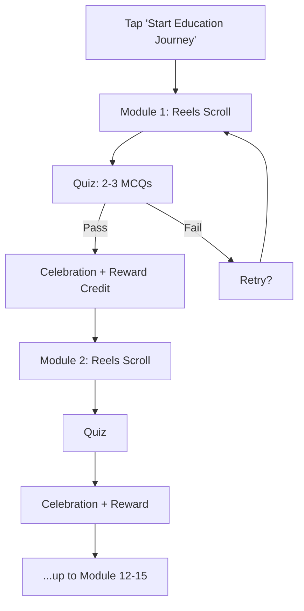
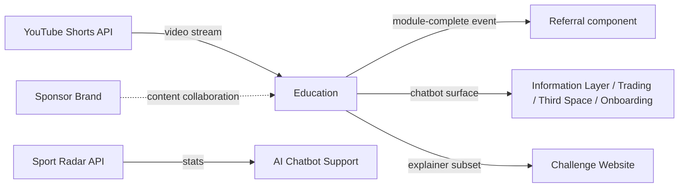

# InPlay Trading Challenge -- Education

> **Vision:** [[vision]]
> **Date:** 2026-05-14
> **Status:** Defined
> **Owner:** Kevin (content + scope) / George Westbrook (engineering) / Brett StClair (client-facing)
> **Sources:** _[[meetings/06-05-2026-vision-workshop]], [[meetings/14-05-2026-education-thirdspace-challenge-website]]_

---

## 1. What Does This Component Do?

**Functional purpose:**

The Education component is the on-ramp for non-traders. It teaches the basics of trading — how to click buy, how to click sell, what long and short mean, what an IPO is, how price discovery works on the InPlay exchange — using a TikTok-style scroll experience that feels native to how the target audience already consumes content. Edwin set the depth: _"at a 40,000 foot level. Not narrowed into any of the more granular detail."_ Skye set the format: _"It should feel like you are consuming information like TikTok."_ Cody added the gating mechanic: short quizzes at the end of each module to verify retention before crediting the reward.

The journey begins when a user taps "Start Education Journey" from a dedicated icon in the app. They land in module one. They scroll vertically through 15-second reels, each captioned in the native scroll-with-sound-off style. At the end of each module, 2-3 multiple-choice questions appear. On passing, a celebration animation fires, referral dollars credit to the user's referral wallet, and the next module unlocks. Progress is tracked server-side -- if the user leaves halfway through module four, they return to module four.

The total catalogue is intentionally curbed -- Edwin called for _"the top 12 modules or something, right? Maybe 15."_ Content covers the gamut: buy/sell mechanics, long/short language, IPO basics, the 100K starting balance, risk management, momentum, volatility. The repository also powers a separate **AI Chatbot Support** layer that handles L1 support questions (Cody's target: 75-85%) -- same content, different surface, conversational rather than scroll-based.

A subset of the education content (high-level explainer videos) is exposed on the **Challenge Website** for users who want a taste before downloading the app. The website does not host the full repository -- the goal is always to push users into the app, where the rest of the education and the trading itself lives.

```
Education
├── Modules / Reels Viewer       (TikTok-style scroll, 15-sec reels, captions)
├── Quiz / Poll Layer            (2-3 multi-choice questions, gates reward)
├── Reward Integration           (referral wallet credit on quiz pass)
├── Progress Tracking            (resume state, status badge)
├── AI Chatbot Support           (L1 support, references education repo)
├── Education-on-Website         (high-level explainer subset)
└── Sponsor Ownership Layer      (single advertiser owns module per period)
```

**Personas:**

> **Canonical audience definitions:** [[audiences]]

| Audience | How they use this component | What they need from it |
|---------|---------------------------|----------------------|
| **Crypto-Savvy Sports Trader** | Skips most of it. May dip into IPO mechanics or order-book modules if InPlay's specifics differ from what they're used to on Polymarket / Kalshi | A way to skip ahead. Don't gate trading on completing tutorials they don't need |
| **Analytical Fan / Armchair GM** | Primary audience. Knows sports cold, doesn't know trading. Will scroll the whole catalogue if the content is genuinely TikTok-native | Snackable. Native to how they already consume content. Earns them referral dollars so it feels rewarding, not homework |
| **Finance-Curious Student** | Primary audience. Treats education as a credibility builder -- "I learned how to trade, here's what I know." May share completion on social. Likely to engage with sponsor-owned modules from brands they recognise (Coca-Cola, Red Bull) | Polished native-feeling content. Visible progress (status badge). Social proof for sharing completion |
| **Veteran Trader-Bettor** | Will not engage. May glance at the AI chatbot for InPlay-specific questions but otherwise bypasses the entire surface | The AI chatbot needs to handle their tactical questions without making them watch a reel |

---

## 2. What Needs to Happen?

**Functional requirements:**

_Modules and reels:_

- User can launch Education from a dedicated icon/page in the app
- User taps "Start Education Journey" to begin module one
- User scrolls vertically through reels within a module (TikTok-style)
- Each reel is 15 seconds maximum (Skye: _"15 seconds max"_)
- Each reel has captions/subtitles in native scroll-with-sound-off style
- Modules are sequential -- module one before module two, and so on
- Total catalogue is 12-15 modules at launch (Edwin: _"maybe the top 12 modules or something, right? Maybe 15"_)
- Content covers: buy/sell, long/short language, IPO mechanics, 100K starting balance, risk management, momentum, volatility

_Quiz / poll gate:_

- At the end of each module, user sees 2-3 multiple-choice questions
- Questions are styled like a TikTok poll -- swipe-to-vote feel (Skye: _"maybe it's like a multiple choice scroll that happens... like a poll that you vote on and then it moves to the next video"_)
- On passing the quiz, user receives a celebration animation
- On passing, referral dollars credit to the user's referral wallet
- After celebration, next module is queued -- "Move on to part two"

_Progress and resume:_

- User progress is stored server-side
- User can leave at any reel and return to that exact reel later
- A status/badge surface shows: modules completed, current module, last reel viewed
- The status surfaces on the user's profile / personal dashboard

_AI chatbot support:_

- A separate AI chatbot is accessible across the app (entry points TBD)
- The chatbot answers natural-language questions by drawing on the same education content repository
- Target: chatbot handles 75-85% of L1 support questions (Cody)
- Chatbot references Sport Radar stats where queries are stats-driven (Statmuse-style model)
- Note: chatbot architecture needs its own module discussion (Cody flagged this as a follow-up)

_Education on the Challenge Website:_

- A subset of education content (high-level explainer videos) is exposed on the Challenge Website
- The website subset is for the curious public -- enough to validate the product, not enough to substitute for the in-app experience
- Cody: _"high level, you know, some explainer videos, some educational content or the hype video"_
- George's progressive-disclosure idea: show all 12 modules, click into module one, halfway through it says "if you want to carry on with this go to the app"

_Sponsor ownership:_

- A single advertiser can own a module (or set of modules) for a fixed period (monthly+, not programmatic)
- The sponsor's brand is embedded in the content (not swapped per impression)
- Content is co-created with the sponsor -- they may use their own content creators
- Multiple advertisers cannot share the same module within the same period
- Example given: Coca-Cola owns "How to read the order book" for a month

**Business rules and constraints:**

- Content stays at "40,000 feet" -- basics only, no advanced strategy, no recommendations, no advice
- Language must use "earn" not "win" (project-wide regulatory rule)
- Reward credits only on quiz pass, not just video view (Cody's verification logic)
- Education is free in the trading challenge
- Sponsor branding is fully embedded, not programmatically rotated (Skye was explicit on this)
- AI chatbot stays inside its lane -- references the education repository, does not give trading advice
- Sponsor-owned modules must be co-created with the sponsor; InPlay collaborates on the educational scripting

**Edge cases and error states:**

- User fails the quiz -- can they retry immediately, after a cooldown, or only by re-watching the module? ⚠️ **Gap**
- User watches half a reel and swipes away -- does that count as "viewed" for progress? ⚠️ **Gap**
- User clears app data -- progress survives because it's server-side, but the question of pinned-to-account vs pinned-to-device is open
- Video fails to load (low bandwidth) -- graceful fallback to text or static frame? ⚠️ **Gap**
- Sponsor pulls out mid-period -- what backfills the module? ⚠️ **Gap**
- AI chatbot answers a question it shouldn't (gives trading advice) -- moderation / guardrails undefined ⚠️ **Gap**



---

## 3. How Should It Look and Feel?

**Design direction:**

Native TikTok / Instagram Reels aesthetic. Skye: _"It should feel like you are consuming information like TikTok."_ Vertical scroll, captions on every video, snackable, infotainment hybrid. Sky's framing: _"infotainment element... that's what we're trying to hybridize here."_

Brett's anti-pattern: not Udemy. _"Keep it lightweight so it's not one of those Udemy style kill me forces."_ No long-form lectures, no polished corporate training video aesthetic, no quiz banks with 20 questions.

Celebration moments on quiz completion are punchy and emotional -- a brief animation, not a "great job!" screen.

**Reference products:**

- **TikTok / Instagram Reels** -- primary aesthetic reference, vertical scroll, captioned, snackable
- **Investopedia** -- content packaging and educational structure reference (Cody, sent to Kevin)
- **CBOE Institute** -- educational content packaging for options retail (Cody)
- **Kaplan University** -- potential sponsor + content model (Edwin: _"their whole business is selling educational materials"_)
- **Tasty Live (16-hour broadcast)** -- production-level extension partner candidate (Cody)
- **Statmuse** -- NLP / short-form answer model for the AI chatbot (Cody: _"they built an entire business off short form answers that run off NLP"_)
- **AI-overlay video format** -- creator-in-corner with AI-generated voice and overlay (Skye, referenced existing TikTok content creators)
- **Anti-pattern: Udemy** -- too long, too polished, too formal for this audience

**Key UX principles:**

- 15 seconds maximum per reel -- non-negotiable
- Every video has captions (native scroll-with-sound-off behaviour)
- One thumb-swipe between reels, no menus or modals mid-module
- Celebration on quiz completion is a moment, not a screen
- "Start Education Journey" is the primary entry point -- single, unambiguous funnel
- Brand-owned content (sponsor modules) feels like it belongs to the sponsor's social channel, not like a banner ad next to neutral content
- Progress is visible but not nagging -- status badge, not a notification

---

## 4. How Are We Going to Solve It?

| Capability | Build / Buy / Access | Provider / Approach | Rationale |
|-----------|---------------------|-------------------|-----------|
| Video hosting and distribution | Access | **YouTube Shorts** (primary) -- via YouTube API and pre-built libraries | Brett's proposal, George validated _"it's not as complex as I thought it was."_ Leverages YouTube's serving infrastructure, removes build/scale burden, and lets InPlay also distribute on YouTube as a channel. Branding hidden via custom UI overlay |
| Alternative video pipeline | Investigate | Embed private Instagram / TikTok feed via social-feed widget | Skye's suggestion -- pulls content from a private brand channel into the app. Deferred for research; YouTube path is primary |
| Video creation | Build (AI-assisted) | AI scripting + AI voice generation + AI overlay (creator-in-corner style) | Lets InPlay produce content fast and lets sponsors swap branding on existing scripts. Brett has prior experience with the toolchain |
| Captions / subtitles | Build | Generated as part of video production pipeline | Native to the TikTok aesthetic, not optional |
| Quiz / poll engine | Build | InPlay internal | 2-3 multi-choice questions per module, swipe-to-vote UX, pass/fail logic, reward trigger |
| Progress tracking | Build | InPlay internal (PostgreSQL) | Per-user state: modules complete, current module, last reel viewed. Server-side, account-pinned |
| Reward credit on completion | Build (integration) | InPlay internal -> Referral component | Module-complete event fires, Referral component credits referral wallet |
| AI chatbot support | Build | InPlay internal -- needs its own module discussion (Cody flagged) | References the education repository plus Sport Radar stats. Statmuse-style NLP for sports-specific questions |
| Sponsor content management | Build | InPlay internal (CMS) | Per-module sponsor metadata, branding overlay assets, content swap-out workflow |
| Website explainer subset | Build | Static export of selected high-level reels to Challenge Website | Picks which modules / reels go to the public funnel |

---

## 5. What Data Does It Need?

| Data | Direction | Source / Destination | Notes |
|------|-----------|---------------------|-------|
| Module videos (reels) | In | YouTube Shorts (or alternative host) | Streamed via API. 15-sec max. Captioned |
| Module metadata | Stored | InPlay internal | Module ID, order, title, sponsor (if any), associated quiz ID |
| Quiz questions and answers | Stored | InPlay internal | Per module: 2-3 multi-choice questions, correct answer index |
| User progress | Stored | InPlay internal (server-side, account-pinned) | Modules complete, current module, last reel viewed, timestamps |
| Quiz attempt log | Stored | InPlay internal | Question, chosen answer, pass/fail, timestamp |
| Module completion event | Out | Referral component | Fires reward credit to the user's referral wallet |
| Sponsor metadata | Stored | InPlay internal | Sponsor name, logo, period, modules owned, branding asset URLs |
| AI chatbot query log | Stored | InPlay internal | User question, chatbot answer, references used. Powers retraining and quality measurement |
| Sport Radar stats (for chatbot) | In | Sport Radar API | Used when the chatbot answers stats-driven questions (Statmuse-style) |
| Website explainer subset | Out | Challenge Website | Curated set of reels published to the public funnel |

---

## 6. Who Can Access It?

| Persona / Role | Access level | Notes |
|---------------|-------------|-------|
| Fully onboarded users | Full | All modules, quizzes, rewards, AI chatbot |
| KYC-pending (holding state) users | Browse-only | Can watch reels but quiz rewards do not credit until KYC completes ⚠️ **needs confirmation** |
| Pre-onboarded users (web only) | High-level subset | Explainer videos on Challenge Website, no in-app access |
| Unauthenticated public | Subset (web only) | Same as above |
| Sponsor admin users | Manage own modules | Through a sponsor portal -- post-MVP (no decision in this session) |

---

## 7. How Do We Know It's Working?

- [ ] At least 60% of newly onboarded users start the education journey within their first session
- [ ] At least 40% of users who start the journey complete at least one module
- [ ] Average modules completed per user reaches 4+ within the first week of active use
- [ ] At least 20% of users complete all modules during the challenge
- [ ] Quiz pass rate per module sits in the 70-90% band -- below 70% means the module needs rework, above 95% means the quiz is too easy
- [ ] AI Chatbot resolves 75-85% of L1 support questions without escalation (Cody's target)
- [ ] Sponsor recall lift -- A/B test on sponsored vs. non-sponsored modules to measure brand recall
- [ ] Drop-off curve per reel within a module is identifiable -- weak reels surface for rework

---

## 8. Dependencies

**What this component needs:**

| Depends on | What we need | Blocking? |
|-----------|-------------|----------|
| YouTube Shorts API + libraries | Video serving infrastructure, scroll mechanic compatibility | Yes for primary path; alternative pipelines exist |
| Customer Onboarding | Authenticated user identity for progress tracking | Yes |
| Referral component | Referral wallet write API for crediting rewards on module completion | No -- can stub during build |
| Sport Radar API | Stats data referenced by AI chatbot | No -- chatbot can launch without stats integration |
| Sponsor agreements (Sky / Cody sales work) | Brand sign-off, content collaboration, scheduling | No -- can launch with InPlay-produced content and add sponsors progressively |
| AI Chatbot architecture decision | Dedicated discussion needed (Cody flagged) | No for MVP modules; Yes for chatbot |
| Content production schedule | Who scripts, films, captions, and reviews -- responsibility chain undefined | ⚠️ **Gap** |

**What other components need from this one:**

- **Referral component** listens for module-complete events to credit referral wallet
- **AI Chatbot Support** must be accessible from anywhere in the app (Information Layer, Trading flows, Customer Onboarding, Third Space all reference it)
- **Challenge Website** subscribes to the curated explainer subset
- **Trading** component links to education modules when users encounter unfamiliar terms (e.g., a long/short tooltip links to that module)
- **Customer Onboarding** may surface education in the holding state (when users wait for KYC to clear) -- decision pending

---

## 9. Priority

**Must-have at launch?** Yes -- partially. Education modules themselves are a launch requirement for two reasons:

1. **App-store gating.** Cody: _"the app stores will decline it if it's because they see it as a scam"_ if the app launches without substantive content. Education modules are part of the substantive content requirement.
2. **User activation.** The Analytical Fan and Finance-Curious Student audiences are not traders. Without education, they hit the trading screen, do not understand long/short, and bounce.

**Sequencing rationale:**

- A subset of modules (the 4-6 covering the absolute basics) must be live for app launch
- Quiz layer can launch with module set (it's the gating mechanic for rewards)
- AI Chatbot is post-MVP -- Cody explicitly flagged this needs its own module discussion before scoping
- Sponsor-owned modules layer in as Sky / Cody close sales -- not a launch blocker
- Website explainer subset can launch alongside Challenge Website
- Progress tracking is launch-required (otherwise the resume experience breaks immediately)

**Post-MVP (explicitly deferred or open):**

- AI Chatbot support (needs dedicated session)
- Cody's _"meeting the trader where they're at in their knowledge base"_ -- personalised education journey based on user behaviour (future state)
- Production partnerships -- Tasty Live broadcasts, Investopedia content licensing, Kaplan / CBOE Institute relationships
- Sponsor portal (admin self-service for sponsors managing their modules)
- Discord-style "education channels" owned by sponsors -- Skye floated this, deferred

---

## 10. Risks

**Abuse vectors:**

- Users gaming quizzes to farm referral wallet credit (mitigation: KYC gate on referral wallet payout; per-module reward cap; quiz attempt throttling)
- Bots scripting through reels to collect rewards (mitigation: anti-bot via Persona KYC, behavioural detection)
- Sponsor-owned content drifting from neutral education into pure advertising (regulatory risk -- looks like advertising disguised as education)

**Data risks:**

- Sport Radar stats stale in AI chatbot answers -- _"the Packers' last 300-yard game"_ is only accurate if the chatbot has current data
- Video content drift -- sponsor leaves mid-period, content needs swap-out, what backfills?
- User progress data loss → frustrating UX (re-watching completed modules)
- AI chatbot hallucinations on edge-case sports questions -- could fabricate stats

**Compliance:**

- **NOT financial advice** -- strict line between basics (long/short mechanics) and recommendations ("you should go long on the Packers"). Edwin's vision-level rule applies: _"I want users to make their own journey"_
- **Sponsor disclosure** -- FTC requires clear disclosure that sponsored modules are sponsored content (e.g., "Sponsored by Coca-Cola" label, not subtle)
- **Quiz-rewards as promotion** -- crediting referral dollars for completing a quiz may trigger state-by-state promotion / sweepstakes regulations. Needs legal review
- **Educational content disclaimer** -- "Educational content, not financial advice" must appear consistently
- **AI chatbot guardrails** -- the chatbot must refuse trading advice requests, refuse stock-tip questions, stay inside the educational scope

**Controls needed:**

- "Educational content, not financial advice" disclaimer on every module
- "Sponsored by [Brand]" disclosure on every sponsored module
- Quiz attempt throttling (rate limit + cooldown after failure)
- Per-module reward cap (e.g., reward can only credit once per user per module)
- AI chatbot guardrails -- refuses advice, refuses tips, references education repo only
- Content review process before publishing a module (legal + product review)
- Sponsor content review before publishing a sponsor-owned module (legal + brand alignment review)

---

## Sub-Components

| Sub-Component | Overview | Status | Link |
|--------------|----------|--------|------|
| Modules / Reels Viewer | TikTok-style scroll, 15-sec reels with captions, vertical swipe between reels within a module | Collecting | [[sub-components/modules-reels-viewer/modules-reels-viewer]] |
| Quiz / Poll Layer | 2-3 multi-choice questions at end of each module, swipe-to-vote UX, gates reward credit | Collecting | [[sub-components/quiz-poll-layer/quiz-poll-layer]] |
| Reward Integration | On quiz pass: celebration animation + referral wallet credit via Referral component | Collecting | [[sub-components/reward-integration/reward-integration]] |
| Progress Tracking | Server-side per-user state: modules complete, current module, last reel viewed. Status badge surface | Collecting | [[sub-components/progress-tracking/progress-tracking]] |
| AI Chatbot Support | Conversational L1 support layer drawing on the education repo + Sport Radar. Target 75-85% of L1 questions. Needs its own architecture discussion (Cody flagged) | Stub | [[sub-components/ai-chatbot-support/ai-chatbot-support]] |
| Education-on-Website | Curated high-level subset published to Challenge Website -- the public-facing taster | Collecting | [[sub-components/education-on-website/education-on-website]] |
| Sponsor Ownership Layer | Single-advertiser ownership of a module for a fixed period. Embedded branding, co-created content, FTC disclosure | Collecting | [[sub-components/sponsor-ownership-layer/sponsor-ownership-layer]] |

---

> **Update (12–17 June touchdowns):** **Delivery method still open (12-06):** the team needs to align on how the first iteration is executed. Options on the table: **TikTok-style 30–40 second highlight videos** plus detailed text, **AI-generated voice narration**, **code-generated animation slides**, and a **podcast format** (10–20 min) for accessibility. **Brand-owned modules (12-06):** an alternative to InPlay producing content is a **brand taking full ownership** of a module (visual design, ambassadors, voice talent, spoken ad breaks within the content); a podcast variant could carry **programmatic AI-voice ad reads** sprinkled through (cross-references the Sponsor Ownership Layer and [[advertising/advertising]]). **Beta + session (12-06, 17-06):** Kevin and Troy to finalise a first module for a beta test; a dedicated brainstorm session was scheduled (the **18 June education session**). The **"What is an IPO draft?"** explainer link from [[ipo-module/ipo-module]] routes here. _Sources: [[12-06-2026-touchdown]], [[17-06-2026-touchdown]]. See [[digests/touchdowns-12-17-jun-2026]]._

## Diagrams

_Sub-component tree appears in Section 1. Functional flow appears in Section 2._



---

## Gaps and Questions for Next Call

### Gaps

- **Quiz failure UX:** retry immediately? Cooldown? Re-watch required? Not discussed
- **Reel-viewed accounting:** what fraction of a reel counts as viewed? Not discussed
- **Video fallback:** low-bandwidth / video-load-fail behaviour not discussed
- **Sponsor mid-period exit:** backfill content workflow not discussed
- **AI chatbot scope and architecture:** Cody explicitly flagged a separate module discussion needed
- **Content production responsibilities:** who scripts, films, captions, reviews? Pipeline not nailed down
- **Holding-state reward credit:** does KYC-pending user accrue rewards or are they gated until KYC clears?
- **Education-as-onboarding-touchpoint:** does the holding state surface education modules while users wait for KYC? Skye / Brett hinted at this in earlier sessions
- **Personalisation (future):** Cody's _"meeting the trader where they're at"_ idea -- deferred but no follow-up scheduled
- **Sponsor portal:** if Coca-Cola owns a module, who uploads their assets, schedules the period, and signs off on the script? Manual for v1, but no agreed-upon process

### Questions for Edwin / Cody / Kevin

1. What's the reward dollar amount per module completion? Does it vary by module difficulty?
2. Who is the right tester for these modules? Edwin self-flagged: _"I'm not the right person to ask because I've been doing it so long... we actually need to talk to someone who's really probably not a trader."_ Who's the proxy?
3. For sponsor-owned modules: who signs off on the educational content from the InPlay side (legal? Edwin? Cody?)?
4. Is the chatbot a launch feature or a post-MVP feature? Cody's flagging suggests post-MVP but a launch decision would be useful
5. Confirm "12-15 modules" as the cap, or revisit?
6. What's Kevin's content production timeline -- when does the first module ship to test?
7. Do sponsored modules pay InPlay differently than standard ad inventory? (i.e., are these sold by Skye's team as part of the ad packaging or as a separate motion?)
