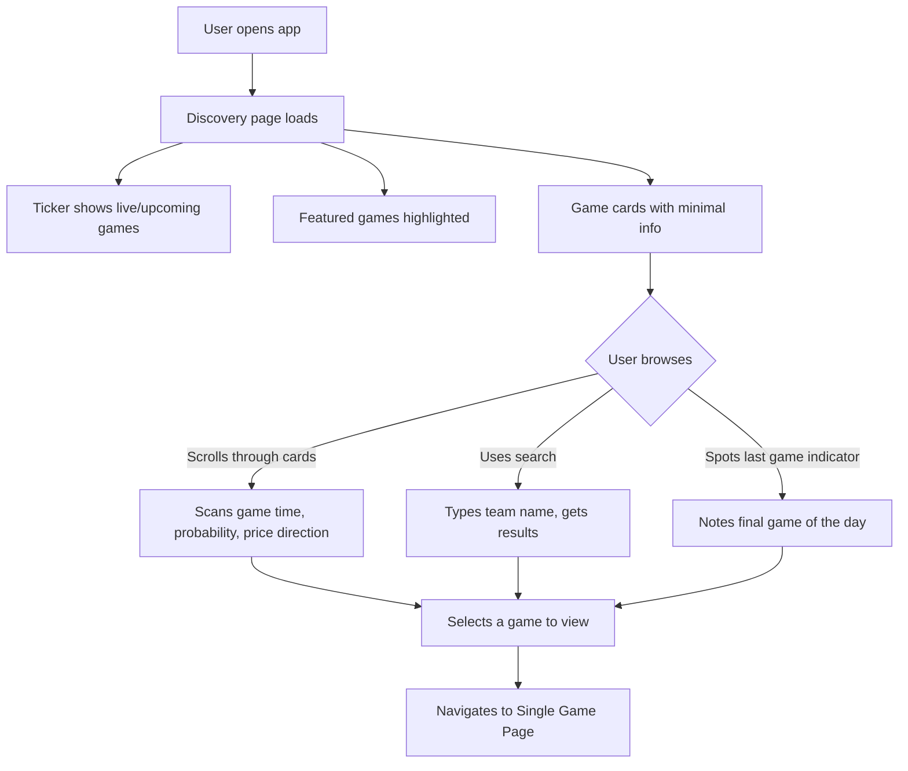
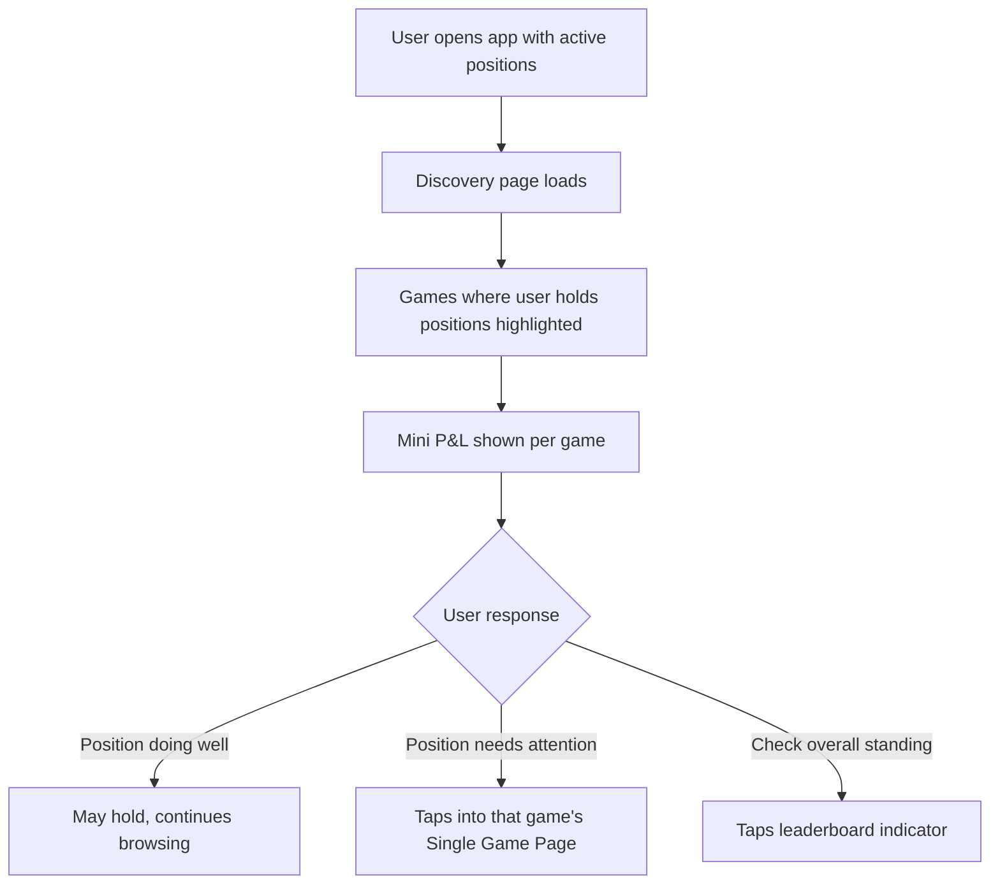
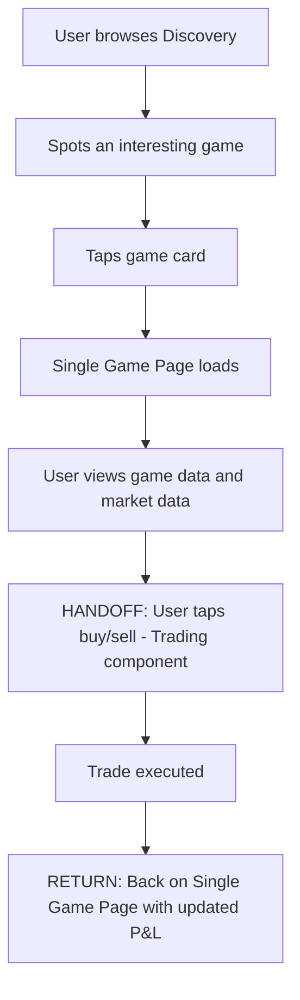

# InPlay Trading Challenge -- Discovery / Home

> **Component:** [[information-layer]]
> **Date:** 2026-05-09
> **Status:** Collecting
> **Owner:** George Westbrook
> **Sources:** _[[08-05-2026-component-1-simulation-app]]_

---

## 1. What Does This Sub-Component Do?

**Functional purpose:**

The Discovery / Home page is the entry point to the app -- the first screen users see after login. It's a browsable overview of what's happening across all games. Users scan the day's slate, search for specific teams, and decide where to focus their attention and trading activity.

The page prioritises quick scanning over deep detail. Each game is represented as a card showing minimal info (3 items max: game time, win probability, price direction). A horizontal scrolling ticker at the top shows live and upcoming games. Featured/marquee games are highlighted (top 5 college, top 5 NFL per week). A "last game of the day" indicator flags the final game -- critical because daily prizes make late games disproportionately important for users near the payout line.

The page also surfaces the user's current positions and mini P&L for games they're already trading in, and a compact leaderboard indicator showing their competitive position.

**Entities that interact with it:**

- All three user personas -- post-onboarding
- The Sports-Passionate Casual uses this page to find games they have knowledge about
- The Young Aspiring Trader uses featured games as a starting point (less pre-existing sports knowledge to guide selection)
- The Experienced Trader may bypass Discovery quickly via search, going straight to the games they're tracking

---

## 2. What Needs to Happen?

**Functional requirements:**

- User can see a horizontal scrolling ticker of live/upcoming games at the top of the screen
- User can search for teams with type-ahead across ~163 teams (32 NFL + ~131 NCAA), with disambiguation for overlaps (e.g., Buffalo Bills vs. Buffalo college)
- User can see per-game cards with minimal info: game time, win probability, stock price direction
- User can see featured/marquee games (top 5 college, top 5 NFL per week)
- User can see a "last game of the day" visual indicator
- User can click any game card to navigate to the Single Game Page
- User can see mini P&L for games where they hold active positions
- User can see a compact leaderboard indicator (their rank and proximity to payout)
- User can filter or segment between NFL and NCAA games

**Business rules:**

- Game cards show 3 data points maximum -- keep discovery fast and scannable
- "Last game of the day" calculated based on game start time, consistent with leaderboard daily calculation rules
- Featured games selection criteria TBD (editorial? algorithmic? advertiser-driven?)

**Edge cases:**

- No games currently live (off-season, bye week, early morning) -- what does the page show?
- User has no positions -- does the P&L section appear at all, or is it hidden?
- 163 teams in search results -- how does disambiguation work when multiple teams match the same input?
- Multiple games starting at the same time -- how are they ordered?

---

## 3. Entity Journeys

### 3a. Isolated Journeys

#### Journey 1: User browses the day's games

**Entity:** User (all personas)

**Input:** User opens the app / lands on Discovery

**Outcome:** User has scanned the day's slate and identified a game to drill into

**Steps:**

**Acceptance criteria:**

- [ ] Page loads within 2 seconds
- [ ] Ticker scrolls horizontally showing live games first, then upcoming
- [ ] Each game card shows exactly 3 data points: game time, win probability, price direction
- [ ] Featured games are visually distinct from regular game cards
- [ ] "Last game of the day" has a clear visual indicator
- [ ] Search returns results after 1-2 keystrokes
- [ ] Search handles disambiguation (e.g., "Buffalo" shows both Bills and college team with league labels)
- [ ] NFL and NCAA games distinguishable at a glance

---

#### Journey 2: User checks their active positions from Discovery

**Entity:** User

**Input:** User has active positions and opens the app to see how they're doing

**Outcome:** User can see at a glance which games they're involved in and their P&L without drilling into each game

**Steps:**

**Acceptance criteria:**

- [ ] Games where user holds positions are visually distinguished from games without positions
- [ ] Mini P&L (unrealised, up/down indicator) shown on the game card for active positions
- [ ] Compact leaderboard indicator visible on Discovery (rank + gap to payout)
- [ ] User can quickly identify which of their positions need attention

---

### 3b. Cross-Component Journeys

#### Journey 1: User discovers a game and trades

**Entity:** User (all personas)

**Input:** User finds an interesting game on Discovery and wants to trade

**Handoff point:** User taps a game card -> navigates to Single Game Page (within Information Layer) -> taps buy/sell -> order entry widget (Trading component). On return: back to game page with updated P&L

**Components involved:** Information Layer (Discovery) -> Information Layer (Single Game Page) -> Trading (Order Entry) -> Information Layer (Single Game Page)

**Outcome:** User has gone from browsing to trading in a seamless flow

**Steps:**

**Acceptance criteria:**

- [ ] From Discovery to executing a trade takes no more than 3 taps (tap game, tap buy/sell, confirm)
- [ ] Game page preserves context from Discovery (user doesn't lose their place)
- [ ] After trading, Discovery reflects the new position when user navigates back

---

## 4. Look and Feel

**Design specifics:**

Clean, scannable, fast. This is not a data-dense page -- it's a decision-making page. The user needs to quickly identify which games matter to them. Light mode works well here (Edwin's point about charts and information popping on light backgrounds). Cards should be uniform in size with clear visual hierarchy: team names largest, then the 3 data points, then any position indicators.

**Reference products:**

- **Poly Market home page** -- clean icons, probability displayed inline, minimal clutter. Take: the visual clarity and data density
- **Fanatics home page** -- sport category tabs at top, game cards below. Take: the categorical navigation (NFL / NCAA toggle). Avoid: the promotional banners eating screen space

**UX principles specific to this sub-component:**

- 3 data points per game card maximum -- resist adding more
- Live games should feel different from upcoming games (visual energy, animation, different card treatment)
- Search must be fast and forgiving -- partial matches, fuzzy matching
- The page should answer "what should I trade right now?" within 5 seconds of opening

---

## 5. Data Requirements

| What | Direction | Description | Source / Destination |
|------|-----------|------------|---------------------|
| Game schedule / fixtures | In | All games today and upcoming, with times, teams, venues | Sport Radar |
| Win probabilities | In | Current probability for each team in each game | Sport Radar |
| Current prices per team | In | Latest stock price and direction (up/down) for each team | T0 ATS |
| User's active positions | In | Which teams the user holds, and unrealised P&L per position | Trading component |
| Featured games list | In | Which games are marquee this week (selection criteria TBD) | InPlay internal / editorial |
| Last game of the day | In | Which game starts last today (derived from schedule) | Sport Radar schedule data |
| User's leaderboard position | In | Current rank and gap to payout for compact indicator | Leaderboard sub-component |
| Team metadata | In | Team names, logos, league (NFL/NCAA) for search and display | Sport Radar / InPlay internal |

---

## 6. Dependencies

| Depends on | What we need | Blocking for build? |
|-----------|-------------|----------|
| Sport Radar | Game schedule, win probabilities, team metadata | Yes -- no schedule, no discovery page |
| T0 ATS | Current prices per team | Yes -- need price direction for game cards |
| Trading component | User's active positions and P&L | No -- page works without position indicators |
| Leaderboard (sibling) | User's rank for compact indicator | No -- can hide indicator |
| Single Game Page (sibling) | Navigation target when user selects a game | No -- can stub the destination |

**What siblings or other components need from this one:**

- Single Game Page needs: the game selection context (which game the user tapped)
- Leaderboard may link back here if user wants to find a game to trade from leaderboard context

---

## 7. Risks

**Specific risks:**

- 163 teams could make the page feel overwhelming if not filtered/segmented well
- Featured games selection could be perceived as biased if advertiser-driven rather than editorial
- Search disambiguation (Buffalo Bills vs. Buffalo college) could confuse users if not handled clearly
- On days with many simultaneous games (full Saturday college slate), the page could feel cluttered

**Controls to build into the journeys:**

- NFL/NCAA toggle as primary filter to reduce cognitive load
- Clear labelling on search results (team name + league + record)
- Featured games criteria should be transparent or at least not feel like ads
- Sensible default ordering: live games first, then upcoming by start time

---

## 8. Priority

**Must-have at launch?** Yes -- this is the front door to the app.

**Sequencing rationale:** Should be built alongside or shortly after Single Game Page. It's simpler technically (mostly read-only display of schedule and price data) but depends on the same SR and T0 integrations. The search functionality is the most complex piece here.

---

## Sub-Sub-Components

Leaf node -- no further decomposition needed.

---

## Open Questions

1. Is this the same page as Game Day Overview, or are they separate views?
2. How much personalisation? Can users pin favourite teams, hide sports they don't follow?
3. Where does the news feed appear -- here, or only on deeper pages?
4. Featured games selection criteria -- editorial, algorithmic, or advertiser-driven?
5. What does the page show when no games are live (off-season, bye weeks, early morning)?
6. Multiple games starting at the same time -- what's the ordering logic?
