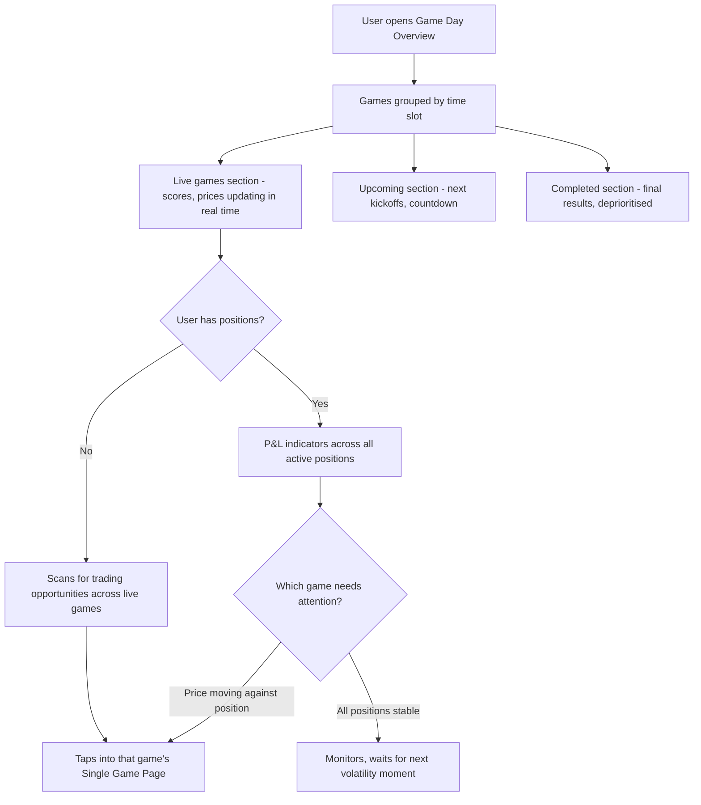
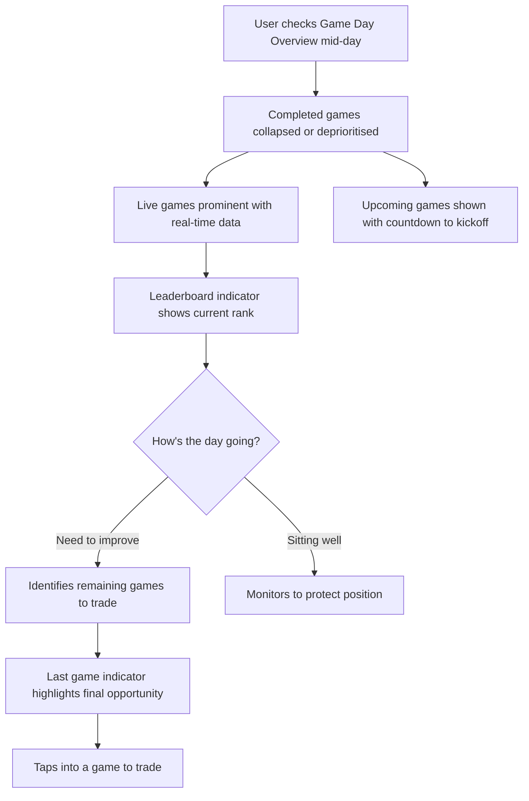
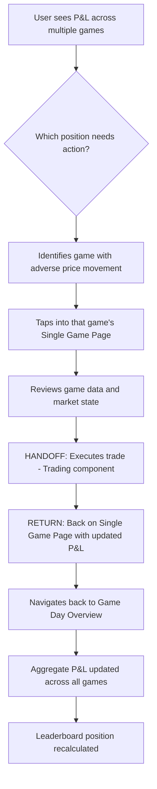

# InPlay Trading Challenge -- Game Day Overview

> **Component:** [[information-layer]]
> **Date:** 2026-05-09
> **Status:** Collecting
> **Owner:** George Westbrook
> **Sources:** _[[08-05-2026-component-1-simulation-app]]_

---

## 1. What Does This Sub-Component Do?

**Functional purpose:**

The Game Day Overview is the active monitoring page for a live game day. Where Discovery is a general entry point for browsing and searching, Game Day Overview is specifically about what's happening right now and what's coming up today. On a Saturday college football slate there could be 60+ games. On NFL Sunday, 13-16 games with staggered kickoffs. The user isn't just browsing -- they're managing attention across multiple simultaneous live games, potentially holding positions in several of them.

The page groups games by time slot (morning, afternoon, primetime, late night), shows live scores and real-time price movements, surfaces the user's P&L across all active positions, and helps them prioritise where to focus. As games complete and fewer remain, the page reflects increasing urgency -- the "last game of the day" becomes critical for users near the daily payout line.

This is also where the user feels the cumulative effect of the day. Their aggregate P&L across all positions, their leaderboard rank shifting in real time, and the countdown to the next kickoff all converge here. It's the command centre for an active trading day.

Whether this is a separate page in the bottom nav or a tab/mode within Discovery is an open design question. The content and journeys are distinct from general Discovery browsing regardless of how it's surfaced in the IA.

**Entities that interact with it:**

- All three user personas -- post-onboarding
- The Experienced Trader uses this as their primary monitoring dashboard during game days -- tracking multiple positions simultaneously
- The Sports-Passionate Casual checks in throughout the day to see how games they care about are going
- The Young Aspiring Trader uses this to find games where there's active price movement and trading opportunity

---

## 2. What Needs to Happen?

**Functional requirements:**

- User can see all of today's games grouped by time slot (morning, afternoon, primetime, late night)
- User can see live games with current scores, quarter/period, stock prices for both teams, and direction indicators
- User can see upcoming games with start times and countdown to kickoff
- User can see completed games with final scores and results (deprioritised visually)
- User can see mini P&L for all games where they hold active positions
- User can see aggregate P&L across all positions for the day (total day performance)
- User can see their leaderboard position indicator in context of the day's performance
- User can see how many games are remaining (live + upcoming)
- User can see a "last game of the day" indicator that becomes more prominent as options narrow
- User can filter between NFL and NCAA (critical on Saturdays with 60+ college games)
- User can click any game to navigate to the Single Game Page
- All data updates in real time -- scores and prices refresh without manual action

**Business rules:**

- Games ordered: live first (sorted by most recent activity or most price movement), then upcoming by start time, then completed
- Completed games collapse or deprioritise as the day progresses -- don't let finished games dominate the page
- "Last game of the day" calculated based on game start time, consistent with leaderboard daily rules
- NFL/NCAA filter as primary segmentation for managing large game slates

**Edge cases:**

- 60+ college games on a Saturday -- how do you manage this volume? Conference grouping? Show only games with positions + featured?
- No games currently live (between time slots) -- what's shown? Countdown to next batch of kickoffs
- All games completed for the day -- page becomes a day-in-review summary?
- User has positions in 10+ games simultaneously -- P&L section could become overwhelming

---

## 3. Entity Journeys

### 3a. Isolated Journeys

#### Journey 1: User monitors multiple live games simultaneously

**Entity:** User (all personas)

**Input:** User opens Game Day Overview during an active game day with multiple live games

**Outcome:** User has a real-time picture of all live games, their positions, and where they need to focus

**Steps:**

**Acceptance criteria:**

- [ ] Games grouped by time slot (morning / afternoon / primetime / late)
- [ ] Live games show: score, quarter, current stock prices for both teams, direction indicators
- [ ] User's positions across all live games visible with per-game unrealised P&L
- [ ] Aggregate P&L across all positions shown (total day performance)
- [ ] Games update in real time -- scores and prices refresh without manual action
- [ ] Clear visual distinction between live, upcoming, and completed games
- [ ] Completed games show final result and realised P&L (if position was closed)
- [ ] NFL/NCAA filter available to manage large game slates

---

#### Journey 2: User tracks remaining opportunities as the day progresses

**Entity:** User

**Input:** Some games have finished, others are still live or upcoming. User wants to assess what's left

**Outcome:** User understands which remaining games matter most for their daily leaderboard position

**Steps:**

**Acceptance criteria:**

- [ ] Completed games visually deprioritised (collapsed, greyed, or moved to bottom)
- [ ] Remaining game count visible ("3 games still live, 2 upcoming")
- [ ] "Last game of the day" indicator becomes more prominent as fewer games remain
- [ ] Leaderboard position indicator shows how the day is going across all positions
- [ ] Countdown to next kickoff for upcoming games
- [ ] User can quickly assess: "what's left and where should I focus?"

---

### 3b. Cross-Component Journeys

#### Journey 1: User manages positions across multiple games

**Entity:** User (Experienced Trader, Sports-Passionate Casual)

**Input:** User has positions in multiple live games and needs to act on one based on what they see on Game Day Overview

**Handoff point:** User taps a game where their position needs attention -> Single Game Page loads -> user executes a trade (Trading component). On return: Game Day Overview updates with new aggregate P&L

**Components involved:** Information Layer (Game Day Overview) -> Information Layer (Single Game Page) -> Trading (Order Entry) -> Information Layer (Game Day Overview updated)

**Outcome:** User has adjusted a position based on cross-game awareness and can see the impact on their aggregate day performance

**Steps:**

**Acceptance criteria:**

- [ ] User can identify which game needs attention from the overview without clicking into each one
- [ ] After trading, navigating back to Game Day Overview shows updated aggregate P&L
- [ ] Leaderboard position reflects the trade's impact
- [ ] The flow from overview to trade and back takes no more than 4 taps

---

## 4. Look and Feel

**Design specifics:**

Scoreboard-style. Think of a live sports ticker expanded to full page. Each game is a card or row with key info at a glance -- teams, score, prices, P&L. Dense but scannable. The aggregate P&L and leaderboard indicator should be pinned/sticky so the user always sees their overall position as they scroll through games.

The page should feel alive on game days -- real-time score updates, price movement indicators, visual energy on live games. Completed games should feel settled -- greyed, collapsed, no longer competing for attention.

**Reference products:**

- **ESPN Scoreboard page** -- all games for the day, grouped by time slot, live scores updating. Take: the scoreboard density and grouping
- **Bloomberg market overview** -- multiple tickers with real-time movement across many instruments. Take: the multi-position monitoring feel

**UX principles specific to this sub-component:**

- Aggregate P&L and leaderboard position should be sticky/pinned -- always visible as user scrolls
- Live games must feel visually different from upcoming and completed games
- On a 60+ game Saturday, the page must not feel overwhelming -- NFL/NCAA filter and time-slot grouping are essential
- As the day progresses and games complete, the page should naturally focus attention on what's remaining

---

## 5. Data Requirements

| What | Direction | Description | Source / Destination |
|------|-----------|------------|---------------------|
| Today's game schedule | In | All games for today with times, teams, venues, time slots | Sport Radar |
| Live game scores | In | Real-time scores and quarter/period for all live games | Sport Radar push API |
| Current prices per team | In | Stock prices and direction for all teams playing today | T0 ATS |
| User's active positions | In | All positions the user holds, per-game unrealised P&L | Trading component |
| Aggregate day P&L | In/Stored | Sum of all position P&L for the day | Trading component / InPlay internal |
| User's leaderboard position | In | Current rank and gap to payout | Leaderboard sub-component |
| Game status | In | Whether each game is pre-game, live, or completed | Sport Radar |
| Remaining game count | In | How many games are still live or upcoming (derived from schedule + status) | Sport Radar |

---

## 6. Dependencies

| Depends on | What we need | Blocking for build? |
|-----------|-------------|----------|
| Sport Radar | Today's schedule, live scores, game status | Yes -- no SR, no game day page |
| T0 ATS | Current prices for all teams playing today | Yes -- need prices for the overview |
| Trading component | User's positions and per-game P&L | No -- page works as a scoreboard without position overlay |
| Leaderboard (sibling) | User's rank for the sticky indicator | No -- can hide indicator |
| Single Game Page (sibling) | Navigation target when user taps a game | No -- can stub |
| Discovery / Home (sibling) | May share navigation or exist as a tab within Discovery | No -- can be built independently |

**What siblings or other components need from this one:**

- Single Game Page benefits from the user arriving with cross-game context (they know why they're here)
- Leaderboard may link to this page when the user wants to find games to trade

---

## 7. Risks

**Specific risks:**

- 60+ games on a Saturday could make the page feel overwhelming even with filtering
- Real-time updates across many games simultaneously is a performance challenge (many websocket connections or polling)
- Users with many positions could find the aggregate P&L misleading if some are in completed games and some in live games
- The relationship to Discovery is unclear -- if both exist, users may be confused about which to use

**Controls to build into the journeys:**

- NFL/NCAA filter and time-slot grouping as primary tools to manage volume
- Conference grouping as a secondary filter for college games (SEC, Big Ten, etc.)
- Clear labelling of aggregate P&L: "today's total" vs. "live positions only"
- If this becomes a tab within Discovery, ensure the tab is prominent and discoverable on game days

---

## 8. Priority

**Must-have at launch?** Yes -- on game days, users need a way to monitor multiple games simultaneously. Without this, they'd have to click into each game individually.

**Sequencing rationale:** Depends on the IA decision (separate page vs. Discovery tab). If separate, can be built in parallel with Discovery. If a tab within Discovery, build after Discovery's base is functional. Either way, it shares the same SR and T0 integrations.

---

## Sub-Sub-Components

Leaf node -- no further decomposition needed.

---

## Open Questions

1. Is this a separate page in the bottom nav, a tab within Discovery, or a contextual mode that activates on game days?
2. On a 60+ game Saturday, is NFL/NCAA filter enough, or do we need conference grouping for college games?
3. Should completed games collapse automatically or does the user control this?
4. Aggregate P&L: should it include completed games' realised P&L, or only live/open positions?
5. Does the page show games where the user has no positions? Or can they filter to "my games only"?
6. How does this page behave during the week when there are no games? Does it show the upcoming weekend's slate?
