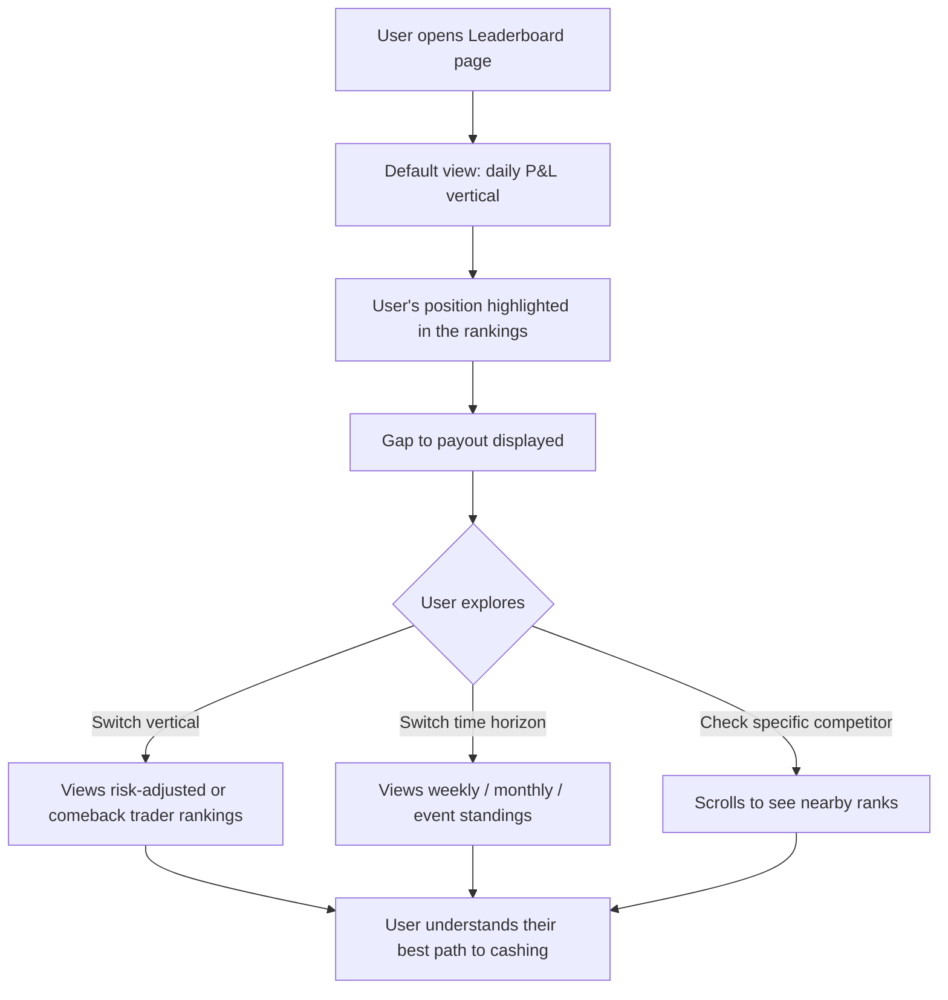
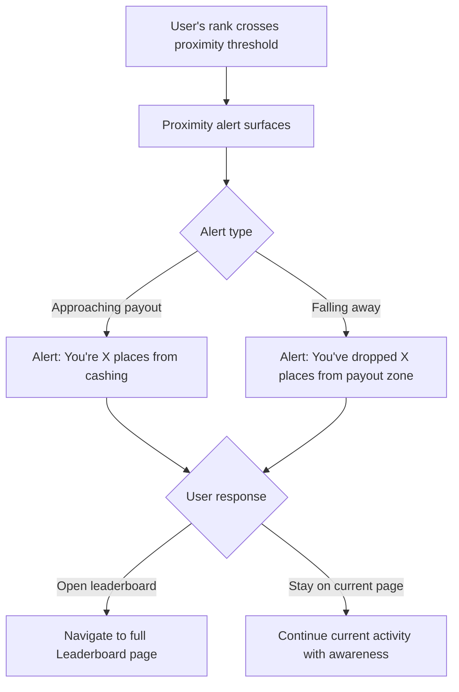
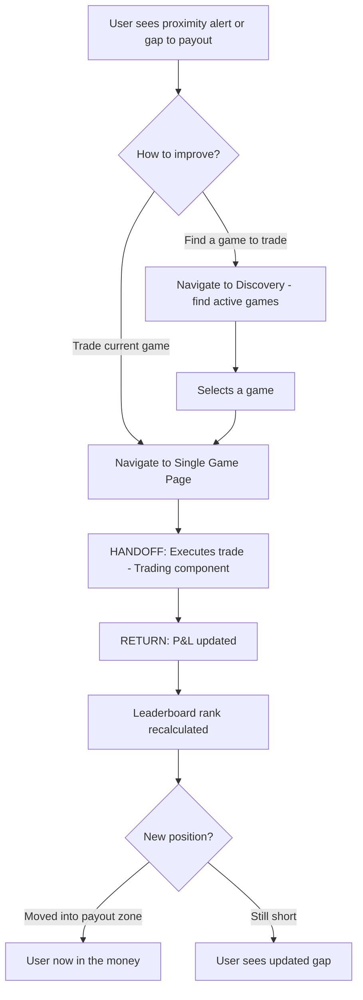

# InPlay Trading Challenge -- Leaderboard

> **Component:** [[information-layer]]
> **Date:** 2026-05-09
> **Status:** Collecting
> **Owner:** George Westbrook
> **Sources:** _[[08-05-2026-component-1-simulation-app]], [[meetings/06-05-2026-vision-workshop]]_

---

## 1. What Does This Sub-Component Do?

**Functional purpose:**

The Leaderboard is the competitive spine of the InPlay Trading Challenge. It tracks how every user is performing relative to the entire field across three competition verticals (best P&L, best risk-adjusted return, comeback trader of the day) and four time horizons (daily, weekly, monthly, full event). It exists as both a dedicated full-page view and as mini widgets embedded on other pages (Single Game Page, Discovery, Game Day Overview).

The leaderboard's most important job isn't just showing rank -- it's telling the user what they need to do to reach a payout position. "You're 847th out of 50,000" is information. "The person in 100th place has $14,200 P&L, you're at $13,800, you need $400 to cash" is a call to action. This gap-to-payout mechanic is what drives engagement, especially during the final games of the day when users are scratching to get into the money.

Special event days (Thanksgiving, Christmas) have enhanced prize pools and dedicated leaderboard treatment. The leaderboard also surfaces recognition -- badges, trader of the week announcements -- to create aspiration beyond just the prize money.

**Entities that interact with it:**

- All three user personas -- post-onboarding
- The Experienced Trader gravitates toward the risk-adjusted return vertical (rewards discipline over aggression)
- The Sports-Passionate Casual is most driven by the comeback trader vertical (rewards knowledge-driven recovery)
- The Young Aspiring Trader is most motivated by straight P&L (biggest prize pool, simplest to understand)

---

## 2. What Needs to Happen?

**Functional requirements:**

- User can view full leaderboard rankings across three verticals: best P&L, best risk-adjusted return, comeback trader
- User can view leaderboard across four time horizons: daily, weekly, monthly, full event
- User can see their own position highlighted within the full leaderboard
- User can see the gap between their performance and the nearest payout position -- both direction (how far) and magnitude (how much)
- User can see what the person in the last payout position has (the "cashing line")
- User receives proximity alerts when approaching or falling away from payout positions
- Mini leaderboard widget available for embedding on other pages (Single Game Page, Discovery)
- Special event days display enhanced prize pools and dedicated treatment
- Badges and recognition (trader of the week, etc.) visible on the leaderboard
- User can switch between the three verticals and four time horizons easily

**Business rules:**

- Daily leaderboard calculations: games count based on start time within the 24-hour period, not finish time (e.g., late Hawaii game starting at 10:30pm counts for that day)
- Three separate payout structures per time horizon
- Daily leaderboard resets each day; weekly rolls; monthly rolls; event is cumulative
- Language must use "earn" not "win" throughout

**Edge cases:**

- What happens when two users are tied on the payout boundary? How is the tiebreaker resolved?
- What happens during the transition between daily leaderboard resets? Is there a gap or does the new day start immediately?
- What if a user's rank changes while they're viewing the full leaderboard? Does it update live or on refresh?
- How is "comeback trader" defined? Biggest swing from negative to positive in a day? Largest percentage recovery?

---

## 3. Entity Journeys

### 3a. Isolated Journeys

#### Journey 1: User checks their competitive position

**Entity:** User (all personas)

**Input:** User navigates to the full Leaderboard page (from bottom nav, or taps through from mini widget on game page)

**Outcome:** User knows exactly where they stand, what they need to do to cash, and which vertical gives them the best chance

**Steps:**

**Acceptance criteria:**

- [ ] User's own position highlighted and visible without manual searching
- [ ] Gap to payout shown clearly: "100th place (last payout) has $14,200. You have $13,800. You need $400"
- [ ] User can switch between three verticals without page reload
- [ ] User can switch between four time horizons without page reload
- [ ] Rankings update in real time during live games
- [ ] Total field size shown (e.g., "847th of 50,000")
- [ ] Payout amount for each tier visible (what does 1st place get vs. 50th vs. 100th)

---

#### Journey 2: User receives a proximity alert

**Entity:** User

**Input:** User's ranking crosses a threshold near a payout boundary (approaching or falling away from cashing)

**Outcome:** User is aware their position has changed relative to the payout line and can decide whether to act

**Steps:**

**Acceptance criteria:**

- [ ] Alert surfaces when user enters a defined proximity range to a payout position (threshold TBD)
- [ ] Alert also surfaces when user drops out of proximity range
- [ ] Alert is visible but not disruptive -- doesn't block trading or game viewing
- [ ] Alert indicates which vertical the user is closest to cashing in
- [ ] Tapping the alert navigates to the full Leaderboard page

---

### 3b. Cross-Component Journeys

#### Journey 1: Leaderboard proximity drives a trade

**Entity:** User (all personas)

**Input:** User sees they're close to a payout position and needs to improve their P&L in the remaining games

**Handoff point:** User identifies a game to trade on from the leaderboard context -> navigates to Single Game Page or Discovery to find a trading opportunity. State passed: user's awareness of how much P&L they need. On return: leaderboard updates with new rank after trade

**Components involved:** Information Layer (Leaderboard) -> Information Layer (Discovery / Single Game Page) -> Trading (Order Entry) -> Information Layer (Leaderboard updated)

**Outcome:** User has traded to improve their position and can see the impact on their ranking

**Steps:**

**Acceptance criteria:**

- [ ] Leaderboard rank updates within seconds of a trade executing
- [ ] User can navigate from leaderboard to a game page to trade in 2 taps or fewer
- [ ] After trading, returning to leaderboard shows the updated position
- [ ] The "last game of the day" indicator on Discovery connects to this journey -- user knows which game is their last chance

---

## 4. Look and Feel

**Design specifics:**

The full leaderboard page should feel competitive and urgent -- like a live sports scoreboard. Numbers should be large and scannable. The user's own position should be immediately obvious (highlighted row, different colour, pinned to view). The gap-to-payout should be the most prominent number on the page -- bigger than the rank itself.

The mini widget (for embedding on game pages) should be compact: rank, gap to payout, one line. Tappable to expand to full view.

**Reference products:**

- **DraftKings daily fantasy tournament leaderboards** -- Cody's specific recommendation. Large tournaments (50,000-200,000 people), real-time rank updates, proximity notifications. Take: the engagement mechanics and real-time feel
- **Fantasy Premier League** -- season-long league table with weekly movement indicators. Take: the visual treatment of rank changes (arrows, green/red movement)

**UX principles specific to this sub-component:**

- Gap to payout is more important than absolute rank -- always show what the user needs, not just where they are
- Movement indicators (up/down arrows, rank change since last check) create a sense of dynamism
- The three verticals should be clearly differentiated -- a user should instantly understand which one they're viewing
- Risk-adjusted return needs accessible language -- don't use "Sharpe ratio" in the UI. Find a plain-English framing (TBD with Edwin)

---

## 5. Data Requirements

| What | Direction | Description | Source / Destination |
|------|-----------|------------|---------------------|
| All users' P&L data | In | Current P&L for every user in the challenge, for ranking calculation | Trading component |
| Risk-adjusted return scores | In | Calculated metric for each user (formula TBD) | InPlay internal -- needs definition |
| Comeback trader scores | In | Calculated metric -- biggest swing from negative to positive (definition TBD) | InPlay internal -- needs definition |
| Payout thresholds | In | How many places pay out per vertical per time horizon, and how much | InPlay internal -- challenge rules |
| User's current rank (per vertical, per horizon) | Stored | Calculated and cached for fast retrieval | InPlay internal |
| Proximity threshold config | In | How close to payout before alerting (e.g., within 50 places) | InPlay internal -- configurable |
| Special event day config | In | Which days are special, prize multipliers, enhanced pools | InPlay internal -- challenge rules |
| Badge/recognition data | Stored | Trader of the week, milestone badges | InPlay internal |

---

## 6. Dependencies

| Depends on | What we need | Blocking for build? |
|-----------|-------------|----------|
| Trading component | P&L data for all users to calculate rankings | Yes -- no P&L data, no leaderboard |
| InPlay challenge rules | Payout structures, number of payout positions, prize amounts, special event days | Yes -- need rules to build the leaderboard logic |
| Single Game Page (sibling) | Hosts the mini leaderboard widget | No -- full page view works independently |
| Discovery / Home (sibling) | May embed mini leaderboard or proximity indicator | No -- leaderboard works without this |

**What siblings or other components need from this one:**

- Single Game Page needs: user's current rank, gap to payout, which vertical they're closest in (for the mini widget)
- Discovery may need: a summary indicator of the user's competitive position
- Push/CRM (cross-cutting) may need: proximity threshold events to trigger push notifications

---

## 7. Risks

**Specific risks:**

- Risk-adjusted return vertical may confuse non-trader personas if not communicated in accessible language
- "Comeback trader" definition is undefined -- different definitions could dramatically change who wins
- Leaderboard calculation at scale (50,000+ users, updating in real time during live games) is a performance challenge
- Gaming risk: users could collude or use multiple accounts to manipulate rankings
- Daily reset timing: if not handled cleanly, users could exploit the gap between reset and first game

**Controls to build into the journeys:**

- Clear, plain-English labels for each vertical -- no financial jargon in the UI
- Real-time rank updates should be throttled to avoid UI flickering (update every few seconds, not every tick)
- Audit trail for payout-eligible positions to detect collusion or multi-accounting
- Clear communication of reset timing: "New day starts at X:XX AM ET"

---

## 8. Priority

**Must-have at launch?** Yes -- the leaderboard is the prize delivery mechanism. Without it, there's no competition and no reason to trade.

**Sequencing rationale:** Can be built in parallel with Single Game Page since it consumes P&L data from Trading rather than from the game page directly. The mini widget integration with Single Game Page can be done after both are independently functional. The full page view is the priority; the embedded widgets come second.

---

## Sub-Sub-Components

Leaf node -- no further decomposition needed. The full-page leaderboard and mini widget are two views of the same data, not separate sub-components.

---

## Open Questions

1. How is "comeback trader" defined? Biggest absolute swing? Biggest percentage swing? Biggest recovery from a losing position?
2. How do we communicate "risk-adjusted return" to non-trader personas? What's the plain-English label?
3. How many places pay out per vertical per time horizon? (e.g., top 100 for daily P&L, top 50 for risk-adjusted)
4. What are the prize amounts per tier? Is it tiered (1st gets more than 50th) or flat (everyone in the money gets the same)?
5. What's the proximity alert threshold? Within 50 places? 10%? Configurable?
6. What happens on a tie at the payout boundary?
7. Special event days -- what are the specific days and multipliers? Who decides?
