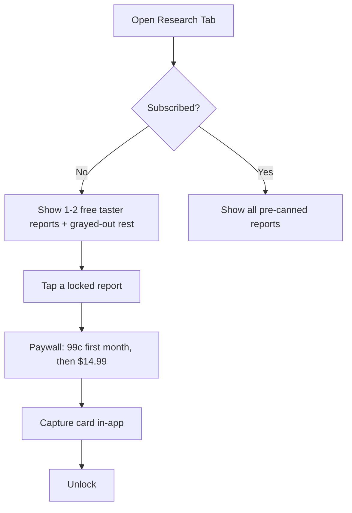
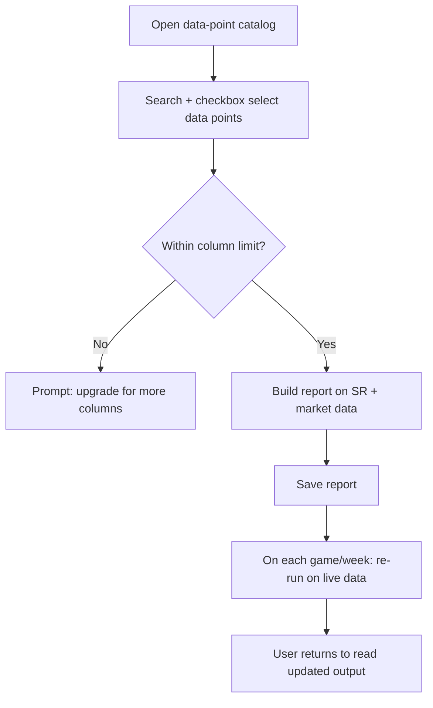
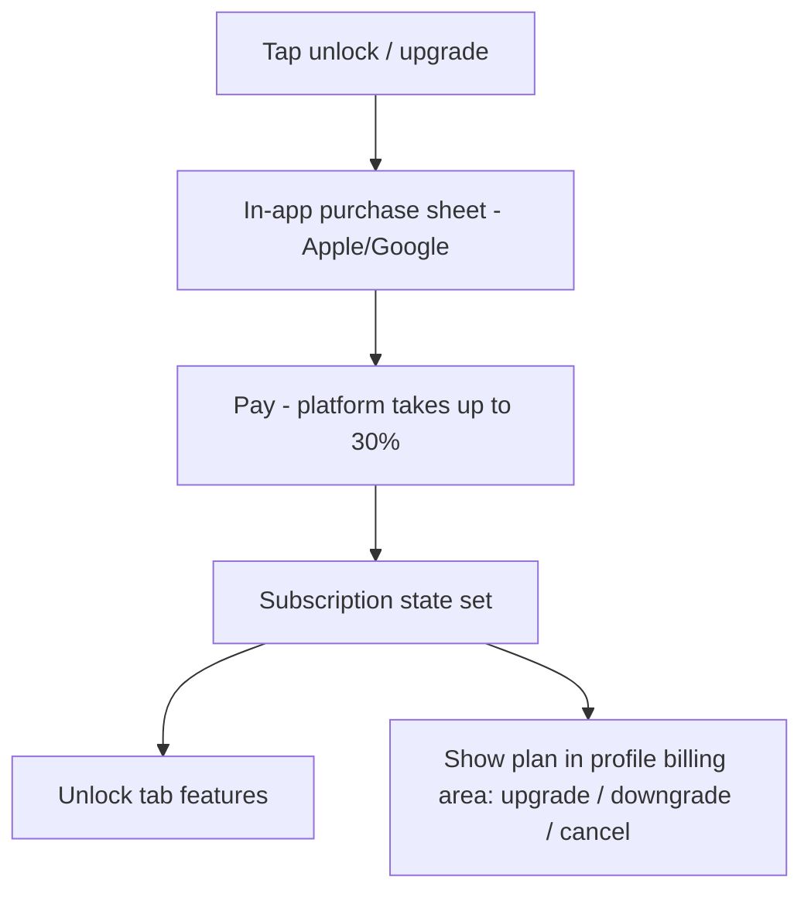

# InPlay Trading Challenge -- Research Tab

> **Component:** [[information-layer]]
> **Date:** 2026-05-09
> **Updated:** 2026-06-26 — AI Agent Research deep-dive: phased build (pre-canned → saved-custom → AI companion), pricing reset (99c → $14.99 → $49.99), in-app payment decision, background/foreground/multi-agent architecture. From [[26-06-2026-ai-agent-research-component]]
> **Updated:** 2026-07-13 — v1 pre-canned reports demoed live in-app; ladder refined to four steps (LLM analysis layer inserted before the full AI agent). From [[13-07-2026-touchdown]]
> **Status:** Defined _(Phase 1 scoped; AI companion is Phase 2, still conceptual)_
> **Owner:** George Westbrook (engineering) + Cody Haugen (product / client-facing)
> **Sources:** _[[08-05-2026-component-1-simulation-app]], [[18-05-2026-touchdown]], [[26-06-2026-ai-agent-research-component]], [[13-07-2026-touchdown]]_

---

## 1. What Does This Sub-Component Do?

**Functional purpose:**

The Research Tab is InPlay's data-intelligence and **monetisation** surface. It is where a user goes to *understand* the market before they trade: run reports over the platform's data (Sport Radar sports data, T0 market data, and InPlay's cross-correlated volatility dataset), build and save their own reports, and — in Phase 2 — converse with an **AI research companion** that builds reports for them in natural language. It is also the **primary paid product of the first trading-challenge season**: a subscription that exists, in Cody's framing, to "unlock a tool in the tool belt" that offsets the lack of advertising revenue in season one (≈$14.99 × 500k users ≈ $8M).

The 26-06 session reframed the tab from "the AI Research Agent" into a **three-tier feature ladder**, deliberately sequenced so cost and complexity ramp with willingness to pay:

```
Research Tab (subscription-gated)
├── Pre-canned reports   PHASE 1   built once, all subscribers see it (cheap, ultra-scalable)
│                                  e.g. "top-10 defenses vs top-10 offenses, head-to-head per game"
├── Saved custom reports PHASE 1   user builds from a data-point catalog; saved; auto-updates each game/week
│                                  per-user cost (scales linearly); the valuable, sticky feature
└── AI companion         PHASE 2   conversational "smart Excel buddy"; NL report building; unlocks $49.99 tier
```

**Build status (13-07):** the v1 **pre-canned reports are demoed live in-app** — Sport Radar data roll-ups on a weekly cadence, sortable columns, and click-in column definitions (phone width limits how many columns display at once; users click in to see what a column means). Cody is sending over a set of pre-canned report ideas to brainstorm from. George's 13-07 articulation also refined the ladder into **four steps**: pre-canned → user custom reports ("still effectively database roll-ups") → **an LLM analysis layer over both** (outlier detection + commentary: "the AI's analysed it and said, this is an outlier… I've also noticed on this research report…") → the full **AI agent** with access to all reports and users, able to answer questions and create reports. Resourcing between the layers follows usage metrics ("given the metrics from usage, that's where we pour the resources"). The differentiator lands once T0 prices are piped in alongside SR data: cross-correlating win probabilities with price history — "this team in the fourth quarter when they're losing, this is the likelihood they win… the price usually fluctuates X amount in the last quarter… no other platform, app, or software does that on the planet." (Source: standup 2026-07-13)

Underneath the three tiers, the original **AI Research Agent** modes still apply and are now mapped to "foreground" vs "background" AI (see §1 architecture note and §3):

1. **Manual chat / companion (foreground)** — the user asks in natural language and the agent builds/answers. _Phase 2._ This is the same capability documented as the **Research AI Chat** in [[third-space/third-space|Third Space]].
2. **Scheduled / saved reports** — a saved report runs on cadence (weekly / per-game) against live data.
3. **Event-triggered proactive research (background)** — a webhook/event (injury, block trade, price spike) triggers analysis surfaced as an insight ("noticed a 10% price hike + these injuries → suggests XYZ").

**Foreground vs background AI (George's framing):**
- **Foreground AI** = the chat window the user talks to (Phase 2 companion).
- **Background AI** = AI working *behind* a canned or custom report on extracted data points (price-impact analysis, injury-impact analysis) that would be hard to produce functionally without it. Some saved custom reports have **no AI at all** — pure data-point queries.
- **Multi-agent** = specialist agents (e.g. a price-impact agent, an injury-impact agent) each with their own endpoints, talking to each other behind the scenes to assemble a comprehensive report "that isn't just a line of numbers." The user never sees the agents.

**Entities that interact with it:**

- **User (verified, funded, subscribed)** — runs pre-canned reports, builds and saves custom reports, (Phase 2) chats with the companion, taps through to trade.
- **Free / unsubscribed user** — sees a small taste (a couple of always-free pre-canned reports); everything else is grayed-out / paywalled. **No free access to the AI companion, ever** (Cody).
- **Research agents (system)** — background analysis, multi-agent report assembly, scheduled/event runs.

---

## 2. What Needs to Happen?

**Functional requirements:**

- A subscriber can open the Research Tab and run **pre-canned reports** (built once, shared across all subscribers).
- A subscriber can **build a custom report** from a **data-point catalog** — checkbox selectors + a **search function**; a **column limit** (e.g. 5–7) bounds compute and doubles as an upsell lever ("want 10 columns? +$2/mo").
- A subscriber can **save** a custom report; it **re-runs on live data** each game/week and the subscriber returns to read the updated output.
- Every team shown in a report is **hyperlinked to its trade page**; the user can also **trade directly from the research page** (same app, microservices, no latency block). Because one report can list 5–10 teams, the **trade action must carry which team** it refers to.
- _Phase 2:_ a subscriber can ask the **AI companion** in natural language ("best teams in the 4th quarter when it's snowing, two minutes left, on back-to-back road games") and get a built report back, conversationally refined.
- The tab is **discoverable from multiple entry points** (it lives in "More" and "anything in More gets buried" — Cody), including a research prompt on the **team-profile page** and **house-ad tips** that route in (see §3 / Advertising).

**Business rules — pricing & access (reset 26-06):**

- **Subscription pricing (trading-challenge iteration):** **99c first month, then $14.99/month.** The 99c is a deliberate **card-capture** hook ("no one cancels that s***"). _This replaces the earlier ~$99.99/mo production placeholder; the $99.99 framing was the production-vs-raw-SR-data argument, see §7._
- **Phase 2 AI companion raises the tier to $49.99/month** ("a smart person that builds reports in seconds, sitting next to you").
- **Everything in the tab is behind the subscription** for simplicity, **except** a **couple of always-visible pre-canned reports** shown free as a taste (no time-limit — "if you derive value from one free report, good on you," but the rest are grayed out to pull the upgrade).
- **AI companion is never offered in a free demo.**
- **In-app payment, eat the fee (decided — see §3 Journey 4).** Apple/Google in-app purchase takes up to 30%; the team chose to **stay in-app and pay it away** rather than bounce out to a PWA, because the friction of leaving the app loses more revenue than the 30% (Edwin: leaving the app is ~50/50 the user ever comes back). George flagged **split-testing** in-app vs out-of-app drop-off *over time*, not at launch.
- **AI/LLM consumption billing (Phase 2):** runs on a **separate billable LLM instance** (cheapest model with acceptable performance) with **cost guardrails**. Two models debated, likely **both**:
  - **Per-report flat price** (e.g. ~$5/report) for **defined / scheduled** reports — clearer and predictable for the user.
  - **Credit / token** model (Lovable-style) for **free-flowing chat**, where one request might cost $1 and another $10. Margin can be taken on token cost (Cody's "rounding" point).
- The agent **must not influence trades** — Cody: "we can't influence trades, but we can slight them a little." No financial advice (vision-level constraint preserved).

**Cost-scaling rule (the reason for the phasing):**
- **Pre-canned report** = built once → 1-to-many → near-zero marginal cost. Safe for Phase 1 and for free tasters.
- **Saved custom report** = one run per user → **linear cost** (a million users = a million runs). This is why Phase 1 leads with pre-canned, and why custom reports carry the column limit + are the first paid lever.

**Edge cases:**
- **Agent uncertain / no data** → say so; never fabricate a stat.
- **Event-triggered flood** (many simultaneous injuries/news) → throttle/prioritise alerts.
- **Question strays into advice** ("should I buy X?") → reframe to data, don't advise.
- **Report lists multiple teams** → the trade button must disambiguate which team the user is acting on.
- **Poor connectivity** (Cody) → an in-app purchase still completes on the already-loaded app; a PWA redirect that has to load a fresh data-capture page may hang — another mark in favour of in-app.

---

## 3. Entity Journeys

### 3a. Isolated Journeys

#### Journey 1: Run a pre-canned report (taster → paywall)

**Entity:** User (free or subscribed)

**Input:** User opens the Research Tab.

**Outcome:** Free user sees a couple of reports + grayed-out catalogue and converts at 99c; subscriber sees all pre-canned reports.

**Steps:**



**Acceptance criteria:**
- [ ] A small set of pre-canned reports is always visible free; the rest are grayed-out for non-subscribers.
- [ ] The paywall offers 99c first month → $14.99/month and captures the card **in-app**.
- [ ] The AI companion is not reachable in any free state.

#### Journey 2: Build and save a custom report

**Entity:** User (subscribed)

**Input:** User opens the data-point catalog and selects data points.

**Outcome:** A saved report that re-runs on live data each game/week.

**Steps:**



**Acceptance criteria:**
- [ ] User can search and checkbox-select data points to build a report.
- [ ] A column limit bounds the report and surfaces an upgrade prompt when exceeded.
- [ ] Saved reports re-run on live data and show the updated result on return.

#### Journey 3: Ask the AI companion (Phase 2)

**Entity:** User (subscribed, $49.99 tier) + companion agent

**Input:** Natural-language question.

**Outcome:** A built report, conversationally refined, with teams hyperlinked to trade.

**Acceptance criteria:**
- [ ] NL questions return a built, data-grounded report (Statmuse-style, but report-shaped).
- [ ] The companion confirms intent ("did you mean…?") and refines.
- [ ] No fabrication; advice-seeking is reframed to data.

### 3b. Cross-Component Journeys

#### Journey 4: Subscribe and pay (in-app)

**Entity:** User + Billing

**Handoff point:** Research Tab paywall → in-app purchase (Apple/Google) → subscription state → Research Tab unlock + the user's **billing & subscription area** (in profile/admin).

**Components involved:** Research Tab → Billing → Customer Onboarding (profile/admin) → Push/CRM (renewal/expiry)

**Outcome:** User pays without leaving the app; can later upgrade/downgrade/cancel from a billing area.

**Steps:**



**Acceptance criteria:**
- [ ] Payment completes **in-app** (no PWA bounce-out at launch).
- [ ] The user's profile/admin area lists the active subscription with upgrade / downgrade / cancel.
- [ ] Plan changes (incl. column-limit and $14.99→$49.99 AI tier) flow through the same surface.

#### Journey 5: Event-triggered proactive research (background AI)

**Entity:** Research agent (system) — see prior definition; unchanged.

**Handoff point:** Information-Layer event sources (injury news / block trade / price spike) → background agent → user via Research Tab + Push/CRM.

**Acceptance criteria:**
- [ ] A qualifying event triggers proactive agent research.
- [ ] The insight is surfaced in-tab and (optionally) via push.
- [ ] Alert volume is throttled/prioritised under event floods.

#### Journey 6: Discovery via house ads + personalised prompts

**Entity:** User + Advertising / Push-CRM

**Input:** A house-ad "tip" or a personalised prompt based on the user's prior research.

**Outcome:** The user is routed back into the Research Tab.

**Detail:**
- **House-ad tips (Brett):** use house ad inventory to surface a stat ("did you know… click for more") that deep-links into the relevant research — softer than an "upgrade" ad.
- **Hyper-personalised prompts (Skye):** ads/notifications tuned to the user's prior research topics, via Sport Radar's DSP-style hyper-personalised targeting ("you dropped 50 places on the leaderboard — you should have researched X").
- **Team-page entry:** a research prompt/window on the existing team-profile research section ("enter InPlay research, monthly subscription applies") — a second path so the tab isn't buried in "More."

**Acceptance criteria:**
- [ ] House ads can deep-link a tip into a specific report.
- [ ] Prompts can be personalised from the user's research history.
- [ ] The team-profile page exposes a research entry point.

---

## 4. Look and Feel (Optional)

Report-first, not chat-first (for Phase 1): a landing area of **pre-canned reports**, a **builder** (catalog + search + checkbox selectors, column-limited), and a **saved-reports** list that updates on live data. The Phase 2 **companion** adds a chat surface alongside ("ask me any question, I can help you build reports and slice the data"). Teams in any report are tappable straight to trade. Should feel like a premium research terminal consistent with the Information Layer's data-dense direction. A "**AI companion — coming soon**" placeholder markets Phase 2 from within Phase 1.

---

## 5. Data Requirements

| What | Direction | Description | Source / Destination |
|------|-----------|------------|---------------------|
| Sport Radar stats | In | Basis for reports + NL answers | Sport Radar |
| Market data | In | Prices, order book, block trades, price spikes | T0 |
| Cross-correlated volatility dataset | In | Event→price patterns (InPlay IP) | InPlay |
| Data-point catalog | Stored | The selectable building blocks for custom reports (scope TBD ⚠️) | InPlay |
| Saved custom report definitions | Stored | Per-user report config (data points, columns, cadence) | InPlay |
| Pre-canned report definitions | Stored | Shared, built-once reports | InPlay |
| User questions (Phase 2) | In | NL queries | User |
| Event triggers | In | Injury news, block trades, price spikes | Sport Radar / market data |
| Generated reports / insights | Out/Stored | Reports, briefings, alerts | → user, Push/CRM |
| Subscription + plan state | In/Stored | Free / $14.99 / $49.99, column limit, renewal | Billing (in-app purchase) |
| LLM usage / credits (Phase 2) | Stored | Token/credit consumption + cost guardrails | Billing / separate LLM instance |
| Trade hand-off (team id) | Out | Which team a "trade" tap refers to | → Trading |

---

## 6. Dependencies

| Depends on | What we need | Blocking? |
|-----------|-------------|----------|
| Sport Radar | Stats for grounding + report data points | Yes |
| T0 / market data | Prices, block-trade / price-spike events | Partial — pre-canned reports can run on SR alone initially |
| **Billing / in-app purchase** | Apple/Google IAP, plan state, upgrade/downgrade/cancel surface | **Yes** for the paid product |
| **Separate billable LLM instance** | Cheapest viable model + cost guardrails | **Yes** for Phase 2 |
| [[third-space/third-space|Third Space]] (Research AI Chat) | Same manual-chat capability; reconcile ownership | Partial |
| [[team-page/team-page|Team Page]] | Research entry point on the team profile | No |
| Advertising (house ads) + Push/CRM | Discovery tips, personalised prompts, alert delivery | No |
| Trading | Trade hand-off carrying team id from a report | No (but needed for the two-clicks-to-trade promise) |

**What other components need from this one:**
- [[third-space/third-space|Third Space]] — the Research AI Chat is hosted here.
- Advertising — research-history signal feeds hyper-personalised house ads.

---

## 7. Risks

**Specific risks:**
- **Hallucinated stats / advice** — fabrication or stepping into financial advice is a trust + compliance risk.
- **Custom-report cost blow-out** — per-user runs scale linearly; without the column limit and guardrails, Phase 2 LLM spend can outrun the subscription margin.
- **Event-trigger noise** — too many proactive alerts overwhelm users.
- **In-app 30% fee vs conversion** — paying away up to 30% is real margin; the bet is that in-app conversion beats a PWA bounce-out. Revisit via split-test, not assumption.
- **Monetisation/conditioning ethics** — conditioning free users then paywalling must not feel like a bait-and-switch (the 99c card-capture is deliberately sticky).

**Controls to build into the journeys:**
- Strict grounding in licensed data; explicit "I don't know" over fabrication.
- Advice-reframing guardrail (no trade recommendations); "slight but don't influence."
- Column limits + per-report/credit guardrails on LLM spend.
- Alert throttling/prioritisation.

> **Production-vs-challenge pricing context (retained):** raw Sport Radar data access is B2B-only at ~$5–20k/mo, which is the backdrop to the original ~$99.99/mo production framing. The **challenge** pricing (99c → $14.99, AI tier $49.99) is the season-one consumer model; a production model can re-tier later.

---

## 8. Priority

**Phasing (decided 26-06):**
- **Phase 1 (target: in-app as soon as possible, may slip past launch):** pre-canned reports, the **data-point catalog + saved custom reports**, subscription + in-app payment, discovery entry points, "AI companion — coming soon" placeholder.
- **Phase 2:** the **AI companion** (foreground chat + multi-agent background), token/credit billing on a separate LLM instance, $49.99 tier.

**Sequencing rationale:** lead with the **cheap, ultra-scalable** pre-canned reports (also the free taster), then the **sticky, paid** saved-custom reports, then the **highest-value, highest-cost** AI companion once the cost model and guardrails are proven. Cody: "everything you see is Phase 1; the AI companion is leaps and bounds the most powerful feature for Phase 2." Reconcile the manual-chat mode with Third Space so the capability isn't built twice.

---

## Sub-Sub-Components

Leaf node — the three feature tiers are phases on one Research Tab, not separable sub-parts. The data-point catalog, the report builder, and the billing/subscription layer are the buildable pieces within it.

---

## Open Questions for Next Call

- **Data-point catalog scope** — what data points / categories are exposed in the builder, and the search behaviour. Cody: "we need to figure out what exactly we want to show here, otherwise your catalog could be everything." Pre-canned report examples to be supplied by the InPlay team.
- **AI billing model** — final split between per-report flat pricing and token/credit, and which LLM instance + guardrails.
- **Column-limit values** — the launch limit (5? 7?) and the upsell steps.
- **Ownership reconciliation** — the manual-chat mode = Third Space's Research AI Chat. One build, surfaced in both places — confirm which component owns it.
- **In-app vs out-of-app split-test** — design the experiment (drop-off vs 30%) for *after* launch.
- **Which event types trigger proactive research**, and the alert-volume policy.
- **Engagement-lift measurement** — capture the research-driven screen-time uplift (Cody/George: ~20–30%) for the advertiser story; feeds Analytics & Funnel Measurement.
