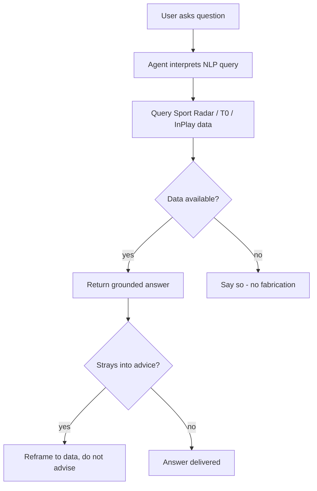
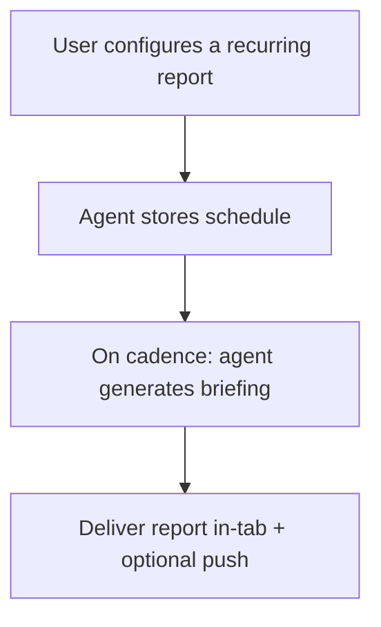
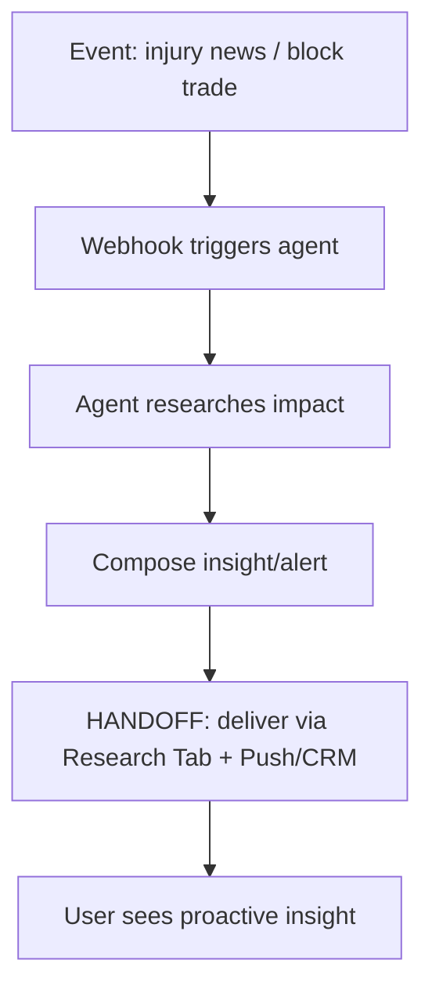

# InPlay Trading Challenge -- Research Tab

> **Component:** [[information-layer]]
> **Date:** 2026-05-09
> **Updated:** 2026-06-02 — defined via the AI Research Agent (from [[18-05-2026-touchdown]]); confirmed the agent lives here
> **Status:** Collecting
> **Owner:** George Westbrook
> **Sources:** _[[08-05-2026-component-1-simulation-app]], [[18-05-2026-touchdown]]_

---

## 1. What Does This Sub-Component Do?

**Functional purpose:**

The Research Tab is the home of InPlay's **AI Research Agent** — a conversational, report-generating, and proactively-alerting research layer over the platform's data (Sport Radar sports data, T0 market data, and InPlay's cross-correlated volatility dataset). It is where a user goes to *understand* the market before they trade: ask questions in natural language, receive scheduled briefings, and get pushed proactive insight when something material happens. It is also a primary **monetisation lever** — free during the simulation challenge to condition users to rely on it, then **subscription-gated (~$99.99/mo) in production** (cheap relative to raw Sport Radar data access at ~$5–20k/mo, which is B2B-only).

The AI Research Agent operates in **three modes**:

1. **Manual chat** — the user asks a question and gets an NLP answer over Sport Radar stats (Statmuse-style). _This is the same capability documented as the **Research AI Chat** in [[third-space/third-space|Third Space]] — it surfaces here, on the Research Tab._
2. **Scheduled reports** — the agent generates periodic briefings (e.g. a weekly game-day price report) on a cadence the user sets.
3. **Event-triggered proactive research** — a webhook/event (e.g. injury news, a large block trade) triggers the agent to research and surface an insight or alert without the user asking.

Beyond the agent, the Research Tab carries the **historical/volatility research** discussed earlier: annotated historical charts (past price moves with event annotations), volatility-pattern analysis ("how much does a touchdown typically move the price"), and tooling to help users build volatility strategies.

```
Research Tab (AI Research Agent + historical research)
├── Manual chat        (NLP over Sport Radar stats; = Third Space Research AI Chat)
├── Scheduled reports  (periodic briefings, user-set cadence)
├── Event-triggered    (webhook/event → proactive research + alert)
└── Historical/volatility research (annotated charts, pattern analysis)
```

**Entities that interact with it:**

- **User (verified, funded)** — chats, subscribes to reports, receives proactive alerts, browses historical research. Free in the challenge; premium in production.
- **Research agent (system)** — runs the scheduled and event-triggered modes; answers manual queries.

---

## 2. What Needs to Happen?

**Functional requirements:**

- User can ask a **natural-language question** and get an answer grounded in Sport Radar stats (Statmuse-style).
- User can **schedule recurring reports** (e.g. weekly game-day price report) and receive them on cadence.
- The agent can **proactively research and surface insight** when a triggering event arrives (injury news, block trade, etc.).
- User can view **annotated historical charts** and **volatility-pattern analysis**.
- The tab is **free in the challenge**; in production it is **subscription-gated (~$99.99/mo)**.

**Business rules:**

- Free during simulation challenge; paywalled in production (~$99.99/mo).
- The agent must **not give financial advice** — it surfaces data and analysis; it does not recommend trades (vision-level constraint — InPlay does not advise/summarise sentiment as guidance).
- Grounded in licensed data only (Sport Radar, T0, InPlay's own dataset).

**Edge cases:**

- **Agent uncertain / no data** → say so; never fabricate a stat.
- **Event-triggered flood** (many simultaneous injury/news events) → throttle/prioritise alerts.
- **Question strays into advice** ("should I buy X?") → reframe to data, don't advise.

---

## 3. Entity Journeys

### 3a. Isolated Journeys

#### Journey 1: Ask a research question (manual chat)

**Entity:** User (verified)

**Input:** User types a natural-language question on the Research Tab.

**Outcome:** User gets a data-grounded answer (Statmuse-style) and is better informed to trade.

**Steps:**



**Acceptance criteria:**
- [ ] Natural-language questions return answers grounded in licensed data.
- [ ] The agent never fabricates a statistic; says when it doesn't know.
- [ ] Advice-seeking questions are reframed to data, not answered as recommendations.

#### Journey 2: Subscribe to a scheduled report

**Entity:** User (verified) + agent

**Input:** User sets up a recurring report (e.g. weekly game-day price report).

**Outcome:** User receives the briefing on cadence.

**Steps:**



**Acceptance criteria:**
- [ ] User can configure a recurring report and cadence.
- [ ] The agent generates and delivers the briefing on schedule.

### 3b. Cross-Component Journeys

#### Journey 1: Event-triggered proactive research

**Entity:** Research agent (system)

**Input:** A material event arrives (injury news from Sport Radar; a large block trade from the market data / [[single-game-page/single-game-page|Single Game Page]]).

**Handoff point:** Information Layer event sources → Research Agent → user via Research Tab + Push/CRM alert.

**Components involved:** Information Layer (data/events) → Research Tab → Push/CRM (delivery)

**Outcome:** The user is proactively surfaced a researched insight tied to the event.

**Steps:**



**Acceptance criteria:**
- [ ] A qualifying event triggers proactive agent research.
- [ ] The insight is surfaced in-tab and (optionally) via push.
- [ ] Alert volume is throttled/prioritised under event floods.

---

## 4. Look and Feel (Optional)

Conversational and report-like — a chat surface for manual queries, a briefings area for scheduled/proactive reports, and the historical/volatility research views (annotated charts). Should feel like a premium research terminal, consistent with the Information Layer's data-dense direction.

---

## 5. Data Requirements

| What | Direction | Description | Source / Destination |
|------|-----------|------------|---------------------|
| Sport Radar stats | In | Basis for NLP answers + reports | Sport Radar |
| Market data | In | Prices, order book, block trades | T0 |
| Cross-correlated volatility dataset | In | Event→price patterns (InPlay IP) | InPlay |
| User questions | In | NLP queries | User |
| Report schedule config | Stored | Cadence + report type | InPlay |
| Event triggers | In | Injury news, block trades | Sport Radar / market data |
| Generated insights/reports | Out/Stored | Answers, briefings, alerts | → user, Push/CRM |
| Subscription status (production) | In | Free (challenge) vs paid (~$99.99/mo) | Billing |

---

## 6. Dependencies

| Depends on | What we need | Blocking? |
|-----------|-------------|----------|
| Sport Radar | Stats for grounding | Yes |
| T0 / market data | Prices, block-trade events | No — chat works on SR alone initially |
| [[third-space/third-space|Third Space]] (Research AI Chat) | The manual-chat capability is the same; reconcile ownership | Partial |
| Push/CRM (cross-cutting) | Delivery of scheduled/proactive alerts | No |
| Billing (production) | Subscription gating (~$99.99/mo) | No (challenge is free) |

**What other components need from this one:**

- [[third-space/third-space|Third Space]] — the Research AI Chat is hosted here.

---

## 7. Risks

**Specific risks:**
- **Hallucinated stats / advice** — fabrication or stepping into financial advice is a trust + compliance risk.
- **Event-trigger noise** — too many proactive alerts overwhelm users.
- **Monetisation/conditioning ethics** — "conditioning" free users to depend on it then paywalling must not feel like a bait-and-switch.

**Controls to build into the journeys:**
- Strict grounding in licensed data; explicit "I don't know" rather than fabrication.
- Advice-reframing guardrail (no trade recommendations).
- Alert throttling/prioritisation.

---

## 8. Priority

**Must-have at launch?** Manual chat is the launch-relevant piece (it's the Research AI Chat). Scheduled and event-triggered modes, plus production subscription gating, can follow. The Research Tab was explicitly **deferred to "phase two"** in the 15-05 touchdown.

**Sequencing rationale:** Ship the manual-chat mode with the Information Layer; layer scheduled reports and event-triggered research after live data is flowing; add subscription gating for production. Reconcile with Third Space so the chat capability isn't built twice.

---

## Sub-Sub-Components

Leaf node — the three agent modes are journeys on one Research Tab, not separable sub-parts.

---

## Open Questions for Next Call

- **Ownership reconciliation:** the manual-chat mode = Third Space's Research AI Chat. One build, surfaced in both places — confirm which component owns it.
- Exact production subscription model (flat ~$99.99/mo vs tiered/per-feature).
- Which event types trigger proactive research, and the alert-volume policy.
- How much historical/volatility tooling vs pure agent — is there an InPlay proprietary analysis layer beyond data display?
