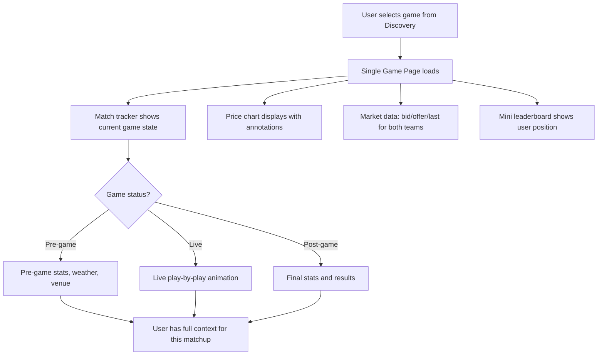
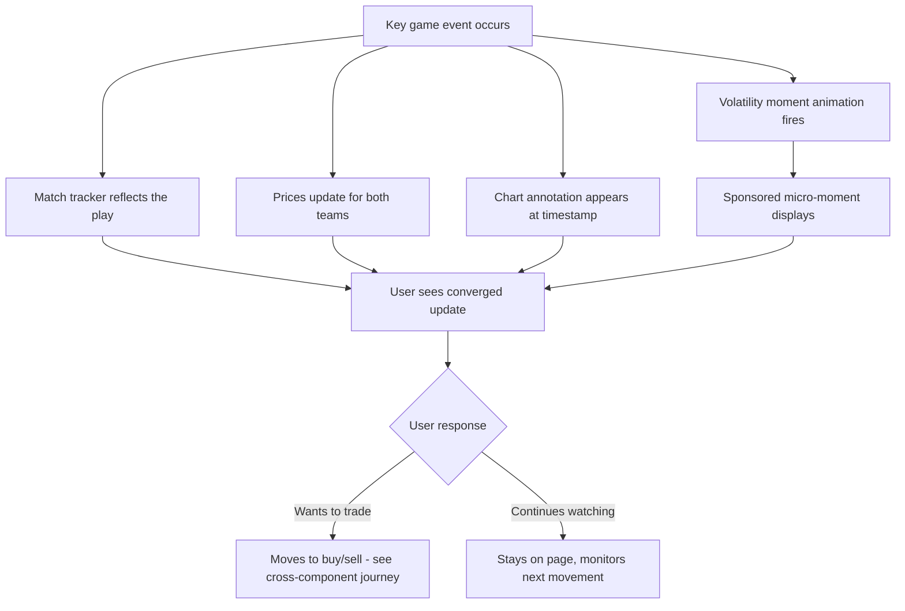
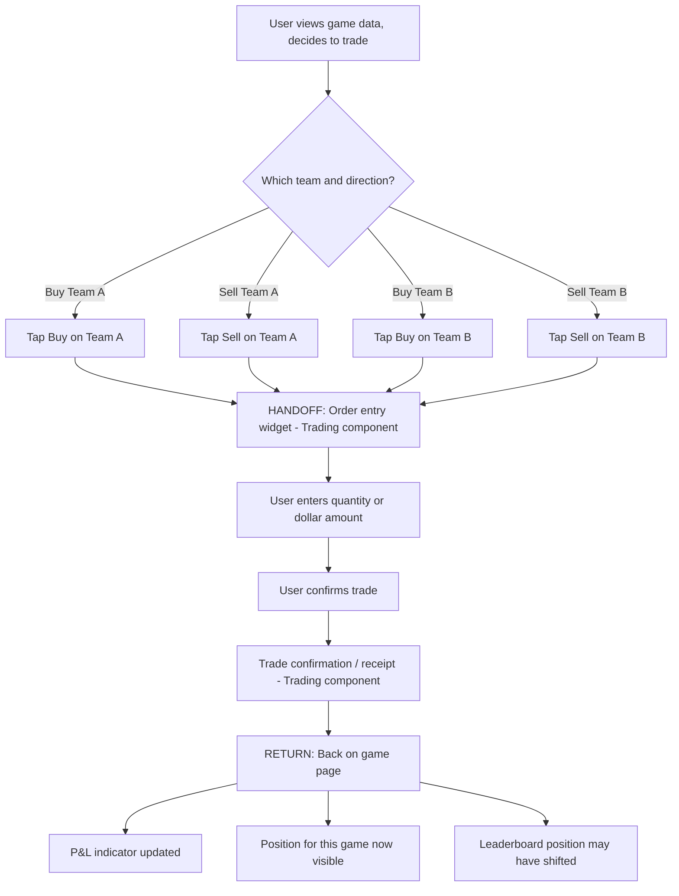

# InPlay Trading Challenge -- Single Game Page

> **Component:** [[information-layer]]
> **Date:** 2026-05-09
> **Updated:** 2026-07-20 — **Watch Mode (landscape)** added (§9): conceived 13-07, demoed 15-07, iterated 17-07 + 20-07 (scrollable graph stack + interlaced ads, team-selector ordering). Candidate sub-component — needs focused session. From [[13-07-2026-touchdown]] / [[15-07-2026-touchdown]] / [[17-07-2026-touchdown]] / [[20-07-2026-touchdown]]
> **Status:** Collecting
> **Owner:** George Westbrook
> **Sources:** _[[08-05-2026-component-1-simulation-app]], [[13-07-2026-touchdown]], [[15-07-2026-touchdown]], [[17-07-2026-touchdown]]_

---

## 1. What Does This Sub-Component Do?

**Functional purpose:**

The Single Game Page is the convergence point of the entire app -- where sports data, market data, and trading come together on a single screen for one specific matchup. This is where users spend the majority of their time during live games. It's the page a user lands on when they click into a game from Discovery or Game Day Overview.

The page shows two teams in a head-to-head matchup. Users can see the Sport Radar live match tracker (the game playing out visually), an annotated price chart (game events mapped to price movements), real-time game stats, and market data (bid/offer, order book depth). An embedded trading widget from the Trading component lets them buy or sell either team without leaving the page. A mini leaderboard widget shows their current position and gap to cashing. During live games, volatility moments (touchdowns, turnovers, injuries) trigger visual animations and sponsored micro-moments across the page.

The page exists in three states: pre-game (stats, weather, venue, matchup context), live (real-time everything), and post-game (final stats, results, chart review). It's also the primary surface for advertiser micro-moments -- sponsors own specific in-game events that trigger visual moments on this page.

**Entities that interact with it:**

- All three user personas (Young Aspiring Trader, Sports-Passionate Casual, Experienced Trader) -- all post-onboarding
- The Experienced Trader persona will spend the most time here and consume the most data (order book depth, chart annotations, market data)
- The Sports-Passionate Casual may use the match tracker as their primary way of following the game when broadcast isn't available

---

## 2. What Needs to Happen?

**Functional requirements:**

- User can view two teams in a head-to-head matchup with current stock prices and direction indicators for each
- User can view the Sport Radar live match tracker (embedded HTML5 widget) in pre-game, live, and post-game states
- User can view a price chart for this game's timeline, annotated with volatility moments (game events mapped to price movements)
- User can view real-time game stats and play-by-play data during live games
- User can view market data: current price, bid/offer, order book depth for both teams
- User can see their current positions in either team (if held) and unrealised P&L
- User can access buy/sell for either team without leaving the page (Trading component widget embedded)
- User can see their leaderboard position and gap to the nearest payout position (mini leaderboard widget)
- User can tap on a team name/logo to navigate to the Team Page for deeper research
- Volatility moments trigger visual animations and chart annotations in real time
- Sponsored micro-moments display during volatility events
- Page works across mobile and tablet (Sport Radar widgets are HTML5 responsive)

**Business rules:**

- Market data must update in real time during live games (SR pushes every 1-2 seconds)
- Language must use "earn" not "win" throughout
- Volatility moment animations must not obscure buy/sell buttons or critical pricing data
- Both teams in the matchup must be tradeable from this page (buy or sell either team)

**Edge cases:**

- What happens when SR data feed goes down during a live game? -> Show last known state with timestamp and "delayed" indicator
- What happens when T0 price feed is delayed? -> Disable buy/sell, show "trading paused" with explanation
- What if multiple volatility moments happen within seconds of each other? -> Group or stack annotations rather than overlapping
- What if the user is viewing a pre-game page and the game starts? -> Page should transition to live state automatically
- What if the user has no positions in either team? -> P&L section hidden or shows "no positions" rather than empty state

---

## 3. Entity Journeys

### 3a. Isolated Journeys

#### Journey 1: User views a live game

**Entity:** User (all personas)

**Input:** User clicks into a specific game from Discovery / Home or Game Day Overview

**Outcome:** User can see all relevant game and market data for this matchup and has enough context to decide whether to trade

**Steps:**

**Acceptance criteria:**

- [ ] Page loads within 2 seconds of selection
- [ ] Both teams visible with current stock prices and direction indicators (up/down arrow, percentage)
- [ ] Sport Radar live match tracker displays in correct state (pre/live/post)
- [ ] Price chart shows game timeline with annotated volatility moments
- [ ] Market data (bid, offer, last price) updates in real time during live games
- [ ] Mini leaderboard shows user's current rank and gap to nearest payout position
- [ ] User can distinguish which team they hold a position in (if any)
- [ ] Page transitions automatically from pre-game to live when the game starts

---

#### Journey 2: Volatility moment occurs during a live game

**Entity:** User

**Input:** A key game event happens (touchdown, turnover, injury) during a live game the user is watching

**Outcome:** User sees the moment reflected across the page -- price movement, chart annotation, visual animation -- and can quickly assess whether to act

**Steps:**

**Acceptance criteria:**

- [ ] Game events trigger visible annotations on the price chart within the SR data refresh window
- [ ] Volatility animation is noticeable but doesn't obscure buy/sell buttons or critical data
- [ ] Sponsored content during micro-moments feels integrated, not interruptive
- [ ] Prices for both teams update following the event
- [ ] User can see the magnitude of the price movement (not just direction)
- [ ] Previous volatility moments remain visible as annotations on the chart timeline
- [ ] 15-20 volatility moments per game on average (per Edwin/Cody estimate)

---

### 3b. Cross-Component Journeys

#### Journey 1: User executes a trade from the game page

**Entity:** User (all personas)

**Input:** User decides to buy or sell one of the two teams while viewing game data

**Handoff point:** User taps buy/sell -> Trading component's order entry widget opens. State passed: team selected, current price, game context. On return: updated P&L, updated position, potentially shifted leaderboard rank

**Components involved:** Information Layer (Single Game Page) -> Trading (Order Entry -> Confirmation) -> Information Layer (Single Game Page)

**Outcome:** User has executed a trade and returned to the game page with updated P&L and position

**Steps:**

**Acceptance criteria:**

- [ ] Buy/sell available for both teams in the matchup
- [ ] User can enter trade by dollar amount or share quantity (fractional shares supported)
- [ ] Order entry shows current bid/offer price and estimated cost/return
- [ ] After trade confirmation, user returns to the game page (not redirected elsewhere)
- [ ] P&L indicator updates immediately after trade execution
- [ ] Current positions for this game visible on the page after trading
- [ ] Mini leaderboard reflects any rank change from the trade

---

## 4. Look and Feel

**Design specifics:**

Data-dense but layered. The game page is the most information-rich screen in the app -- match tracker, price chart, market data, trading widget, leaderboard widget all coexist. On mobile this means vertical stacking with the most critical elements (match tracker, prices, buy/sell) visible without scrolling, and deeper data (full chart, order book, stats) accessible by scrolling down. Dark mode preferred for this screen specifically -- it's the "trading floor" experience.

**Reference products:**

- **Poly Market event page** -- clean layout with price, chart, and trade entry on one screen. Take: the density without clutter
- **FanDuel in-game view** -- match tracker with odds alongside. Take: the coexistence of game visualisation and trading data. Avoid: the information overload and internal ad banners
- **Bloomberg mobile** -- green/red directional arrows with percentage. Take: quick-glance price direction indicators

**UX principles specific to this sub-component:**

- Match tracker and buy/sell buttons must be visible without scrolling -- these are the two most-used elements during a live game
- Volatility moment animations must not obscure actionable elements (buy/sell, prices)
- Price chart annotations should be readable at mobile scale -- short labels ("TD Alabama", "INT") not full sentences
- The page must feel alive during a game -- real-time updates across multiple elements create the sense that "something is always happening" (Cody's point about subconscious engagement)

---

## 5. Data Requirements

| What | Direction | Description | Source / Destination |
|------|-----------|------------|---------------------|
| Live play-by-play events | In | Real-time game events (touchdowns, turnovers, injuries, drives). Updates every 1-2 seconds during live games | Sport Radar push API |
| Live match tracker widget | In | Embedded HTML5 visualisation of the game. Pre/live/post states | Sport Radar hosted solution |
| Win probabilities | In | Real-time probability calculations for both teams | Sport Radar |
| Game metadata | In | Teams, venue, weather, game time, status (pre/live/post) | Sport Radar |
| Current prices (bid/offer/last) | In | Real-time stock prices for both teams in this matchup | T0 ATS |
| Order book depth | In | Number of orders at each price level for both teams | T0 ATS |
| Price history for this game | In | Price movements since game start, for the chart timeline | T0 ATS |
| Volatility moment annotations | In | Cross-correlated data: which SR event mapped to which price movement, with timestamps | InPlay internal store |
| User's current positions | In | Whether the user holds shares in either team, quantity, average entry price | Trading component |
| User's P&L | In | Current unrealised P&L for positions in this game | Trading component |
| Leaderboard position | In | User's current rank, gap to payout, which vertical they're closest in | Leaderboard sub-component |
| Sponsored micro-moment content | In | Which advertiser owns this game/moment, creative assets | Advertising (cross-cutting) |

---

## 6. Dependencies

| Depends on | What we need | Blocking for build? |
|-----------|-------------|----------|
| Sport Radar | Live data feeds, match tracker widget, game metadata | Yes -- no SR, no game page |
| T0 ATS | Real-time prices, order book, price history | Yes -- no T0, no market data |
| Discovery / Home (sibling) | Navigation context -- which game was selected | No -- can load directly via deep link |
| Leaderboard (sibling) | User's current rank and proximity data for mini widget | No -- can mock or hide widget |
| Trading component | User positions, P&L, order entry widget | No -- can mock positions; order entry can be added later |
| Advertising (cross-cutting) | Sponsored content for micro-moments | No -- can run without ads initially |
| InPlay internal store | Cross-correlated volatility data for chart annotations | No -- chart works without annotations, just less rich |

**What siblings or other components need from this one:**

- Leaderboard needs to know which game the user is watching (for contextual ranking)
- Trading needs game context (which game, which team) when user initiates a trade
- Team Page may link back to this game page if a live game is in progress

---

## 7. Risks

**Specific risks:**

- SR data delay (30-40 seconds from real-world events) means users watching live TV see events before the app -- creates information asymmetry between users with and without broadcast access
- High-traffic moments (multiple touchdowns across games simultaneously) could cause T0 price feed latency or SR widget lag
- Mobile screen real estate is tight -- if too many elements compete for space, the experience becomes cluttered and unusable
- Chart annotations at mobile scale may be unreadable if too many volatility moments cluster in a short time window

**Controls to build into the journeys:**

- Data freshness indicator -- if data is delayed beyond acceptable threshold, show a "delayed" label so users don't trade on stale information
- Annotation density management -- if multiple events happen within seconds, group or stack annotations rather than overlapping
- Graceful degradation -- if SR feed drops, show last known state with timestamp; if T0 drops, disable buy/sell and show "trading paused"
- Performance budget -- page must remain responsive even with all real-time elements updating simultaneously

---

## 8. Priority

**Must-have at launch?** Yes -- this is the core screen. The entire product premise converges here.

**Sequencing rationale:** Build this first among the sub-components. It's the primary engagement surface, the most complex technically (multiple real-time data sources converging), and it drives design decisions for every other page. If this works, the rest follows. If this doesn't work, the product doesn't work.

---

## 9. Watch Mode (landscape) — added 13–17 Jul 2026

> ⚠️ **Candidate sub-component.** Watch Mode emerged and was built across three July standups. It's captured here because it lives on the Single Game Page surface, but it is substantial enough — own layout, own monetisation debate, own ad inventory — to warrant a focused session and possibly its own sub-component doc.

**What it is:** a full-screen **landscape** mode (user rotates the phone) combining on one screen: the **Gamecast** (a custom-built 3D stadium visualisation — plays, gains/losses, ball position, live event pop-ups), the **win-probability chart**, the **live share-price chart** for both teams, and **trade execution**. Edwin's founding ask (13-07): _"see the win probability, the game cast, and the share price all in one look-see"_ — so that when a play moves the probability, the user immediately checks what it did to the price and trades on it. Edwin (15-07): _"90–95% of my time would be right here"_ — the working assumption is this is where users live during live games.

**Timeline:**

- **13-07 — conceived.** Edwin asked for the single-screen view; George proposed the landscape "watch mode": left side fixed Gamecast with an event stepper, right side probability + price chart with trade access (possibly swipeable to further graph views, each carrying an ad unit).
- **15-07 — demoed.** The 3D stadium Gamecast is **fully custom-built — no Sport Radar match-tracker module** ("this is all completely custom"). Cody confirmed the IP consequence on the spot: **white-label / resale potential** to partners (Hard Rock explicitly in mind). Strongest reaction of any feature demo to date ("this is the only way you're going to use this app now" — Edwin; "we're charging for this, guys" — Cody).
- **17-07 — iterated.** Feedback decisions below.
- **20-07 — iterated again.** Scrollable graph column + ad density, team-selector ordering — see the 20-07 block below.

**Monetisation debate (15-07, unresolved — logged in [[open-questions]]):**

- Cody: gate it — "if you want the watch feature, it's another **$4.99 a month**."
- Kevin: free window (~5 minutes) then paywall; Troy: **first day free**, then subscribe; Jared agrees free-first — "nobody's going to pay for this unless they experience it first."
- Troy's caveat: **premium payers expect no/fewer ads** — a direct conflict with this being the top ad surface (~720 impressions/game target).
- Edwin **parked payment for iteration 1**: prove the CPM/engagement model first — "getting five bucks a month from 50,000 people is juicy, but it doesn't validate our premise, which is we're trying to monetize engagement." Jared's pay-to-remove-ads model was also rejected for launch (the ad inventory's perceived value must build first).

**Design / iteration decisions (17-07):**

- **Kill the slider** for stepping through volatility moments — it sits so close to the screen edge it fights the OS close-app gesture (Cody's "fat thumb" report: 9 times out of 10 it drags the whole app); keep the one-at-a-time click-through buttons. Decided — Edwin: "I would lose the slider."
- **Add position/P&L context on-screen:** net position for this game (long/short which team), per-game P&L, and a global/day P&L — Edwin wants all three visible while trading; unused screen real estate identified next to the trade button and above the field.
- **Trade sheet must swipe between both teams** in the matchup — it currently locks to whichever team was selected (Cody). The portrait trade layout also renders in landscape and needs a landscape redesign.
- **Event scrubbing:** stepping through events drives both the Gamecast and the price-chart position (candles per team, "what happened" annotations on expand). Expandable event cards (click a play to expand) have spare space earmarked as **direct-sale ad placements**; George's alternative — infinite scroll with ad units between stacked panels — was cooled on by Edwin in favour of field-overlay placement.
- **Ad surfaces:** transparent **field-overlay logo** (Red Bull style); **30s videos inside the field outline during known stoppages only** (pre-game, quarter breaks, halftime — never during live play); presented-by lockups on the probability/price charts. See the Advertising update in [[components/components]].
- **Known bugs:** field lettering/direction mirrored (MIA reversed — 15-07); scrub slider unreliable (now being removed).

**Iteration decisions (20-07):**

- **Right-hand column is now a scrollable graph stack with interlaced ad units** — multiple graphs/components scroll vertically on the right side (thumb-reach side while holding landscape), with ads between them plus an ad unit on the left side. Ad maths: two static graphs left ~1 ad position; ~6 scrollable graphs give **6–8 ad positions**. Edwin said on the last call he did **not** want the scroll — Cody/Troy want to show him anyway ("fast enough… not overwhelming"; "gives you more positions"). Not yet decided what else goes in the stack (no open-positions/P&L widget yet — pre-trading-integration).
- **Team-selector ordering (applies on other pages too):** the two teams **playing** first → the user's **favourite teams** → alphabetical (league-grouping considered: if an NFL game, NFL teams before NCAA). Working assumption: beyond playing+favourites, users **search** rather than swipe through ~130 teams (Cody: "four to five swipes before… I'm just gonna type it in").
- **Trade sheet team scroll-through built** — the 17-07 "must swipe between both teams" item has landed; you can now scroll through teams in the trade sheet.
- **Feedback loop starting:** interns from the target demographic begin structured app reviews this week (Troy).
- **IAB conformance re-confirmed:** modern IAB standards are aspect-ratio-based, not fixed pixel dims — units scale as long as proportions hold (double-check pending); Brett sceptical mobile tower banners exist — to be tested with real ad units soon.

(Source: standup 2026-07-20)

**Dependencies / sequencing:** the visual shell currently runs on placeholder data. The real unlock is mapping **T0 price history + SR events + win probability onto the same timeline** — blocked on trading integration (T0 QA environment + load testing first, then real data piped in). This is also what powers the Research Tab's cross-correlation reports.

**Gamecast feed-source clarified (24-07):** the custom Gamecast runs on InPlay's licensed **Sport Radar media data feeds** (fetch pre-event history, then stream live events). The faster SR **betting feed** (which powers the licensed "ugly" match tracker) is **not accessible** to InPlay because it is not a licensed sports book. Decision: prioritise the **fastest feed available** so the visual and pricing signal stay TV-competitive; the real-world-to-delivery **delta is uncontrollable** (whenever SR sends). Full feed/probabilities detail in [[integrations]]; MM probability consumption in [[market-maker/market-maker]]. (Source: [[24-07-2026-touchdown]])

_This section answers Open Question 3 below (landscape rotation): yes — Watch Mode is the landscape experience._

(Source: standups 2026-07-13 / 2026-07-15 / 2026-07-17)

---

## Sub-Sub-Components

Leaf node -- no further decomposition needed. The page has multiple elements (match tracker, chart, market data, trading widget, leaderboard widget) but they all share state and render on the same screen. _(13–17 Jul: **Watch Mode** (§9) strains this — flagged as a candidate sub-component pending a focused session.)_

---

## Open Questions

1. How much order book depth to show on mobile? Full book or just top of book (best bid/best offer)?
2. Layout: how do match tracker, chart, stats, and trading widget coexist on a single mobile screen? Scrollable sections, tabs, or collapsible panels?
3. Does the match tracker go full-screen on landscape rotation? — **Answered (13–17 Jul): yes — Watch Mode, see §9.**
4. The SR data delay is 30-40 seconds from real-world events. Is that acceptable, or do we need a visible disclaimer?
5. Should the page show a count of how many other users are viewing this game? (social proof / activity indicator)
