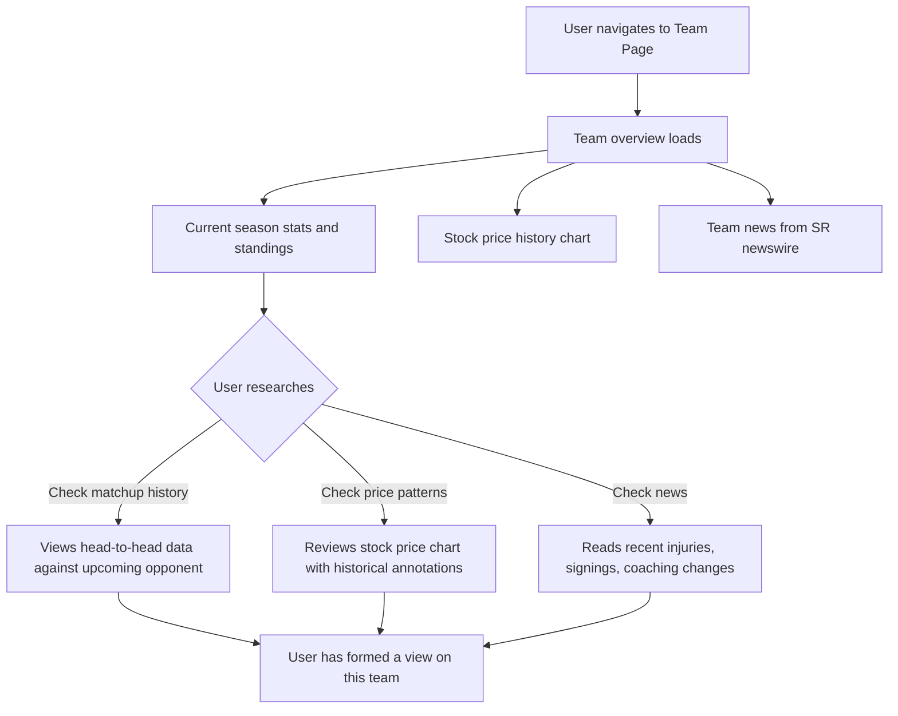
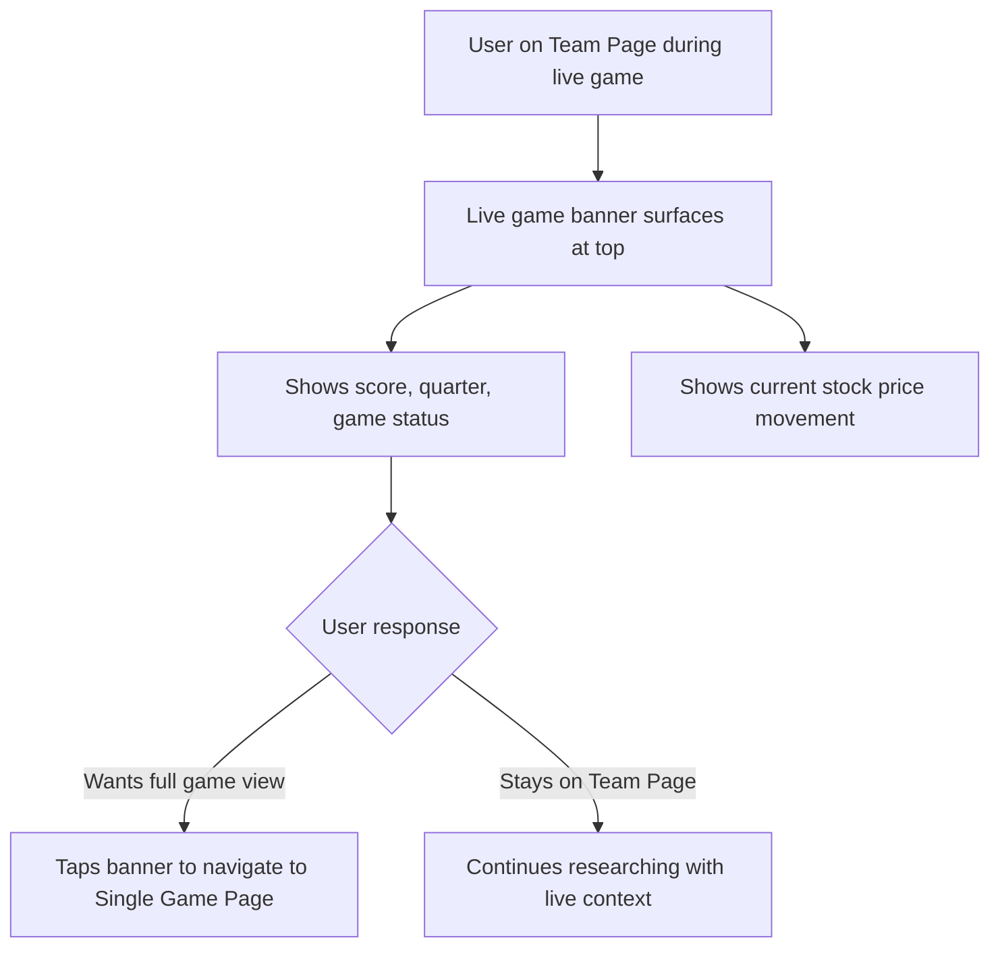
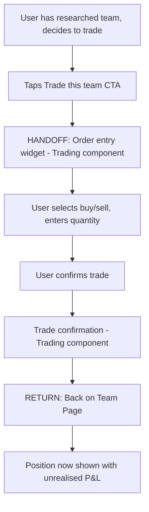

# InPlay Trading Challenge -- Team Page

> **Component:** [[information-layer]]
> **Date:** 2026-05-09
> **Status:** Collecting
> **Owner:** George Westbrook
> **Sources:** _[[08-05-2026-component-1-simulation-app]]_

---

## 1. What Does This Sub-Component Do?

**Functional purpose:**

The Team Page is the persistent profile for a single team -- it exists whether or not the team is currently playing. It's where users go for deeper research: historical performance, season stats, head-to-head matchup data, and the team's stock price history over time. When the team has a live game, the page is enriched with real-time data and links through to the Single Game Page.

This is the research layer of the Information component. The Sports-Passionate Casual comes here because they know football and want to confirm their instincts with data. The Experienced Trader comes here to study historical volatility patterns and understand how this team's stock price has moved in past games. The Young Aspiring Trader may come here to learn about a team they're considering trading.

The Team Page also hosts team-specific news (injuries, signings, coaching changes from the SR newswire) and a "Trade this team" CTA that links to order entry.

**Entities that interact with it:**

- All three user personas -- post-onboarding
- The Experienced Trader spends the most time here -- this is their research desk
- The Sports-Passionate Casual uses this to validate sports knowledge with data
- The Young Aspiring Trader may browse team pages to learn about teams before committing to a trade

---

## 2. What Needs to Happen?

**Functional requirements:**

- User can view a team's historical performance data (10-15 years from Sport Radar)
- User can view current season stats and standings
- User can view head-to-head matchup data against other teams
- User can view the team's stock price history over time (chart)
- User can view team-relevant news from the SR newswire (injuries, signings, coaching changes)
- User can see the team's current stock price, bid/offer, and direction indicator
- User can see whether they hold a position in this team (and P&L if so)
- User can initiate a trade on this team via a "Trade this team" CTA
- When the team has a live game, the page surfaces live data: score, match status, link to Single Game Page
- User can view upcoming schedule for this team

**Business rules:**

- Historical data display defaults to current season; deeper history accessible but not front-loaded
- News feed shows only team-relevant items, not the full league newswire
- Stock price chart should show the same annotation style as the Single Game Page chart (volatility moments) for historical games

**Edge cases:**

- Team has a bye week -- what's shown? Upcoming schedule, historical data, no live elements
- Off-season -- page still exists but with no active trading context. What's the value prop?
- Team hasn't played yet this season (pre-season) -- stock price history starts from IPO price only

---

## 3. Entity Journeys

### 3a. Isolated Journeys

#### Journey 1: User researches a team before trading

**Entity:** User (Experienced Trader, Sports-Passionate Casual)

**Input:** User navigates to a Team Page (from search, from Discovery game card tap on team name, or from Single Game Page)

**Outcome:** User has enough context about this team's performance and price history to make a trading decision

**Steps:**

**Acceptance criteria:**

- [ ] Team overview loads within 2 seconds
- [ ] Current season record, standings, and key stats displayed prominently
- [ ] Stock price history chart shows price over time with annotated volatility moments from past games
- [ ] Head-to-head matchup data available for any opponent
- [ ] News feed shows team-relevant items only, most recent first
- [ ] Current stock price, bid/offer, and direction indicator visible at the top
- [ ] If user holds a position in this team, it's shown with unrealised P&L

---

#### Journey 2: User checks a team during a live game

**Entity:** User

**Input:** User is on the Team Page and the team is currently playing

**Outcome:** User can see live game context and decide whether to jump to the Single Game Page

**Steps:**

**Acceptance criteria:**

- [ ] When the team has a live game, a prominent banner or card surfaces at the top of the Team Page
- [ ] Live banner shows current score, quarter/period, and stock price movement
- [ ] Tapping the banner navigates to the Single Game Page for that matchup
- [ ] Team Page continues to show historical and research data below the live banner
- [ ] If no live game, the banner doesn't appear (no empty state)

---

### 3b. Cross-Component Journeys

#### Journey 1: User trades a team from the Team Page

**Entity:** User (all personas)

**Input:** User has researched a team and wants to buy or sell

**Handoff point:** User taps "Trade this team" CTA -> order entry widget opens (Trading component). State passed: team selected, current price. On return: Team Page shows updated position and P&L

**Components involved:** Information Layer (Team Page) -> Trading (Order Entry -> Confirmation) -> Information Layer (Team Page)

**Outcome:** User has executed a trade on this team and returned to the Team Page with updated position data

**Steps:**

**Acceptance criteria:**

- [ ] "Trade this team" CTA is visible and accessible without scrolling
- [ ] Order entry pre-fills the team (user doesn't re-select)
- [ ] After confirmation, user returns to Team Page (not redirected)
- [ ] Team Page now shows the user's position in this team with P&L
- [ ] If user already held a position, updated position reflects the new trade

---

## 4. Look and Feel

**Design specifics:**

The Team Page should feel like a research dashboard -- more data-dense than Discovery but less real-time-focused than the Single Game Page. The stock price chart is the centrepiece, with stats and news supporting it. The layout should allow scanning: key stats at the top, chart in the middle, news and matchup data below.

When a live game is in progress, the page should feel energised at the top (live banner) but remain calm below (research content doesn't change based on live events).

**Reference products:**

- **Yahoo Finance stock page** -- price chart with key stats, news feed, historical data tabs. Take: the layout structure (chart + stats + news)
- **ESPN team page** -- schedule, standings, roster, news. Take: the breadth of team context. Avoid: the ad-heavy layout

**UX principles specific to this sub-component:**

- The stock price chart is the centrepiece -- it should be the largest element on the page
- Historical data should default to current season, with the ability to zoom out to longer timeframes
- News should feel fresh and relevant, not a data dump -- most recent first, team-relevant only
- "Trade this team" CTA should be persistent (sticky or always visible) since the whole point of research is to inform a trade

---

## 5. Data Requirements

| What | Direction | Description | Source / Destination |
|------|-----------|------------|---------------------|
| Team profile data | In | Name, logo, league, conference, division | Sport Radar / InPlay internal |
| Current season stats | In | Win/loss record, standings, key performance metrics | Sport Radar |
| Historical performance | In | 10-15 years of team stats, season records, notable results | Sport Radar REST API |
| Head-to-head matchup data | In | Historical results and stats against specific opponents | Sport Radar |
| Stock price history | In | Price over time since IPO, with annotated volatility moments for past games | tZERO ATS + InPlay internal (annotations) |
| Current stock price | In | Bid/offer/last, direction indicator | tZERO ATS |
| Team news | In | Injuries, signings, coaching changes, AP-style editorial | Sport Radar newswire (filtered to this team) |
| Upcoming schedule | In | Next games, dates, opponents | Sport Radar |
| Live game data (when applicable) | In | Score, quarter, game status for current game | Sport Radar |
| User's position in this team | In | Whether user holds shares, quantity, average entry, unrealised P&L | Trading component |

---

## 6. Dependencies

| Depends on | What we need | Blocking for build? |
|-----------|-------------|----------|
| Sport Radar | Team stats, historical data, matchup data, news, schedule, live game data | Yes -- no SR, no team page |
| tZERO ATS | Stock price history and current price | Yes -- no tZERO, no price chart |
| Trading component | User's position in this team | No -- page works without position data |
| InPlay internal store | Historical volatility annotations for past games | No -- chart works without annotations |
| Single Game Page (sibling) | Navigation target when user taps live game banner | No -- can stub |

**What siblings or other components need from this one:**

- Single Game Page may link back here (user taps team name/logo on game page)
- Discovery may deep-link here from search results

---

## 7. Risks

**Specific risks:**

- 10-15 years of historical data is a lot -- page could be slow if all data is loaded upfront
- Off-season the page has limited value since there's no active trading context -- risk of feeling dead
- News feed could feel stale if the team has no recent news items
- Player-level data not yet scoped -- users may expect it (especially Sports-Passionate Casual)

**Controls to build into the journeys:**

- Lazy-load historical data -- show current season by default, load deeper history on demand
- Off-season: surface the stock's IPO price, pre-season projections, historical comparisons to maintain relevance
- News feed: if no recent team-specific news, consider surfacing league-level news relevant to this team's conference/division
- Player data: flag as a gap for next call rather than guessing at scope

---

## 8. Priority

**Must-have at launch?** Yes -- users need team-level research to make informed trades. Without it, trading decisions are uninformed.

**Sequencing rationale:** Can be built in parallel with Single Game Page. Less complex technically (mostly read-only data display from SR and tZERO) but shares the same data integrations. The live game enrichment can be added after the base page is functional.

---

## Update (24-07-2026): Analyst Prices swipeable page

> Source: [[24-07-2026-touchdown]]. New surface requested by Edwin; sample due Monday (from Edwin).

- Edwin wants **one more swipeable page** on the team surface: alongside the existing schedule/details swipe, add an **"analyst prices"** page showing **guest analysts' prices** for that team, one analyst per view.
- Model: recruit **4–5 guest analysts** who publish prices in exchange for a **distribution forum** in-app; InPlay hosts one house view plus guest views. First target is **Preferred Walk-Ons** (a college-football creator group, ~200k social base, ~2 months independent after splitting from **PFF**), providing an **NCAA analyst piece**; Cody + Kevin still sourcing an **NFL** equivalent. They can start quickly.
- **Open build questions (George):** where do analysts **upload** each week, how does InPlay **consume**, **serve**, and **label/attribute** that data. The weekly ingestion pipeline is undefined.
- Cody will send **subscription packages + pricing** to George since this content is tied to the paid/research offering. **Pricing and the research/subscription module are owned separately** (see [[information-layer/sub-components/research-tab/research-tab]]); this page's product mechanic is captured here, the monetisation is not.

## Sub-Sub-Components

Leaf node -- no further decomposition needed.

---

## Open Questions

1. Does the Team Page include player-level data (roster, individual stats), or only team-level?
2. How deep does the historical data go in the default view? Current season, last 3 seasons, all time?
3. Does the page show other users' trading activity on this team (e.g., "most traded team today", volume indicators)?
4. Stock price chart: should it show the same annotation style as the Single Game Page for historical games?
5. Off-season content: what's the value prop of a Team Page when no games are being played?

> ### ⚠ Update (28-08-2026, _[[28-08-2026-touchdown]]_): team reference data is wrong in at least a dozen places
>
> Jared's review found errors across conference, colour and abbreviation, with
> more to come: _"there's probably 15 others."_
>
> | Team | Currently shows | Should be |
> |---|---|---|
> | Notre Dame | In the **ACC** | **Independent** |
> | Louisiana Tech | Colour **red** | **Blue** |
> | UConn | `UCN` | **`CONN`** |
> | Charlotte | `CHAR` | **`CLT`** |
>
> George's response: the **names** came through in the last data update, the
> **colours** did not, and he will re-run it. Text updates are straightforward.
>
> ⚠ **Small individually, and worth taking seriously anyway.** This is the
> reference data on the surfaces users see, and it was found the day before the
> first live college games by someone who follows the sport. An audience that
> knows Notre Dame is independent will notice, and getting a team's own colour
> wrong undermines confidence in the prices sitting next to it. **A full sweep of
> all 138 NCAA teams is worth doing rather than fixing the four that were
> reported.**
