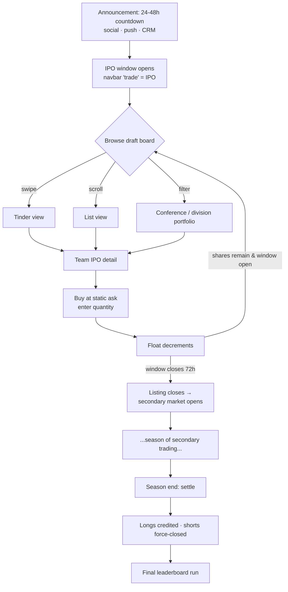
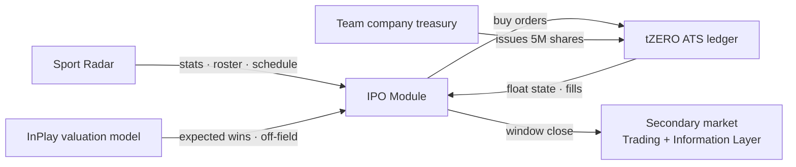
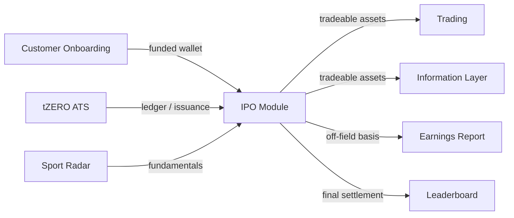

# InPlay Trading Challenge: IPO Module

> **Vision:** [[vision]]
> **Audiences:** [[audiences]]
> **Date:** 2026-05-26
> **Status:** Defined
> **Owner:** Edwin (client-facing: IPO mechanics owner) + George (engineering) + Troy (tZERO / on-chain ledger)
> **Updated:** 2026-07-17: scope confirmed (all ~138 D1 schools), market-maker warehousing resolves unsold-share handling, timeline pinned (IPO deadline ~Aug 22, secondary trading Aug 29). From [[15-07-2026-touchdown]] / [[17-07-2026-touchdown]]
> **Updated:** 2026-07-29, Edwin delivered the **IPO pricing model v1.0** with listed prices for all 32 NFL + 138 NCAA team companies. Captured in [[ipo-pricing-2026]] (source workbook safe-copied to `sources/`).
> **Pricing (authoritative):** [[ipo-pricing-2026]] holds the latest listed IPO prices, parameters, and methodology.
> **Updated:** 2026-08-10: **primary market structure settled** (broker-dealer MPID holds and sells 1,000,000 shares/team; the taker buys ≥600,000 of them). NCAA window 5 days, NFL 2 days, load-balancing algo dropped. Prices publish early and **freeze 3 days pre-IPO**. Language is now **"simulated IPO"** by legal instruction. From [[31-07-2026-touchdown]] / [[03-08-2026-touchdown]] / [[07-08-2026-touchdown]].
> **Sources:** _[[meetings/26-05-2026-component-IPO-touchdown]], [[06-05-2026-vision-workshop]], [[meetings/15-07-2026-touchdown]], [[meetings/17-07-2026-touchdown]], [[ipo-pricing-2026]]_

---


## Shares remaining: reversed on 19-08, and now without a source

> Source: [[19-08-2026-touchdown-requirements-review]]

Edwin's instruction had been that **shares remaining stays hidden until near the
close**. On 19 August he reversed it: buyers should see remaining availability,
his example being 500,000 left of 1,000,000.

⚠ **The number no longer has an obvious source.** The offering became
venue-backed the same day: an IPO buy is a real venue order resting against the
market maker's ask, and the database float's sold-out and remaining counters were
deliberately stopped from gating those buys, because the maker's book is the
inventory and the float describes something nothing draws from.

Two honest options, and this needs a ruling rather than a UI guess:

1. **Derive it from the venue side**, so the number means what it says.
2. **Keep the float in step deliberately**, accepting that it is a mirror rather
   than the source of truth, and that it can drift.

Until one is chosen, any counter shown to a user is decorative.

## The rehearsal method (19-08)

The maker is **turned off**, shares are allocated, sell orders are created, and
the offering is verified inside the app while Edwin buys from the admin panel as
the taker. What it proves: the IPO card appears, shares can be bought,
**selling is blocked**, and the allocation figures move. Framed as preparation
for the NFL offering rather than only the NCAA one.

## 1. What Does This Component Do?

**Functional purpose:**

The IPO Module is how every tradeable asset in the InPlay universe **comes into existence**. Before any team stock can be traded on the secondary market, it must be issued to the user base through a primary offering, branded in-product as the **"Trading Challenge Draft."** This is the bookend event that opens each season: 32 NFL team companies and ~131 NCAA team companies each float a fixed block of shares at a set price, users buy in during a fixed window, and at the end of that window the assets graduate into the live secondary market (the Information Layer + Trading components) where two-sided price discovery takes over.

The user experience is deliberately simple and high-energy. The IPO is announced across every channel (in-app, social, push, CRM) with a countdown, Skye: _"24, 48 hours ahead of time to notify them that the days that the IPOs will be happening."_ When the window opens, the app's primary "trade" navigation slot transforms **into** the IPO experience, there is no trading button before this point, because there is nothing to trade. The user lands on a **draft board** of all available team companies, each showing a forward-looking price and how many shares are left. They browse, either swiping through teams Tinder-style, scrolling a list, or filtering by conference (NCAA) / division (NFL) to assemble a portfolio, drill into a team to assess expected wins, last-season form, and key roster changes, and then **buy**. Critically, during the IPO there is **only a buy action**, no selling, no two-sided market. InPlay (acting through each team company's treasury as issuer) is the sole seller. Buyers cross a single static ask price and take shares out of the float until it is exhausted or the window closes.

The forward-looking IPO price is the seed of the whole market. It is built from **on-field value** (projected wins × value-per-win) plus **off-field value** (a marketing/engagement-driven revenue allocation). This off-field figure is what later flows through the **Earnings Report** (see [[components/earnings-report/earnings-report|Earnings Report]], documented separately) as a recurring tradable event, making the IPO price not a one-off number but the opening level of a season-long valuation story.

The component also owns the **other** bookend: season-end settlement. When a season concludes, the IPO Module's liquidation logic closes the book, crediting long holders the cash value of their shares, force-closing shorts at the settlement price, and triggering the final leaderboard run. IPO opens the asset's life; liquidation ends it.

```
IPO Module ("Trading Challenge Draft")
├── Draft Board / Listings
│   ├── Tinder-swipe view
│   ├── List view (price · team · shares remaining)
│   └── Filter by conference (NCAA) / division (NFL), portfolio view
├── Team IPO Detail
│   ├── Expected wins → expected on-field value
│   ├── Off-field value (marketing allocation)
│   ├── Last-season stats (per game)
│   ├── Key additions / departures (free agency, draft, retirements)
│   └── Schedule
├── Primary Offering Execution
│   ├── Static ask price (no bid, does not move)
│   ├── Buy-only (no sell during IPO)
│   ├── Quantity entry → float decrements
│   └── No per-user cap · 20% float held back for shorting
├── IPO Scheduling & Windows
│   ├── 72-hour window per league
│   ├── NCAA all-at-once (~Aug 20)
│   └── NFL all-at-once (~7 days before Sept 9)
├── Announcement & Countdown
│   ├── 24–48h pre-alerts (social · push · CRM)
│   └── Go-live notification
└── Season-End Settlement / Liquidation
    ├── Longs credited (shares × settlement price)
    ├── Shorts force-closed (debited difference)
    └── Final leaderboard run
```

> ### ⚠ Update (31-07 / 03-08 touchdowns): the primary's market structure is settled
>
> Several things above are now superseded. The mechanics live here; the
> market-maker side is in [[market-maker/decisions]] (27-07 → 07-08 block).
>
> **Two entities, two MPIDs, two wallets** (Troy):
> - **InPlay Markets, the broker dealer**: client-facing. Holds the **entire
>   primary issuance** and posts it for sale. tZERO preloads **1,000,000 shares
>   per team company** plus effectively unlimited buying power, so there are no
>   rejects. Troy's analogy: the designated market maker on the NYSE holding
>   shares to be sold to the public. **This is the seller**, standing in for
>   each team company as issuer.
> - **InPlay Markets, the principal trading arm**: non-client-facing, runs the
>   maker and taker algos off one wallet. Buys in the primary; makes and takes
>   in secondary.
>
> Edwin's framing, cutting George off mid-sentence: _"the market maker is not
> going to open up and sell."_ The first sale is always the company raising the
> money, via the broker dealer.
>
> **Issuance: 1,000,000 shares per team, both leagues.** Edwin overrode the
> earlier 900k NFL / 1M NCAA split: _"we're going to make it a million on both
> and then we're just not going to sell all of them."_ ⚠ Supersedes the **5M
> float** and **20% short holdback** figures above. A **treasury holdback**
> retains the unsold remainder, exactly as in production: float and public
> offering are two different numbers, modelled against a ~**$75M** cap.
>
> **Windows: NCAA five days, all teams at once. NFL two days.** ⚠ Supersedes
> the 72-hour window above. The **load-balancing algo is dropped** for season 1
>: one application for both leagues, deferred to the **NBA in October**.
>
> **The taker is the biggest buyer of every IPO**, targeting **≥600,000 of the
> 1,000,000** shares per team, with randomised size and randomised heartbeat
> inside Edwin-supplied ranges and time blocks. Deliberately **not**
> participation-weighted in v1: George asked whether a heavily traded team
> should get more bought for liquidity, and Edwin said no, keep it simple.
> Rebalancing happens afterwards through **market operations once secondary
> opens**, itself intended as a tradeable information event.
>
> The reason is failure avoidance, not liquidity optimisation. Edwin, 03-08,
> with signups at ~118: _"we need to have something that comes in and buys
> during the IPO. Otherwise, there'll be teams that don't sell any shares
> whatsoever at an IPO. A complete failure of the IPO. We cannot have that for
> the simulation."_
>
> _Sources: [[31-07-2026-touchdown]], [[03-08-2026-touchdown]]._

> ### Update (31-07): price publication, the 3-day freeze, and pre-IPO demand
>
> **The problem.** tZERO make a team's price **static once the IPO price is
> set**: there is a lock on it: which blocks the simulated trading the team
> needs to run before launch. So prices could not simply be published early.
>
> **The resolution (Edwin).** Publish the prices now via an **OTA push**, and
> **freeze only three days before the IPO**. The gap matters: _"from now until
> IPO, you could have a lot of roster changes. Kids could get arrested and
> banned and hurt and coaches get fired. All kinds of s\*\*\* can go down, which
> would materially affect that stock price."_ Confirming tZERO can hold prices
> unlocked until then is an open item (T14 in
> [[market-maker/open-questions]]).
>
> Context: prices had not been published yet because the team wants to **pull
> them from tZERO** rather than hard-code the numbers, which is what triggered
> the lock problem.
>
> **New want: pre-IPO indication of interest.** Edwin wants users able to
> queue orders **before the window opens**: _"they can pre[-order], say oh I
> want to buy a 100 shares of X and they can hit a button, and then we can start
> to develop… oh, 48,000 shares already looking to be bought of Chicago
> Bears."_ Surfaced as a **shares-remaining / shares-spoken-for bar**, so a
> million-share issuance with 500,000 spoken for visibly has 500,000 left. The
> **market maker can pre-place IPO buy orders** into the same queue.
>
> The motivation is engagement, not price discovery: there is nothing to do in
> the app right now beyond news and research, and Edwin wants something
> trading-shaped for users and for sales demos. _"Anything to do with trading
> that's going to get their mindset focused on that, that would be helpful."_
> George took it away to scope. Touches
> [[ipo-module/sub-components/announcement-countdown/announcement-countdown|Announcement & Countdown]]
> and
> [[ipo-module/sub-components/draft-board/draft-board|Draft Board]].
>
> _Source: [[31-07-2026-touchdown]]._

> ### Update (17-08): the offering page, deliberately thin
>
> Five days out, Edwin reduced the requirement to its simplest form: a page per
> team showing **the shares available and a buy control, and nothing else.** His
> words: _"the IPO has to just be an offer, where there's a million shares
> available and that's it. It's just selling. Because you can't sell them, you
> can only buy them."_
>
> **The sell control during the offering.** George offered two options, remove it
> or show it locked with a popup explaining that selling begins when the secondary
> market opens. Edwin chose the second, for a reason worth recording: _"I don't
> want to get a bunch of calls. Out of this 150 people, a hundred are friends and
> family. I'm going to be getting calls from Kevin's uncle saying I can't sell my
> shares."_ Explaining a constraint in place is cheaper than fielding the
> confusion it causes.
>
> **Edwin will manually buy the majority of each team's shares** at the offering,
> with the secondary market opening the following weekend. That confirms the
> desktop execution interface below is not a convenience: it is how the offering
> gets absorbed at all.
>
> _Source: [[17-08-2026-touchdown]]._

> ### Update (12-08): Edwin needs a desktop execution interface for the offering
>
> A requirement that had not surfaced before, and it is dated. Edwin has to
> place orders across **170 team companies** during the offering, and the only
> route today is the phone app: _"logging in and out of 170 teams on the phone
> is going to be cumbersome."_ He wants **something he can click many times with
> a mouse**.
>
> George's read is that this is configuration rather than a new build, because
> it runs on exactly the same infrastructure as the app, with the likely
> wrinkles being journal-related. It attaches to the market-maker admin panel
> that Edwin is already getting a login to.
>
> **Needed before the offering opens on 22 August, with a couple of test orders
> put through first** so it is not being used for the first time on the day.
>
> _Source: [[12-08-2026-touchdown]]._

> ### ⚠ Update (07-08): mandatory language change
>
> Legal has ruled on how the offering may be described. **Always "simulated
> IPO", never a bare "IPO"**, and **nothing may claim SEC regulation**: _"all
> that has to come down"_ (Edwin). Kevin is credited with the phrasing. The
> route through is **Rule 255** testing-the-waters, which requires prescribed
> disclosures ahead of time; a Regulation A disclaimer is now in the app.
>
> This applies to every surface that names the event: this component, the app,
> the website and all outbound copy. Rules and reasoning in
> [[compliance/regulatory-positioning]]. _Source: [[07-08-2026-touchdown]]._

**Personas:**

| Persona | How they use this component | What they need from it |
|---------|---------------------------|----------------------|
| **Crypto-Savvy Sports Trader** (Early Adopter) | Treats the IPO like a token launch, wants to get into the float early at the static price before secondary-market discovery moves it. Watches the 72h window closely | Clear shares-remaining counter, a fast buy flow, transparency on float size (5M) and the 20% short holdback |
| **Analytical Fan / Armchair GM** (Broad Target) | Uses the detail page to value teams off roster knowledge, keys on **additions/departures** and schedule more than price. Builds a conviction portfolio | Key roster changes, last-season per-game stats, schedule, expected-wins basis for the price |
| **Finance-Curious Student** (Campus Buzz) | Most likely to use the **Tinder-swipe** browse and conference filters (loads "all the SEC teams"). Learning to value an asset for the first time | Low-friction, visual browse; an obvious "why is this priced at $40?" explanation (expected wins) |
| **Veteran Trader-Bettor** (Hands-On Operator) | Thinks in float, holdback, and exit liquidity. May load up a single team (no cap) and plans secondary-market shorting against the 20% holdback | No purchase limits, precise float/holdback mechanics, the schedule to time entries against game volatility |

---

## 2. What Needs to Happen?

**Functional requirements:**

- User can see a **draft board** listing every team company available to IPO, each with: current IPO price, expected wins, and shares remaining out of the float.
- User can browse the board in **multiple modes**: a Tinder-style swipe, a scrollable list, and a **filtered/portfolio view** by NCAA conference or NFL division (e.g. "show me all NFC North").
- User can open a **team IPO detail page** showing expected wins (and the derived expected value), off-field value basis, last-season per-game stats, **key additions/departures**, and the team's schedule.
- User can **buy** shares at the static ask price by entering a quantity; the system matches the buy against the float and decrements remaining shares in real time.
- There is **no sell/trade action during the IPO**, the only action is buy. (Edwin: _"if it's possible to make it just a buy button."_)
- There are **three entry routes to buy**: the trade button (which during this phase routes to the IPO), the draft-board listing, and the team page.
- The app surfaces a **countdown** to IPO open and a **go-live** state; the navbar's "trade" slot becomes the IPO experience until trading opens.
- At the close of the 72h window the listing **closes** and the asset moves to the **secondary market** (handover to Trading / Information Layer).
- At **season end**, the system credits longs (shares × settlement price), **force-closes shorts** (debiting the difference between short price and settlement), and runs a **final leaderboard**.



**Business rules and constraints:**

- **Fixed float:** every team company issues exactly **5,000,000 shares** for this iteration.
- **Static single-sided price:** the IPO lists an **ask only**; the price does **not** move during the window. InPlay/the team treasury is the only seller.
- **Buy-only:** no selling or short-selling during the IPO window. Two-sided market begins only on the secondary market after close.
- **72-hour window** per league; whole float is offered at once (no load-balancing this iteration).
- **No per-user purchase limit**, a user may spend their entire 100,000 InPlay$ on a single team (Edwin: _"no limit"_).
- **20% holdback (~1M shares per team):** reserved so the secondary market is shortable without users over-shorting the market.
- **Issuer = team company treasury**, even in simulation, the 5M shares are issued by the treasury and must be represented on-chain as the buyers' first ownership.
- **Scheduling:** NCAA IPOs all run together (~Aug 20, ending ~4 days before week-zero on Aug 27); NFL IPOs all run together ~7 days before the Sept 9 kickoff. NCAA secondary trading can run **before** NFL IPOs complete.
- **Settlement is simulation-only** for the challenge: longs credited at settlement price, shorts debited the difference, then a final leaderboard.
- **Scope confirmed (15-07): all ~138 D1 schools IPO**, not just the power conferences. Troy raised the scope cut over no-demand worries on bottom teams; Edwin overruled, "I want them all", because the market-maker backstop (below) guarantees fill. (Source: standup 2026-07-15)
- **Market-maker backstop (15-07):** where a team draws no bid, the **market maker buys unsold float in max clips (~50,000 shares)** and warehouses the inventory, guaranteeing **35% (Edwin may raise to 50%) of every float is consumed** (public + market maker combined) so every asset is tradable on the secondary market. (Source: standup 2026-07-15)
- **Timeline pinned (15/17-07):** IPO deadline **~Aug 22**; **secondary trading opens Aug 29** after IPO close, tradable in the pre-season gap but with no on-field events yet (UX for that dead zone needs thought). Target **~10,000 users at IPO launch**; iteration continues into the first competition weeks. (Source: standups 2026-07-15 / 2026-07-17)
- ⚠️ **Float sizing needs reconciling:** Edwin (15-07) cited **~1M shares available per NCAA team and 875,000 per NFL team**, vs the fixed **5M float** documented 26-05. Affects float maths, the 20% holdback, and MM warehousing volumes. Logged in [[open-questions]]. (Source: standup 2026-07-15)

**Edge cases and error states:**

- **Float exhausted before window closes** → listing shows sold-out; no further buys; asset waits for secondary market at window close.
- **User tries to sell during IPO** → not possible (no sell action exists in this phase).
- **Window straddles two leagues** → user can trade NCAA secondary while NFL is still in its IPO window; the app must handle mixed states (some assets "IPO", some "live").
- **Unsold shares at window close, RESOLVED (15-07):** the **market maker buys them** in max clips (~50k) and warehouses the inventory (35%, possibly up to 50%, of every float consumed either by the public or the MM), so no asset reaches the secondary market untradable. (Source: standup 2026-07-15)
- ⚠️ **Open:** Concurrency on the last shares of a float, two users buying the final block simultaneously; how is the partial fill / race resolved on the tZERO ledger?

---

## 3. How Should It Look and Feel?

**Design direction:** Energetic, event-driven, and **beautiful but lightweight**, Edwin: _"it's a critical piece and we want it to be amazing and beautiful, but it's only going to last for 3 days,"_ so engineering bandwidth should be proportionate. The dominant interaction metaphor is the **"Tinder experience"**, fast, visual, swipe-to-next discovery of teams, which Edwin strongly endorsed (_"your Tinder experience is coming to a very powerful use case here… the more we make it like that, the better"_). It should feel like a launch moment, not a form.

**Reference products:**
- **Tinder**, swipe-through discovery card pattern for browsing teams one at a time.
- **Amex offers / card-app offer hub**, Edwin's mental model for an in-app "rewards/offers" repository (note: this seeded the sponsor-rewards idea, which belongs to **Advertising**, not IPO).
- Brokerage primary-offering / "buy" screens, for the buy-quantity execution UI (single-sided, click-to-buy).

**Key UX principles for this component:**
- **Buy, not trade.** The action must read unambiguously as a one-way buy so users internalise that there's no selling yet, ideally a literal "Buy" button, not a "Trade" ticket.
- **Central, not buried.** Until trading opens, the IPO is *the* primary experience, it occupies the navbar's trade slot, not a secondary "More" page.
- **Two browse modes, user's choice.** Build both the filtered Tinder-swipe and a list view; George: _"give the user the option to have both."_
- **Make the price legible.** A user should be able to see *why* a team is priced where it is (expected wins → expected value), so the number feels earned, not arbitrary.
- **Portfolio-by-grouping.** Let users load a whole conference/division at once and buy across it.

---

## 4. How Are We Going to Solve It?

| Capability | Build / Buy / Access | Provider / Approach | Rationale |
|-----------|---------------------|-------------------|-----------|
| Primary-offering matching engine (static ask, float decrement) | Access + Build | tZERO ATS (ledger) + InPlay app layer | tZERO is the trading venue; the IPO is a constrained single-sided order type against a treasury-issued float. Troy: must "figure out how that ledger is going to work." |
| On-chain share issuance | Access | tZERO / chain | Team treasuries are the issuer of record; first ownership must be represented on-chain even in simulation |
| Forward-looking price derivation (on-field + off-field) | Build | InPlay model | Expected wins × value/win, plus $250/game off-field allocation by trade-volume share, InPlay-proprietary valuation logic |
| Team fundamentals (stats, roster, schedule) | Access | Sport Radar | Last-season per-game stats, schedule, and roster (additions/departures) sourced from the existing SR licensing deal |
| Draft-board UI (Tinder + list + filters) | Build | InPlay app (George's team) | Core differentiated experience; no off-the-shelf equivalent |
| Announcement / countdown comms | Build + Access | In-app + push + CRM + social | Cross-channel orchestration via the Push/CRM cross-cutting concern |



---

## 5. What Data Does It Need?

| Data | Direction | Source / Destination | Notes |
|------|-----------|---------------------|-------|
| Expected wins per team | In | InPlay projection / model | Drives on-field value and the listed IPO price |
| Off-field value allocation ($250/game by volume share) | In | InPlay model + trade-volume data | Feeds the [[components/earnings-report/earnings-report|Earnings Report]]; basis must be shown on detail page |
| Last-season per-game stats | In | Sport Radar | Shown on team detail; "easy win" pre-live-data value-add |
| Key additions / departures | In | Sport Radar / roster data | Edwin: the **most valuable** signal, especially NCAA (star QB leaving) |
| Team schedule | In | Sport Radar | Lets users time entries against expected game volatility |
| Float state (shares issued / remaining) | Stored / Out | tZERO ledger → app | Real-time decrement; sold-out state |
| Share issuance & ownership records | Stored | On-chain (tZERO) | Treasury = issuer; buyers' first ownership |
| Buy orders (team, quantity, price, user) | In / Stored | App → tZERO ledger | Static ask price; no cap |
| Settlement prices (season end) | In | InPlay / tZERO | Used to credit longs and force-close shorts |
| IPO schedule / window state per league | Stored | InPlay | Open/closed/upcoming per asset; drives navbar + countdown |

---

## 6. Who Can Access It?

| Persona / Role | Access level | Notes |
|---------------|-------------|-------|
| All four user audiences | Full (buy) | Gated behind KYC + funded trading wallet, a user needs their 100,000 InPlay$ provisioned to buy |
| Pre-KYC / unfunded user | View only (at most) | Cannot buy without a provisioned wallet; see [[components/customer-onboarding/customer-onboarding\|Customer Onboarding]] |
| InPlay / team treasury | Issuer / sole seller | Only seller during the primary offering |

⚠️ Whether browsing the draft board is visible pre-KYC (as a teaser) or fully gated is undecided.

---

## 7. How Do We Know It's Working?

- [ ] High proportion of funded users place at least one IPO buy during the window (IPO participation rate).
- [ ] Floats reach healthy take-up, shares sold vs 5M issued per team, especially for marquee teams.
- [ ] Broad distribution across teams (not just a handful of marquee names), indicates the browse/discovery experience surfaces the long tail.
- [ ] Smooth handover: assets transition into secondary trading at window close with no liquidity gap.
- [ ] Countdown/announcement drives a measurable spike in app opens at go-live.
- [ ] Season-end settlement completes cleanly, all longs credited and shorts closed with no balance discrepancies.

---

## 8. Dependencies

**What this component needs:**

| Depends on | What we need | Blocking? |
|-----------|-------------|----------|
| [[components/customer-onboarding/customer-onboarding\|Customer Onboarding]] (KYC + wallet) | Funded trading wallet to buy | Yes |
| tZERO ATS | Ledger + on-chain issuance + primary-offering order handling | Yes |
| Sport Radar | Stats, roster (additions/departures), schedule for detail pages | No, can mock with placeholder fundamentals initially |
| InPlay valuation model | Expected wins + off-field allocation to set IPO price | Yes (need a price to list) |
| Push / CRM (cross-cutting) | Cross-channel countdown + go-live alerts | No |

**What other components need from this one:**

- **Trading** and the **Information Layer** need the **secondary-market assets** the IPO creates, without the IPO there is nothing to trade.
- **[[components/earnings-report/earnings-report|Earnings Report]]** consumes the **off-field value** mechanic seeded at IPO ($250/game allocated by volume).
- **Leaderboard** (Information Layer sub-component) depends on the **season-end settlement** run for final rankings.



---

## 9. Priority

**Must-have at launch?** **Yes, and first.** The IPO is the gating event for the entire season: no asset exists on the secondary market until it has been through the draft. It must ship before any trading functionality is usable.

**Sequencing rationale:** The IPO window precedes secondary trading by design (NCAA ~Aug 20, NFL ~7 days before Sept 9). However, Edwin explicitly scoped engineering effort: the experience _"is only going to last for 3 days,"_ so the team should build a clean, correct, beautiful-enough v1 and **iterate later in the fall** rather than over-engineer. The hard dependency is correctness of issuance and float accounting (tZERO ledger), not breadth of features. Season-end settlement is needed only at season close, so it can be built after the opening IPO ships.

---

## 10. Risks

**Abuse vectors:**
- **Float cornering / hoarding:** with no per-user cap, a well-funded user (or coordinated group) could buy a large share of a team's float, concentrating ownership and distorting the opening secondary market.
- **Over-shorting:** the 20% holdback exists specifically to bound shorting, if mis-sized, shorts could overwhelm available borrow.
- **Bot buying** at the open to grab scarce floats faster than humans (mitigated upstream by KYC).

**Data risks:**
- **Mispriced IPOs:** the opening price depends on the expected-wins model; a bad projection lists an asset far from fair value and damages trust on day one.
- **Stale/incorrect roster data** (additions/departures), Edwin called this the most valuable signal, so errors here directly mislead buyers.
- **Float-accounting drift** between the app's shares-remaining counter and the tZERO ledger during high-concurrency buying.

**Compliance:**
- Even simulated, shares are **issued by team-company treasuries as issuer of record** and represented on-chain, the issuance + ownership ledger must be defensible. Production carries SEC/primary-offering weight (accredited vs non-accredited on primary offering per the vision); the simulation must not blur that line.

**Controls needed:**
- Authoritative float state on the tZERO ledger with the app reading from it (single source of truth for shares remaining).
- Clear sold-out and window-closed states; idempotent buy handling for last-block races.
- A reviewable settlement run (audit trail) for end-of-season credits/debits.
- Consider (open question) a soft concentration limit or disclosure if cornering becomes a problem.

---

## Sub-Components

| Sub-Component | Overview | Status | Link |
|--------------|----------|--------|------|
| Draft Board / Listings | Browse all team companies; Tinder-swipe, list, and conference/division filter views; price + shares-remaining | Defined | [[sub-components/draft-board/draft-board]] |
| Team IPO Detail | Per-team: expected wins → value, off-field basis, last-season stats, key additions/departures, schedule | Defined | [[sub-components/team-ipo-detail/team-ipo-detail]] |
| Primary Offering Execution | Static-ask buy-only flow; quantity entry; float decrement; no per-user cap; 20% holdback | Defined | [[sub-components/primary-offering-execution/primary-offering-execution]] |
| IPO Scheduling & Windows | 72-hour windows; NCAA (~Aug 20) and NFL (~7 days pre-Sept 9) all-at-once sequencing; mixed live/IPO states | Defined | [[sub-components/ipo-scheduling/ipo-scheduling]] |
| Announcement & Countdown | 24–48h pre-alerts across social/push/CRM; go-live notification; navbar takeover | Defined | [[sub-components/announcement-countdown/announcement-countdown]] |
| Season-End Settlement / Liquidation | Credit longs (shares × settlement), force-close shorts (debit difference), final leaderboard run. Simulation-only | Defined | [[sub-components/season-end-settlement/season-end-settlement]] |

---

> **Update (12–17 June touchdowns):** **Named the "IPO draft" (17-06):** chosen over "draft board" (too close to fantasy sports) and bare "IPO" (unfamiliar to users). A **"What is an IPO draft?"** link sits to the right of the title and routes into [[education/education]] to explain the mechanic, why to buy IPOs, and what a position means. **Inventory visibility (17-06):** Edwin wants to **hide shares-remaining** until the offering is near close (for example only surface it under ~500k shares left); a percentage display was rejected (reads 0% at the start and looks weak). This implies a **straw buyer / market maker** to fill unsold inventory so an offering never looks like it had zero sales (see [[trading/trading]] and [[architecture/open-questions]]). **Launch dates firm up:** College Football IPO **~22 Aug**, NFL **~2 Sept**, refining the IPO Scheduling window (was NCAA ~Aug 20 / NFL ~7 days pre-Sept 9). **Synthetic off-field pricing for the pre-launch preview (15-06):** preview IPO pricing combines a **synthetic on-field** number (betting lines / futures) with a **synthetic off-field** number from a per-game ad-spend model (a game's ad spend distributed by each team's share of trade volume; ad spend is not published until the earnings reports). This is a preview/simulation input, not a live-trading decision. _Sources: [[15-06-2026-touchdown]], [[17-06-2026-touchdown]]. See [[digests/touchdowns-12-17-jun-2026]]._

## Gaps and Questions for Next Call

### Gaps
- **Unsold shares at window close**, roll into secondary float, cancel, or retain in treasury? Undecided.
- **Last-block concurrency**, how partial fills / races on the final shares are resolved on the tZERO ledger.
- **Expected-wins model ownership**, who produces the projections that set IPO prices, and how are they sense-checked?
- **Pre-KYC visibility**, can users browse the draft board before KYC/funding as a teaser, or is it fully gated?
- **Look-and-feel**, only the Tinder/list direction is set; no mockups or design system applied yet.
- **Off-field → Earnings Report handoff**, the $250/game mechanic is seeded here but the recurring earnings event is a separate component (next session).

### Questions for next call
- Confirm float = 5M and holdback = 20% as final for the challenge iteration.
- Confirm IPO dates against the finalised NCAA/NFL schedules (NCAA week-zero Aug 27; NFL Sept 9).
- Settlement mechanics: confirm the exact settlement-price definition and the short force-close calculation.
- Does the draft board need a "sold out" secondary signal, or do sold-out teams simply drop off until the secondary market opens?
- Cross-reference: confirm the "10 territories / sponsor rewards / affiliate" discussion is owned by **Advertising**, not IPO.
