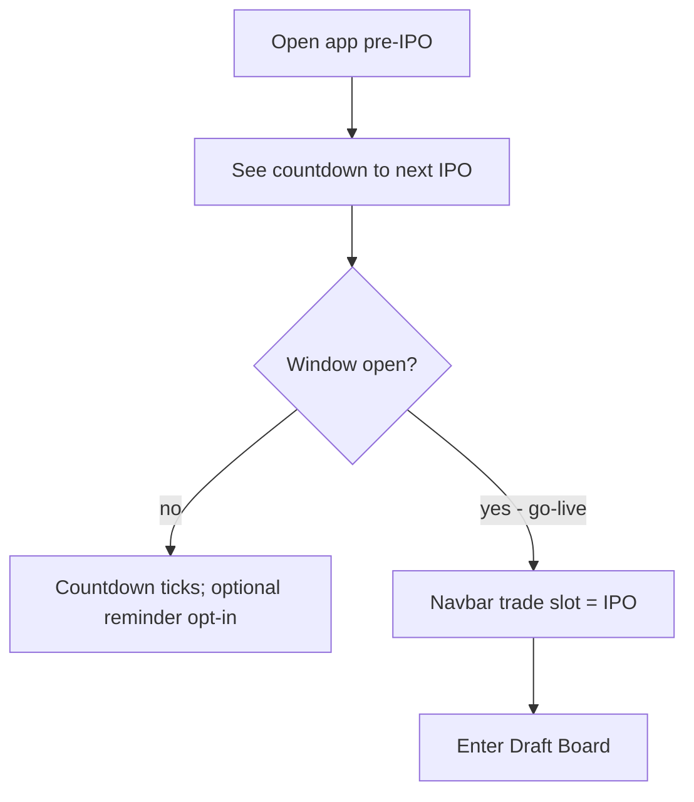
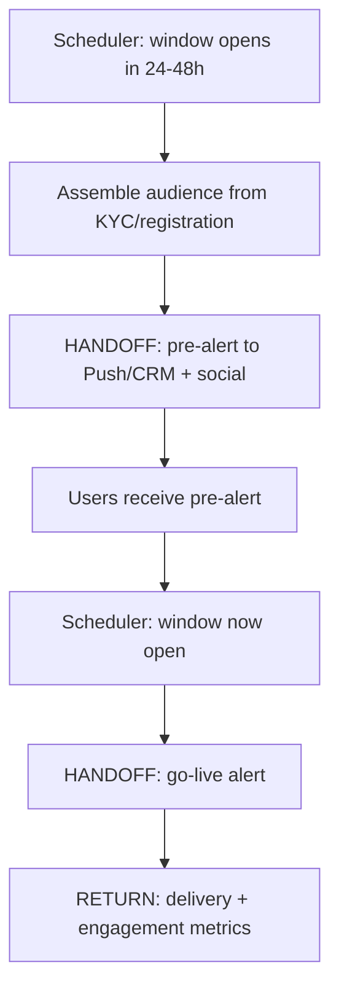

# InPlay Trading Challenge — Announcement & Countdown

> **Component:** [[ipo-module]]
> **Date:** 2026-05-26
> **Status:** Defined
> **Owner:** Skye (client-facing — comms/GTM) + George (engineering)
> **Sources:** _[[meetings/26-05-2026-component-IPO-touchdown]]_

---

## 1. What Does This Sub-Component Do?

**Functional purpose:**

Announcement & Countdown is the hype-and-notify layer that drives users to the IPO at the right moment. The IPO is a time-boxed event (72-hour windows — see [[ipo-scheduling]]), so its success depends on getting the audience that downloaded the app to show up when the window opens. This sub-component owns the **pre-event build-up** and the **go-live trigger** across every channel.

Skye scoped it in the room: notify the audience **24–48 hours ahead** of the IPO dates, then notify them again **the moment it goes live**, using the two highest-leverage channels — **push notifications** (to users who've downloaded and KYC'd) and **social/CRM** (broader GTM reach) — plus an in-app **countdown**. When the window opens, the app's "trade" navbar slot takes over and becomes the IPO experience (the takeover itself is rendered by [[draft-board]] / [[ipo-scheduling]]; this sub-component fires the signal). It is heavily entwined with the **Push/CRM cross-cutting concern** — this sub-component defines the IPO-specific triggers and content; the delivery infrastructure is shared.

**Entities that interact with it:**

- **Comms agent (system)** — schedules and fires pre-alerts and go-live notifications across channels. Event-driven.
- **User** — receives notifications and sees the in-app countdown.
- **GTM/marketing team** — sets the schedule and message content (Skye's team).

---

## 2. What Needs to Happen?

**Functional requirements:**

- Fire **pre-event alerts 24–48h** before each league's IPO window opens, across push, social, and CRM.
- Fire a **go-live notification** the moment the window opens.
- Display an **in-app countdown** to the next IPO open.
- Signal the **navbar takeover** at go-live (hand to [[draft-board]] / [[ipo-scheduling]]).
- Target notifications using **KYC/registration data** and push-opt-in status.

**Business rules:**

- Pre-alert lead time is 24–48h (per Skye); go-live alert is immediate at window open.
- Channel content is set by GTM; this sub-component owns the IPO-specific triggers/timing.
- Only notify users appropriately (respect push opt-in / channel consent).

**Edge cases:**

- **User has notifications disabled** → rely on in-app countdown + social/CRM only.
- **Schedule changes after pre-alert sent** → must be able to send a correction.
- **Staggered leagues** → separate countdown/alert sequences for NCAA and NFL.

---

## 3. Entity Journeys

### 3a. Isolated Journeys

#### Journey 1: See the in-app countdown and reach the IPO at go-live

**Entity:** User

**Input:** User opens the app in the run-up to an IPO window.

**Outcome:** User is aware of when the IPO opens and lands in it at go-live.

**Steps:**

**Acceptance criteria:**
- [ ] A countdown to the next IPO open is visible in-app.
- [ ] At go-live the navbar trade slot becomes the IPO experience.
- [ ] Separate countdowns exist for NCAA and NFL windows.

### 3b. Cross-Component Journeys

#### Journey 1: Fire cross-channel IPO alerts

**Entity:** Comms agent (system)

**Input:** Scheduling agent signals "IPO window opens in 24–48h" and, later, "window now open."

**Handoff point:** IPO Module → Push/CRM (+ social). State passed: audience segment, message/content, channel, send time. Delivery is owned by the Push/CRM cross-cutting concern.

**Components involved:** IPO Module → Push/CRM (cross-cutting) → user devices/channels

**Outcome:** Targeted users receive a pre-alert and a go-live alert; engagement spikes at open.

**Steps:**

**Acceptance criteria:**
- [ ] A pre-alert fires 24–48h before each window across push, social, and CRM.
- [ ] A go-live alert fires at window open.
- [ ] Targeting uses KYC/registration data and respects channel consent.
- [ ] Delivery/engagement is measurable (open spike at go-live).

---

## 4. Look and Feel (Optional)

**Design specifics for this sub-component:** The in-app countdown should feel like an **event hype** moment — prominent, exciting ("make it sexy", per Brett), not a small banner. Notifications should be punchy and time-specific ("NCAA IPO opens in 24 hours").

**UX principles specific to this sub-component:**
- Build anticipation without being spammy (Skye's caution applies generally to the app).
- Be unmistakable at go-live — the user should know *the moment* they can buy.

---

## 5. Data Requirements

| What | Direction | Description | Source / Destination |
|------|-----------|------------|---------------------|
| IPO window schedule | In | When each league's window opens | [[ipo-scheduling]] |
| Audience / segment data | In | Who to notify (KYC/registration, opt-in) | Customer Onboarding / CRM |
| Notification content | In | Channel messages | GTM / marketing |
| Delivery + engagement metrics | Out | Sends, opens, app-open spike | Push/CRM analytics |
| Countdown state | Out | Time-to-open shown in-app | [[ipo-scheduling]] → UI |

---

## 6. Dependencies

| Depends on | What we need | Blocking? |
|-----------|-------------|----------|
| [[ipo-scheduling]] | Window open times + go-live signal | Yes |
| Push/CRM (cross-cutting) | Delivery infrastructure across channels | Yes (for notifications) |
| Customer Onboarding / CRM | Audience data, push opt-in status | Yes (for targeting) |
| GTM / marketing | Message content + cadence | No — can template |

**What siblings or other components need from this one:**

- [[draft-board]] / [[ipo-scheduling]] consume the go-live signal for the navbar takeover.

---

## 7. Risks

**Specific risks:**
- **Missed/late alerts** — a time-boxed event with poor notification wastes the window; low turnout at open.
- **Over-notification** — spammy alerts erode trust and push opt-out.
- **Targeting on stale data** — notifying users who can't participate (not KYC'd) or missing those who can.

**Controls to build into the journeys:**
- Schedule-driven triggers tied to [[ipo-scheduling]] (no manual send risk).
- Respect channel consent; cap frequency.
- Build a correction path if the schedule changes after a pre-alert.

---

## 8. Priority

**Must-have at launch?** Yes for the **go-live + pre-alert** basics — the IPO needs an audience at open. Richer countdown polish can iterate.

**Sequencing rationale:** Depends on [[ipo-scheduling]] (needs window times) and the Push/CRM cross-cutting infrastructure. Can be built in parallel with the buy flow but integrated late, once schedule times exist.

---

## Sub-Sub-Components

Leaf node — no further decomposition needed. Delivery mechanics belong to the Push/CRM cross-cutting concern, not here.
