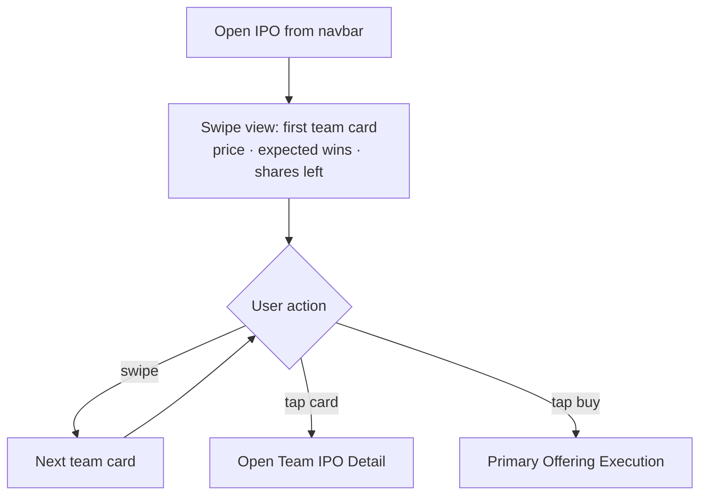
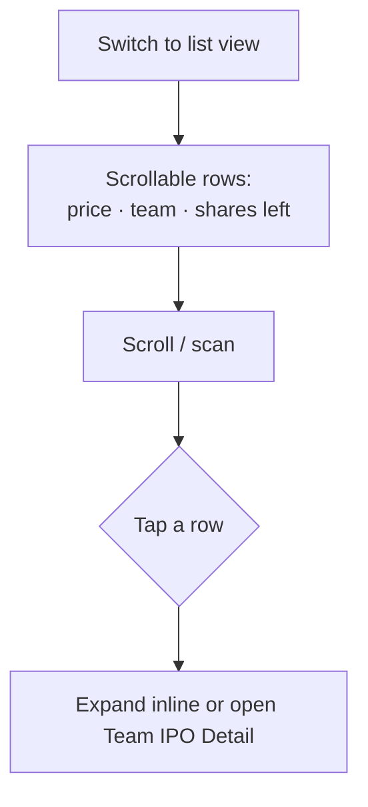
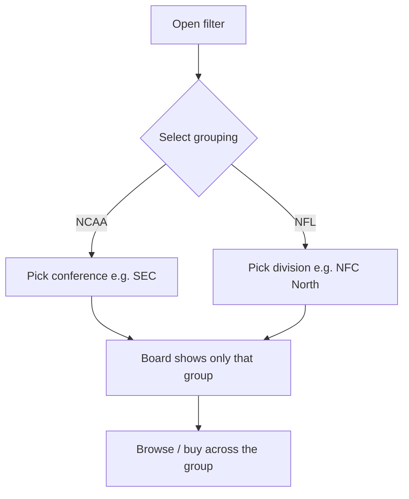

# InPlay Trading Challenge — Draft Board / Listings

> **Component:** [[ipo-module]]
> **Date:** 2026-05-26
> **Status:** Defined
> **Owner:** Edwin (client-facing) + George (engineering)
> **Sources:** _[[meetings/26-05-2026-component-IPO-touchdown]]_

---

## 1. What Does This Sub-Component Do?

**Functional purpose:**

The Draft Board is the browse-and-discover surface of the IPO ("Trading Challenge Draft"). It presents every team company available in the current primary offering as a scannable set of listings, each showing its forward-looking IPO price, the basis for that price (expected wins), and how many shares remain in the float. It is the entry point to the whole IPO experience — until secondary trading opens, the app's primary "trade" navigation slot **is** this board.

The board is deliberately built for fast, low-friction discovery across a large universe (32 NFL + ~131 NCAA team companies). Users can move through it three ways: a **Tinder-style swipe** through team cards one at a time (Edwin's strongly-preferred metaphor), a **scrollable list** of price/team/shares-remaining rows, or a **filtered portfolio view** that loads a whole conference (NCAA) or division (NFL) at once so a user can assemble a themed basket. From any listing the user drills into the [[team-ipo-detail]] for the full picture, or buys directly via [[primary-offering-execution]].

**Entities that interact with it:**

- **User (KYC-verified, funded wallet)** — browses, filters, and selects teams to assess or buy. All four audiences use it; the Finance-Curious Student and casual fan gravitate to swipe, the Armchair GM and Veteran to list/filter.
- ⚠️ **Pre-KYC user** — open question whether they can view the board as a teaser or are fully gated (see parent component §6).

---

## 2. What Needs to Happen?

**Functional requirements:**

- Display every team company in the active offering, each with: current IPO price, expected wins, and **shares remaining** out of the 5M float.
- Provide a **swipe (Tinder) view** — one team card at a time, swipe to advance.
- Provide a **list view** — compact rows (price · team · shares remaining) with click-to-expand / open detail.
- Provide a **filter** to load all teams in a chosen **NCAA conference** or **NFL division** (e.g. "all SEC", "NFC North") for portfolio-style browsing.
- Surface a clear **sold-out** state on any team whose float is exhausted.
- Let the user open the [[team-ipo-detail]] from any listing, and initiate a buy from the listing itself.
- Occupy the navbar's "trade" slot for the duration of the IPO window; revert to normal trading when the window closes.

**Business rules:**

- Listings exist only while a team's IPO window is open; at window close the team leaves the board and appears in the secondary market.
- Shares-remaining must reflect the authoritative float state (single source of truth = tZERO ledger).

**Edge cases:**

- **All teams in a league sold out before window close** → board shows all sold-out; nothing buyable until secondary opens.
- **Mixed league states** — NCAA teams may be in secondary trading while NFL teams are still IPO; the board must clearly distinguish "buy at IPO" vs "now trading" teams (see [[ipo-scheduling]]).
- **Empty filter** (a conference/division with no open listings) → show an empty/closed state, not an error.

---

## 3. Entity Journeys

### 3a. Isolated Journeys

#### Journey 1: Browse the draft board by swipe

**Entity:** User (verified, funded)

**Input:** User opens the IPO experience from the navbar during an open window.

**Outcome:** User has seen a sequence of team cards and either advanced past or opened/bought one.

**Steps:**

**Acceptance criteria:**
- [ ] Each card shows team, IPO price, expected wins, and shares remaining.
- [ ] Swiping advances to the next team with no perceptible load delay.
- [ ] Sold-out teams are visibly marked and not buyable from the card.
- [ ] Tapping a card opens its detail; a buy affordance is reachable from the card.

#### Journey 2: Browse by list

**Entity:** User (verified, funded)

**Input:** User switches to list view.

**Outcome:** User scans many teams quickly and opens one of interest.

**Steps:**

**Acceptance criteria:**
- [ ] List shows price, team name, and shares remaining per row.
- [ ] User can scroll the full universe without pagination friction.
- [ ] Tapping a row opens detail or expands key info.

#### Journey 3: Filter to a conference/division portfolio

**Entity:** User (verified, funded)

**Input:** User selects a conference (NCAA) or division (NFL) filter.

**Outcome:** User views only the chosen group's listings and can buy across them to build a portfolio.

**Steps:**

**Acceptance criteria:**
- [ ] NCAA filterable by conference; NFL filterable by division.
- [ ] Selecting a group shows only its open listings.
- [ ] User can buy multiple teams within the group without losing the filter.
- [ ] Empty/closed groups show a clear empty state.

### 3b. Cross-Component Journeys

_None originate here. Buying crosses into [[primary-offering-execution]] (same component). Window-close handover to the secondary market is owned by [[ipo-scheduling]]._

---

## 4. Look and Feel

**Design specifics for this sub-component:** Two co-existing modes the user can toggle: a **swipe deck** of rich team cards (the hero experience) and a **dense list** for fast scanning. Filters sit at the top (conference/division chips). Energetic, launch-event feel; the board is the centrepiece, not a buried menu.

**Reference products / screen-grabs:**
- **Tinder** — the swipe-card discovery pattern (Edwin: _"the more we make it like that, the better"_).

**UX principles specific to this sub-component:**
- Build **both** swipe and list; let the user choose (George: _"give the user the option to have both"_).
- Shares-remaining should feel **live** — scarcity drives urgency during the 72h window.
- Price must be legible as *earned* — expected wins visible alongside it.

---

## 5. Data Requirements

| What | Direction | Description | Source / Destination |
|------|-----------|------------|---------------------|
| Team list (current offering) | Out | All team companies with an open IPO window | [[ipo-scheduling]] / InPlay |
| IPO price | Out | Static ask price per team | InPlay valuation model |
| Expected wins | Out | Basis for the price | InPlay projection |
| Shares remaining | Out | Live float state per team | tZERO ledger via [[primary-offering-execution]] |
| Conference / division mapping | In | Grouping metadata for filters | Sport Radar / InPlay |
| Sold-out / window-state flag | Out | Buyable vs sold-out vs now-trading | [[ipo-scheduling]] |

---

## 6. Dependencies

| Depends on | What we need | Blocking? |
|-----------|-------------|----------|
| [[ipo-scheduling]] | Which teams are in an open window; mixed-state flags | Yes |
| [[primary-offering-execution]] | Live shares-remaining; buy entry | Yes |
| [[team-ipo-detail]] | Detail view to drill into | No — can stub |
| InPlay valuation model | IPO price + expected wins | Yes (need a price to list) |
| Sport Radar / InPlay | Conference/division metadata | No — can hardcode initially |

**What siblings or other components need from this one:**

- It is the navigation hub — [[team-ipo-detail]] and [[primary-offering-execution]] are reached from here.

---

## 7. Risks

**Specific risks:**
- **Stale shares-remaining** — if the counter lags the ledger, users attempt buys on sold-out floats.
- **Mixed-state confusion** — users may not understand why some teams are "buy at IPO" and others "now trading" during the NCAA/NFL overlap.
- **Discovery bias** — swipe/list ordering could over-expose marquee teams and starve the long tail (hurts broad distribution metric).

**Controls to build into the journeys:**
- Read shares-remaining from the authoritative ledger; show a clear sold-out state.
- Visually distinguish IPO listings from now-trading teams on the board.
- Consider randomised/were-shuffled ordering or a "less discovered" surfacing to spread distribution.

---

## 8. Priority

**Must-have at launch?** Yes — it's the front door to the IPO; without it there is no way to discover what to buy.

**Sequencing rationale:** Build alongside [[primary-offering-execution]] (they're tightly coupled — the board needs live float state and the buy entry). Swipe and list can ship together; filters can follow if needed.

---

## Sub-Sub-Components

Leaf node — no further decomposition needed. The three browse modes share a single board/state and are journeys, not separable sub-parts.
