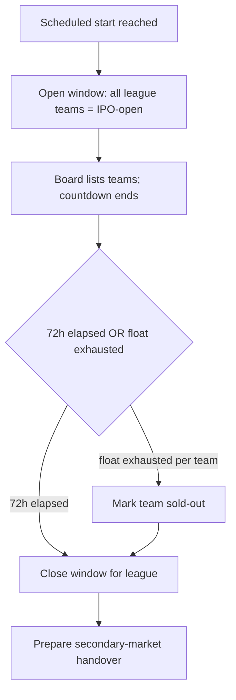
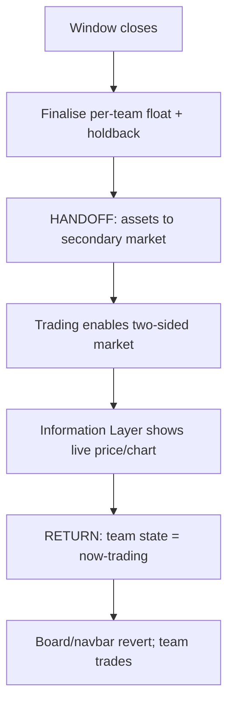

# InPlay Trading Challenge — IPO Scheduling & Windows

> **Component:** [[ipo-module]]
> **Date:** 2026-05-26
> **Status:** Defined
> **Owner:** Edwin (client-facing — mechanics) + Cody (schedule/dates) + George (engineering)
> **Sources:** _[[meetings/26-05-2026-component-IPO-touchdown]]_

---

## 1. What Does This Sub-Component Do?

**Functional purpose:**

IPO Scheduling & Windows is the system clock of the IPO Module. It governs **when** each league's primary offering opens, how long it stays open, and the moment it closes and hands its assets to the secondary market. It is mostly an agent/system concern with little direct UI — but it drives what every user-facing surface shows (the [[draft-board]] only lists teams whose window is open; the [[announcement-countdown]] counts down to these times).

Edwin set the rules in the room, overriding an earlier suggestion to stage IPOs in blocks over multiple days: each league's teams IPO **all at once**, in a single **72-hour window**, ending shortly before that league's season starts. NCAA runs first — Edwin: _"we would start on the 20th and end 72 hours,"_ ahead of NCAA week-zero on Aug 27 (leaving ~4 days of secondary trading before the first game). NFL runs ~7 days before its Sept 9 kickoff. Because the two leagues are staggered, the system must handle a **mixed state**: NCAA assets can be live in the secondary market while NFL teams are still in their IPO window. At the close of each 72-hour window, every team in that league transitions from buy-only IPO to the two-sided secondary market.

**Entities that interact with it:**

- **Scheduling agent (system)** — opens windows, enforces the 72h duration, closes windows, triggers the secondary-market handover. No direct UI.
- Indirectly: **users**, via the surfaces this drives (board, countdown).

---

## 2. What Needs to Happen?

**Functional requirements:**

- Open a **72-hour IPO window** for all teams in a league at the scheduled start.
- Run NCAA and NFL windows on a **staggered** schedule (NCAA ~Aug 20; NFL ~7 days before Sept 9).
- **Close** each window at the 72-hour mark (or earlier per team if its float exhausts).
- On close, transition each team from **buy-only IPO** to the **secondary market** (two-sided).
- Maintain and expose a **per-team state**: upcoming / IPO-open / sold-out / now-trading.
- Support a **mixed state** across leagues (NCAA trading while NFL still IPO-ing).

**Business rules:**

- Window length = 72 hours per league for this iteration.
- All teams in a league IPO concurrently (no multi-day staging this iteration).
- NCAA secondary trading may begin before NFL IPOs complete.
- Dates anchor to each league's season start, not a fixed calendar (must confirm against finalised schedules).

**Edge cases:**

- **Float exhausts before 72h** → that team goes sold-out immediately; does it move to secondary early, or wait for the league window close? *Decision needed.*
- **Schedule changes** (league moves its start date) → window start must be re-anchorable.
- **Unsold shares at window close** → roll to secondary float, cancel, or retain in treasury? *Open (see parent §Gaps).*

---

## 3. Entity Journeys

### 3a. Isolated Journeys

#### Journey 1: Open, run, and close a league's IPO window

**Entity:** Scheduling agent (system)

**Input:** Scheduled IPO start time for a league reached.

**Outcome:** The league's teams are buyable for exactly 72h, then closed and prepared for handover.

**Steps:**

**Acceptance criteria:**
- [ ] All teams in a league open for IPO at the scheduled start.
- [ ] Window stays open for 72 hours.
- [ ] A team whose buyable float exhausts is marked sold-out before window close.
- [ ] At 72h the window closes and no further IPO buys are accepted.
- [ ] Per-team state (upcoming / open / sold-out / trading) is queryable by the board and countdown.

### 3b. Cross-Component Journeys

#### Journey 1: Hand assets to the secondary market

**Entity:** Scheduling agent (system)

**Input:** Window close for a league.

**Handoff point:** IPO Module → Trading + Information Layer. State passed: each team's final float, the 20% shortable holdback, and the opening reference price. Users expect the team to now show a two-sided (bid/ask) market.

**Components involved:** IPO Module → Trading / Information Layer

**Outcome:** Each team becomes tradeable on the secondary market with two-sided pricing.

**Steps:**

**Acceptance criteria:**
- [ ] At window close, each team is enabled for two-sided trading.
- [ ] The 20% holdback is available as shortable supply on the secondary market.
- [ ] Mixed state is supported — NCAA can be trading while NFL is still IPO.
- [ ] The navbar's trade slot reverts from IPO to normal trading per league as windows close.

---

## 4. Look and Feel (Optional)

_Mostly non-UI. The only user-visible surface is per-team state badges (upcoming / IPO-open / sold-out / now-trading) shown on the [[draft-board]] and Information Layer — see those sub-components for treatment._

---

## 5. Data Requirements

| What | Direction | Description | Source / Destination |
|------|-----------|------------|---------------------|
| League season start dates | In | Anchor for window scheduling | Cody / Sport Radar schedule |
| Window start/end timestamps | Stored | Per-league 72h window | InPlay scheduler |
| Per-team state | Out/Stored | upcoming / open / sold-out / trading | InPlay → board, countdown, Information Layer |
| Final float + holdback | Out | Handed to secondary market at close | tZERO ledger → Trading |
| Opening reference price | Out | IPO price seeds secondary open | InPlay model → Trading |

---

## 6. Dependencies

| Depends on | What we need | Blocking? |
|-----------|-------------|----------|
| Cody / Sport Radar | Finalised NCAA & NFL season start dates | Yes (anchors the schedule) |
| [[primary-offering-execution]] | Float-exhaustion signals | Yes |
| Trading / Information Layer | Ability to enable a two-sided market at handover | Yes (for close) |

**What siblings or other components need from this one:**

- [[draft-board]] and [[announcement-countdown]] read window state and times.
- Trading / Information Layer receive the handover at close.

---

## 7. Risks

**Specific risks:**
- **Mis-anchored dates** — if league start dates shift and the schedule doesn't, IPOs open at the wrong time relative to games.
- **Botched handover** — a gap between IPO close and secondary open would leave assets untradeable (liquidity gap).
- **Mixed-state bugs** — incorrectly treating an NFL-IPO team as tradeable (or vice-versa) during the overlap.

**Controls to build into the journeys:**
- Re-anchorable window start tied to league schedule, not hardcoded dates.
- Atomic close→open handover with no untradeable interval.
- Explicit per-team state machine (upcoming → open → sold-out/closed → trading) enforced everywhere.

---

## 8. Priority

**Must-have at launch?** Yes — it gates when buying and trading are possible. The IPO can't open or close without it.

**Sequencing rationale:** Build alongside [[primary-offering-execution]] (they share float state and the close trigger). The secondary-handover path depends on Trading being ready to accept assets, so coordinate sequencing with the Trading component.

---

## Sub-Sub-Components

Leaf node — no further decomposition needed.
