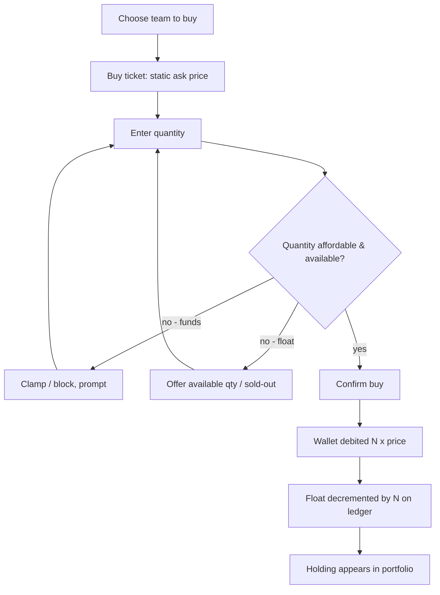
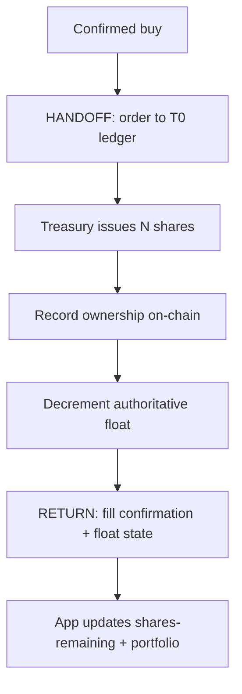

# InPlay Trading Challenge — Primary Offering Execution

> **Component:** [[ipo-module]]
> **Date:** 2026-05-26
> **Status:** Defined
> **Owner:** Edwin (client-facing — mechanics) + Troy (T0 / on-chain ledger) + George (engineering)
> **Sources:** _[[meetings/26-05-2026-component-IPO-touchdown]]_

---

## 1. What Does This Sub-Component Do?

**Functional purpose:**

Primary Offering Execution is the buy engine of the IPO — the mechanism by which a user takes shares out of a team company's float at the offering price, and by which the float is issued, decremented, and exhausted. It is the most mechanically precise part of the IPO Module and the one with the hardest correctness requirements, because it touches the T0 ledger and on-chain issuance.

The model is intentionally simple, and Edwin specified it precisely. Each team company floats **5,000,000 shares** at a **single static ask price** that does not move. There is no bid — InPlay, acting through the team company's treasury as the issuer of record, is the **only seller**. A user crosses the ask and clicks **buy** (never sell — there is no sell action in this phase), enters a quantity, and that quantity is matched and removed from the float. Edwin's worked example: 100,000 shares at $40; a user buys 1,000 → 99,000 remain; the next buyer takes 10,000 → 89,000 remain; and so on until the float is gone. There is **no per-user limit** — a user may spend their entire 100,000 InPlay$ on one team. InPlay **holds back ~20% (≈1M shares)** of each float to enable shorting on the secondary market without users over-shorting. When the float is exhausted (or the window closes — see [[ipo-scheduling]]), the team stops being buyable at IPO.

Even in the simulated challenge, the shares are **issued by the team company's treasury** and that issuance must be represented on-chain — the buyer's purchase is their first ownership of the security (Troy: _"they're the issuer even in the simulated environment… that has to be represented on the chain"_). Resolving exactly how that ledger works is an open item with the T0 team.

**Entities that interact with it:**

- **User (verified, funded)** — initiates buys at the static ask.
- **Ledger/matching agent (T0)** — issues from treasury, matches buys, decrements float, records ownership on-chain.

---

## 2. What Needs to Happen?

**Functional requirements:**

- Present a **buy-only** action at the static ask price (no sell, no two-sided ticket).
- Let the user enter a **quantity** and confirm; debit the cost from their trading wallet.
- **Match** the buy against the team's remaining float and **decrement** shares remaining atomically.
- Enforce **no per-user purchase cap**.
- Reserve a **20% holdback** of each float (not sold in the primary offering) for secondary-market shorting.
- Record issuance and ownership **on-chain** (treasury = issuer).
- Reflect the cost in the user's wallet balance and the holding in their portfolio.
- Mark the team **sold-out** when the buyable float (80%) is exhausted.

**Business rules:**

- Static ask price; price does not change during the window.
- 5M total float per team; ~80% buyable in the primary offering, ~20% held back.
- Buy is a one-way action — no selling until the secondary market opens.
- A user cannot spend more than their trading-wallet balance (max 100,000 InPlay$).

**Edge cases:**

- **Requested quantity exceeds remaining buyable float** → fill what's available (partial) and mark sold-out, or reject — *decision needed* (see Risks/§Gaps).
- **Two users buy the last block simultaneously** → ledger must resolve the race deterministically (idempotent, no oversell).
- **Insufficient wallet balance** → block/clamp the buy to affordable quantity.
- **Window closes mid-purchase** → reject the buy cleanly; no partial post-close fills.

---

## 3. Entity Journeys

### 3a. Isolated Journeys

#### Journey 1: User buys at the static ask

**Entity:** User (verified, funded)

**Input:** User chooses a team to buy (via [[draft-board]] listing, [[team-ipo-detail]], or the trade button) during an open window.

**Outcome:** User owns N shares of the team; their wallet is debited N × price; the team's remaining float drops by N.

**Steps:**

**Acceptance criteria:**
- [ ] Only a buy action is available — no sell during the IPO.
- [ ] Price shown is the static ask and does not move.
- [ ] User can buy any quantity up to their wallet balance (no per-user cap).
- [ ] Wallet is debited exactly quantity × price.
- [ ] Shares remaining decrement by exactly the bought quantity.
- [ ] The holding is reflected in the user's portfolio.
- [ ] A buy cannot exceed the buyable (80%) float.

### 3b. Cross-Component Journeys

#### Journey 1: Issue and decrement against the T0 ledger

**Entity:** Ledger/matching agent (T0) + team treasury

**Input:** A confirmed user buy.

**Handoff point:** IPO Module → T0 ledger. State passed: team, quantity, price, buyer. On return: confirmed fill + new float state + on-chain ownership record.

**Components involved:** IPO Module → T0 ATS / chain → IPO Module

**Outcome:** Shares are issued from the treasury to the buyer, recorded on-chain, and the authoritative float is updated.

**Steps:**

**Acceptance criteria:**
- [ ] Each issuance is attributed to the team treasury as issuer of record.
- [ ] Ownership is recorded on-chain even in the simulated environment.
- [ ] The ledger is the single source of truth for float remaining.
- [ ] Concurrent buys on the final block do not oversell the float (idempotent).

#### Journey 2: Hand the asset to the secondary market

_Owned by [[ipo-scheduling]] — at window close the team transitions from buy-only IPO to a two-sided secondary market. Cross-referenced here because the 20% holdback becomes the shortable supply at that point._

---

## 4. Look and Feel

**Design specifics for this sub-component:** A minimal, unambiguous **buy ticket** — team, static price, quantity field, cost preview, confirm. The word "buy" should dominate; nothing should suggest selling. Show shares-remaining prominently to convey scarcity.

**Reference products / screen-grabs:**
- Brokerage "buy" order tickets (single-sided) — for the quantity/cost-preview pattern.

**UX principles specific to this sub-component:**
- Make it read as **buy, not trade** (Edwin: _"we want the market to understand that there's no selling"_).
- Show cost and resulting balance before confirm.
- Surface remaining float to create launch-window urgency.

---

## 5. Data Requirements

| What | Direction | Description | Source / Destination |
|------|-----------|------------|---------------------|
| Static ask price | Out | Fixed offering price per team | InPlay valuation model |
| Buy quantity | In | User-entered share count | User input |
| Wallet balance | In/Out | Funds available; debited on buy | Trading wallet ([[trading]]) |
| Float remaining | In/Out/Stored | Authoritative shares left (of 80% buyable) | T0 ledger |
| Holdback reserve | Stored | ~20% (≈1M) reserved for shorting | T0 ledger |
| Ownership / issuance record | Stored | Treasury → buyer, on-chain | T0 / chain |
| Holding (position) | Out/Stored | Shares now owned by user | Portfolio ([[trading]]) |

---

## 6. Dependencies

| Depends on | What we need | Blocking? |
|-----------|-------------|----------|
| T0 ATS | Ledger, treasury issuance, on-chain ownership, float accounting | Yes |
| Trading wallet ([[trading]]) | Funded balance to debit | Yes |
| InPlay valuation model | Static ask price | Yes |
| [[ipo-scheduling]] | Window-open state; close trigger | Yes |
| [[draft-board]] / [[team-ipo-detail]] | Buy entry points | No |

**What siblings or other components need from this one:**

- [[draft-board]] / [[team-ipo-detail]] read **shares remaining** from here.
- [[season-end-settlement]] settles the positions created here.
- The **secondary market** (Trading / Information Layer) inherits the float and the 20% shortable holdback.

---

## 7. Risks

**Specific risks:**
- **Float-accounting drift / oversell** under concurrency — the core correctness risk; app counter must not diverge from the ledger.
- **Float cornering** — no per-user cap means a whale or coordinated group could buy most of a team's float and distort the opening secondary market.
- **Holdback mis-sizing** — too little shortable supply chokes the secondary short market; too much starves primary buyers.
- **On-chain issuance gaps** — if issuance isn't correctly attributed to the treasury, the ownership ledger is indefensible.

**Controls to build into the journeys:**
- Authoritative float on the ledger; app reads it; idempotent fills for last-block races.
- Hard sold-out state at 80% exhaustion.
- Audit trail of issuance (treasury → buyer) for every fill.
- Consider (open) a soft concentration limit or disclosure if cornering proves a problem.

---

## 8. Priority

**Must-have at launch?** Yes — this *is* the IPO. Highest correctness bar in the component.

**Sequencing rationale:** Build first among the sub-components; [[draft-board]] and [[team-ipo-detail]] depend on its live float state. The T0 ledger integration is the long-pole and should be de-risked early.

---

## Sub-Sub-Components

Leaf node — no further decomposition needed.
