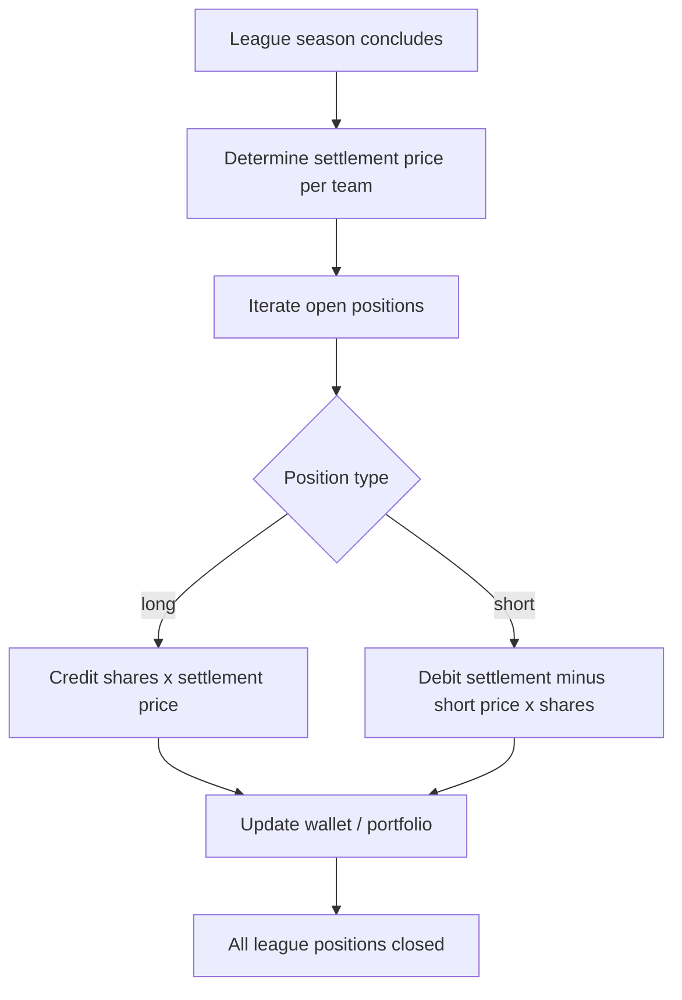
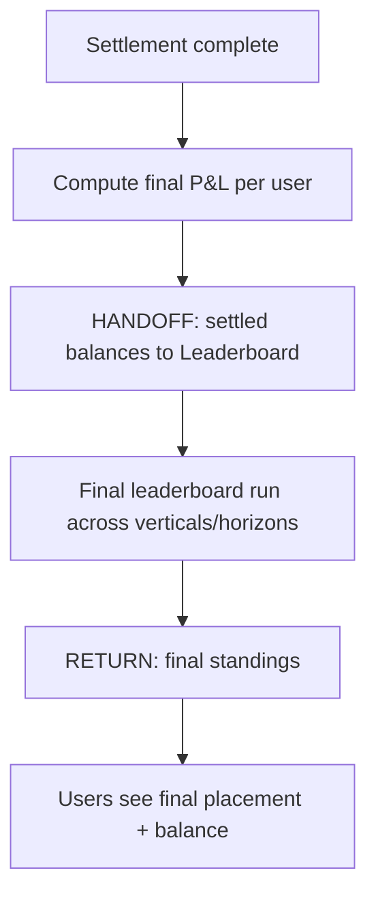

# InPlay Trading Challenge — Season-End Settlement / Liquidation

> **Component:** [[ipo-module]]
> **Date:** 2026-05-26
> **Status:** Defined
> **Owner:** Edwin (client-facing — mechanics) + Troy (T0 / ledger) + George (engineering)
> **Sources:** _[[meetings/26-05-2026-component-IPO-touchdown]]_

---

## 1. What Does This Sub-Component Do?

**Functional purpose:**

Season-End Settlement is the closing bookend of the IPO Module — where the IPO opens an asset's life, this ends it. When a season concludes, every open position in that league's team companies is closed out at a final settlement price and the trading challenge's leaderboards are run one last time. Brett framed it as the natural "top and tail" of the same component as the IPO, and Edwin walked the mechanics through in the room.

The logic is straightforward. At season close, the system looks at every position: **long holders** are credited the cash value of their shares (Edwin's example: 20,000 shares worth $30 each → $600,000 credited to that user's challenge wallet), and **short holders** are **force-closed** — debited the cash difference between their short price and the final settlement price (short from $50, settles at $75 → debited $25/share). Then a **final leaderboard run** ranks everyone. Edwin noted the end of season is low-drama by design: time-decay-like convergence means a share moves at most ~$7.50 in the final game, so the closing doesn't whipsaw the standings. The NCAA season concludes before the NFL season, so settlement runs **per league** on a staggered basis. This is **simulation settlement only** — Edwin was explicit it's about the challenge, not production liquidating dividends.

**Entities that interact with it:**

- **Settlement agent (system)** — runs the close-out at season end. Event-driven, no direct UI.
- **User** — sees their final credited/debited balance and final leaderboard placement (rendered by Trading / Leaderboard).

---

## 2. What Needs to Happen?

**Functional requirements:**

- At a league's season close, determine the **final settlement price** for each team company.
- **Credit longs**: holding × settlement price → user's challenge wallet.
- **Force-close shorts**: debit (settlement price − short price) × shares from the short holder.
- Run a **final leaderboard** across the challenge's verticals/time horizons after settlement.
- Run **per league** (NCAA settles before NFL).
- Reflect final balances in users' wallets/portfolios and final standings.

**Business rules:**

- Simulation-only settlement (no real-cash liquidating dividend here — that's production / vision-level).
- Longs credited at settlement value; shorts debited the short-to-settlement difference.
- End-of-season price movement is bounded (~$7.50 max change in the final game) by convergence.
- NCAA and NFL settle on separate schedules aligned to each season's end.

**Edge cases:**

- **User is short and settlement price is below their short** → they profit (credited the favourable difference) — confirm sign handling.
- **Insufficient balance to cover a short loss** → how is a negative outcome handled in the simulation? *Decision needed.*
- **Position open across both leagues** → each leg settles on its league's schedule.

---

## 3. Entity Journeys

### 3a. Isolated Journeys

#### Journey 1: Settle the book at season end

**Entity:** Settlement agent (system)

**Input:** A league's season concludes (settlement trigger).

**Outcome:** All positions in that league are closed at the settlement price; wallets reflect credits/debits.

**Steps:**

**Acceptance criteria:**
- [ ] A final settlement price is set for every team company at season close.
- [ ] Longs are credited holding × settlement price.
- [ ] Shorts are force-closed and debited (settlement − short) × shares (correct sign for favourable shorts).
- [ ] All open positions in the league are closed — none left open.
- [ ] Wallet and portfolio reflect the final balances.
- [ ] Runs per league (NCAA before NFL).

### 3b. Cross-Component Journeys

#### Journey 1: Trigger the final leaderboard run

**Entity:** Settlement agent (system)

**Input:** Settlement of a league completed.

**Handoff point:** IPO Module → Leaderboard (Information Layer) + Trading. State passed: final settled balances/P&L per user. Users expect to see their final standing and cash-out-relevant position.

**Components involved:** IPO Module → Trading / Leaderboard (Information Layer)

**Outcome:** The final challenge leaderboard is produced from settled balances.

**Steps:**

**Acceptance criteria:**
- [ ] The final leaderboard runs only after settlement completes.
- [ ] Final standings reflect settled balances, not pre-settlement marks.
- [ ] Final placement is surfaced to users (via Leaderboard / Trading).

---

## 4. Look and Feel (Optional)

_No dedicated UI in this sub-component. User-facing results (final balance, final standings) are rendered by Trading (portfolio/wallet) and the Leaderboard sub-component of the Information Layer. A "season closed / final results" state should be considered there._

---

## 5. Data Requirements

| What | Direction | Description | Source / Destination |
|------|-----------|------------|---------------------|
| Settlement price per team | In | Final price at season close | InPlay / T0 |
| Open positions (long/short) | In | All holdings to settle | T0 ledger / Trading |
| Short entry prices | In | Needed to compute short P&L | T0 ledger |
| Credited/debited balances | Out/Stored | Final wallet outcomes | Trading wallet |
| Final P&L per user | Out | Input to final leaderboard | Leaderboard (Information Layer) |
| Season-end trigger / dates | In | Per-league close timing | [[ipo-scheduling]] / schedule |

---

## 6. Dependencies

| Depends on | What we need | Blocking? |
|-----------|-------------|----------|
| T0 ledger / Trading | Open positions, short entry prices, wallet write | Yes |
| InPlay / T0 | Final settlement prices | Yes |
| Leaderboard (Information Layer) | To run the final standings | Yes (for the final run) |
| [[ipo-scheduling]] / schedule | Per-league season-end trigger | Yes |

**What siblings or other components need from this one:**

- Leaderboard depends on the final settled P&L for end-of-season standings.
- Trading wallets receive the final credits/debits.

---

## 7. Risks

**Specific risks:**
- **Settlement-price disputes** — an unclear or contestable final price undermines trust at the most sensitive moment (Edwin's Polymarket horror story: a $900 balance error is exactly this class of risk).
- **Sign / calculation errors** on short force-closes — wrong direction or magnitude directly mis-pays users.
- **Negative-balance handling** — a short loss exceeding balance has undefined behaviour in the simulation.
- **Leaderboard runs on unsettled marks** — final standings computed before settlement completes.

**Controls to build into the journeys:**
- A **reviewable, auditable settlement run** (audit trail of every credit/debit) before balances are finalised.
- Explicit, tested sign convention for long vs short outcomes.
- Gate the final leaderboard run on settlement completion.
- Define negative-outcome handling for the simulation (clamp at zero? track as loss?).

---

## 8. Priority

**Must-have at launch?** Not at the *opening* IPO — it's only needed at season close. But it is **must-have before the first season ends**, and the audit/correctness bar is as high as the buy flow.

**Sequencing rationale:** Can be built after the opening IPO and secondary trading ship, since it only runs at season end. Should not be left to the last minute given its correctness/trust weight and dependency on the Leaderboard.

---

## Sub-Sub-Components

Leaf node — no further decomposition needed.
