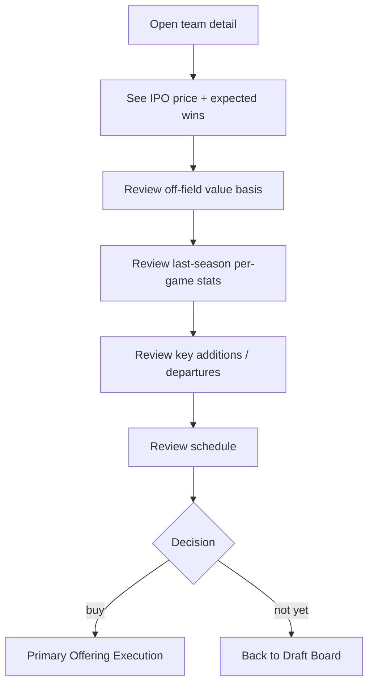
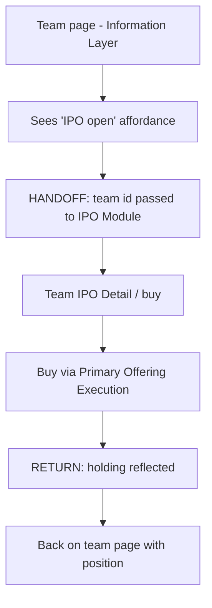

# InPlay Trading Challenge — Team IPO Detail

> **Component:** [[ipo-module]]
> **Date:** 2026-05-26
> **Status:** Defined
> **Owner:** Edwin (client-facing) + George (engineering) + Cody (sports data)
> **Sources:** _[[meetings/26-05-2026-component-IPO-touchdown]]_

---

## 1. What Does This Sub-Component Do?

**Functional purpose:**

The Team IPO Detail is the per-team assessment page a user opens from the [[draft-board]] to decide whether to buy a team's stock in the primary offering. It answers the question "why is this team priced at $X, and is that a good buy?" by showing the basis for the IPO price and the fundamentals a sports-literate user would use to form a view.

It surfaces, in priority order from the room: **expected wins** (which drives the expected on-field value and therefore the listed price), the **off-field value** basis (the marketing/engagement allocation that later flows through earnings), **last-season per-game stats**, **key additions and departures** (free-agency moves, draft picks, retirements — Edwin called this *the most valuable* signal, especially for college teams losing a star QB), and the team's **schedule** (so users can time their entries against games they expect to be volatile). It is the bridge between discovery and the buy action in [[primary-offering-execution]].

**Entities that interact with it:**

- **User (verified, funded)** — reads the detail to value the team and decide to buy. The Armchair GM keys on roster changes + schedule; the Veteran on expected-wins-to-value math.

---

## 2. What Needs to Happen?

**Functional requirements:**

- Display **expected wins** and show how it derives the **expected value** (and thus the IPO price).
- Display the **off-field value** basis ($250/game allocated by share of trade volume) so users understand the second pricing input.
- Display **last-season stats on a per-game basis**.
- Display **key additions / departures** — players gained (draft, free agency) and lost (free agency, trades, retirement).
- Display the team's **schedule** for the upcoming season.
- Show the **current IPO price** and **shares remaining**, with a buy affordance into [[primary-offering-execution]].

**Business rules:**

- The price shown must equal the static ask in the offering (no divergence between detail and board).
- Data shown is pre-live-season context (historical + projections) — there is no live game data during the IPO window.

**Edge cases:**

- **Missing roster data** for a team → show available fundamentals; don't block the page.
- **New / relocated program with no last-season stats** → gracefully omit that section.
- **Team sells out while viewing** → buy affordance switches to sold-out in place.

---

## 3. Entity Journeys

### 3a. Isolated Journeys

#### Journey 1: Assess a team and decide to buy

**Entity:** User (verified, funded)

**Input:** User opens a team from the [[draft-board]] (or via search / [[team-page (Information Layer)|team page]]).

**Outcome:** User has enough information to value the team and either buys or returns to the board.

**Steps:**

**Acceptance criteria:**
- [ ] Expected wins is shown and visibly linked to the expected value / price.
- [ ] Off-field value basis ($250/game, volume-allocated) is explained.
- [ ] Last-season stats are shown per game.
- [ ] Key additions and departures are listed (gains and losses).
- [ ] The upcoming schedule is shown.
- [ ] Current price and shares remaining match the board and the offering.
- [ ] A buy affordance leads directly into [[primary-offering-execution]].

### 3b. Cross-Component Journeys

#### Journey 1: Arrive from the Information Layer team page

**Entity:** User (verified, funded)

**Input:** User is on a team's page in the Information Layer and the team has an open IPO.

**Handoff point:** Information Layer team page → IPO Module team detail / buy. State passed: which team. On return, user expects to be back where they came from with their buy reflected.

**Components involved:** Information Layer → IPO Module → (back to) Information Layer

**Outcome:** User buys into the IPO from a team-page entry point (the "third buy route").

**Steps:**

**Acceptance criteria:**
- [ ] The Information Layer team page exposes an IPO entry only while the team's window is open.
- [ ] Team identity and context carry across the handoff.
- [ ] After buying, the user's new holding is reflected on return.

---

## 4. Look and Feel

**Design specifics for this sub-component:** Information-dense but readable — price + expected wins as the headline, then progressively-disclosed sections (off-field basis, last-season stats, roster moves, schedule). George floated **progressive disclosure** vs the swipe metaphor; detail is the progressive-disclosure end.

**Reference products / screen-grabs:**
- Brokerage equity "company profile" pages — for the fundamentals layout.

**UX principles specific to this sub-component:**
- Lead with **why the price is what it is** (expected wins → value).
- Prioritise **roster changes** prominently — it's the highest-value signal per Edwin.
- Keep it scannable; a user mid-swipe-session shouldn't hit a wall of text.

---

## 5. Data Requirements

| What | Direction | Description | Source / Destination |
|------|-----------|------------|---------------------|
| Expected wins | Out | Projection driving on-field value | InPlay model |
| Expected value / IPO price | Out | Derived headline price | InPlay model |
| Off-field value basis | Out | $250/game, volume-allocated | InPlay model |
| Last-season per-game stats | Out | Historical form | Sport Radar |
| Additions / departures | Out | Roster gains and losses | Sport Radar / roster data |
| Schedule | Out | Upcoming games | Sport Radar |
| Shares remaining / price | Out | Live offering state | tZERO ledger / [[primary-offering-execution]] |

---

## 6. Dependencies

| Depends on | What we need | Blocking? |
|-----------|-------------|----------|
| Sport Radar | Stats, roster, schedule | No — can mock with placeholders to start |
| InPlay valuation model | Expected wins, price, off-field basis | Yes |
| [[primary-offering-execution]] | Live price/shares + buy entry | Yes |
| [[draft-board]] | Entry point in | No |

**What siblings or other components need from this one:**

- [[draft-board]] links into it; [[primary-offering-execution]] is launched from it.

---

## 7. Risks

**Specific risks:**
- **Stale / wrong roster data** — the most-valued signal; errors directly mislead buyers (Edwin emphasised additions/departures).
- **Mispriced expected wins** — a bad projection makes the whole page misleading.
- **Information overload** — too much data kills the fast-discovery feel.

**Controls to build into the journeys:**
- Source roster moves from a reliable feed; timestamp/version the fundamentals.
- Show the expected-wins basis so the price isn't a black box.
- Use progressive disclosure to keep the default view light.

---

## 8. Priority

**Must-have at launch?** Yes — without it users buy blind. It's the decision surface.

**Sequencing rationale:** Build after [[draft-board]] and [[primary-offering-execution]] exist (it sits between them), but it's still launch-critical. Fundamentals can start with last-season stats (Cody: the "easy one") and expand to roster moves.

---

## Sub-Sub-Components

Leaf node — no further decomposition needed.
