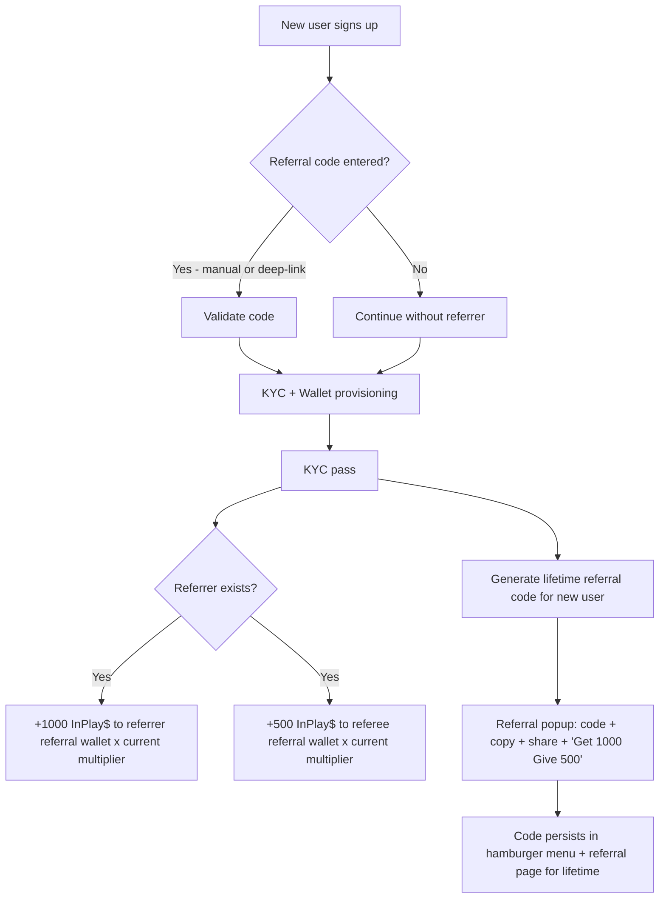
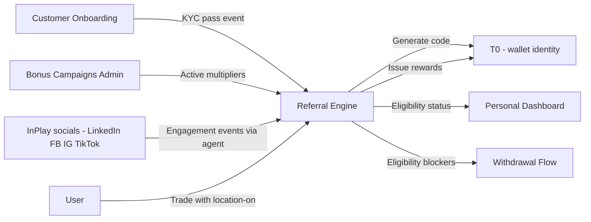

# InPlay Trading Challenge — Referral

> **Vision:** [[vision]]
> **Audiences:** [[audiences]]
> **Date:** 2026-05-14
> **Status:** Defined
> **Owner:** Cody (client-facing) + George (engineering) + Brett (strategy)
> **Sources:** _[[meetings/06-05-2026-vision-workshop]], [[meetings/12-06-2026-onboarding-and-renewal-and-global-component]]_

---

## 1. What Does This Component Do?

**Functional purpose:**

Referral is InPlay's growth engine. It is simultaneously a **product feature** (users earn and spend InPlay dollars through referrals) and a **distribution mechanism** (every user becomes a node in viral spread). The premise is dual-sided value: when a user invites someone who completes KYC, the referrer earns 1,000 InPlay$ and the referee gets 500 InPlay$. That same code becomes the user's permanent identity for sharing — across links, QR codes, dot cards, t-shirts, in-app posts, and embedded social shares. The referral wallet is a **separate balance** from the trading wallet, with no cap, and can refill the trading wallet (back to 100K) when it drops below 25K — creating a safety net proportional to the user's network without giving any trader an unfair in-game edge.

Referral is also where InPlay layers **behavioural campaigns**: multiplier days, themed events, cross-product nudges. Edwin and Cody see this as the marketing flywheel that turns the trading challenge into a self-propelling acquisition machine ahead of the August launch. The goal: build a meaningful referral bank during the summer pre-launch programme so that when the season starts, users already feel invested in the platform's success.

A separate strand — **cash payout eligibility** — also sits in this component. To convert from "I won InPlay dollars" to "I get real cash," users must satisfy a set of eligibility requirements (minimum referrals, location-sharing during trades, and others TBD). These rules need to be **transparent and trackable** on the user's referral dashboard — never buried in T&Cs. Skye: _"let's make it easy for them to track what they have done and haven't done."_

Sub-component map:

```
Referral
├── Code Lifecycle               (generation, lifetime stability, redemption entry, validation)
├── Share Surfaces               (link, QR, dot card, t-shirt, embedded-post)
├── Bonus Campaigns              (multiplier days, themed events, cross-product nudges)
├── Cash Eligibility Tracking    (rules engine + dashboard checklist + reminder prompts)
├── Social Engagement Credits    (follow/comment on InPlay socials → InPlay$)
├── Sponsor Redemption           (use referral $ for sponsor offers — future-state)
└── Donor / Group Accounts       (universities, alumni — exploratory)
```

**Audiences:**

All four audiences participate in Referral, but the **channels and motivations differ sharply**. See [[audiences]] for full audience definitions.

| Audience | How they use Referral | What they need from it |
|---|---|---|
| Crypto-Savvy Sports Trader | Shares on X / Discord, embeds referral QR in winning-trade posts. Treats referral bank as part of their P&L story. | Embedded-post mechanic. Easy share to socials. Public referral count signal. |
| Analytical Fan / Armchair GM | Shares with friend group, fantasy league chats, Reddit. Less likely to broadcast publicly. | Clear "what I get / what they get" framing. Easy private share (messages, email). |
| Finance-Curious Student | Campus ambassadors, dot card distribution at parties / events, QR on t-shirts at viewing parties. Highest viral coefficient. | QR mechanics. Bonus campaign visibility. Donor/alumni angle if their university participates. |
| Veteran Trader-Bettor | Shares within professional network. Low viral, high quality conversions. | Trust signals on the receiving end. Low-effort share mechanism (link / contact share). |

---

## 2. What Needs to Happen?

**Functional requirements:**

### Code lifecycle
- On KYC pass, system auto-generates a referral code for the new user. Code is **lifetime-stable** — never regenerates
- A popup appears immediately on first wallet-ready showing: the code, a Copy button, share buttons (Messages / Email / Socials), and the **"Get 1,000, Give 500"** framing in InPlay orange — Cody: _"in our color orange letters exactly that get a thousand give 500 something very short and sweet right there"_
- The same code is accessible from the account hamburger menu and on the dedicated referral page
- New signups can enter a referral code at registration (optional field). Clicking a referral **link** deep-links into the app and bypasses manual code entry
- On referee's KYC completion: **1,000 InPlay$ → referrer's referral wallet, 500 InPlay$ → referee's referral wallet** (rule from vision; reward triggered on full KYC pass, not just signup)

### Share surfaces
- Referral can be shared as: a **link** (deep-link bypasses code entry), a **QR code** (in-app, on dot cards, on t-shirts, in posts), or via the **share screen** integration on the device
- When a user shares a winning trade or other event from the app, their **referral QR is embedded** in the shared post (George's idea: _"there's one aspect of why they'd want to share which is just the vanity. I've just won $500…within that post, if we embed the user's referral QR code into the post that they're sharing, then they're getting the $500 and then the user is also getting the referral"_)
- Dot cards (Troy, ~$25/unit) carry the user's unique QR code + social links + a full data dump — suitable for campus ambassadors and frequently-networking users
- T-shirts carry a generic QR (not unique per shirt — Edwin: _"you're not going to print a unique URL code for each t-shirt"_) — used for gorilla marketing at sporting events, viewing parties, etc.
- Interns wearing branded clothing distribute generic codes; paid campus ambassadors carry dot cards with their own QR

### Bonus campaigns
- The platform must support **time-bound multipliers** on the dual-sided reward (e.g., 2x on Father's Day, July 4th)
- Recurring weekday multipliers (e.g., Tuesday or Wednesday) used to drive **pre-game-day signup** so users are fully onboarded before Saturday/Sunday kickoff
- **Cross-product behavioural campaigns**: Brett's example — _"follow 500 people on third space and for 72 hours your referral money jumps by 100%"_ — campaigns can incentivise non-wallet actions (follows, posts, third-space engagement) rather than always being direct wallet boosts
- Bonus campaigns visible to users on the referral page and via push/CRM
- Admin tooling required to schedule, activate, and monitor campaigns

### Cash eligibility tracking
- A set of eligibility rules gates conversion from InPlay$ to real cash (rules owned by InPlay; final set TBD — see Open Questions)
- Known rule candidates:
  - Minimum number of referrals (Edwin proposed 10)
  - Location-sharing enabled at time of trade
  - Age 18+ (already enforced at KYC)
  - Other rule(s) TBD — Edwin had a third that he couldn't recall in-call
- All eligibility requirements must be **visible and trackable** on the referral dashboard — bullet points or tick-boxes that a user can check at any time (Skye)
- When a user attempts to cash out, a reminder prompt surfaces any unmet requirements: _"just a reminder when you want to cash out, these are the things you have to fulfil"_
- This is a **transparency principle**, not a hidden T&C — Edwin: _"the more transparent we make the challenge, the more conversion we're going to get into production"_

### Wallet interaction
- Referral wallet has **no cap** (vision rule — influencer with 1,000 referrals could legitimately hold $1M+ in referral wallet)
- Referral wallet can only refill the trading wallet **back to 100K, when the trading wallet drops below 25K** (vision rule — safety net, not unfair edge)
- Referral wallet **resets to zero at end of season** (vision rule)
- All referral balances live on T0 wallets (decision from Onboarding extraction — wallets are on T0)

### Social engagement credits (from vision)
- Engagement on InPlay's own social posts (LinkedIn, Facebook, Instagram, TikTok — follow, comment) earns InPlay$ credits into the referral wallet
- Detail of which actions, what value, and how detection works → ⚠️ **Gap.** Agents are mentioned ("an agent will go figure out if you've got posts" — Brett) but no architecture decided

### Sponsor redemption (future-state, from vision)
- Users with large referral banks can redeem InPlay$ for sponsor offers
- Specifics: which sponsors, what offers, redemption flow → ⚠️ **Gap.**



**Business rules and constraints:**

- Reward triggers on **full KYC completion**, not signup (vision)
- Lifetime-stable code — never regenerates (this call)
- Trading wallet cap of 100K is absolute — referral refill cannot exceed
- Referral wallet reset at end of season (vision)
- Bonus multipliers apply to the dual-sided amounts (e.g., 2x = 2000 / 1000)
- A user cannot refer themselves (basic anti-abuse rule)
- Code redemption is optional at signup — no penalty for users without a referrer

**Edge cases and error states:**

- User tries to enter an invalid / expired / revoked code → friendly error, allow them to continue
- Referee fails KYC after entering code → no reward issued; referrer not notified
- Referee deletes their account → ⚠️ **Gap.** Are rewards reclaimed? Preserved?
- Multiple devices, same person attempts to refer themselves → KYC ID-match should catch (Persona controls)
- End-of-season reset — does it happen at season close or at the start of the next? ⚠️ Confirm with InPlay
- Campaign rolled back mid-period — what happens to rewards already issued under the higher multiplier? ⚠️ Gap

---

## 3. How Should It Look and Feel?

**Design direction:**

Visible, celebratory, frictionless. Sharing is the dominant action — every surface should make sharing easier than not sharing. The "what I get / what they give" framing must always be **first thing visible** on any referral surface — Skye called this out explicitly: _"the amount of times that I've just like xed a referral screen popup that comes up when I because I just want to get into utilising the app. We need to make sure that that's very clear and short and sharp."_

Cash eligibility tracking is the counterweight: clean, honest, checklist-style. Not buried in T&Cs. Not designed to trick or to bury. Users should be able to glance and know.

**Reference products:**

- **Revolut** — Brett — staged onboarding incentives that escalate ($200 → $700–$800 across multiple step-ups including card-order + first transaction). Reference for **staged eligibility tracking** more than for referral mechanics directly
- **eToro / Polymarket / Kalshi** — Skye — follow-individual mechanic (see their P&L, see their trades) is **third-space adjacent**, not Referral. Flagged here for cross-reference: when users share referral content, the social proof of their performance is part of the convert
- ⚠️ **Gap for next call** — explicit referral reference products. Robinhood referral, Coinbase referral, Cash App, Uber/Lyft historical mechanics

**Key UX principles:**

- **"What I get / what they get" framing in InPlay orange, first thing on every referral surface** (Skye + Cody)
- **Share is one tap** — popup share, copy button, deep-link mechanic must be instant
- **The QR code is the second hero** — it shows up in posts, on dot cards, on t-shirts, on the referral page
- **Eligibility checklist is transparent, never hidden** (Skye + Edwin)
- **Reminder prompts at cash-out moment surface unmet requirements** — proactive, not punitive

---

## 4. How Are We Going to Solve It?

| Capability | Build / Buy / Access | Provider | Rationale |
|---|---|---|---|
| Referral code generation + storage | Build | InPlay | Codes are lifetime-stable identifiers tied to T0 wallet identity. Custom because of multi-surface (link, QR, dot card, embedded post) integration. |
| Referral wallet (balance + transfer) | Access | **T0** | All wallets live on T0 per Onboarding decision. Refill logic (referral → trading when trading <25K) implemented as T0 transfer rule. |
| Bonus campaign engine | Build | InPlay (Rebel / Novosapien) | Time-bound multipliers, cross-product behavioural rules (follow X = bonus Y), admin tooling. Custom because campaigns blend with multiple components. |
| QR generation | Build | InPlay | Standard library; unique per user. Embedded in shares, on dot cards. |
| Dot cards | Buy | Third party (Troy's relationship) | ~$25/unit at low quantity; lower at scale. Carries unique QR + social links + data dump. |
| T-shirts / branded clothing | Buy | Third party | Generic QR. Gorilla marketing inventory. |
| Eligibility rules engine | Build | InPlay | Configurable rules (count thresholds, location-on, etc.). Drives dashboard checklist + cash-out reminder prompts. |
| Social engagement detection (follow/comment on InPlay socials) | Build | InPlay (likely agent-based) | Brett: _"an agent will go figure out if you've got posts."_ Detection mechanism + value mapping ⚠️ to design. |
| Embedded-post QR composition | Build | InPlay | When user shares from app (winning trade, etc.), their QR composites onto the share image. |
| Donor / group accounts | Build (future) | InPlay | Exploratory. Concept: universities, alumni funds as referral pool donors. ⚠️ securities-law review needed before build. |

---

## 5. What Data Does It Need?

| Data | Direction | Source / Destination | Notes |
|---|---|---|---|
| Referral code (per user) | Out (stored) | InPlay → user | Lifetime-stable. Generated on KYC pass. |
| Referral code (entered by referee) | In (user input or deep link) | App → InPlay | Optional at signup. Validated against existing codes. |
| Referrer ↔ referee link | Stored | InPlay | Audit trail of who referred whom. |
| Referral wallet balance | Stored | T0 | Per user. No cap. Reset to zero at season end. |
| Bonus campaign config | Stored | InPlay | Time window, multiplier, target action(s), conditions. |
| Current active multipliers | Read | InPlay | Applied at reward-issuance time. |
| Cash eligibility status per user | Stored | InPlay | Boolean per rule. Drives dashboard checklist + cash-out prompts. |
| User location (during trades) | In (device) | App → InPlay | Required for one eligibility rule (Edwin). Sensitivity: high — Troy's cyber flag. Captured during trade events, not continuously. |
| Social engagement events (InPlay socials) | In (external) | LinkedIn / Facebook / Instagram / TikTok APIs → InPlay (agent) | Detection of follows, comments. Value mapping per action type ⚠️ TBD. |
| QR code (per user) | Generated on demand | InPlay → device / dot card / share image | Encodes referral link with deep-link target. |
| Shared post events (with embedded QR) | Stored | InPlay | Track shares for funnel measurement. |
| Sponsor redemption transactions (future) | Stored | InPlay | Track redemptions, value, sponsor, user. |



---

## 6. Who Can Access It?

| Audience / Role | Access level | Notes |
|---|---|---|
| New user pre-KYC | Can enter a referral code at signup | Reward only triggers on KYC pass. |
| KYC-passed user | Has own code, can share, can redeem | All standard mechanics. |
| Holding-state user | Can see code, but reward triggers don't fire on incoming referrals until their own wallet provisioned — confirm semantics | ⚠️ Edge — confirm: does the popup with code wait for wallet-ready, or fire on KYC pass? |
| Anonymous (no account) | Cannot earn — but receives referral via link/QR landing | Hands them to Onboarding. |
| Donor / group account (future) | Aggregated referral pool, distributed to associated users | Exploratory. |
| Admin (InPlay / Rebel) | Campaign scheduling, eligibility rule config, audit | Internal tool, not user-facing. |

---

## 7. How Do We Know It's Working?

> ⚠️ **These metrics are recommendations only.** The call did not define success metrics. Bring to next session for discussion.

- [ ] **Referral code entry rate at signup**: ≥40% of new users enter or arrive via a referral code (signals virality + deep-link effectiveness)
- [ ] **K-factor**: average number of successful referrals per active user > 1.0 (each user brings at least one more on average — viral growth)
- [ ] **Time-from-share-to-signup**: median <72 hours (signals immediacy of conversion)
- [ ] **Campaign lift**: bonus multiplier days produce ≥2x daily signup volume vs baseline (validates the campaign engine ROI)
- [ ] **Embedded-post share rate**: ≥30% of trade-share events include the embedded referral QR (validates the embed mechanic works invisibly)
- [ ] **Eligibility transparency**: <5% of cash-out attempts blocked by an unmet requirement the user wasn't already aware of (validates Skye's transparency principle in practice)
- [ ] **Social engagement credit attribution**: agent detects ≥95% of qualifying engagements with the right value mapping (operational metric)
- [ ] **Referral wallet utilisation**: ≥60% of users with referral balance use it (either to refill trading wallet at <25K, or for sponsor redemption when available) — validates the wallet is a real feature, not a vanity number

**Cross-cutting funnel measurement:** Referral is a major node in the end-to-end funnel — flagged in Onboarding. Specifically: **share event → referee install → referee KYC pass → referee first trade → referee referral cohort** is the multi-step viral chain that needs explicit tracking. Belongs in the dedicated Analytics & Funnel Measurement doc.

---

## 8. Dependencies

**What Referral needs:**

| Depends on | What we need | Blocking? |
|---|---|---|
| **Customer Onboarding** | KYC pass event, registration-with-code event, deep-link handler at install | **Yes** — core path |
| **T0** | Referral wallet, transfer rule (referral → trading when trading <25K), wallet reset at season end | **Yes** — core path |
| **Trading** | Trade-with-location event (for eligibility rule) | Partial — needed for cash payout, not for accumulating InPlay$ |
| **Third Space** | Engagement events (if cross-product campaigns ride on third-space activity) | No for v1 |
| **Push / CRM** | Notify users on campaign starts, eligibility reminders, share prompts | No for v1 (can defer push notifications) |
| **Personal Dashboard** | Surface for referral balance + eligibility checklist | **Yes** — primary user surface |
| **Withdrawal Flow** | Surface eligibility blockers + transparent requirements at cash-out attempt | **Yes** when withdrawal goes live |
| **InPlay social accounts** (LI / FB / IG / TikTok) | APIs + agent access for engagement detection | No for v1 (can phase in) |
| **Persona** (KYC) | ID-match to prevent self-referral | Inherited via Onboarding |
| **Securities / regulatory review** | Confirmation that donor/group accounts don't trigger SEC implications | **Yes** before donor/group build |

**What other components need from Referral:**

- **Onboarding** — code validation at registration; code generation event post-KYC
- **Personal Dashboard** — referral balance, eligibility checklist, share surface
- **Trading** — refill trigger when trading wallet <25K
- **Withdrawal Flow** — eligibility verdict per user
- **Push / CRM** — campaign-launch event, eligibility-update event
- **Third Space** — sharing of trades with embedded QR

---

## 9. Priority

**Must-have at launch?** **Yes** — for the **summer pre-launch programme** specifically. The referral mechanic is the marketing engine for the August launch — users must be earning during summer.

**Sequencing rationale:**
- **Phase 1 (pre-launch — June/July):** code lifecycle, share surfaces (link + QR + dot card), bonus campaigns (Father's Day, July 4th, weekday multipliers), basic referral wallet on T0
- **Phase 2 (launch — August):** eligibility tracking + dashboard checklist, embedded-post QR, season-reset logic
- **Phase 3 (post-launch):** social engagement credits, sponsor redemption, donor/group accounts (subject to securities review)

Edwin is explicit on summer urgency. Cody is the owner of the campaign calendar — he flagged: _"I can work out a calendar basically or an events time frame over the summer of what these bonus days will look like."_

---

## 10. Risks

**Abuse vectors:**

- **Bot signups to farm referral wallets** — mitigated by Persona KYC (gov ID + biometric face-match)
- **Self-referral via multiple devices / accounts** — mitigated by Persona ID-match
- **Influencer collusion / farms** — partial mitigation via 100K trading wallet cap (refill cap) — wallet can be large but trading edge is bounded
- **Stolen ID submissions to harvest dual-sided rewards** — Persona biometric is the control
- **Campaign exploitation** — coordinated mass-signup during a 2x multiplier window. Mitigation: campaign telemetry, anomaly detection
- **Social engagement credit gaming** — fake follows/comments, bot rings on InPlay's socials. Mitigation: agent detection rules + manual audit

**Data risks:**

- **User location data during trades** — sensitive PII. Troy explicit: _"we're going to have to really look at cyber security here because I don't want us to be in the press on all this personal data being leaked."_ Capture only at trade events (not continuous tracking), encrypt at rest, minimise retention
- **Social engagement detection via external APIs** — third-party API stability, rate limits, ToS compliance with each social platform
- **End-of-season wallet reset** — irreversible. Communication to users critical. Edge: what if a user is mid-share when reset fires?

**Compliance:**

- **AML / KYC** — referral rewards have monetary value. AML implications inherited from Onboarding (Persona).
- **Securities review for donor/group accounts** — alumni "donating" purchasable referral banks → potential securities classification. ⚠️ **Must clear with counsel before build.**
- **Sponsor redemption** — depending on offer types (cash equivalents, gift cards, services), compliance varies by jurisdiction. ⚠️ TBD.
- **Tax** — large referral wallets that convert to cash trigger 1099 obligations. Handled at withdrawal flow, but Referral generates the underlying balance.
- **Advertising standards** — campaigns ("Get 1,000 InPlay$!") regulated by FTC. Clear disclosure required.
- **Promotion law** — bonus multiplier campaigns may classify as sweepstakes/promotions in some jurisdictions. ⚠️ TBD.
- **Self-referral / KYC bypass** is the abuse vector regulators care most about — control via Persona ID-match.

**Controls needed:**

- Anti-fraud anomaly detection on signup spikes during multipliers
- Audit trail on every reward issuance (referrer/referee/timestamp/multiplier/campaign)
- Eligibility checklist surfaced at cash-out moment + on the referral page
- Rate limiting on share events to throttle scripted abuse
- Manual review queue for high-value referral banks before cash payout
- Disclosure copy on every share surface (T&Cs link, brief disclosure where required)
- Clear season-reset communication (push, email, in-app) ahead of reset

---

## Sub-Components

| Sub-Component | Overview | Status | Link |
|---|---|---|---|
| Code Lifecycle | Generation on KYC pass, lifetime stability, redemption entry at signup, code validation | Collecting | _[[sub-components/code-lifecycle]]_ |
| Share Surfaces | Link, QR code, dot card, t-shirt strategy, embedded-post composition | Collecting | _[[sub-components/share-surfaces]]_ |
| Bonus Campaigns | Multiplier days, themed events, cross-product behavioural campaigns, admin tooling | Collecting | _[[sub-components/bonus-campaigns]]_ |
| Cash Eligibility Tracking | Rules engine, dashboard checklist, reminder prompts at cash-out moment | Collecting | _[[sub-components/cash-eligibility-tracking]]_ |
| Social Engagement Credits | Follow/comment on InPlay socials → InPlay$ via agent detection | Collecting | _[[sub-components/social-engagement-credits]]_ |
| Sponsor Redemption | Use referral $ for sponsor offers (future-state) | Collecting | _[[sub-components/sponsor-redemption]]_ |
| Donor / Group Accounts | Universities, alumni-funded pools (exploratory, securities review required) | Exploratory | _[[sub-components/donor-group-accounts]]_ |

---

## Open Questions for Next Call (InPlay team)

### Cash eligibility (highest priority)
- What is the **final set of eligibility rules** for cash payout? Edwin proposed 10 referrals + location-on + a third he couldn't recall in-call — confirm full list
- Are eligibility rules **per cash withdrawal** or **per season**?
- Different tiers (e.g., higher cash threshold requires more referrals)?
- Communication policy when a rule changes mid-season

### Wallet mechanics
- Edge: referee deletes account after reward issued — claw back the referrer's reward, or preserve?
- Mid-campaign rollback — what happens to rewards issued under a now-cancelled multiplier?
- Holding-state semantics: does referral popup fire on KYC pass or wallet-ready?
- End-of-season reset — exact timing? Comms plan?

### Donor / group accounts (Brett + Edwin idea)
- Securities-law review needed: alumni "purchasing" referral banks to gift to students — does this trigger securities classification?
- Eligibility model for student users — opt-in to a donor pool? Auto-assigned by university affiliation?
- Donor portfolio variant (Troy): give alumni $100K real capital to invest on behalf of a fund — separate product, not Referral. Confirm scoping

### Social engagement credits
- Which actions earn how many InPlay$ — full value matrix
- Detection mechanism: bespoke agent per platform vs unified service
- Anti-gaming: detection of bot follow rings, fake comments
- Bring-up sequencing — which platforms first?

### Sponsor redemption (future-state)
- Sponsor pipeline status: who, what offers, when?
- UX of the redemption flow
- Compliance per offer type and jurisdiction

### Campaign engine
- Calendar for summer pre-launch campaigns — Cody to own (in-progress)
- Admin tooling — InPlay-internal or Rebel-built?
- Geographic targeting on campaigns (some markets only)?
- Rollback mechanics for live campaigns

### Cross-cutting
- End-to-end funnel measurement — Referral nodes (share → install → KYC → first trade) feed into the cross-cutting Analytics & Funnel Measurement doc

### Cybersecurity
- Location data handling framework — capture, encryption, retention, deletion — needs the dedicated cyber session Troy flagged in Onboarding

---

## Diagrams Index

- Section 2 — referral journey (Mermaid `graph TD`)
- Section 5 — referral engine data flow (Mermaid `graph LR`)
