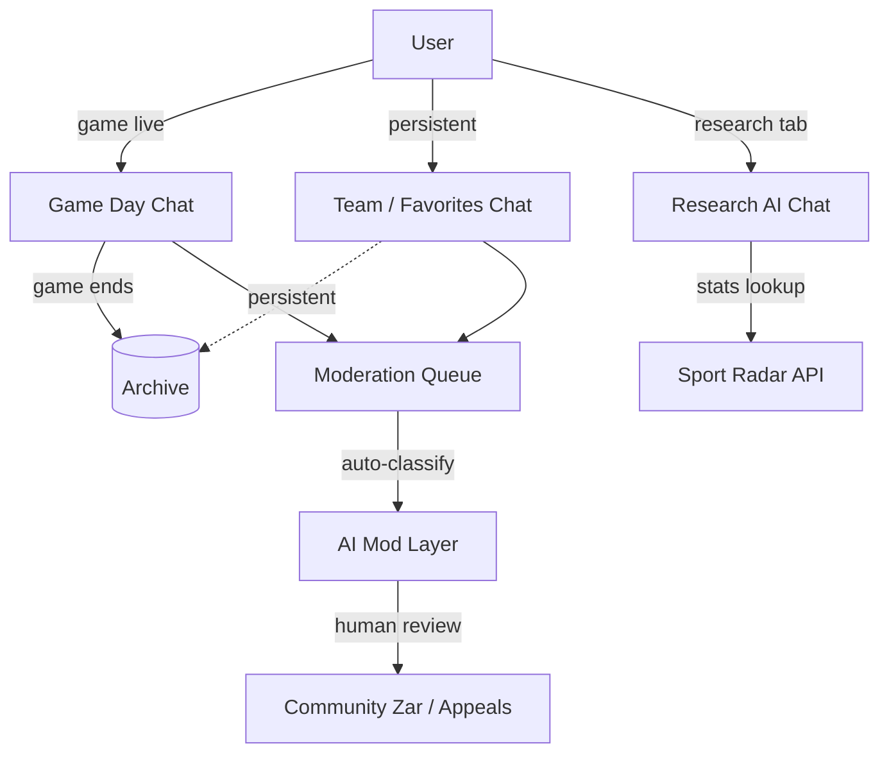
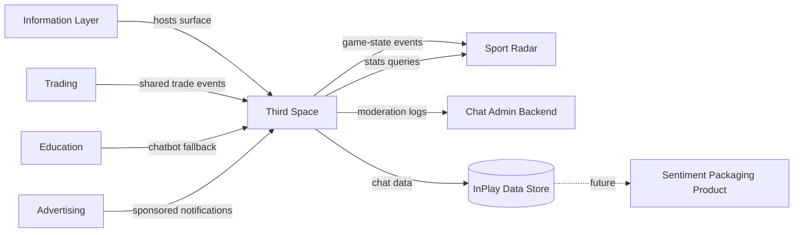

# InPlay Trading Challenge -- Third Space

> **Vision:** [[vision]]
> **Date:** 2026-05-14
> **Status:** Defined
> **Owner:** Cody Haugen (product framing) / George Westbrook (engineering) / Brett StClair (client-facing)
> **Sources:** _[[meetings/06-05-2026-vision-workshop]], [[meetings/14-05-2026-education-thirdspace-challenge-website]]_

---

## 1. What Does This Component Do?

**Functional purpose:**

The Third Space is the community and social layer of the InPlay app -- where users react to live games in real time, discuss trades and teams over longer horizons, and ask the AI research chat sports questions that draw on the Sport Radar data set. It is **stickiness infrastructure, not core product**. Trading is the core product. The Third Space exists to keep users on-platform during dead time, to surface organic peer learning, and to feed the social proof that drives viral acquisition. Skye's definition: _"a social space for them to be able to communicate their thoughts on what they think is going on and be reactive to what's going on with teams. It's a social community like WhatsApp essentially or a chat room for them to be able to converse on what's going on."_

Cody crystallised the surface area into three forms during this session, and that framework is the spine of this component:

1. **Game Day Chat** -- ephemeral, lives on the matchup page, ends when the game ends. Two teams' worth of users in one chat going back and forth (_"I'm long the Bears, while I'm long the Packers, I'm actually shorting the Bears"_). Mostly banter, memes, gifs. _"It's mainly going to be about s***-talking."_
2. **Team / Favorites Chat** -- long-horizon, persistent, Reddit-style. Per-team or per-favourite groupings. Where users share news (_"Did you see the Packers signed a free agent this week?"_), strategy thoughts, and longer-form analysis.
3. **Research AI Chat** -- private, conversational, NLP-driven. Loaded with Sport Radar statistics. Users ask questions like _"When was the last time the Packers threw for 300 yards?"_ and get short, accurate answers. Modelled on Statmuse. Lives on the research tab. Free in the challenge, likely paid in production.

InPlay does **not** curate, summarise, or aggregate sentiment from these chats -- that line was set at the vision level (_"I don't want to be the summarizer of the sentiment. I want users to make their own journey"_) and applies here. The platform provides infrastructure; users provide content.

All chat data is owned and stored by InPlay. Skye flagged this as a long-term value pool: _"it's potentially a very valuable space for us to be able to record what people are saying because it lends itself for us to be able to start packaging thematic narratives that we are able to sell from a data perspective."_ This is a future-state monetisation pillar -- not an MVP feature, but the data plumbing must support it from launch.

```
Third Space
├── Game Day Chat               (matchup-page, ephemeral, banter)
├── Team / Favorites Chat       (persistent, longer-horizon, Reddit-style)
├── Research AI Chat            (NLP on Sport Radar stats, research tab)
├── Moderation System           (user-appeals + AI layer, no active InPlay mod)
├── Chat Admin Backend          (internal dashboard, stats, campaign injection)
├── Sentiment / Data Packaging  (FUTURE -- thematic narratives sold to advertisers)
└── Influencer Broadcast Channels (FUTURE -- Discord-style channel ownership)
```

**Personas:**

> **Canonical audience definitions:** [[audiences]]

| Audience | How they use this component | What they need from it |
|---------|---------------------------|----------------------|
| **Crypto-Savvy Sports Trader** | Light on game-day banter, heavy on Research AI Chat. Treats the AI chat like Bloomberg's chat-with-data feature -- a query interface for sports stats | Fast, accurate NLP answers. Reliable Sport Radar coverage. No fluff |
| **Analytical Fan / Armchair GM** | Primary user of Team / Favorites Chat. This is where they prove they were right three weeks ago. Heavy on long-form analysis, news sharing, "I told you so" energy | Persistent threads, easy news / link sharing, ability to follow other users they respect, gifs / memes for emphasis |
| **Finance-Curious Student** | Lives in Game Day Chat during live games. Banter, memes, social rivalry. May follow influencer broadcast channels (future state) | Fast, low-friction posting. Gifs / memes / reactions. Sense of community / belonging. Mobile-first chat UX |
| **Veteran Trader-Bettor** | Mostly bypasses the social chats. Uses Research AI Chat as a Statmuse replacement | The AI chat needs to be genuinely good. Speed and accuracy matter more than community |

---

## 2. What Needs to Happen?

**Functional requirements:**

_Game Day Chat:_

- A chat is automatically provisioned for each live game when the game opens
- Chat lives on the matchup / game day page
- Users from both teams' fanbases can post in the same chat
- Chat ends when the game ends -- Cody: _"chats will not live on the game page longer than the game is actually being played"_
- Users can post text, gifs, memes (potentially -- 80/20 yes/no until chat infrastructure is chosen)
- Users can send "gifts" to other users on the rival team (George floated this for game-day banter mechanic)
- Chat scope is intentionally narrow -- two teams' fanbases per chat avoids the "illegal stream chat" firehose

_Team / Favorites Chat:_

- A persistent chat exists for each NFL / NCAA team
- Users join automatically when they favourite a team (or buy shares?)
- Chat is Reddit-style: longer-form, news sharing, persistent threads
- Users can post text, links, gifs, images
- Available outside of live games (the persistent layer)

_Research AI Chat:_

- Conversational chat interface, private to the user
- Lives on the Research tab (within Information Layer)
- Loaded with the full Sport Radar statistics dataset
- Answers natural-language questions about teams, players, historical performance
- Short-form answers -- Cody: _"so much more natural language processing back and forth with the chat tool as opposed to the research"_
- Modelled on Statmuse (Cody: _"Google and Amazon Alexa actually default to Statmuse for sports questions"_)
- Free during the challenge; paid feature in production

_Moderation:_

- User-based moderation with appeals system -- Brett: _"set up something like a user-based moderation. So when someone can lodge and put an appeal that it's violated your policies"_
- AI layer on top to scale moderation review (auto-classify obvious violations)
- InPlay does NOT actively moderate -- this scales catastrophically (Brett: 400K msgs/hour at Teraflow)
- Policy violations trigger warnings before bans
- Cody's "Zar" idea: appoint a community moderator per team, vetted, badge of honor

_Admin Backend:_

- Internal dashboard for monitoring chat stats, volumes, sentiment trends (without acting on them)
- Notification / campaign injection capability -- staff can fire announcements into specific chats
- Moderation queue review interface
- Reporting for compliance audits

_Cross-cutting requirements:_

- All chat data is stored by InPlay (Skye: data ownership is non-negotiable)
- Chat data is available for the future sentiment / thematic narrative packaging product
- Chat surfaces appear in context: Game Day Chat on the matchup page; Team Chat on the team / favorites page; Research AI Chat on the research tab
- Chats must scale to bursty traffic -- a touchdown or big play creates a surge of messages
- Users can mute / report / block other users
- Users can favourite / follow specific posts or threads (future state -- not MVP)

**Business rules and constraints:**

- InPlay does NOT curate or summarise sentiment from chats (vision-level rule, applies here)
- All chat data is owned by InPlay
- Game Day Chats end with the game -- no persistent record on the game page after kickoff ends
- Profanity: tolerated (age-gated platform). Brett: _"I'm guessing it's perfectly fine to swear on the platform, right? You've age-gated, great."_
- Hate speech / racial slurs: not tolerated, action required, warnings before bans
- "Watch the freedom-speech kind of scenarios" -- moderation policy must be defensible and bias-aware
- Research AI Chat does NOT give trading advice -- references stats only (consistent with vision-level rule)
- Game Day Chats are scoped to two-teams-per-chat to avoid the "illegal stream chat" failure mode

**Edge cases and error states:**

- Chat volume spikes 100x at a touchdown -- backend must absorb burst without dropping messages
- User posts hate speech -- AI layer auto-flags, warning fires, repeat → ban
- User reports another user -- appeal queue triggers, AI pre-classifies, human (Zar?) reviews
- User cleared app data -- chat membership and read state survives because account-pinned
- Game ends mid-message -- chat closes, last messages still post but chat archives to data store
- Research AI Chat asked a non-sports question -- refuses politely, redirects to relevant chat surface
- Research AI Chat asked a trading-advice question -- refuses, references education modules instead
- Influencer / Zar abuses their role -- escalation path TBD ⚠️ **Gap**
- Two users post simultaneously -- ordering by server timestamp (no special rules)



---

## 3. How Should It Look and Feel?

**Design direction:**

Mobile-first, fast, native to how the audience already chats. Not Slack -- too utilitarian. Not Discord (yet -- that's future state). More like Twitch chat for the game-day banter, more like Reddit / WhatsApp for the longer-horizon team chats, more like a sleek chat assistant for the AI research surface.

Skye's strong frame: this is _"team banter."_ Brett's illustrative example: _"Oh, this team's on fire, this is so great"_ and someone writes _"wait, they're just about to tank, this is going to be the worst loss."_ The vibe is fan culture, not finance Twitter.

Each surface has its own design personality:
- **Game Day Chat** -- fast, lively, gifs and memes, semantic colors for each team's fans (visually clear who's repping who)
- **Team / Favorites Chat** -- threaded, longer-form, easier to scan and reply within a thread
- **Research AI Chat** -- clean, query-and-answer, Bloomberg-or-Statmuse aesthetic

**Reference products:**

- **Statmuse** -- direct model for Research AI Chat. Cody: _"they built an entire business off short form answers that run off NLP and how people interact with that is amazing"_
- **Twitch chat / illegal stream chat** -- aesthetic reference for the game-day energy, but also the anti-pattern for scale (Cody: _"that chat lives on those illegal streams and it's just I mean you can't even read a sentence before it's gone"_)
- **Reddit** -- structural model for the Team / Favorites Chat -- longer-horizon, threaded, persistent
- **WhatsApp** -- Skye's analogy for the social-chatroom feel
- **Discord** -- future state, for influencer-owned channels
- **eToro / Polymarket / Kalshi follow-individual mechanic** -- referenced in earlier components, applies here for the future "follow specific influential traders" feature

**Key UX principles:**

- Game Day Chat ends with the game -- a clear visual close, archive accessible elsewhere
- Two-team chats only (not free-for-all per game day) -- protects against firehose
- Mute / block / report are first-class actions, accessible in two taps
- Profanity tolerated, hate speech not -- this distinction must show up in the UI (e.g., a slur triggers an inline warning before posting)
- Research AI Chat answers in 1-3 sentences -- no walls of text
- Senders are clearly labelled by team affiliation in Game Day Chat (rivalry framing)
- Brand campaign notifications can be injected by staff via admin backend (e.g., "Sponsored by Doritos -- big play coming up")

---

## 4. How Are We Going to Solve It?

| Capability | Build / Buy / Access | Provider / Approach | Rationale |
|-----------|---------------------|-------------------|-----------|
| Chat infrastructure (text, presence, history) | Access | **Open-source headless chat platform** (specific platform TBC -- Brett identified one in earlier proposal, name not recalled in this session) | _"Open source instead of reinventing the wheel here, it's been done a thousand times over. It's called the headless. So I've double-checked it's a headless platform, so we can layer our own head on it with our own interface."_ Reduces build risk and time |
| Game Day Chat lifecycle | Build | InPlay internal -- glues the chat platform to game state (Sport Radar match-status events) | Auto-create chat on game open, auto-close on game end, archive to data store |
| Team / Favorites Chat lifecycle | Build | InPlay internal -- persistent membership tied to favourite-team list | Auto-join when user favourites a team |
| Research AI Chat | Build | InPlay internal -- LLM with Sport Radar tool access, Statmuse-style retrieval | Cody's reference. Needs sports-aware NLP, real-time stat retrieval, refusal logic for non-sports / advice queries |
| Moderation: auto-classification | Build / Buy | InPlay internal + commercial content-moderation API (e.g., Perspective, OpenAI moderation, Hive) | AI pre-classification scales beyond what humans can do at launch volume |
| Moderation: user appeals | Build | InPlay internal | Per Brett's recommendation -- users flag content, appeals queue processes |
| Community moderation ("Zar") | Build | InPlay internal -- vetted per-team mod role | Cody's idea, needs definition. Off-loads from InPlay onto trusted users |
| Admin backend / dashboard | Build | InPlay internal | Stats, moderation queue review, notification / campaign injection |
| Data storage (all chat messages) | Build | InPlay internal (PostgreSQL + chat-platform-native store, exported daily) | Skye: data ownership is the value pool |
| Sentiment / thematic packaging _(future)_ | Build | InPlay internal NLP pipeline | FUTURE -- thematic narratives sold to advertisers / media buyers (Skye / Omnicom angle) |
| Influencer broadcast channels _(future)_ | Build | InPlay internal | FUTURE -- Discord-style ownership, top traders / influencers own a channel |

---

## 5. What Data Does It Need?

| Data | Direction | Source / Destination | Notes |
|------|-----------|---------------------|-------|
| Chat messages | In / Stored | User posts → chat platform → InPlay data store | High-volume, bursty, archived for sentiment / narrative packaging |
| Chat metadata | Stored | InPlay internal | Chat ID, type (game-day / team / research), participants, lifecycle state |
| User memberships | Stored | InPlay internal | Which chats each user is in, mute / block lists, follow lists |
| Game state events | In | Sport Radar API | Drives Game Day Chat lifecycle (open on kickoff, close on game-end) |
| Sport Radar stats | In | Sport Radar API | Powers Research AI Chat answers |
| Moderation flags | Stored | InPlay internal | Auto-flags from AI layer, user-reports, resolutions, actions taken |
| User actions (warning / ban) | Stored | InPlay internal | Audit trail for moderation, dispute resolution |
| Sentiment / theme extracts _(future)_ | Out | Advertiser / Omnicom-style buyer | FUTURE -- packaged narratives, not raw chat |
| Admin notifications / campaigns | Out | Specific chats | Staff-injected announcements |

---

## 6. Who Can Access It?

| Persona / Role | Access level | Notes |
|---------------|-------------|-------|
| Fully onboarded users | Full -- can post, react, reply, follow | Across all chat surfaces |
| KYC-pending (holding state) users | Read-only | Can view chats but not post until KYC complete ⚠️ **needs confirmation** |
| Pre-onboarded users | No access | Chats are not exposed on web / public surfaces |
| Community Zars (per-team mods) | Full + moderation review queue | Vetted, badged users for a specific team |
| InPlay staff (admin) | Admin backend access | Stats, moderation review, campaign injection. Does NOT actively moderate in-line |
| InPlay legal / compliance | Audit access | Read-only access to action logs and dispute records |

---

## 7. How Do We Know It's Working?

- [ ] At least 30% of active users post in a chat at least once per session
- [ ] Game Day Chats remain readable -- post-rate per chat does not exceed a threshold that prevents users from following the conversation (TBD threshold based on testing)
- [ ] Average session length increases for users who engage with chats vs. those who don't
- [ ] Research AI Chat: 80%+ of queries return an accurate, sports-relevant answer in under 3 seconds
- [ ] Research AI Chat: refusal rate for advice / non-sports queries is high (the chatbot stays in its lane)
- [ ] Moderation queue resolution time stays under target (TBD -- to set with launch volume)
- [ ] Community sentiment data is captured and structured well enough to be productised in year 2
- [ ] Influencer / Zar adoption -- at least one engaged Zar per top-10 team within the first month

---

## 8. Dependencies

**What this component needs:**

| Depends on | What we need | Blocking? |
|-----------|-------------|----------|
| Open-source chat platform selection | Specific platform decision (Brett to confirm name from earlier proposal) | Yes -- platform choice shapes everything downstream |
| Sport Radar API | Game state events (drives Game Day Chat lifecycle); stats data (powers Research AI Chat) | Yes for Game Day Chat lifecycle; Yes for Research AI Chat content |
| Information Layer | Game / matchup / team / research-tab surfaces to host chats on | Yes -- chats need their parent surfaces |
| Customer Onboarding | Authenticated user identity, KYC status (for posting privileges) | Yes |
| Trading component | Trade-with-location and trade-shared events (so users can share executed trades into game-day banter) | No -- chats can launch without trade-sharing |
| Referral component | If chat engagement earns rewards (social engagement credits), needs the credit pipeline | No -- decision pending, not launch-critical |
| Education component | Reference link from Research AI Chat refusals ("for trading advice, see the education module on long/short") | No |
| Advertising (cross-cutting) | Campaign injection contracts -- which chats can run sponsored notifications, pricing, packaging | No for launch, Yes for monetisation |
| Legal / policy team | Written moderation policy, bias-aware enforcement guidelines | Yes -- can't launch chats without a policy |

**What other components need from this one:**

- **Information Layer** embeds chat surfaces on matchup, team, and research-tab pages
- **Trading** can share executed trades into the Game Day Chat (Cody's idea: AI captures the trade, generates a team-themed share card)
- **Personal Dashboard** may surface chat notifications and unread counts
- **Advertising** can inject sponsored notifications via the admin backend
- **Referral** _(future)_ may credit social engagement (chat activity) toward the cash-eligibility checklist

---

## 9. Priority

**Must-have at launch?** Partial. Per vision: _"designed as stickiness and social proofing function not the core product."_ Specifically:

- **Game Day Chat** -- launch requirement. The biggest reason to keep users in-app during live games is the social rivalry.
- **Team / Favorites Chat** -- launch requirement. Persistence layer, drives retention across games.
- **Research AI Chat** -- launch-desirable but not blocking. Free in challenge, paid in production -- a value-add but the trading challenge works without it.
- **Moderation system (basic)** -- launch requirement, non-negotiable. Cannot launch chats without policy + moderation infrastructure.
- **Admin backend** -- launch requirement (minimal version).
- **Sentiment / thematic packaging** -- explicitly future-state.
- **Influencer broadcast channels** -- explicitly future-state. _"In a future version of this, I see this being able to build into various different potential Discord channels"_ (Skye).

**Sequencing rationale:**

- Open-source chat platform choice is the first blocker -- shapes timeline, capabilities, scale ceiling
- Moderation policy + tooling must be in place before chats go live to real users
- Game Day Chat depends on Sport Radar game-state events -- coordinate with Information Layer build
- Research AI Chat depends on the AI Chatbot work in Education component -- shared infrastructure
- Sentiment packaging is a year-2 product; data plumbing supports it from day one (storage + structure)

**Post-MVP (explicitly deferred):**

- Sentiment / thematic narrative packaging product
- Discord-style influencer-owned broadcast channels
- Follow-individual mechanic (eToro / Polymarket pattern)
- Community ranking that weights certain users' messages (George floated, parked)
- Cross-game / cross-team aggregated narrative views

---

## 10. Risks

**Abuse vectors:**

- Bot-driven chat manipulation (price manipulation via fake sentiment) -- KYC mitigates partially, but sophisticated actors persist
- Coordinated raids / brigading on a team chat from rival fanbases -- moderation tooling must catch
- Slurs and harassment escalating -- repeat-offender pattern must auto-escalate
- "Zars" abusing their role (favouritism, biased bans) -- escalation / dispute path TBD ⚠️ **Gap**
- Coordinated meme-stock-style sentiment manipulation (vision-level risk, surfaces here)
- Influencers (future) using broadcast channels to push trades for personal benefit (front-running) -- regulatory risk

**Data risks:**

- Bursty traffic at touchdowns / key moments overwhelming backend -- message drop is a UX failure
- Chat data exfiltration -- sensitive PII in chat (e.g., users sharing personal info inadvertently)
- Sentiment data quality -- if chat is mostly memes, the thematic narrative product is hollow
- Research AI Chat hallucination -- fabricated sports stats damage trust
- Cross-cutting cyber risk -- Troy's vision-level flag applies here: _"the more data we collect, the more sensitive it gets and the more susceptible we are to cyber attacks"_

**Compliance:**

- Hate-speech moderation laws vary by jurisdiction (UK Online Safety Act, EU DSA, US state-by-state)
- "Watch the freedom-speech kind of scenarios" (Brett) -- bias-aware enforcement is required
- Defamation in user posts -- platform liability framework needed (Section 230 in US, varies elsewhere)
- Research AI Chat must NOT give trading advice -- consistent with the vision-level rule (Edwin: _"I don't want to be the summarizer of the sentiment. I want users to make their own journey"_)
- Sponsor-injected announcements must be disclosed as sponsored content (FTC)
- Sentiment data sales to advertisers (future) -- GDPR / CCPA implications, must be anonymised / aggregated

**Controls needed:**

- Written moderation policy, published in-app
- AI pre-classification + user appeals queue
- Community Zars per team (badged, vetted, accountable)
- Rate limiting on posts (anti-spam, anti-bot)
- Auto-warning + escalation ladder for repeat offenders
- Sponsored-notification disclosure UI
- Research AI Chat guardrails (refuse advice, refuse non-sports, reference stats only)
- Cybersecurity controls aligned with the cross-cutting framework Troy is scoping
- Defamation reporting path with takedown-and-review workflow

---

## Sub-Components

| Sub-Component | Overview | Status | Link |
|--------------|----------|--------|------|
| Game Day Chat | Per-matchup chat, ephemeral, two-teams scope, ends with game. Banter, gifs, memes, semantic colors per team | Collecting | [[sub-components/game-day-chat/game-day-chat]] |
| Team / Favorites Chat | Per-team persistent chat. Reddit-style threading. Long-horizon news / strategy / fandom | Collecting | [[sub-components/team-favorites-chat/team-favorites-chat]] |
| Research AI Chat | NLP query interface on Sport Radar stats. Statmuse-model. Lives on research tab. Free in challenge, paid in production | Collecting | [[sub-components/research-ai-chat/research-ai-chat]] |
| Moderation System | User-appeals + AI auto-classification layer + community Zars. No active InPlay moderation | Collecting | [[sub-components/moderation-system/moderation-system]] |
| Chat Admin Backend | Internal dashboard: stats, moderation queue, campaign / notification injection | Collecting | [[sub-components/chat-admin-backend/chat-admin-backend]] |
| Sentiment / Data Packaging | _(FUTURE)_ Thematic narrative extraction from chat data, sold to advertisers / Omnicom-style buyers | Stub | [[sub-components/sentiment-data-packaging/sentiment-data-packaging]] |
| Influencer Broadcast Channels | _(FUTURE)_ Discord-style channel ownership for top traders / influencers | Stub | [[sub-components/influencer-broadcast-channels/influencer-broadcast-channels]] |

---

## Diagrams

_Three-form architecture and lifecycle flow appear in Sections 1 and 2._



---

## Gaps and Questions for Next Call

### Gaps

- **Specific open-source chat platform name** -- Brett identified one in an earlier proposal but couldn't recall. Need to confirm name + capability set
- **Zar role definition** -- vetting process, authority, escalation path if a Zar abuses the role
- **Per-team chat membership** -- auto-join on favouriting? On holding shares? Opt-in? Not decided
- **Moderation policy text** -- who drafts, who signs off, how is it published / updated?
- **Defamation / takedown workflow** -- platform-liability legal framework not yet scoped
- **KYC-pending posting rights** -- can holding-state users post or only read?
- **Rate-limiting thresholds** -- specific limits per chat type not set
- **Game Day Chat archive UX** -- after a game ends, is the archive accessible? Where?
- **Cross-game banter** -- Cody's example was Bears vs Packers fans in one game; what about a user who is long Packers and Chiefs simultaneously in two parallel game-day chats?
- **Sentiment packaging product scope** -- needs its own dedicated session; flagged as year-2 but data plumbing decisions made now constrain that future product

### Questions for Edwin / Cody / Skye

1. Which open-source chat platform is the front-runner -- can we name it in this doc?
2. Do KYC-pending users post in chats, or read-only until they finish?
3. Are Zars compensated (referral $? cash?) or volunteer / badge-of-honour only?
4. What's the legal team's framework on hate-speech enforcement (jurisdiction-specific or global policy)?
5. Game Day Chat archive -- accessible to who, for how long, where?
6. Research AI Chat -- launch feature or fast-follow? Cody's framing suggests launch, but no explicit decision
7. Sentiment packaging product -- when do we scope it properly? It's referenced as a year-2 product but the data structure decisions are happening now
8. For sponsored notifications injected into chats -- who controls editorial veto (InPlay or sponsor)?
