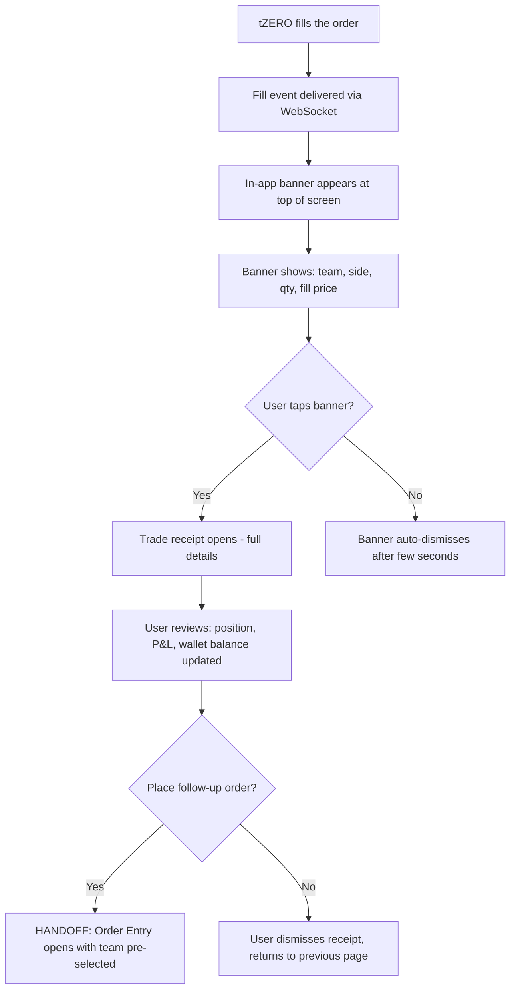
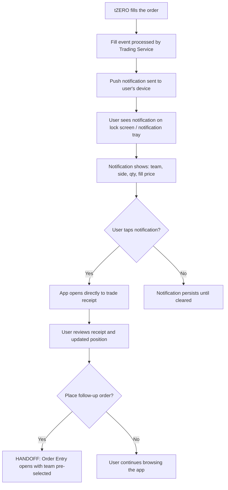
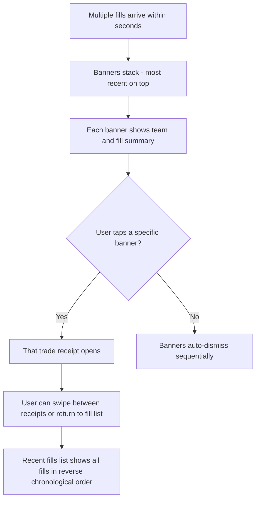
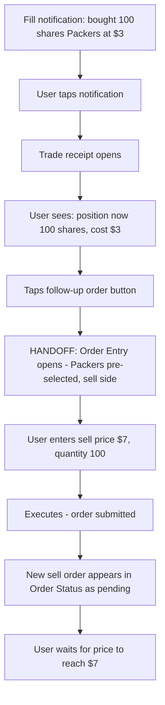

# InPlay Trading Challenge -- Fill Confirmation

> **Component:** [[trading]]
> **Date:** 2026-05-11
> **Status:** Collecting
> **Owner:** George Westbrook
> **Sources:** _[[meetings/11-06-2026-trading-component]]_

---

## 1. What Does This Sub-Component Do?

**Functional purpose:**

Fill Confirmation is the moment the user learns their order executed. With limit orders, this moment is decoupled from order submission -- the fill could arrive seconds or hours after the order was placed. The user might be on a completely different page, or even outside the app entirely.

This sub-component handles two things: the alert and the receipt. The alert is a real-time notification (in-app banner or push notification) that tells the user "your order for X shares of the Packers filled at $25.00." The receipt is the detail view they can tap into -- full trade details including team, side, quantity, fill price, total value, timestamp, and updated position.

Edwin was emphatic about this being fast and prominent: the fill notification is what keeps the trading loop spinning. User gets filled on a buy at 3, sees the notification, immediately places a sell at 7. Without it, users have to manually check Order Status, which breaks the flow and reduces trading activity.

This is also the natural surface for post-MVP sponsored moments -- a brand owning the fill celebration ("You earned $380 -- congratulations by Bank of America," Edwin). The team aligned that ads belong after the trade completes, not during the trade flow (Max: "when you're trading, let the trade flow happen. Don't worry about your advertising"). Skye reinforced this: "when you've completed the sale, something else happens. Then that can be potentially owned by a brand." Skye also identified brand-moment matching: energy drinks owning volatility moments, crypto wallets owning leaderboard payouts. Not MVP scope, but the sub-component should be designed with that extensibility in mind.

**Entities that interact with it:**

- All three user personas -- anyone whose order has filled
- The Sports-Passionate Casual benefits most during live games -- fast fill notifications mean fast reactions
- The Experienced Trader may receive multiple fill notifications in quick succession -- needs to distinguish between them
- The Young Aspiring Trader gets their first "it worked" moment -- this is a retention-critical experience

---

## 2. What Needs to Happen?

**Functional requirements:**

_Fill Alert (in-app):_

- When a fill occurs, an in-app notification appears immediately -- banner/toast at top of screen, visible regardless of which page the user is on
- Alert shows: team name, side (bought/sold), quantity filled, fill price
- Alert is tappable -- takes user to the trade receipt detail view
- Alert auto-dismisses after a few seconds if not tapped
- Multiple fills in quick succession should stack, not overwrite each other

_Fill Alert (push notification):_

- If the user is outside the app when a fill occurs, a push notification is sent
- Push notification shows the same core info: team, side, quantity, price
- Tapping the push notification opens the app directly to the trade receipt

_Trade Receipt (detail view):_

- Full details of the executed trade: team name/symbol, side, quantity filled, fill price, total value (quantity x price), timestamp
- If partial fill: show what filled and what's still pending
- Updated position after the fill: new position size, average cost, unrealised P&L
- Updated wallet balance after the fill
- Quick action: user can immediately place a follow-up order from the receipt (e.g., filled on a buy, now wants to place a sell) -- links to Order Entry with team pre-selected

_Fill History:_

- Recent fills accessible from a list -- last N fills shown in reverse chronological order
- Each fill is tappable to view the full receipt
- Distinct from Trade History (which is the long-term historical record) -- this is the "what just happened" view

**Business rules:**

- Fill notifications must arrive in real time -- target sub-50ms from tZERO execution report to user's screen (via FIX Gateway -> NATS -> Centrifugo). _(Latency target and infrastructure from architecture docs)_
- Partial fills generate a notification per fill event -- user sees "50 of 100 shares filled" then later "50 of 100 shares filled" (or a single "100 shares fully filled" if it happens at once)
- Execution busts (ExecType=H) should generate a prominent correction notification -- "your previous fill of X shares has been reversed"
- Execution corrections (ExecType=G) should update the receipt with corrected price/quantity

**Edge cases:**

- User receives a fill notification while in the Order Entry modal placing a different trade -- does the alert interrupt them?
- Multiple fills arrive simultaneously (e.g., 5 partial fills in 2 seconds) -- how do we avoid notification overload?
- Fill notification arrives but user has lost connectivity -- is it queued and delivered on reconnect?
- Execution bust after the user has already acted on the fill (e.g., placed a sell order based on a buy that gets busted) -- cascading impact

---

## 3. Entity Journeys

### 3a. Isolated Journeys

#### Journey 1: User receives a fill while browsing the app

**Entity:** User (all personas)

**Input:** User placed a limit order earlier, now browsing a different page. The order fills.

**Outcome:** User sees the fill, reviews the receipt, and optionally places a follow-up order

**Steps:**

**Acceptance criteria:**

- [ ] Fill notification appears within 50ms of tZERO execution report
- [ ] Banner visible on top of whatever page the user is on
- [ ] Banner shows team, side, quantity, fill price at a glance
- [ ] Tapping banner opens full trade receipt
- [ ] Receipt shows updated position, P&L, and wallet balance
- [ ] Quick action to place a follow-up order from the receipt
- [ ] Banner auto-dismisses if not tapped -- doesn't block the UI permanently

---

#### Journey 2: User receives a fill while outside the app

**Entity:** User (all personas)

**Input:** User placed a limit order, closed the app. The order fills.

**Outcome:** User receives a push notification, taps it, and sees the trade receipt

**Steps:**

**Acceptance criteria:**

- [ ] Push notification delivered promptly when fill occurs and user is outside the app
- [ ] Notification shows enough info to understand what happened without opening the app
- [ ] Tapping notification deep-links directly to the trade receipt -- not the home screen
- [ ] Receipt shows the same full details as the in-app version

---

#### Journey 3: User receives multiple fills in quick succession

**Entity:** User (Experienced Trader)

**Input:** User has multiple pending orders across teams. Several fill within seconds of each other (e.g., game event moves multiple prices).

**Outcome:** User can review each fill individually without being overwhelmed

**Steps:**

**Acceptance criteria:**

- [ ] Multiple fill notifications don't overwrite each other -- they stack or queue
- [ ] Each notification is distinguishable (different team names, prices)
- [ ] User can access any individual fill's receipt
- [ ] Recent fills list provides an overview when multiple fills have occurred
- [ ] No notification overload -- if 10+ fills arrive at once, group or summarise rather than firing 10 banners

---

### 3b. Cross-Component Journeys

#### Journey 1: Fill triggers a follow-up trade (Edwin's core loop)

**Entity:** User (Sports-Passionate Casual, Experienced Trader)

**Input:** User gets filled on a buy at $3, wants to immediately place a sell at $7

**Handoff point:** Fill Confirmation receipt -> Order Entry with team pre-selected and side flipped

**Components involved:** Trading (Fill Confirmation) -> Trading (Order Entry) -> Trading (Order Status)

**Outcome:** User completes the buy-then-sell loop without leaving the trading flow

**Steps:**

**Acceptance criteria:**

- [ ] Receipt offers a clear "place follow-up order" action
- [ ] Order Entry opens with the same team pre-selected
- [ ] Side is flipped -- if the fill was a buy, follow-up defaults to sell (and vice versa)
- [ ] The full loop (fill notification -> receipt -> follow-up order submitted) takes under 5 seconds
- [ ] Edwin's loop: "filled on buy at 3, immediately place a sell at 7"

---

## 4. Look and Feel

**Design specifics:**

The fill notification should feel like a moment -- something happened, pay attention. Not alarming, but unmistakably present.

_In-app banner:_
- Slides in from the top, overlays the current page
- Colour-coded: blue accent for buy fills, red accent for sell fills
- Compact -- one line of key info (team, side, qty, price), tappable for full receipt
- Auto-dismisses after 4-5 seconds, slides out
- Multiple banners stack vertically, dismiss sequentially

_Trade receipt:_
- Full-screen or large bottom sheet -- this is a moment worth pausing on
- Team name and logo prominent at top
- Large fill price -- the number the user cares about most
- Side, quantity, total value clearly laid out
- Updated position section: new size, average cost, unrealised P&L
- Updated wallet balance
- Follow-up order button prominent at bottom -- keeps the trading loop going
- Clean, celebratory but not over the top -- this is a trading receipt, not a slot machine win

_Push notification:_
- Standard OS notification format
- Title: "Order Filled" or "Trade Executed"
- Body: "Bought 100 shares Packers @ $3.00"
- Deep-links to receipt on tap

**UX principles specific to this sub-component:**

- The fill notification is the heartbeat of active trading -- it must be fast and reliable. If users can't trust that they'll be notified, they'll compulsively check Order Status instead
- Don't interrupt active order entry -- if the user is mid-trade in the Order Entry modal, the fill banner should appear above it but not dismiss the modal
- The receipt should feel like a natural pause point -- review what happened, decide what's next, then act or move on
- Post-MVP: the receipt is where sponsored moments will live. Design the layout to accommodate a brand element without it feeling shoehorned in later

---

## 5. Data Requirements

| What | Direction | Description | Source / Destination |
|------|-----------|------------|---------------------|
| Fill event | In | Real-time notification that an order filled: ExecID, ClOrdID, team symbol, side, fill quantity (LastShares), fill price (LastPx), timestamp | tZERO execution report via FIX Gateway -> NATS -> Centrifugo WebSocket |
| Partial fill event | In | Same as fill event but with remaining quantity (LeavesQty) and cumulative filled (CumQty) | tZERO execution report |
| Updated position | In | New position size, cost basis, unrealised P&L after the fill | tZERO execution report (PosSIZ, PosCOST, PosUpnl) or Trading Service calculation |
| Updated wallet balance | In | New trading wallet balance after the fill | Trading Service (PostgreSQL + Redis) |
| Execution bust | In | A previous fill has been reversed -- ExecRefID points to the original fill being busted | tZERO execution report (ExecType=H) |
| Execution correction | In | A previous fill's price or quantity has been adjusted | tZERO execution report (ExecType=G) |
| Push notification delivery | Out | Fill summary sent to user's device when they're outside the app | Push notification infrastructure (mechanism TBD) |
| Follow-up order context | Out | Team symbol and flipped side passed to Order Entry when user taps follow-up action | Internal -- passed to Order Entry modal |

---

## 6. Dependencies

| Depends on | What we need | Blocking for build? |
|---|---|---|
| FIX Gateway + NATS + Centrifugo | Real-time delivery pipeline: tZERO execution report -> FIX Gateway -> NATS -> Centrifugo -> user's screen. The entire notification chain | Yes -- without it, no real-time fill alerts |
| Trading Service | Processes fill events, updates positions and wallet balances, provides the data for the receipt | Yes -- receipt needs calculated position and wallet data |
| Push notification infrastructure | Delivers fill alerts when user is outside the app | No -- in-app notifications work without it, but Edwin's vision depends on it |
| Order Entry (sibling) | Receives handoff when user taps "follow-up order" from the receipt | No -- receipt works without the follow-up action |
| Order Status (sibling) | Order Status tracks the state change; Fill Confirmation delivers the alert. They observe the same event but serve different purposes | No -- both can be built independently |

**What siblings or other components need from this one:**

- **Order Entry** receives team and flipped side when user places a follow-up order from the receipt
- **Portfolio View** reflects the position changes that the fill created
- **Trade History** receives the completed trade as a historical record
- **Advertising (cross-cutting, post-MVP)** will attach sponsored moments to the receipt experience

---

## 7. Risks

**Specific risks:**

- Notification delay -- if the fill alert arrives late (seconds instead of milliseconds), the user misses the window to place a follow-up order at a good price. Edwin's entire loop depends on speed
- Missed notifications -- if the WebSocket drops and reconnects, fills that occurred during the gap might not trigger a banner. User doesn't know they own shares
- Push notification unreliability -- iOS and Android push delivery is not guaranteed or instant. User outside the app may learn about a fill minutes late
- Notification overload during volatile moments -- a touchdown moves 5 prices, 5 orders fill at once. 5 banners firing in rapid succession is chaotic
- Execution bust after user acted -- user gets filled, sees the receipt, places a follow-up sell order based on the fill. Then the fill gets busted. They now have a sell order open with no underlying position. Cascading problem
- Receipt data inconsistency -- if the position or wallet balance shown on the receipt is calculated before all concurrent fills are processed, the numbers could be momentarily wrong

**Controls to build into the journeys:**

- Fill events must be persisted (NATS JetStream) so they survive WebSocket disconnections -- on reconnect, any missed fills are delivered
- Notification grouping for rapid-fire fills -- if 5+ fills arrive within 2 seconds, show a summary banner ("5 orders filled -- tap to review") rather than firing 5 individual banners
- Execution bust notification must be at least as prominent as the original fill notification -- don't let a quiet correction hide a material position change
- Receipt should show a timestamp on all data -- "position as of [time]" so the user knows the data is point-in-time
- Push notification as a fallback, not the primary -- in-app delivery via Centrifugo is the reliable path. Push is for when the user isn't in the app

---

## 8. Priority

**Must-have at launch?** Yes -- without fill notifications, users have no way to know their orders executed unless they manually check Order Status. Edwin's core trading loop (fill -> react -> follow-up order) depends entirely on this sub-component. It's what keeps users actively trading rather than passively waiting.

**Sequencing rationale:** Build alongside Order Status. Both observe the same tZERO execution report events -- Order Status updates the state in the list, Fill Confirmation delivers the alert. They share the same data pipeline (FIX Gateway -> NATS -> Centrifugo) so building them together is efficient. The trade receipt can be built after the alert since the alert is the time-critical piece.

---

## Open Questions

1. Should fill banners interrupt the Order Entry modal, or appear above/behind it?
2. What's the grouping threshold for rapid-fire fills -- 3 in 2 seconds? 5 in 5 seconds? What does the summary banner look like?
3. Push notification provider -- Firebase Cloud Messaging, APNs directly, or a third-party service?
4. Should the receipt show a "share this trade" action for Third Space integration?
5. How long does the receipt persist -- can users go back and view receipts from earlier in the session, or only from the notification?
6. Post-MVP sponsored moments -- should the receipt layout reserve space for a brand element now, or retrofit later?
