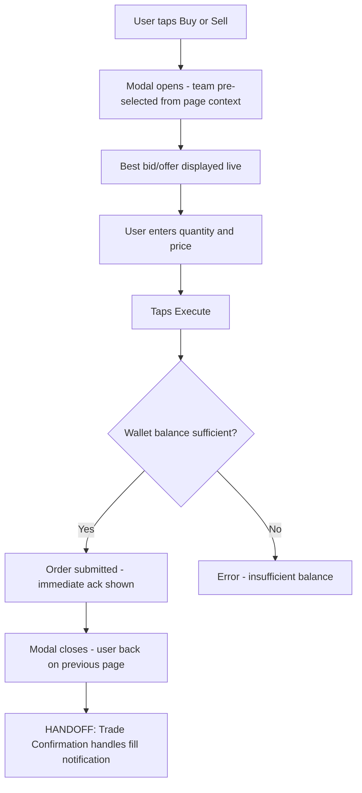
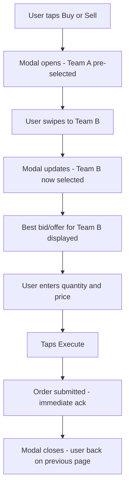
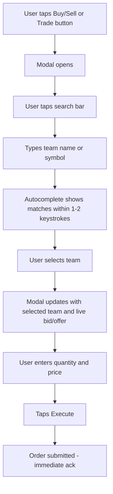
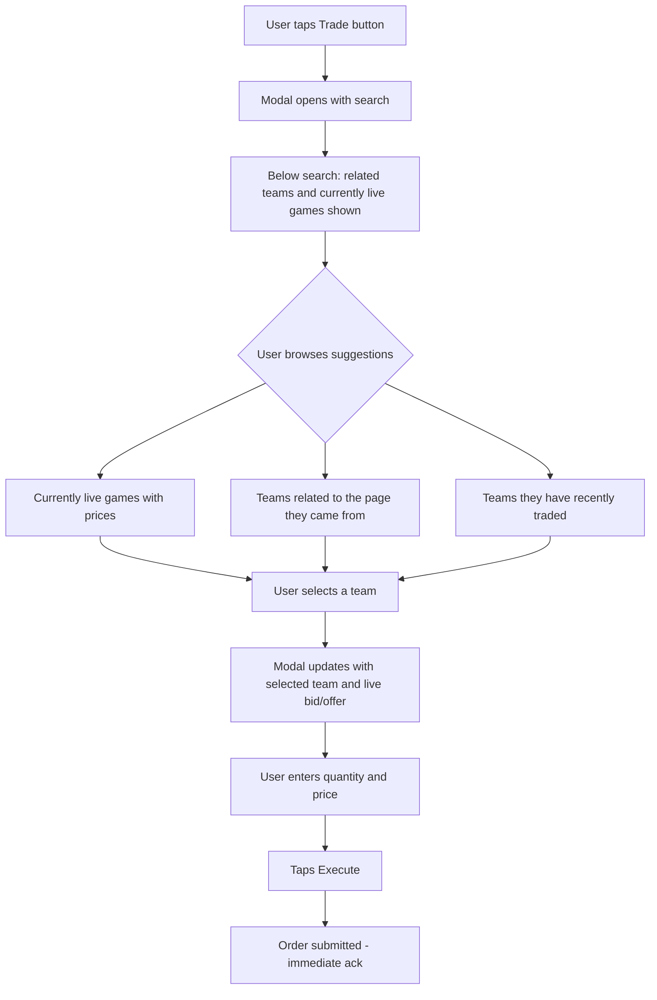
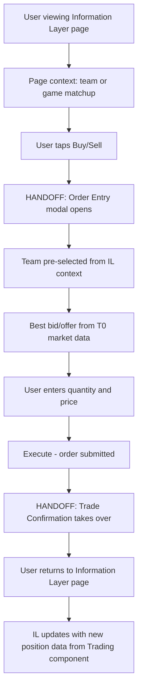

# InPlay Trading Challenge -- Order Entry

> **Component:** [[trading]]
> **Date:** 2026-05-11
> **Status:** Collecting
> **Owner:** George Westbrook
> **Sources:** _[[11-05-2026-trading-component]]_

---

## 1. What Does This Sub-Component Do?

**Functional purpose:**

Order Entry is the moment the user commits to a trade. It's the modal/overlay that appears when a user taps buy or sell from anywhere in the app. The sub-component handles everything from the tap to the submission: team selection (pre-populated or searched), quantity input, price input, and the execute button.

The defining design principle is context-awareness. The modal doesn't start blank -- it infers the most likely team based on where the user is in the app. On a team page, it defaults to that team. On a game day page, it shows both teams in the matchup. On any other page, it opens with search. This reduces clicks and keeps the user in flow.

Order Entry is persistent -- buy/sell buttons float across all pages (collapsible when not wanted) so the user is never more than 2-3 taps from submitting an order. The only order type supported at MVP is limit orders (tZERO does not support native market orders).

**Entities that interact with it:**

- All three user personas -- post-onboarding, with a funded trading wallet
- The Sports-Passionate Casual is the primary user during live games -- reacting fast to game events, needs minimal friction
- The Experienced Trader uses it frequently and precisely -- specific prices, specific quantities, may have multiple orders across teams
- The Young Aspiring Trader is learning -- may not understand limit orders initially, needs clarity on what "price" means (links to Education component)

---

## 2. What Needs to Happen?

**Functional requirements:**

_Modal / Overlay:_

- Modal appears on top of the current page when user taps buy, sell, or trade -- user stays in context
- Modal displays: team name/symbol, current best bid and best offer prices (live-updating), quantity input, price input, execute button
- Best bid/offer displayed above buy/sell buttons so users can see the current market before committing (Troy: "that's our version of a market order")
- Modal can be dismissed without submitting -- user returns to whatever page they were on

_Context-Aware Defaults:_

- Team page: modal pre-selects that team, user only needs to enter quantity and price (2 clicks to submit)
- Game day page: modal shows both teams in the matchup, user picks one then enters quantity and price (3 clicks max)
- Other pages (leaderboard, etc.): modal opens with search, user finds team then enters quantity and price (3 clicks max)
- Search always available as fallback regardless of which page the user came from

_Persistent Access:_

- Buy/sell buttons float on screen across all pages
- Buttons stay visible while scrolling
- Buttons can be collapsed/minimised and re-expanded
- On pages where trading is the primary intent (team page, trade page), buttons auto-expand
- On pages where trading is secondary (leaderboard, education), a single trade button in the corner opens the modal

_Order Fields:_

- Team (pre-populated or searched)
- Side (buy or sell -- determined by which button was tapped)
- Quantity (user input)
- Price (user input -- limit price)
- Order type is always limit (no selection needed at MVP)

_Submission:_

- No "are you sure?" confirmation dialog -- execute on tap
- Immediate "order acknowledged" feedback (sub-50ms target)
- Async fill notification handled by Trade Confirmation sub-component

**Business rules:**

- Only limit orders (OrdType=2) -- tZERO constraint
- Wallet balance must be sufficient for order value (quantity x price) before submission is allowed
- Buy always on left, sell always on right -- non-negotiable
- ClOrdID generated on submission -- max 20 chars, no leading zeroes (tZERO will reject otherwise)
- Only onboarded users can submit orders

**Edge cases:**

- User taps buy on a team page, but wants to trade a different team -- search fallback must be fast and obvious
- User enters a price far from current best bid/offer -- do we warn them? (Open question)
- User tries to submit with insufficient wallet balance -- what's the UX? Greyed-out execute button? Inline error?
- User taps buy/sell during a trading halt on that team -- what do they see?
- Concurrent orders across multiple teams -- does the modal track that you already have an open order on this team?
- User is mid-trade in the modal and a fill notification comes in for a different order -- how does that interrupt (or not) the current flow?

---

## 3. Entity Journeys

### 3a. Isolated Journeys

#### Journey 1: Direct trade -- right team already selected

**Entity:** User (all personas)

**Input:** User taps buy/sell, modal opens with the correct team pre-selected

**Outcome:** Limit order submitted without changing team

**Steps:**

**Acceptance criteria:**

- [ ] Team pre-selected based on page context
- [ ] Best bid and best offer prices displayed and updating in real time
- [ ] User can enter quantity and price
- [ ] Execute button submits the order with no confirmation dialog
- [ ] "Order acknowledged" feedback appears in under 50ms
- [ ] User returns to previous page after submission
- [ ] Total flow from tap to submission is 2 clicks (buy/sell -> execute) plus quantity/price input

---

#### Journey 2: Swipe to a different team on the page

**Entity:** User (Sports-Passionate Casual, Experienced Trader)

**Input:** User taps buy/sell, modal opens with one team, but they want the other team from the same matchup

**Outcome:** User swipes to the other team and submits

**Steps:**

**Acceptance criteria:**

- [ ] Swipe gesture switches between teams available on the current page
- [ ] Visual indicator that more teams are available (dots, peek of next card, etc.)
- [ ] Bid/offer updates immediately on swipe to reflect the new team
- [ ] Swipe feels natural and doesn't conflict with other phone gestures
- [ ] _Note: swipe UX is proposed -- needs wireframing and testing before committing_

---

#### Journey 3: Search for a team not on the page

**Entity:** User (all personas)

**Input:** User wants to trade a team that isn't defaulted or available via swipe

**Outcome:** User finds team via search, submits order

**Steps:**

**Acceptance criteria:**

- [ ] Search bar always accessible within the modal
- [ ] Autocomplete handles misspellings
- [ ] Results appear within 1-2 keystrokes
- [ ] After team selection, flow is identical to Journey 1

---

#### Journey 4: Browse related/live teams from the modal

**Entity:** User (Sports-Passionate Casual)

**Input:** User opens the trade modal but isn't sure which team to trade -- wants to browse what's active

**Outcome:** User discovers a team to trade from suggestions within the modal

**Steps:**

**Acceptance criteria:**

- [ ] Modal shows contextual suggestions below the search bar: live games, related teams, recently traded teams
- [ ] "Related teams" driven by page context -- e.g., on Packers page, show teams playing Packers today, next week
- [ ] Live games section shows current prices to prompt trading ideas
- [ ] Suggestions don't overwhelm -- compact, scannable, secondary to search
- [ ] Tapping a suggestion loads that team into the modal identically to search selection

---

### 3b. Cross-Component Journeys

#### Journey 1: Information Layer context flows into Order Entry

**Entity:** User

**Input:** User is consuming data on an Information Layer page and decides to act

**Handoff point:** Information Layer provides page context (which team/game) -> Order Entry modal opens with that context pre-loaded

**Components involved:** Information Layer (Team Page / Single Game Page / Game Day Overview) -> Trading (Order Entry) -> Trading (Trade Confirmation)

**Outcome:** The user's trading decision is informed by the data they were just viewing, and the modal reflects that context without the user re-entering it

**Steps:**

**Acceptance criteria:**

- [ ] Modal correctly infers team from Information Layer page context
- [ ] User does not need to re-enter information already visible on the page they came from
- [ ] After trade, Information Layer page reflects updated position/P&L data
- [ ] The round trip (IL -> trade -> IL) feels seamless, not like switching between apps

---

## 4. Look and Feel

**Design specifics:**

The modal should feel like a trading ticket -- compact, focused, no distractions. When it appears, the background dims and the user's attention narrows to one thing: this trade. Everything they need is on one screen -- team, bid/offer, quantity, price, execute.

The modal sits at the bottom of the screen (bottom sheet pattern) -- close to where the persistent buy/sell buttons live, close to the user's thumb. It slides up, not down from the top. Dismissable by swiping down or tapping outside.

Two distinct states for the persistent buttons:
- **Primary pages** (team page, game day page, trade page): buy and sell buttons visible, expanded
- **Secondary pages** (leaderboard, education, etc.): single trade button, compact, corner placement

Inside the modal:
- Team name and symbol prominent at top
- Best bid and best offer displayed clearly -- these are the anchor prices the user is deciding against
- Quantity and price inputs large enough for thumb entry -- no fiddly small fields
- Execute button is the largest element -- unmistakable, distinct from everything else (fat finger protection via spatial separation, not a confirmation dialog)
- Blue for buy flow, red for sell flow -- colour carries through the modal background or accent, reinforcing which side the user is on

**Reference products (from this session):**

- **MetaTrader 5** -- best bid/offer displayed above buttons, sliding quantity selector, tabs for order types. Cody: "five seconds if that" to execute. The gold standard for speed
- **Trading 212** -- single trade button expanding to options. Cleaner persistent UI but one extra click
- **Poly Market** -- negative reference. Three clicks before you can even start inputting. The experience to avoid

**UX principles specific to this sub-component:**

- The modal is a dead end by design -- you do one thing here (submit an order) and you leave. No navigation, no links, no rabbit holes
- Quantity and price fields should support smart defaults where possible -- e.g., pre-populate price with best offer (for buys) or best bid (for sells) so the user can just adjust if needed
- Swipe between teams should feel like flipping cards, not navigating pages -- lightweight, instant, no loading state
- Search suggestions (live games, related teams, recent trades) are secondary to the search bar -- visible but not competing for attention

---

## 5. Data Requirements

| What | Direction | Description | Source / Destination |
|------|-----------|------------|---------------------|
| Page context | In | Which team or game matchup the user is currently viewing -- determines pre-selected team(s) | Information Layer component |
| Best bid/offer (live) | In | Current best bid price/size and best offer price/size for the selected team -- updates in real time within the modal | tZERO via FIX Market Data feed |
| Team symbology | In | Symbol-to-team mapping, team names, logos -- powers search autocomplete and modal header | InPlay internal |
| Related teams | In | Teams contextually relevant to the current page -- opponents, upcoming matchups, same division | InPlay internal (derived from Sport Radar schedule data) |
| Currently live games | In | Which games are active right now with current prices -- shown as suggestions in the modal | Sport Radar (game status) + tZERO (prices) |
| Recently traded teams | In | Teams the user has traded recently -- shown as suggestions | InPlay internal (user's order history) |
| Wallet balance | In | Current trading wallet balance -- checked before order submission is allowed | InPlay internal (Redis cache for fast reads) |
| Order submission | Out | Validated order: team symbol, side, quantity, price, ClOrdID | tZERO via FIX Gateway (NATS -> FIX NewOrderSingle MsgType=D) |
| Order acknowledgement | In | Immediate ack that the order was received and is pending | Trading Service (returned synchronously on submission) |

---

## 6. Dependencies

| Depends on | What we need | Blocking for build? |
|-----------|-------------|----------|
| tZERO ATS | Order execution via FIX 4.2 Order Entry session. Without it, orders can't be submitted | Yes -- can stub with mock responses for UI development, but no real trading without tZERO |
| tZERO FIX Market Data | Live best bid/offer for the selected team. Displayed in the modal to inform the user's price decision | Yes -- modal without live prices is guessing in the dark |
| Information Layer | Page context (team, game matchup) to power context-aware defaults | No -- modal works with search-only if no context is available |
| Trading Service | Order validation (wallet check, format validation, ClOrdID generation) and submission to FIX Gateway via NATS | Yes -- this is the backend that processes the order |
| Wallet Management (sibling) | Current wallet balance to allow/block order submission | No -- can build UI without balance checks initially |
| Team symbology | Symbol convention and team data for search autocomplete | No -- can use team names as placeholder |
| Sport Radar | Game schedule and status for "currently live" suggestions in the modal | No -- suggestions are a nice-to-have, search works without them |
| Trade Confirmation (sibling) | Handles what happens after submission -- ack feedback, fill notifications | No -- Order Entry's job ends at submission |

**What siblings or other components need from this one:**

- **Trade Confirmation** receives the submitted order and handles the acknowledgement and fill notification flow
- **Order Management** displays and manages orders that were created here
- **Portfolio View** shows positions that result from orders executed here
- **Information Layer** needs to know a trade was submitted so it can update position/P&L displays on the page the user returns to

---

## 7. Risks

**Specific risks:**

- Fat finger trades -- no confirmation dialog means accidental taps submit real orders. Spatial separation of the execute button is the only protection. If button placement is wrong, users will accidentally trade
- Context-aware defaults wrong -- if the system infers the wrong team (e.g., page context is ambiguous), user might submit an order for a team they didn't intend. Edwin confirmed this is a real scenario: "just because you're reviewing the Green Bay Packers doesn't mean you want to trade the Green Bay Packers"
- Swipe gesture conflicts -- if swipe-to-switch-teams collides with phone-level gestures (swipe to go back, swipe to dismiss) it will frustrate users or trigger unintended actions
- Stale bid/offer in modal -- if the price displayed in the modal is delayed or stale, users may set their limit price based on outdated information. Particularly risky during volatile game moments when prices move fast
- Search performance under load -- on game day with thousands of users searching simultaneously, autocomplete must still return results within 1-2 keystrokes
- Limit order confusion for new users -- Young Aspiring Trader persona may not understand why their order didn't fill ("I clicked buy, why don't I own it?"). Without education links or inline guidance, this creates frustration and support burden

**Controls to build into the journeys:**

- Execute button must be physically separated from all other interactive elements -- minimum tap target size, buffer zone around it
- Team name displayed prominently in the modal -- user should always clearly see which team they're about to trade before hitting execute
- Live bid/offer must show a freshness indicator -- if data is delayed, surface a "delayed" label
- Pre-populate price field with best offer (for buys) or best bid (for sells) as a sensible default -- reduces the chance of users entering nonsensical prices
- Inline link to Education component for users who may not understand limit orders -- unobtrusive but discoverable
- Wallet balance shown in the modal -- user can see available funds before entering quantity, reducing rejected submissions

---

## 8. Priority

**Must-have at launch?** Yes -- without Order Entry, there is no trading. This is the single most critical sub-component in the entire Trading component. Everything else (portfolio, history, order management) is meaningless if users can't place an order.

**Sequencing rationale:** Build first within Trading. The persistent buy/sell buttons, the modal, and the context-aware defaults are the core user experience that every other trading sub-component depends on. Trade Confirmation, Portfolio View, and Order Management all flow downstream from Order Entry.

Blocked by tZERO integration for real order submission, but the UI can be built and tested with mock responses in parallel.

---

## Sub-Sub-Components

Leaf node -- no further decomposition needed.

---

## Open Questions

1. Should the price field pre-populate with best offer (buys) / best bid (sells) as a default, or start empty?
2. Fat finger protection -- is spatial separation enough, or do we need a minimum order value threshold?
3. How many teams should be available via swipe? Just the teams on the current page, or a broader set?
4. Should the modal show the user's existing position in that team (if any) before they submit a new order?
5. What's the behaviour when the user taps execute but the wallet balance check fails -- greyed-out button beforehand, or error after tap?
6. Inline education link for limit orders -- where does it sit in the modal without cluttering the UI?
