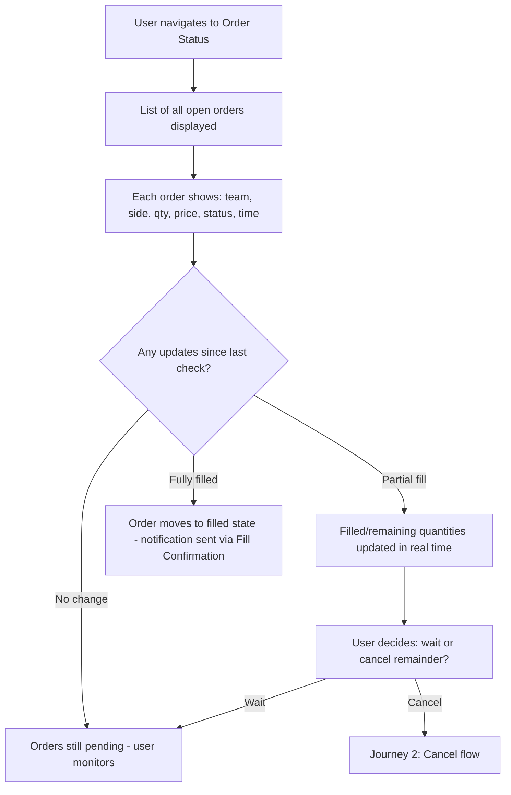
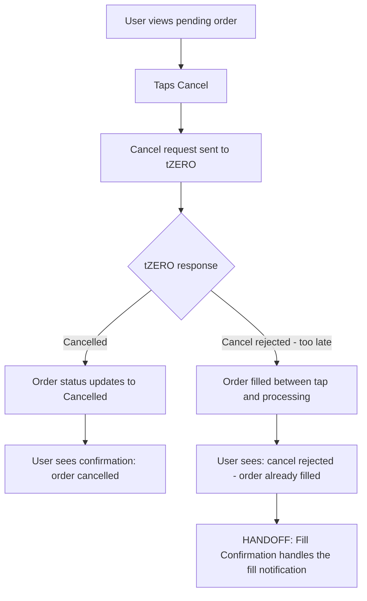
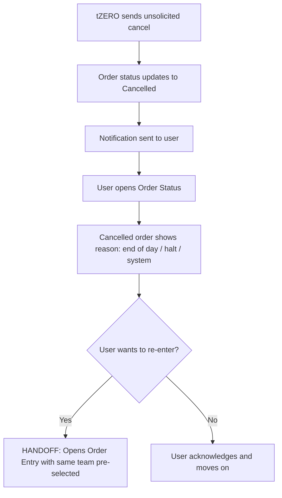
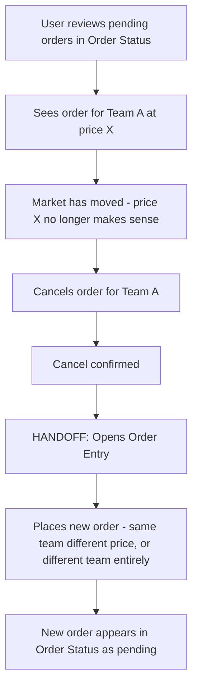

# InPlay Trading Challenge -- Order Status

> **Component:** [[trading]]
> **Date:** 2026-05-11
> **Status:** Collecting
> **Owner:** George Westbrook
> **Sources:** _[[meetings/06-05-2026-vision-workshop]], [[architecture/integrations/tzero]]_
> **Note:** Order Status was not directly discussed in the 11-06-2026 trading component session. Content is derived from the vision workshop, architecture docs (tZERO FIX specs), and reasonable inference from the limit-order-only decision.

---

## 1. What Does This Sub-Component Do?

**Functional purpose:**

Order Status is where users go to check on their pending orders. With limit orders, there's no guarantee of immediate fill -- an order could sit on the book for minutes or hours waiting for the market price to reach the user's limit price. This sub-component gives users visibility into what's happening with every order they've placed.

It shows all open/pending orders with their current state: pending (waiting on the book), partially filled (some shares executed, rest still waiting), or completed states (fully filled, cancelled, rejected, expired). Users can take action from here -- cancel an order that hasn't filled, or modify an order's price or quantity (post-MVP, via tZERO's cancel/replace mechanism).

This is the "control room" for active orders. The Experienced Trader might have multiple limit orders across different teams at different prices, all waiting to fill. They need to see all of them at a glance and act quickly if conditions change -- e.g., cancel a buy order because the game just turned and they no longer want that position.

**Entities that interact with it:**

- All three user personas -- anyone with a pending order
- The Experienced Trader is the primary user -- managing multiple concurrent orders across teams
- The Sports-Passionate Casual checks in when they're waiting for a fill and getting impatient
- The Young Aspiring Trader may be confused about why their order hasn't filled -- needs clarity on order states

---

## 2. What Needs to Happen?

**Functional requirements:**

_Order List:_

- User can see all their open/pending orders in one view
- Each order shows: team name/symbol, side (buy/sell), quantity (original, filled so far, remaining), limit price, order status, time submitted
- Orders update in real time -- when a partial fill happens, the filled/remaining quantities update without manual refresh
- Orders sorted by most recent first (default), with ability to filter by status (open, partially filled, completed)

_Order States Displayed:_

- Pending -- order is live on the book, waiting for a match
- Partially filled -- some shares filled, remainder still waiting
- Filled -- fully executed (moves to Trade History over time)
- Cancelled -- user cancelled or system cancelled (end of day, halt)
- Rejected -- tZERO rejected the order (bad symbol, insufficient funds, format error)
- Expired / Done for Day -- trading day ended, unfilled portion expired

_Actions:_

- User can cancel a pending or partially filled order (unfilled portion only)
- Cancel requires a confirmation step ("are you sure you want to cancel this order?") -- unlike order placement which is instant, cancels are where fat-finger errors are most disruptive (accidentally cancelling an order you wanted to keep). This is a deliberate departure from the no-confirmation principle on order entry
- Cancel confirmation feedback after confirmed: "order cancelled" or "cancel rejected: too late" (order filled between tap and cancel request)
- Modify/replace an order's price or quantity -- post-MVP. tZERO handles this as an atomic cancel-and-replace (MsgType=G), new ClOrdID replaces the old one

_Navigation:_

- Accessible from the bottom nav or a dedicated section within a trading dashboard
- User can tap into any order to see full details (expanded view with fill history if partially filled)
- From the order detail view, user can navigate to the team page for that team

**Business rules:**

- Only the unfilled portion of a partially filled order can be cancelled -- filled shares are permanent
- Cancel may be rejected by tZERO if the order fills between the cancel request and processing ("too late" -- CxlRejReason=0)
- Order status transitions follow the tZERO DFA -- see `architecture/integrations/tZERO.md` for the full state machine
- Done for Day orders expire automatically at end of trading session -- user should be notified

**Edge cases:**

- User cancels an order at the exact moment it fills -- cancel rejected, user now owns shares they tried to avoid. What's the UX for this race condition?
- Order partially fills, user cancels remainder -- they now have a smaller position than intended. Is this clearly communicated?
- Multiple orders for the same team at different prices -- how are these distinguished visually?
- tZERO sends an unsolicited cancel (regulatory halt, end of day) -- how does the user learn about this? Push notification?
- Execution busted by tZERO (ExecType=H) -- a previous fill is reversed. User's position changes after the fact. How is this surfaced?

---

## 3. Entity Journeys

### 3a. Isolated Journeys

#### Journey 1: User checks on pending orders

**Entity:** User (all personas)

**Input:** User has placed one or more limit orders and wants to see their status

**Outcome:** User has a clear picture of all pending orders and their current state

**Steps:**

**Acceptance criteria:**

- [ ] All open/pending orders visible in a single list
- [ ] Each order clearly shows team, side, quantity (original/filled/remaining), limit price, status, submission time
- [ ] Order states update in real time without manual refresh
- [ ] Partially filled orders clearly distinguish between filled and remaining portions
- [ ] User can tap into any order for expanded detail view

---

#### Journey 2: User cancels a pending order

**Entity:** User (Experienced Trader, Sports-Passionate Casual)

**Input:** User has a pending order they no longer want -- game conditions changed, they changed their mind

**Outcome:** Order cancelled, unfilled portion removed from the book

**Steps:**

**Acceptance criteria:**

- [ ] Cancel button visible on pending and partially filled orders
- [ ] Cancel requires confirmation tap ("are you sure?") before submitting to tZERO
- [ ] Cancel confirmation or rejection shown immediately
- [ ] If cancel rejected because order filled, user is clearly told why
- [ ] Partially filled orders: only the unfilled remainder is cancelled, filled portion is retained
- [ ] Cancelled order status updates in the list in real time

---

#### Journey 3: User reviews an order that was unexpectedly cancelled

**Entity:** User (all personas)

**Input:** tZERO sends an unsolicited cancel -- end of day, regulatory halt, or system event

**Outcome:** User understands what happened and why

**Steps:**

**Acceptance criteria:**

- [ ] Unsolicited cancels show a reason (end of day, halt, etc.) -- not just "cancelled"
- [ ] User is notified when an unsolicited cancel happens (push or in-app)
- [ ] User can easily re-enter the same order from the cancelled order's detail view
- [ ] Distinction between user-initiated cancel and system-initiated cancel is visually clear

---

### 3b. Cross-Component Journeys

#### Journey 1: Order Status informs a new trading decision

**Entity:** User (Experienced Trader)

**Input:** User is reviewing their pending orders and sees market conditions have changed -- wants to cancel one order and place a different one

**Handoff point:** User cancels order in Order Status -> opens Order Entry for a new order on the same or different team

**Components involved:** Trading (Order Status) -> Trading (Order Entry) -> Trading (Fill Confirmation)

**Outcome:** User has replaced their trading strategy by cancelling a stale order and entering a new one

**Steps:**

**Acceptance criteria:**

- [ ] Smooth flow from cancel to new order entry -- no dead ends
- [ ] New order appears in Order Status list immediately after submission
- [ ] If cancelling and re-entering for the same team, Order Entry pre-selects that team

---

## 4. Look and Feel

**Design specifics:**

Order blotter style -- a list of rows, each representing one order. Dense but scannable. Think of it like an order book view on a brokerage app, not a feed or timeline.

Each order row shows the critical info at a glance: team name/symbol, buy or sell (colour-coded blue/red), quantity (with filled/remaining if partial), limit price, and status badge. No need to tap into the order to understand its state -- the row tells you everything in one line.

Status badges should be visually distinct:
- **Pending** -- neutral, waiting
- **Partially filled** -- active, attention-drawing (e.g., progress indicator showing 50/100 filled)
- **Filled** -- settled, completed
- **Cancelled** -- greyed out, de-emphasised
- **Rejected** -- error state, red

The list should feel live -- when a partial fill happens, the row updates without the user doing anything. Subtle animation on update (quantity ticks up, progress bar extends) so the user notices the change without it being jarring.

Cancel button should be inline on each row for pending/partial orders -- one tap, no drill-down required for the most common action.

**UX principles specific to this sub-component:**

- Scannable at a glance -- user with 5 pending orders should understand all their states in under 3 seconds
- Real-time updates without manual refresh -- this page should feel alive during game day
- Completed orders (filled, cancelled, rejected) should fade down the list over time -- don't clutter the active view with finished business
- Filter/toggle between "open only" and "all" so the user can focus on what needs attention

---

## 5. Data Requirements

| What | Direction | Description | Source / Destination |
|------|-----------|------------|---------------------|
| Open orders list | In | All user's orders with current state: ClOrdID, team symbol, side, quantity (original, filled, remaining), limit price, status, submission time | Trading Service (PostgreSQL) |
| Order status updates | In | Real-time updates when order state changes -- acceptance, partial fill, full fill, cancel, reject, done for day | tZERO execution reports via FIX Gateway -> NATS -> Centrifugo WebSocket |
| Cancel request | Out | User-initiated cancel for a pending/partially filled order | Trading Service -> FIX Gateway -> tZERO (OrderCancelRequest MsgType=F) |
| Cancel response | In | Cancelled confirmation or cancel rejected (too late, unknown order) | tZERO -> FIX Gateway -> NATS -> Centrifugo |
| Unsolicited cancel reason | In | Why tZERO cancelled an order without user request -- end of day, halt, system event | tZERO execution report (OrdStatus=4, unsolicited -- OrigClOrdID optional) |
| Execution bust/correction | In | A previous fill reversed or adjusted -- position and P&L recalculated | tZERO execution report (ExecType=H for bust, ExecType=G for correction) |
| Modify/replace request (post-MVP) | Out | User changes price or quantity on a live order | Trading Service -> FIX Gateway -> tZERO (OrderCancelReplace MsgType=G) |

---

## 6. Dependencies

| Depends on | What we need | Blocking for build? |
|---|---|---|
| Trading Service | Backend that stores order state and processes execution reports from tZERO | Yes -- no order data without it |
| tZERO ATS | Execution reports that drive order state transitions. Cancel/replace processing | Yes -- can stub with mock state transitions for UI development |
| FIX Gateway | Translates tZERO execution reports into internal events, routes cancel requests to tZERO | Yes -- the pipeline between tZERO and the user |
| Centrifugo (WebSocket) | Real-time delivery of order status updates to the user's screen | Yes -- without it, user has to manually refresh |
| Order Entry (sibling) | Creates the orders that appear here | No -- can seed test orders for development |
| Fill Confirmation (sibling) | Handles the fill notification when an order completes. Order Status shows the state change; Fill Confirmation delivers the alert | No -- both can be built independently |

**What siblings or other components need from this one:**

- **Order Entry** may link back here after submission -- "view your order"
- **Fill Confirmation** needs to know which order filled to show the correct receipt
- **Portfolio View** reflects positions that result from filled orders tracked here
- **Trade History** receives completed orders (filled, cancelled, expired) as historical records

---

## 7. Risks

**Specific risks:**

- Race condition on cancel -- user taps cancel at the exact moment the order fills. They expect the order gone, but they now own shares. This is a tZERO-level race, not something we can prevent -- but the UX must clearly explain what happened
- Stale order state -- if the WebSocket connection drops, the user sees outdated order statuses. They might think an order is still pending when it's already filled or cancelled
- Execution bust confusion -- tZERO reverses a previous fill (ExecType=H). The user thought they owned shares, now they don't. Rare but deeply confusing if not surfaced clearly
- Unsolicited cancel without explanation -- if tZERO cancels an order and the reason isn't clear, users will think the system is broken. Need to map every tZERO cancel reason to a human-readable explanation
- Multiple orders same team -- user has 3 pending orders for the Packers at different prices. If the UI doesn't clearly distinguish them, they might cancel the wrong one
- Modify/replace complexity (post-MVP) -- tZERO's cancel/replace is atomic but creates a new ClOrdID. The old order disappears and a new one takes its place. If the UI doesn't handle this smoothly, it looks like an order vanished

**Controls to build into the journeys:**

- Clear distinction between user-initiated and system-initiated cancels -- different labels, different visual treatment
- On cancel rejection ("too late"), immediately show the fill that occurred -- don't leave the user guessing
- Connection status indicator -- if WebSocket is disconnected, show "reconnecting" so users know data may be stale
- Each order row must show enough detail to distinguish it from other orders for the same team -- price and time at minimum
- Execution busts should trigger a prominent notification -- not just a quiet status change in the list
- Map all tZERO CxlRejReason and OrdRejReason codes to plain English explanations

---

## 8. Priority

**Must-have at launch?** Yes -- with limit orders only, users will frequently have pending orders waiting to fill. Without Order Status, they have no way to know what's happening with their orders. They'd be trading blind.

**Sequencing rationale:** Build immediately after Order Entry. Once users can place orders, they need to see them. Cancel functionality is essential from day one -- users must be able to pull back a bad order. Modify/replace is post-MVP.

---

## Open Questions

1. Where does Order Status live in the app navigation? Dedicated tab in bottom nav, section within a trading dashboard, or accessible from a button in the persistent trade UI?
2. How long do completed orders (filled, cancelled, rejected) stay visible before moving to Trade History? Same session? 24 hours?
3. Should unsolicited cancels (end of day, halt) trigger a push notification or just update silently in the list?
4. Execution busts -- how prominently should these be surfaced? Modal alert? Banner? Just a status change?
5. Should the user be able to re-enter the same order (same team, same price, same quantity) directly from a cancelled order's detail view -- one-tap re-submit?
