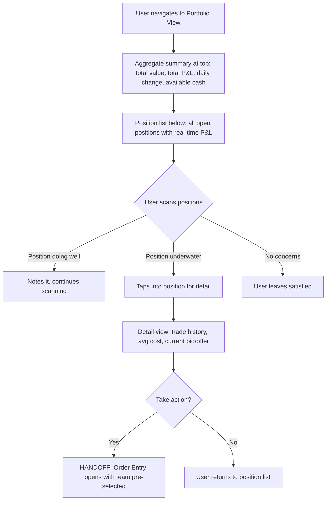
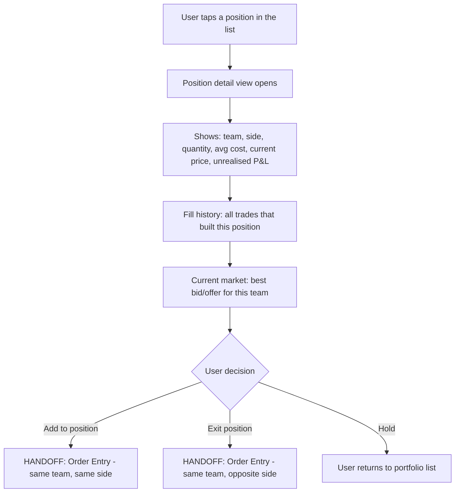
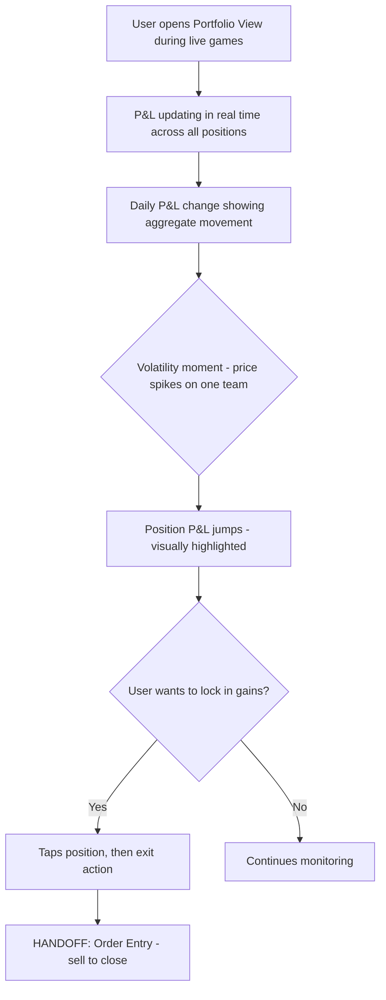
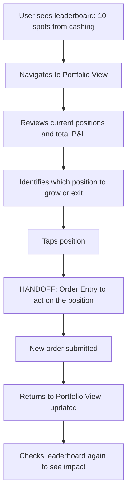

# InPlay Trading Challenge -- Portfolio View

> **Component:** [[trading]]
> **Date:** 2026-05-11
> **Status:** Collecting
> **Owner:** George Westbrook
> **Sources:** _[[meetings/11-06-2026-trading-component]], [[meetings/06-05-2026-vision-workshop]]_

---

## 1. What Does This Sub-Component Do?

**Functional purpose:**

Portfolio View is the user's position dashboard -- a snapshot of everything they currently own across all teams. It answers the question: "what do I hold and how's it doing?" At a glance, the user sees every open position with its current market value, average cost, unrealised P&L, and how each position is contributing to their overall performance.

This is where the trading activity becomes tangible. Order Entry is about acting, Fill Confirmation is about knowing something happened, but Portfolio View is about understanding the cumulative result. For users with positions across multiple teams, this is their command centre -- which positions are profitable, which are underwater, and where should they focus next.

The portfolio updates in real time during live games as prices move. A position bought at $5 that's now trading at $8 shows unrealised P&L of $3 per share -- and that number ticks up and down as the market moves. This real-time feedback is what drives engagement and further trading decisions.

**Entities that interact with it:**

- All three user personas -- anyone with at least one open position
- The Experienced Trader uses this as their primary monitoring tool -- tracking P&L across multiple positions, assessing risk exposure, deciding where to take profits or cut losses
- The Sports-Passionate Casual checks in to see how their "bets" are doing -- simpler view, focused on total P&L and which teams they're up or down on
- The Young Aspiring Trader uses this to learn the relationship between price movements and P&L -- seeing their position value change in real time is educational

---

## 2. What Needs to Happen?

**Functional requirements:**

_Position List:_

- User can see all open positions in a single view
- Each position shows: team name/symbol, side (long/short), quantity held, average cost, current market price, unrealised P&L (dollar and percentage), current market value
- Positions update in real time as market prices move -- P&L ticks up and down during live games
- Positions sorted by largest P&L impact (default), with ability to sort by team name, position size, or percentage gain/loss

_Aggregate Summary:_

- Total portfolio value across all positions
- Total unrealised P&L (dollar and percentage)
- Daily P&L change -- how the portfolio has moved today
- Trading wallet balance (available cash not tied up in positions)

_Position Detail:_

- User can tap into any position for expanded detail
- Detail view shows: full trade history for that position (all fills that built the position), average cost calculation breakdown, current bid/offer for the team, P&L over time (if feasible)
- Quick action: trade this team -- links to Order Entry with team pre-selected

_Time Horizons:_

- P&L viewable across daily, weekly, monthly periods (from vision session -- not detailed this call)
- User can toggle between time horizons to understand short-term vs longer-term performance

**Business rules:**

- Position data sourced from tZERO execution reports -- PosSIZ (size), PosCOST (cost basis), PosRpnl (realised P&L), PosUpnl (unrealised P&L)
- Unrealised P&L calculated against current market price -- must update in real time
- A position is "open" if PosSIZ != 0. When a user fully exits (sells all shares), the position closes and moves to Trade History
- Trading wallet (100K cap) -- the summary should show how much of the wallet is deployed in positions vs available as cash

**Edge cases:**

- User has positions in 20+ teams -- how does the list scale? Scrolling? Pagination? Grouping by sport/league?
- Price feed goes stale during a game -- unrealised P&L stops updating. Does the user see a "delayed" indicator per position?
- Position built across multiple fills at different prices -- average cost must be clearly calculated and explainable
- Execution bust reverses a fill that was part of a position -- position size and P&L change retroactively. How is this surfaced?
- User has both a long position and a pending sell order for the same team -- portfolio shows the position, Order Status shows the pending order. Is there any cross-reference?

---

## 3. Entity Journeys

### 3a. Isolated Journeys

#### Journey 1: User checks overall portfolio performance

**Entity:** User (all personas)

**Input:** User wants to see how their positions are doing across all teams

**Outcome:** User understands their total exposure, total P&L, and which positions need attention

**Steps:**

**Acceptance criteria:**

- [ ] Aggregate summary visible without scrolling -- total value, total P&L, daily change, available cash
- [ ] All open positions listed with real-time unrealised P&L
- [ ] Positions visually coded -- green for profitable, red for losing
- [ ] P&L updates in real time during live games without manual refresh
- [ ] User can scan all positions and identify which need attention in under 5 seconds

---

#### Journey 2: User drills into a specific position

**Entity:** User (Experienced Trader)

**Input:** User wants to understand a specific position -- how it was built, what the average cost is, and whether to act

**Outcome:** User has full context on the position and can decide to hold, add, or exit

**Steps:**

**Acceptance criteria:**

- [ ] Position detail shows every fill that contributed to the position (date, quantity, price)
- [ ] Average cost calculation is transparent -- user can understand how it was derived
- [ ] Current bid/offer displayed so user can assess exit price
- [ ] Quick actions to add to or exit the position -- one tap to Order Entry
- [ ] Side is correctly set for the action -- add keeps same side, exit flips to opposite

---

#### Journey 3: User monitors portfolio during a live game day

**Entity:** User (Sports-Passionate Casual, Experienced Trader)

**Input:** Multiple games are live, user has positions in several teams, prices are moving

**Outcome:** User tracks real-time P&L swings and acts on positions that need attention

**Steps:**

**Acceptance criteria:**

- [ ] Real-time P&L updates across all positions during live games
- [ ] Significant P&L changes are visually highlighted -- not just a number ticking, but a visual cue that something moved
- [ ] Daily P&L aggregate updates in real time
- [ ] User can act quickly from portfolio -- tap position, tap trade, execute

---

### 3b. Cross-Component Journeys

#### Journey 1: Leaderboard position drives portfolio review

**Entity:** User (all personas)

**Input:** User checks leaderboard, sees they're close to cashing, wants to review their positions to decide next move

**Handoff point:** Information Layer (Leaderboard) -> Trading (Portfolio View) -> Trading (Order Entry)

**Components involved:** Information Layer (Leaderboard) -> Trading (Portfolio View) -> Trading (Order Entry)

**Outcome:** User reviews their portfolio in the context of their leaderboard position and makes a strategic trading decision

**Steps:**

**Acceptance criteria:**

- [ ] Smooth navigation from leaderboard to portfolio
- [ ] Portfolio provides enough context (P&L, position sizes) to inform leaderboard strategy
- [ ] After trading, portfolio reflects the change immediately
- [ ] User can quickly return to leaderboard to check updated ranking

---

## 4. Look and Feel

**Design specifics:**

Brokerage portfolio style -- clean, numbers-forward, real-time. Think Robinhood's portfolio screen or any modern trading app's holdings view. The aggregate summary sits at the top as a sticky header -- total value, total P&L, daily change. Below it, the position list scrolls.

_Aggregate summary (sticky header):_
- Total portfolio value -- large, prominent number
- Total unrealised P&L -- dollar and percentage, colour-coded green/red
- Daily P&L change -- how much has moved today
- Available cash (trading wallet balance minus deployed capital)

_Position rows:_
- Each row: team name/symbol, quantity, current price, unrealised P&L (dollar and percentage)
- Colour-coded: green background tint for profitable, red for losing -- scannable at a glance
- P&L numbers tick in real time during live games -- subtle animation on change
- Compact enough to see 5-6 positions without scrolling on a standard phone screen

_Position detail (drill-down):_
- Bottom sheet or full-screen view
- Chart showing position P&L over time (if feasible -- post-MVP candidate)
- Fill history as a compact list: date, qty, price per fill
- Current bid/offer prominently displayed
- Trade action buttons at bottom: "Add to Position" and "Close Position"

**Reference products:**

- **Robinhood** -- clean portfolio summary, position list with real-time P&L, tap for detail. The gold standard for mobile portfolio UX. _(Our reference, not from client call)_
- **MetaTrader 5** -- position list with real-time ticking P&L. More data-dense than Robinhood but proven for active traders. _(MT5 discussed in trading session by Cody)_

**UX principles specific to this sub-component:**

- Numbers are the content -- minimise chrome, maximise data density. Every pixel should be earning its keep
- Real-time updates must feel alive but not distracting -- subtle ticks, not flashing
- The aggregate summary is the first thing the user sees -- it must answer "am I up or down today?" in under 1 second
- Portfolio should feel like a companion to the Information Layer, not a separate world -- the user is flipping between game data and their positions constantly during live games

---

## 5. Data Requirements

| What | Direction | Description | Source / Destination |
|------|-----------|------------|---------------------|
| Position data | In | All user's open positions: team symbol, side, quantity (PosSIZ), cost basis (PosCOST), realised P&L (PosRpnl), unrealised P&L (PosUpnl) | Trading Service (PostgreSQL), originally from tZERO execution reports |
| Current market prices | In | Live prices for all teams the user holds positions in -- used to calculate real-time unrealised P&L | tZERO via FIX Market Data feed -> Centrifugo WebSocket |
| Best bid/offer per position | In | Current bid/offer for position detail view -- shows what the user would get if they exited now | tZERO via FIX Market Data feed |
| Fill history per position | In | All fills that built each position: date, quantity, price, ExecID | Trading Service (PostgreSQL) |
| Trading wallet balance | In | Available cash -- total wallet minus capital deployed in open positions | Trading Service (PostgreSQL + Redis) |
| Daily/weekly/monthly P&L | In | P&L aggregated across time horizons | Trading Service (calculated from position and fill data) |
| Position updates (real-time) | In | When a fill occurs, position data updates -- new size, new average cost, new P&L | tZERO execution reports via FIX Gateway -> NATS -> Centrifugo |

---

## 6. Dependencies

| Depends on | What we need | Blocking for build? |
|---|---|---|
| Trading Service | Position data, fill history, wallet balances, P&L calculations | Yes -- no position data without it |
| tZERO FIX Market Data | Live prices to calculate real-time unrealised P&L and show current bid/offer in detail view | Yes -- without live prices, P&L is static and stale |
| Centrifugo (WebSocket) | Real-time price delivery so P&L ticks during live games | Yes -- without it, user has to manually refresh |
| Order Entry (sibling) | Receives handoff when user taps "add to position" or "close position" from detail view | No -- portfolio works as read-only without it |
| Fill Confirmation (sibling) | Triggers position updates -- when a fill occurs, Portfolio View reflects the change | No -- portfolio can poll or refresh independently |

**What siblings or other components need from this one:**

- **Information Layer** (Game Day Overview, Single Game Page) shows mini P&L indicators for active positions -- sourced from the same position data
- **Leaderboard** uses P&L data to calculate rankings
- **Personal Dashboard** pulls portfolio summary for the landing page

---

## 7. Risks

**Specific risks:**

- Stale prices during live games -- if the market data feed drops, unrealised P&L freezes. Users may make decisions based on outdated P&L numbers. Worse than no data is wrong data
- P&L calculation discrepancy -- if InPlay's P&L calculation diverges from tZERO's position fields (PosCOST, PosUpnl), users see inconsistent numbers depending on where they look. Must use tZERO as source of truth
- Large portfolio performance -- user with 20+ positions, all updating in real time during game day. That's 20+ price subscriptions feeding P&L recalculations every tick. Could cause UI lag on lower-end devices
- Execution bust impact -- a fill gets reversed, position size and P&L change retroactively. If the user was monitoring their portfolio and saw a profitable position, it could suddenly swing. Confusing without clear explanation
- Average cost confusion -- position built across 5 fills at 5 different prices. The average cost is correct but may not match any price the user remembers entering. Needs to be transparent and explainable

**Controls to build into the journeys:**

- Freshness indicator on prices -- if market data is delayed, show a "delayed" badge so users know P&L may not reflect current market
- Single source of truth for P&L -- use tZERO's position fields from execution reports, don't calculate independently
- Average cost breakdown accessible from detail view -- show every fill that contributed, so the user can verify
- Throttle UI updates on lower-end devices -- conflate price ticks to max 2-3 updates per second per position rather than every tick
- Execution bust clearly flagged in position detail -- show what changed, when, and why

---

## 8. Priority

**Must-have at launch?** Yes -- users need to see what they own. Without Portfolio View, the only way to understand their positions is to mentally track their trades or dig through Order Status. Edwin's vision of an engaged, active trader depends on them knowing their P&L at a glance.

**Sequencing rationale:** Build after Order Entry, Order Status, and Fill Confirmation. Those three form the trading action loop. Portfolio View is the reflection layer -- it makes sense once trades are flowing and positions are being built. Can be developed in parallel with Fill Confirmation since they share the same position data pipeline.

---

## Open Questions

1. How many positions should be visible without scrolling? This drives the row height and data density decisions
2. P&L time horizons (daily/weekly/monthly) -- are these tabs, a toggle, or a dropdown? Which is the default view?
3. Should Portfolio View show closed positions (fully exited) or only open? If closed positions appear, for how long before they move to Trade History?
4. Position P&L chart over time -- is this MVP or post-MVP? Adds significant value but requires storing historical price snapshots per position
5. Should the aggregate summary show a comparison to starting wallet (100K)? E.g., "portfolio value: $103,400 (+3.4% from start)"
6. During non-game periods when prices aren't moving -- does the portfolio feel dead? Should there be contextual info like "next game affecting your positions: Packers vs Bears, Saturday 1pm"?
