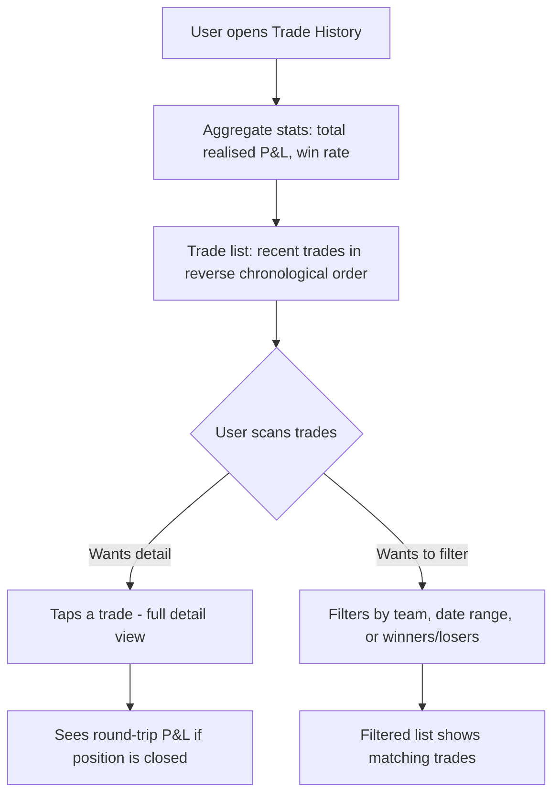
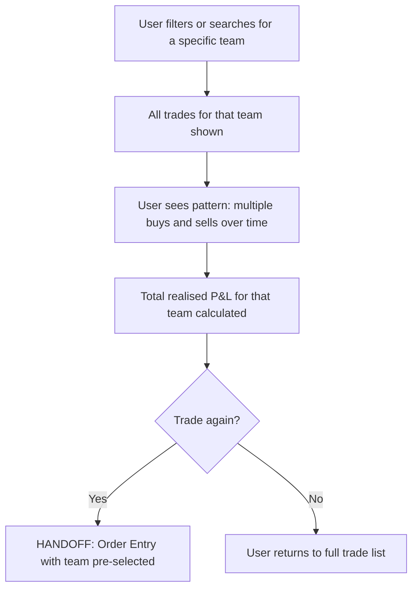

# InPlay Trading Challenge -- Trade History

> **Component:** [[trading]]
> **Date:** 2026-05-11
> **Status:** Collecting
> **Owner:** George Westbrook
> **Sources:** _[[meetings/06-05-2026-vision-workshop]]_
> **Note:** Trade History was not discussed in the 11-06-2026 trading component session. Content is derived from the vision workshop and reasonable extrapolation from the trading component requirements.

---

## 1. What Does This Sub-Component Do?

**Functional purpose:**

The historical record of all completed trades. Where Portfolio View shows what you currently own, Trade History shows what you've done -- every filled order, every closed position, every realised P&L. It answers: "what did I trade, when, and how did it work out?"

This is the long-term ledger. Users come here to review their trading patterns, understand their realised gains and losses, and learn from past decisions. It's also the audit trail -- if a user disputes a trade or wants to understand their leaderboard ranking, Trade History is the source of truth.

**Entities that interact with it:**

- All three user personas
- The Experienced Trader reviews performance patterns -- what worked, what didn't, where to improve
- The Sports-Passionate Casual checks "did I make money this week?"
- The Young Aspiring Trader uses it to learn -- reviewing past trades to understand the relationship between decisions and outcomes

---

## 2. What Needs to Happen?

**Functional requirements:**

_Trade List:_

- All completed trades in reverse chronological order
- Each trade shows: team name/symbol, side, quantity, fill price, total value, realised P&L, date/time
- Filterable by: team, side (buy/sell), date range, P&L (winners/losers)
- Searchable by team name or symbol

_Aggregate Stats:_

- Total realised P&L across all completed trades
- Win rate -- percentage of trades that were profitable
- P&L by time horizon (daily, weekly, monthly)

_Trade Detail:_

- Tap into any trade for full details: fill price, quantity, total value, timestamp, the order that generated it (ClOrdID link to Order Status if still relevant)
- If the trade was part of a position that's now closed -- show the round trip: bought at X, sold at Y, P&L = Z

**Business rules:**

- A trade appears here when an order fills (full or partial fill)
- Closed positions (bought then sold, or vice versa) should show the round-trip P&L
- Trade History is append-only -- trades don't disappear. Execution busts/corrections update the relevant entry with a correction flag
- Data persists for the full season at minimum

**Edge cases:**

- Execution bust -- a trade in history gets reversed. Show it as corrected, not deleted
- Partial fills -- each partial fill is a separate trade entry, or grouped by order?
- Very active trader with hundreds of trades -- pagination, infinite scroll, or date-bucketed?

---

## 3. Entity Journeys

### 3a. Isolated Journeys

#### Journey 1: User reviews recent trading performance

**Entity:** User (all personas)

**Input:** User wants to review their trading activity and performance

**Outcome:** User understands their realised P&L and trading patterns

**Steps:**

**Acceptance criteria:**

- [ ] Aggregate stats visible at top without scrolling
- [ ] Trade list loads quickly even with hundreds of entries
- [ ] Filters narrow the list without page reload
- [ ] Each trade clearly shows realised P&L

---

#### Journey 2: User investigates a specific team's trading history

**Entity:** User (Experienced Trader, Sports-Passionate Casual)

**Input:** User wants to see all trades for a specific team

**Outcome:** User sees their full history with that team and total P&L

**Steps:**

**Acceptance criteria:**

- [ ] Filter by team shows all trades for that team with aggregate P&L
- [ ] User can see their full history with a specific team in one view
- [ ] Quick action to trade that team again from the filtered view

---

## 4. Look and Feel

**Design specifics:**

Ledger style -- clean table/list with clear columns. Less real-time energy than Portfolio View, more reflective. Numbers are settled, not ticking. Colour-coded P&L (green/red) but muted compared to the live portfolio. Feels like a statement, not a dashboard.

Aggregate stats at top as a summary card. Trade list below, compact rows, enough to see 6-8 trades per screen. Date headers to group trades by day.

---

## 5. Data Requirements

| What | Direction | Description | Source / Destination |
|------|-----------|------------|---------------------|
| Completed trades | In | All filled orders with fill details: team, side, qty, price, value, timestamp | Trading Service (PostgreSQL) |
| Realised P&L per trade | In | Calculated from entry and exit prices for closed positions | Trading Service |
| Aggregate stats | In | Total P&L, win rate, P&L by time horizon | Trading Service (calculated from trade history) |
| Execution bust/correction flags | In | Updated when tZERO reverses or corrects a fill | Trading Service |

---

## 6. Dependencies

| Depends on | What we need | Blocking for build? |
|---|---|---|
| Trading Service | All completed trade data, P&L calculations | Yes -- no trade data without it |
| Order Status (sibling) | Completed orders flow into Trade History | No -- can seed independently |
| Portfolio View (sibling) | Closed positions (fully exited) generate round-trip P&L entries | No -- can calculate independently |

**What siblings or other components need from this one:**

- **Leaderboard** uses realised P&L for ranking calculations

---

## 7. Risks

**Specific risks:**

- Data volume -- active traders could generate hundreds of trades per season. List must perform at scale
- Execution bust confusion -- a trade in history gets corrected. If the user already screenshot their P&L for bragging rights, the number changes. Clear "corrected" labelling needed
- Round-trip P&L calculation -- matching buys to sells for a position traded over multiple fills at different prices. FIFO or average cost? Must be consistent with Portfolio View

**Controls to build into the journeys:**

- Pagination or infinite scroll for large trade lists
- Corrected trades clearly flagged -- never silently modified
- P&L calculation method documented in Education component

---

## 8. Priority

**Must-have at launch?** Yes, but lower priority than Order Entry, Order Status, Fill Confirmation, and Portfolio View. Users need a record of what happened, but the active trading loop is more critical. A basic list view with P&L is sufficient for MVP -- filters and aggregate stats can be enhanced post-launch.

---

## Open Questions

1. Partial fills -- individual entries per fill or grouped by order?
2. Round-trip P&L calculation method -- FIFO, LIFO, or average cost?
3. How far back does history persist -- full season, or rolling window?
4. Export capability -- can users download their trade history as CSV? Post-MVP?
