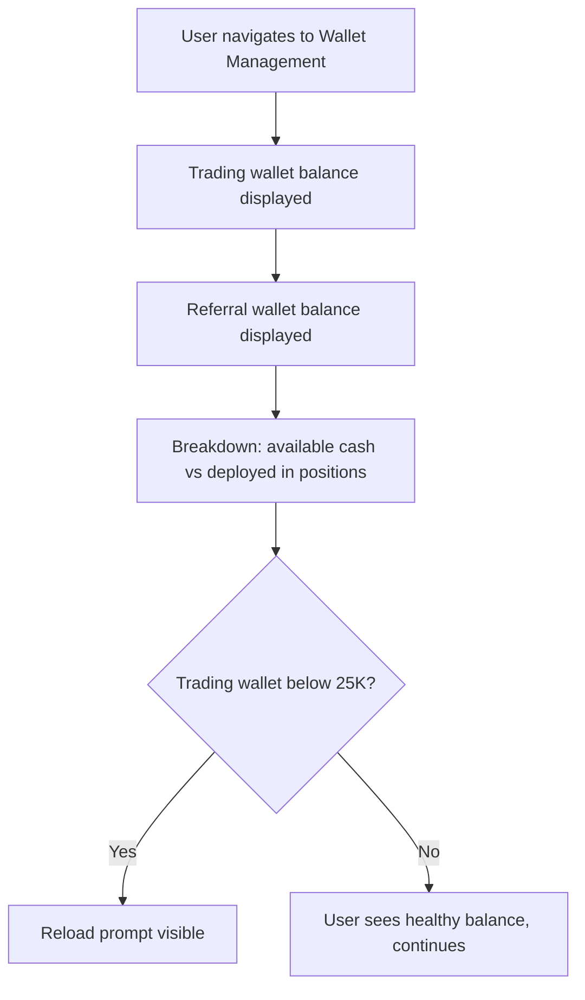
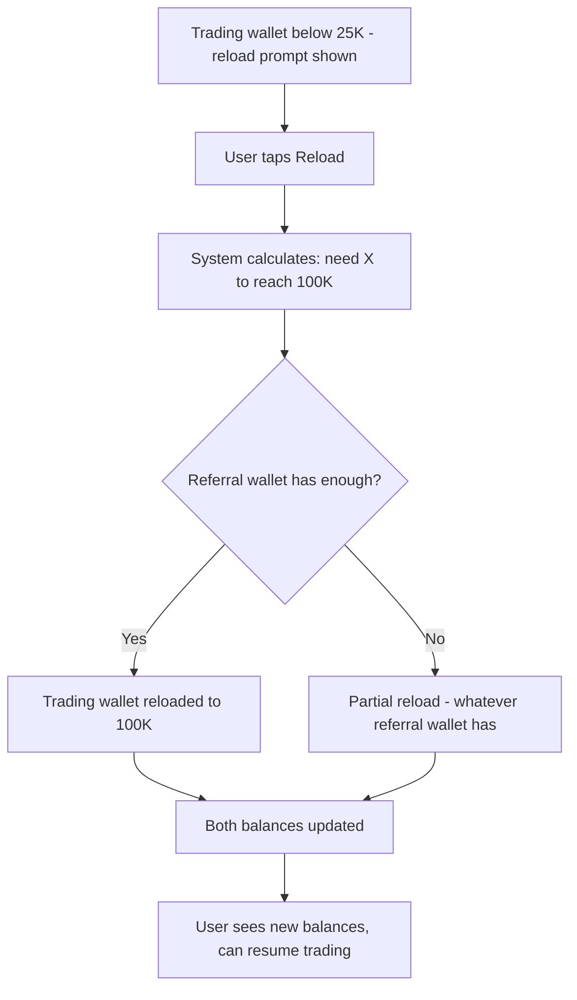
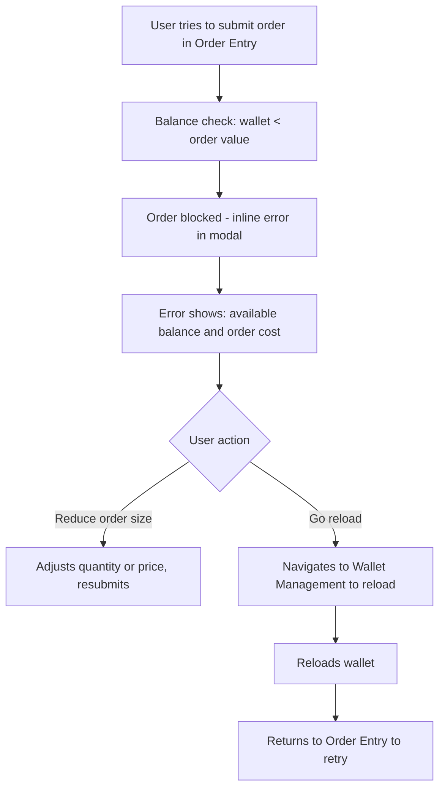

# InPlay Trading Challenge -- Wallet Management

> **Component:** [[trading]]
> **Date:** 2026-05-11
> **Status:** Collecting
> **Owner:** George Westbrook
> **Sources:** _[[meetings/11-06-2026-trading-component]], [[meetings/06-05-2026-vision-workshop]]_

---

## 1. What Does This Sub-Component Do?

**Functional purpose:**

Wallet Management handles the user's InPlay dollar balances -- the money side of trading. Every user has two wallets: a trading wallet (starts at 100K InPlay dollars, capped at 100K) and a referral wallet (earned through referrals and social engagement, no cap, resets end of season).

The trading wallet is what users trade with. When they buy shares, the cost comes out of the trading wallet. When they sell, proceeds go back in. The referral wallet is a reserve -- it can't be used for trading directly, but when the trading wallet drops below 25K, the user can reload it back to 100K from the referral wallet.

This sub-component displays both balances, handles the reload mechanism, and provides the balance checks that Order Entry depends on before allowing order submission.

**Entities that interact with it:**

- All three user personas
- The Experienced Trader monitors available buying power -- needs to know how much capital is available vs deployed
- The Sports-Passionate Casual checks "how much can I still trade with?"
- The Young Aspiring Trader may hit the 25K threshold and needs to understand the reload mechanism

---

## 2. What Needs to Happen?

**Functional requirements:**

_Balance Display:_

- User can see trading wallet balance (available for trading)
- User can see referral wallet balance (reserve, earned through referrals)
- User can see capital deployed in open positions (trading wallet minus available cash)
- Clear breakdown: total wallet = available cash + deployed capital

_Reload Mechanism:_

- When trading wallet drops below 25K, user is prompted to reload from referral wallet
- Reload restores trading wallet to 100K (draws the difference from referral wallet)
- If referral wallet has insufficient funds to fully reload, reload up to whatever is available
- Reload is user-initiated -- not automatic (user must confirm)

_Balance Checks (internal, not user-facing):_

- Before every order submission, verify trading wallet balance >= order value (quantity x price)
- If insufficient, block submission and show inline error in Order Entry modal
- Balance check reads from Redis cache for speed (sub-millisecond)

**Business rules:**

- Trading wallet cap: 100K InPlay dollars. Cannot exceed this via trading gains -- gains above 100K remain in the wallet but the cap applies to reloads
- Referral wallet: no cap, but resets to zero at end of season
- Referral wallet cannot be used for trading directly -- only to reload trading wallet
- Reload trigger: trading wallet below 25K
- Reload amount: difference between current trading wallet balance and 100K

**Edge cases:**

- Trading wallet at 24K, user places a 20K order that fills -- wallet drops to 4K. Reload prompt appears
- Referral wallet has 50K but trading wallet needs 76K to reload to 100K -- partial reload to 74K?
- User's trading gains push wallet above 100K -- is the cap enforced? Can they trade with more than 100K if they've earned it?
- Multiple orders pending that collectively exceed wallet balance -- do we reserve funds per pending order, or only check on submission?

---

## 3. Entity Journeys

### 3a. Isolated Journeys

#### Journey 1: User checks wallet balances

**Entity:** User (all personas)

**Input:** User wants to see how much they have available to trade

**Outcome:** User understands their available cash, deployed capital, and referral reserve

**Steps:**

**Acceptance criteria:**

- [ ] Both wallet balances visible in one view
- [ ] Available cash vs deployed capital clearly broken down
- [ ] Reload prompt appears when trading wallet is below 25K
- [ ] Balances update in real time as trades execute

---

#### Journey 2: User reloads trading wallet from referral wallet

**Entity:** User (all personas)

**Input:** Trading wallet has dropped below 25K, user wants to reload

**Outcome:** Trading wallet restored to 100K (or as close as referral wallet allows)

**Steps:**

**Acceptance criteria:**

- [ ] Reload calculates the correct amount to reach 100K
- [ ] Referral wallet is debited by the reload amount
- [ ] If referral wallet can't fully reload, partial reload clearly communicated
- [ ] Balances update immediately after reload
- [ ] Reload is user-initiated -- confirmation required

---

#### Journey 3: Order blocked due to insufficient balance

**Entity:** User (all personas)

**Input:** User tries to submit an order that exceeds their available trading wallet balance

**Outcome:** Order is blocked with a clear explanation, user can adjust or reload

**Steps:**

**Acceptance criteria:**

- [ ] Insufficient balance blocks submission -- not a post-submission rejection
- [ ] Error message shows available balance and required amount
- [ ] User can adjust order or navigate to reload without losing their trade context

---

## 4. Look and Feel

**Design specifics:**

Simple, card-based layout. Two wallet cards -- trading wallet (primary, larger) and referral wallet (secondary, smaller). Each card shows the balance prominently. The trading wallet card includes the available/deployed breakdown.

Reload button is prominent when the threshold is hit -- not hidden in a menu. But not obnoxious when the wallet is healthy.

This is a utility screen, not a destination -- users visit briefly, get the info they need, and leave. Keep it minimal.

---

## 5. Data Requirements

| What | Direction | Description | Source / Destination |
|------|-----------|------------|---------------------|
| Trading wallet balance | In | Current available balance for trading | Trading Service (PostgreSQL + Redis cache) |
| Referral wallet balance | In | Current referral earnings reserve | Trading Service (PostgreSQL) |
| Deployed capital | In | Calculated from open positions (sum of position costs) | Trading Service |
| Reload transaction | Out | User-initiated: debit referral wallet, credit trading wallet | Trading Service |
| Balance check (for Order Entry) | In | Sub-millisecond read to verify sufficient funds before order submission | Redis cache |

---

## 6. Dependencies

| Depends on | What we need | Blocking for build? |
|---|---|---|
| Trading Service | Wallet balances, reload processing, balance checks | Yes -- no wallet data without it |
| Referral component | Referral wallet balance -- earned through referral and social engagement flows | No -- can set to zero for initial build |
| Order Entry (sibling) | Calls balance check before order submission | No -- wallet works independently as a display |

**What siblings or other components need from this one:**

- **Order Entry** depends on wallet balance checks before allowing order submission
- **Portfolio View** shows available cash from the trading wallet

---

## 7. Risks

**Specific risks:**

- Race condition on balance check -- user places two orders simultaneously, both pass the balance check individually, but combined they exceed the wallet. Need to reserve/lock funds per pending order
- Reload confusion -- users may not understand why they can't trade directly from the referral wallet
- Wallet cap ambiguity -- if trading gains push wallet above 100K, is the user penalised? Cap should only apply to reloads, not to organic growth through trading
- End-of-season referral wallet reset -- users may not expect their referral wallet to zero out. Needs clear communication

**Controls to build into the journeys:**

- Atomic balance reservation on order submission -- deduct from available balance immediately, refund if order is cancelled or rejected
- Clear labelling: "trading wallet" vs "referral wallet" with one-line explanation of each
- Reload mechanism explained in Education component

---

## 8. Priority

**Must-have at launch?** Yes -- without wallet management, there's no balance checking on orders and no reload mechanism. The balance display itself is simple, but the underlying balance check is critical for Order Entry to function correctly.

**Sequencing rationale:** The balance check logic should be built alongside Order Entry since it's a dependency. The wallet display UI can be built later -- it's a simple read-only view. The reload mechanism should be ready before users start depleting their wallets through active trading.

---

## Open Questions

1. Fund reservation -- do we lock funds per pending order, or only check on submission?
2. Wallet cap -- if trading gains push above 100K, does the user keep the excess? Or is 100K a hard ceiling?
3. Partial reload -- if referral wallet can't fully reload to 100K, is a partial reload useful or confusing?
4. Should the reload prompt also appear as a push notification when the user isn't looking at the wallet page?
5. End-of-season referral wallet reset -- how much warning does the user get?
