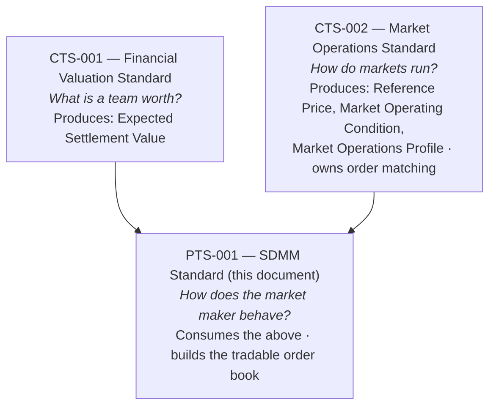
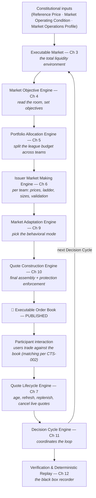
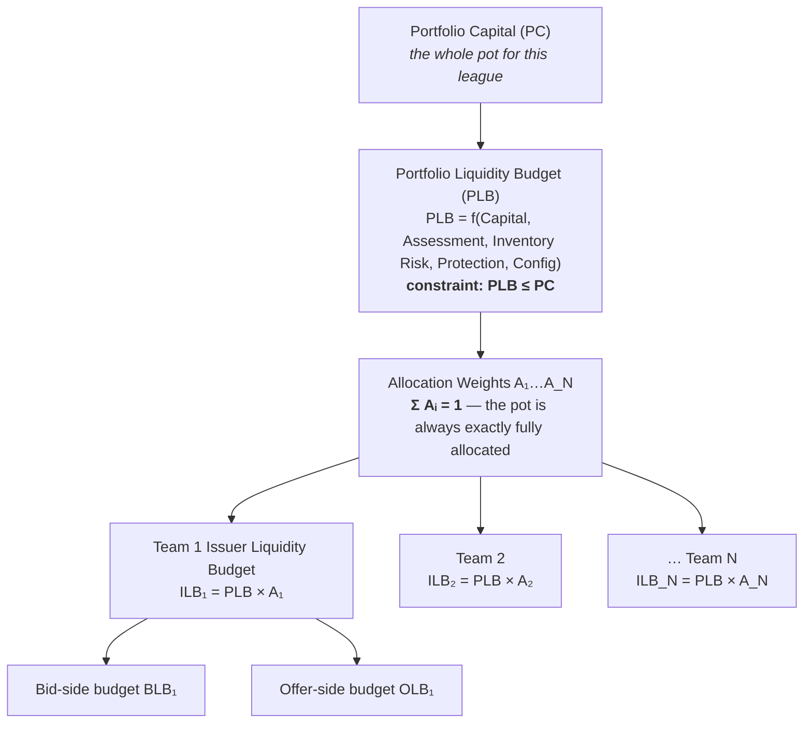
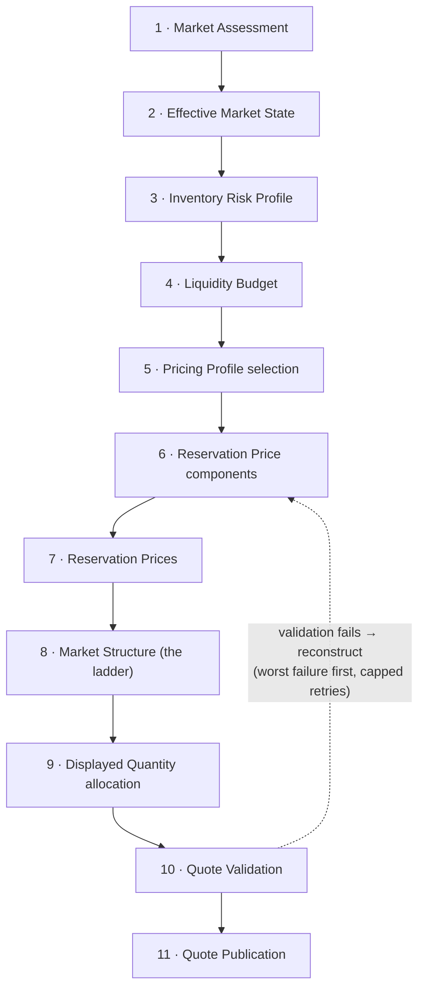
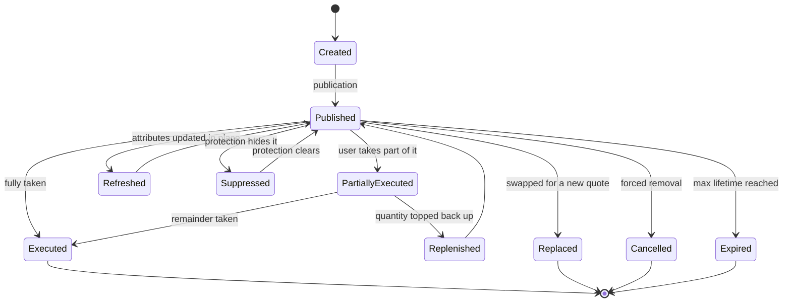
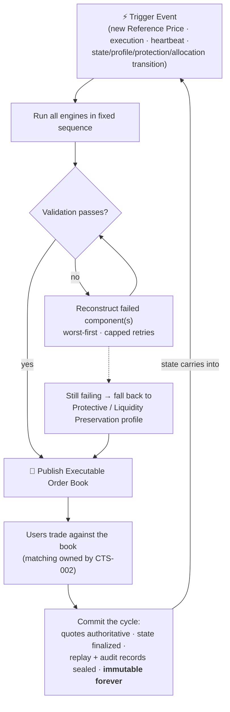

# PTS-001 Comprehensive Guide — The Simulated Designated Market Maker (SDMM)

> **Companion to:** [[standards/PTS-001-simulated-designated-market-maker-standard]] (the authoritative source)
> **Also available:** [[standards/PTS-001-plain-english-guide]] (the 10-minute version)
> **Audience:** Someone with no market-making background who needs to understand — and build — this system.
> **Coverage:** Every chapter of the source, every rule, priority list, formula, and invariant, translated into plain English. Where this guide and the source disagree, the source wins.

---

## Contents

1. [Primer: market-making from zero](#1-primer-market-making-from-zero)
2. [Chapter 1 — Constitutional Principles](#2-chapter-1--constitutional-principles)
3. [Chapter 2 — Simulation Market Architecture](#3-chapter-2--simulation-market-architecture)
4. [Chapter 3 — Executable Market Construction](#4-chapter-3--executable-market-construction)
5. [Chapter 4 — Market Objective Engine](#5-chapter-4--market-objective-engine)
6. [Chapter 5 — Portfolio Allocation Engine](#6-chapter-5--portfolio-allocation-engine)
7. [Chapter 6 — Issuer Market Making Engine](#7-chapter-6--issuer-market-making-engine)
8. [Chapter 7 — Quote Lifecycle Engine](#8-chapter-7--quote-lifecycle-engine)
9. [Chapter 8 — Displayed Quantity Engine](#9-chapter-8--displayed-quantity-engine)
10. [Chapter 9 — Market Adaptation Engine](#10-chapter-9--market-adaptation-engine)
11. [Chapter 10 — Quote Construction Engine](#11-chapter-10--quote-construction-engine)
12. [Chapter 11 — Decision Cycle Engine](#12-chapter-11--decision-cycle-engine)
13. [Chapter 12 — Verification & Deterministic Replay](#13-chapter-12--verification--deterministic-replay)
14. [Cross-cutting themes](#14-cross-cutting-themes)
15. [Worked example](#15-worked-example)
16. [Quirks & open questions in the source](#16-quirks--open-questions-in-the-source)
17. [Implementation checklist](#17-implementation-checklist)

---

## 1. Primer: market-making from zero

InPlay's simulation lets users trade "team stocks" — one stock per NFL team, one per NCAA team, and so on — using fake money. For a market to feel real, every user who wants to buy or sell must find a counterparty *instantly*, at a sensible price, at any time. Real markets solve this with **market makers**: firms that continuously offer to both buy and sell, earning the gap between their two prices.

The **SDMM (Simulated Designated Market Maker)** is InPlay's automated market maker. "Designated" means it is *obligated* to keep quoting — it can't walk away when conditions get uncomfortable. "Simulated" means it trades simulation capital and carries no real financial risk — but it must still *behave* exactly like a disciplined real-world market maker, because realism is the product.

### The exchange-booth analogy

Think of a currency exchange booth at an airport:

- It shows two prices simultaneously: *"we buy dollars at 0.90, we sell dollars at 0.95."*
- The gap — the **spread** — is its margin.
- It doesn't predict where the dollar is going; it keeps two prices up and earns the spread on passing traffic.
- If too many people sell dollars *to* the booth, its till fills up (**inventory** builds). It responds by nudging both prices down: buying becomes less attractive to sellers, and its sell price becomes more attractive to buyers, so the surplus drains away.

Every mechanism in PTS-001 is a formalized, deterministic version of something this booth does instinctively.

### Vocabulary

| Term | Plain meaning |
|---|---|
| **Bid** | Price the SDMM will **buy** at. Users *sell* into the bid. |
| **Offer** (ask) | Price the SDMM will **sell** at. Users *buy* from the offer. |
| **Spread** | Gap between best bid and best offer. |
| **Two-sided quote** | A live bid *and* offer at the same time. |
| **Quotation** | One published price + quantity the SDMM stands behind. "Executable" = a user can actually trade against it. |
| **Order book** | The full set of live bids and offers with quantities. |
| **Depth / ladder** | Price levels beyond the best one. Level `k=0` is the best bid/offer; `k=1` is one step worse; etc. Big orders fill across several levels. |
| **Displayed quantity** | How many shares are shown at each price level. |
| **Tick** | Minimum price increment (e.g. $0.01). Every price must land exactly on a tick. |
| **Inventory** | The SDMM's net position in one stock. Bought more than sold → **long**; sold more than bought → **short**. Expressed as a % of the publicly tradable float. |
| **Float** | Shares available for public trading. Excludes treasury shares and anything locked up. |
| **Locked market** | Bid = offer. **Crossed market:** bid > offer. Both are nonsense states — publishing either is banned. |
| **Issuer / Team Company** | One team's stock (the Chiefs, the Jets, …). |
| **Portfolio** | One league's worth of Team Companies sharing a capital pool (NFL = 32 teams, NCAA D1 football = 131). |
| **Reference Price (RP)** | The externally supplied "fair price" the SDMM anchors everything to. |
| **Decision Cycle** | One full iteration of the SDMM's think-price-publish loop. |

---

## 2. Chapter 1 — Constitutional Principles

### 2.1 The three-document stack

PTS-001 sits at the bottom of a strict hierarchy. The two CTS documents are "constitutional" — PTS-001 implements them and can never override them (§1.2: *"Where a conflict exists, the constitutional standards govern"*).



*(Note: the source contradicts itself on whether CTS-001 or CTS-002 publishes the Reference Price — see [Quirks](#16-quirks--open-questions-in-the-source).)*

The upstream outputs are called **constitutional market objects**:

- **Expected Settlement Value (ESV)** — what the stock should be worth at settlement.
- **Reference Price (RP)** — the current fair price. The SDMM's anchor.
- **Market Operating Condition (MOC)** — is the market open, halted, suspended, etc.
- **Market Operations Profile (MOP)** — the rules of engagement currently in force.

The single most repeated rule in the entire document (§1.4, §1.8, and restated in nearly every chapter):

> **The SDMM consumes constitutional objects. It never creates, modifies, or second-guesses them.**

Explicitly, the SDMM SHALL NOT independently determine: Expected Settlement Value, Reference Price, Market Operating Condition, Market Operations Profile, or participant interaction rules. Its purpose is **not to predict prices** — it is to build a continuously tradable market *around* the price it is given.

### 2.2 Purpose (§1.3)

The SDMM exists to continuously generate realistic, executable, two-sided quotations, providing liquidity without proprietary financial risk. Design goals: continuous executable liquidity · orderly markets · realistic quotation behavior · educational value · deterministic replay · faithful implementation of the constitutional objects.

### 2.3 The seven engineering principles (§1.5)

Every conforming implementation must satisfy all seven:

1. **Continuous Liquidity** — executable two-sided quotes must exist throughout every interval in which the Market Operations Profile authorizes trading. No blank markets, ever.
2. **Deterministic Operation** — identical constitutional inputs + identical configuration + identical event sequence → **identical** market behavior, on any conforming implementation. No wall-clock time, no true randomness, no hidden state.
3. **Inventory Awareness** — the SDMM continuously monitors its position while never pausing its market-making duties to do so.
4. **Continuous Market Presence** — inventory management may *never* be an excuse to stop quoting. The bot manages inventory by skewing prices, not by going dark.
5. **Production-Consistent Market Behavior** — displayed quotes must evolve the way the active Market Operations Profile says a real market would.
6. **Replayability** — every quotation, execution, inventory adjustment, and protection action must be reproducible through deterministic replay.
7. **Engineering Isolation** — the SDMM operates *exclusively* from constitutional inputs and approved configuration. No external pricing feeds unless a Product Technical Standard expressly authorizes one.

### 2.4 Scope (§1.6)

**Governs:** Executable Market construction · Market Posture determination · Price Formation · Market Structure · Displayed Quantity generation · Market Adaptation · Quote Construction · Decision Cycle operation · Verification and Deterministic Replay.

**Does not govern:** valuation, settlement, regulation, participant rights, compliance. (Those belong to the CTS documents or elsewhere.)

### 2.5 The engine pipeline (§1.7)

The SDMM is a chain of engines, each consuming the previous one's outputs read-only:



*(The source's own §1.7 diagram uses older engine names that don't match its chapters — this diagram follows the chapters. See [Quirks](#16-quirks--open-questions-in-the-source).)*

### 2.6 Constitutional invariants (§1.8)

True regardless of which product is running:

- Expected Settlement Value, Reference Price, and Market Operations Profile are all externally determined.
- The SDMM consumes but never creates constitutional objects.
- Deterministic replay is mandatory.
- Continuous executable markets are mandatory unless suspended under CTS-002.

---

## 3. Chapter 2 — Simulation Market Architecture

### 3.1 What makes a simulation market (§2.2)

Every simulation market must exhibit: continuously published Reference Prices · continuous executable two-sided quotes · deterministic operation · simulated executions · simulated inventory · simulated participant portfolios · deterministic replay.

The controlling idea (§2.6): simulation markets must be **computationally indistinguishable from production markets** except where this standard expressly says otherwise. Fake money is not an excuse for lower standards.

### 3.2 Simulation capital (§2.3)

The fake money. It: has **no monetary value** · **cannot** be redeemed for cash · **cannot** be transferred between participants · exists solely for simulation trading. Competition-specific allocation (e.g. everyone starts a contest with 100k) is left to each Product Technical Standard.

### 3.3 Simulation executions (§2.4)

When a user's order is accepted, it executes under CTS-002's Market Interaction Framework and must: update the participant's positions · update their cash balance · update SDMM inventory · generate deterministic execution records. It creates **no financial obligations** — nobody owes anybody real money.

### 3.4 Simulation inventory (§2.5)

The SDMM tracks a simulated inventory per Team Company. It exists to make market-making behavior realistic — supporting continuous liquidity, inventory-aware quoting, deterministic replay, and engineering analysis. It is *not* real financial exposure.

### 3.5 Integrity and objectives (§2.6–2.7)

Simulation markets must preserve orderly behavior, continuous liquidity, determinism, replayability, and **participant fairness**. They serve a dual purpose: educating participants, and acting as a live testbed for evaluating trading strategies, market-making methodologies, inventory methodologies, liquidity methodologies, and market-evolution methodologies.

---

## 4. Chapter 3 — Executable Market Construction

### 4.1 The idea (§3.2)

> *"The SDMM does not construct isolated quotations. It constructs an Executable Market."*

The **Executable Market (EM)** is the SDMM's primary internal object: the complete description of all executable liquidity available at a moment in time. Every published quote, every depth level, every refresh behavior is *derived from* it. Nothing is quoted ad hoc.

### 4.2 The function (§3.4)

```
EMₜ = f(RPₜ, MOCₜ, MOPₜ, CFGₜ)
```

The Executable Market at time *t* is a pure function of: **Reference Price**, **Market Operating Condition**, **Market Operations Profile**, and **SDMM Configuration** (which includes Execution Model and Product Technical Standard config). Exclusively constitutional inputs — nothing else may leak in (§3.3).

### 4.3 What it contains (§3.5)

Every Executable Market defines: executable price structure · executable liquidity structure · executable market depth · quotation generation parameters · quotation refresh parameters · protection parameters.

It is **not itself a published quotation** — it's the internal blueprint the rest of the pipeline works from, and it becomes the authoritative input to the Market Objective Engine for the current Decision Cycle (§3.7).

### 4.4 Independence (§3.6)

Like every engine, the EM never determines ESV, Reference Price, MOC, MOP, or participant interaction. It supplies the information to construct: the Executable Order Book, Executable Quotations, quote refresh/replacement, inventory management, and protection mechanisms.

---

## 5. Chapter 4 — Market Objective Engine

### 5.1 The idea (§4.1–4.2)

Before touching a single price, the SDMM decides **what it is trying to achieve** this cycle. The Market Objective Engine is "the primary decision-making component" — every downstream engine must act consistently with its outputs, which stay authoritative until the next cycle.

The stated character of the whole system (§4.2): *"a deterministic decision system whose primary purpose is to provide continuous executable two-sided liquidity while pursuing profitable long-term market-making performance within the constraints established by this standard."* (On "profit" in a fake-money market, see [§14.3](#143-why-a-fake-money-bot-chases-profit).)

### 5.2 Market Assessment (§4.4)

Each cycle starts by measuring the environment. Minimum required inputs:

| Assessment input | What it measures |
|---|---|
| External Market Phase | What phase the broader market/game context is in |
| Order Arrival Rate | How fast user orders are coming in |
| Order Flow Acceleration | Whether that rate is speeding up or slowing down |
| Fill Velocity | How quickly posted quotes are getting executed |
| Quote Lifetime | How long quotes survive before being consumed |
| Book Consumption Rate | How fast the book's depth is being eaten |
| Inventory Position | Current net position (% of float) |
| Inventory Velocity | How fast the position is growing/shrinking |
| Protection State | Whether any protection mechanisms are tripped |

The assessment itself decides nothing — it feeds the objective decisions.

### 5.3 The six operational objectives (§4.5) and their priority (§4.6)

The SDMM pursues all six simultaneously:

1. Maintain continuous executable two-sided liquidity.
2. Maintain orderly and realistic market behavior.
3. Keep inventory within the active Inventory Risk Profile.
4. Maximize long-term expected market-making performance.
5. Rapidly incorporate constitutional market changes.
6. Preserve deterministic operation and replayability.

When they conflict, precedence is fixed — a lower priority may **never** cause a higher one to be violated:

> **Protection → Continuous Market Availability → Market Integrity → Inventory Stability → Market Quality → Long-Term Performance**

Memorize the shape: **safety first, presence second, profit last.**

### 5.4 Outputs (§4.7–4.9)

Four decisions that steer everything downstream:

| Output | Meaning |
|---|---|
| **Effective Market State** | The engine's classification of current conditions |
| **Inventory Risk Profile** | How much position risk is tolerable right now |
| **Liquidity Budget** | How much liquidity we're willing to put on the table |
| **Pricing Profile** | Which pricing "personality" governs this cycle (see Ch 6) |

The engine explicitly does *not* set reservation prices, market structure, displayed quantities, or quotes — that's later chapters. Its outputs are read-only and authoritative for the full cycle.

---

## 6. Chapter 5 — Portfolio Allocation Engine

### 6.1 The idea (§5.1)

A **Portfolio** = one league's Team Companies + one dedicated capital pool + one Product Technical Standard (NFL: 32 teams; NCAA D1 football: 131). Each Portfolio maintains its own: Portfolio Capital, Portfolio Liquidity Budget, aggregate inventory, per-team Issuer Liquidity Budgets, risk limits, and an Allocation Map. **Resources never cross portfolios** unless a product standard expressly allows it — NFL money never funds NCAA quoting.

The Portfolio Allocation Engine is the enterprise-level brain for one Portfolio: it divides resources *before* any team-level engine builds a market, and its decisions **outrank** team-level preferences (§5.2).

### 6.2 Allocation priority (§5.3)

When portfolio-wide conditions conflict with what an individual team's market wants:

> **Protection → Constitutional requirements → Portfolio Capital Preservation → Portfolio Liquidity → Portfolio Inventory Risk Limits → Issuer Liquidity Allocation → Issuer-Level Market Quality**

Team engines cannot override allocations mid-cycle; allocations stand until the next cycle.

### 6.3 Inputs (§5.4) and Portfolio Assessment (§5.5)

Inputs come in three groups, all read-only:

- **Constitutional:** Effective Market State, Market Objectives, Protection Requirements, product config.
- **Portfolio:** Portfolio Capital, Portfolio Liquidity Budget, Portfolio Inventory + risk limits, active Team Companies, last cycle's Allocation Map.
- **Per-issuer** (for every active team): inventory, market activity assessment, last cycle's budget, effective market state, protection state.

Each cycle, the engine assesses the portfolio's condition — capital utilization, liquidity utilization, inventory position and **concentration** (is risk piling into one team?), activity distribution across teams, overall market activity, protection state, and allocation stability (is the map thrashing cycle to cycle?) — and classifies the portfolio into an operational state that governs this cycle's allocation. The classification math is deferred to the product standard. Assessment must complete *before* any budget is set.

### 6.4 The budget waterfall (§5.6–5.7.1)



Step by step:

1. **Portfolio Liquidity Budget** — the max aggregate liquidity across all teams this cycle: `PLBₜ = f(Capital, Assessment, InventoryRisk, Protection, Config)`, and `PLB ≤ Portfolio Capital` always.
2. **Issuer Liquidity Budgets** — every active team gets exactly one: `ILBᵢ = PLB × Aᵢ`, where the weights `Aᵢ` sum to exactly 1. Weights may be driven by portfolio assessment, market state, per-team activity, per-team inventory risk, per-team protection state, and config. (The weight formula itself is deferred to the product standard.) Hot markets can be weighted up; quiet ones down.
3. **Bid/offer split** — each team's budget divides into a bid-side and offer-side budget: `ILBᵢ = BLBᵢ + OLBᵢ`, both ≥ 0. The two sides *need not be equal* — a team the bot is long in can get a bigger offer-side budget to help sell inventory down. Split drivers: inventory risk profile, market state, activity, protection state, config.

### 6.5 Reallocation (§5.8)

Re-evaluated **every cycle**; revised whenever material change occurs (market state, assessment, capital, inventory, per-team activity or risk, protection, config). Key timing rule: revised allocations take effect **from the next cycle** — reallocation never yanks quotes that were already published in the current one. Deterministic and replayable, like everything else.

### 6.6 Constraints (§5.9) and invariants (§5.10)

Hard rules checked every cycle — an allocation violating *any* of them is never transmitted to the team engines:

| Constraint | Rule |
|---|---|
| Capital | Σ Issuer budgets ≤ Portfolio Liquidity Budget |
| Liquidity | Portfolio Liquidity Budget ≤ Portfolio Capital |
| Inventory | Aggregate portfolio inventory stays within its risk limits |
| Issuer cap | No team exceeds its individual maximum allocation |
| Allocation | Every active team gets exactly one budget; weights sum to 1 |
| Determinism | Fully reproducible via replay |

Invariants (must hold throughout every cycle): capital conservation (Σ ILB = PLB — nothing lost, nothing invented) · weight conservation (Σ A = 1) · one-and-only-one budget per team · **budget integrity** (team engines consume their budget; they may not increase, decrease, or trade it) · portfolio integrity (no allocation violates capital, inventory limits, protection, or constitutional requirements) · determinism · **cycle integrity** (each allocation belongs to exactly one cycle and is immutable once transmitted).

### 6.7 Outputs (§5.11)

**Portfolio-level:** Portfolio Liquidity Budget, Capital Allocation, Risk Assessment, Allocation Map.
**Per team:** Issuer Liquidity Budget, Bid-side Budget, Offer-side Budget, Allocation Weight, and an **Allocation Status** — one of *Fully Allocated / Partially Allocated / Allocation Limited / Allocation Suspended* (product standards may add more).

---

## 7. Chapter 6 — Issuer Market Making Engine

The heart of the spec: how one team's market actually gets built. Runs independently per Team Company, inside its assigned budgets, which it may never modify.

### 7.1 Governing objective (§6.2)

```
maximize  Πₜ   (expected market-making performance this cycle)
subject to Cₜ  (all constraints: constitutional, inventory, budgets,
               pricing limits, protection, deterministic replay)
```

Performance-seeking may never violate a higher-priority constraint, and **every quote must be the deterministic result of the fixed decision sequence below** — no quote may enter the market any other way (§6.13.1).

### 7.2 Decision priority (§6.3) and sequence (§6.3.1)

Priority when conditions collide:

> **Protection → Continuous Availability → Inventory Risk Limits → Liquidity Budget → Pricing Profile → Market Structure → Displayed Quantity → Controlled Randomization → Quote Publication**

The mandatory 11-step computational sequence, executed strictly in order — a later stage may never edit an earlier stage's output except by triggering full reconstruction of the affected component:



### 7.3 Pricing Profiles (§6.5)

Each cycle runs under exactly **one** Pricing Profile — the bot's pricing personality. Version 1.0 defines six. Each profile specifies at minimum: base spread component, inventory sensitivity, activity sensitivity, protection sensitivity, bid- and offer-side liquidity budgets, ladder spacing profile, displayed quantity profile, randomization bounds, and quote refresh parameters.

Selection is driven by the Effective Market State plus the Inventory Risk Profile, Protection State, Market Activity Assessment, and config. If two profiles both apply, the one serving the *higher-priority* objective (per Chapter 4's ordering) wins.

**The parameter table (§6.6.1).** Each profile scales five base parameters — defaults below, overridable per product:

| Profile | Spread (S) | Depth (D) | Size (Q) | Refresh (F) | Inv. sens. (I) | Personality |
|---|---|---|---|---|---|---|
| **Stable** | 1.00 | 1.50 | 1.50 | 1.00 | 0.50 | Calm seas: tight spread, deep generous book, relaxed about inventory |
| **Active** | 1.50 | 1.00 | 1.00 | 0.50 | 1.00 | Busy market: a bit wider, refreshing twice as fast |
| **Defensive** | 2.50 | 0.60 | 0.60 | 1.50 | 1.75 | Getting picked off: widen, shrink, slow down |
| **Recovery** | 1.75 | 1.00 | 0.90 | 1.00 | 2.50 | Digesting a bad position: very inventory-sensitive, working back to flat |
| **Liquidity Preservation** | 3.00 | 0.50 | 0.50 | 1.25 | 3.50 | Conserving ammunition: wide and thin, but present |
| **Protective** | 5.00 | 0.25 | 0.25 | *restricted* | 5.00 | Alarm bells: extremely wide, minimal size; updates only as Protection Rules permit. Still two-sided. |

The multipliers translate mechanically:

```
BaseSpread = TickSize × S      DepthLevels     = N_base × D
Liquidity  = L_base   × Q      RefreshTime     = R_base × F
                               InventorySens λ = λ_base × I
```

**Per-cycle pricing parameters (§6.5.1).** Beyond the profile, each cycle pins down: number of price levels, bid & offer ladder spacing, bid & offer liquidity budgets, bid & offer depth-weighting profiles, the three sensitivity coefficients (inventory / activity / protection), controlled randomization bounds, and the **deterministic randomization seed**. All authoritative until the next cycle.

**Profile transitions (§6.5.2).** Triggered by a change in Effective Market State, Inventory Risk Profile, Liquidity Budget, Protection State, or config. A transition **invalidates everything downstream** of the old profile — reservation price components, reservation prices, market structure, displayed quantities, validation state, and executable quotations must all be rebuilt under the new profile. No stale objects survive.

### 7.4 Reservation Prices (§6.6–6.8)

The **reservation prices** are the bot's true best bid and offer, built by pushing away from the Reference Price on each side:

```
   users sell to the bot here            users buy from the bot here
              │                                     │
   ◄──────────┴──── Bid Offset ────┐   ┌── Offer Offset ────┴──────────►
                                   ▼   ▼
  ── $24.98 ═══════════════════ $25.00 ═══════════════════ $25.01 ──
     Reservation Bid           Reference Price        Reservation Offer
     RBP = RP − BO                (anchor)             ROP = RP + OO
```

Each offset is the sum of four independently computed components (bid and offer sides computed separately — asymmetry is allowed and intentional):

```
Bid Offset   BO = BS_bid   + IS_bid   + AS_bid   + PS_bid
Offer Offset OO = BS_offer + IS_offer + AS_offer + PS_offer
```

| Component | What it does |
|---|---|
| **BS — Base spread** | The default margin; the booth's cut. Set by the Pricing Profile. |
| **IS — Inventory skew** | Pushes prices to steer inventory back toward flat (§7.5 below). |
| **AS — Activity adjustment** | Widens when order flow is fast/aggressive — riskier to quote into. |
| **PS — Protection adjustment** | Extra width when protection mechanisms are on alert. |

Sequencing rule: all components must be **fully computed before** reservation prices are calculated, then consumed read-only — no mid-calculation adjustment. The component formulas themselves are deferred to the product standard; PTS-001 fixes only the architecture.

Then:

```
Reservation Bid    RBP = RP − BO
Reservation Offer  ROP = RP + OO
Reservation Spread RS  = ROP − RBP    ← an output, never a target
```

**Constraints (§6.8.1):** RBP < ROP · both within the applicable trading range · both within min/max permissible price for the security · consistent with the active Pricing Profile, Liquidity Budget, and Inventory Risk Profile. Any failure → recalculate before building the ladder.

### 7.5 Inventory influence (§6.7)

The mechanism that keeps the bot near flat without ever leaving the market:

```
INV = inventory as % of publicly tradable float
IS  = λ(EffectiveMarketState) × INV

bid-side skew   IS_bid   = max(IS, 0)     ← active when LONG
offer-side skew IS_offer = max(−IS, 0)    ← active when SHORT
```

**When long (bought too much):**
- Bid Offset **increases** → the buy price drops further below fair value → selling to the bot gets less attractive → it accumulates less;
- Offer Offset **may decrease** → the sell price edges toward fair value → buying from the bot gets more attractive → inventory drains;
- displayed size may shrink on the bid and grow on the offer.

**When short:** exact mirror — offer backs away, bid gets more attractive, sizes shift the other way.

Two hard limits: skew stays bounded by the active Inventory Risk Profile, and it may **never** prevent continuous two-sided quoting.

### 7.6 Market Structure — the ladder (§6.9)

Around each reservation price the engine lays out **N** price levels. Level `k=0` is the best bid/offer; `k>0` are progressively worse. Level prices step out by the side's ladder spacing (Δ), plus a bounded per-level randomization term (ε). The number of levels is a function of the Pricing Profile, Liquidity Budget, and config.

**Ladder geometry (§6.9, "Ladder Geometry Profile").** The active profile determines: price spacing methodology, number of levels, how liquidity concentrates across depth, and bid/offer symmetry. Product standards may define geometries: *uniform, front-loaded, back-loaded, convex, concave, adaptive,* or other approved shapes.

Randomization guardrail: bounded deterministic variation is fine, but it may **never make a quote more aggressive than its reservation price** (never accidentally give users a better deal than intended) unless the profile expressly authorizes it.

**Tick conformance (§6.9.1).** Applied *after* all randomization:

- Bids round **down** to the nearest valid tick; offers round **up**.
- Rounding therefore always *widens*, never tightens — it can never create a locked or crossed market.
- Rounding must preserve the profile's pricing intent.

### 7.7 Displayed Quantity (§6.10)

Each side's liquidity budget is spread across its ladder:

```
Q_bid(k)   = L_bid   × W_bid(k)   × R_bid(k)
Q_offer(k) = L_offer × W_offer(k) × R_offer(k)

with Σₖ W_bid(k) = 1  and  Σₖ W_offer(k) = 1
```

`W` = depth weights (the shape: e.g. most size at the top, thinner further out); `R` = bounded quantity-randomization factors. The weights normalizing to 1 guarantees the **entire budget** lands on the book — no more, no less.

**Constraints (§6.10.1):** non-negative · within the Liquidity Budget · within Inventory Risk Limits · each level either ≥ the minimum display quantity or exactly zero under an approved suppression rule. Individual depth levels may be suppressed by protection/budget/inventory rules — but the **best bid and best offer must remain continuously available** unless CTS-002 halts trading. All checks verified before publication.

### 7.8 Quote aging hooks (§6.11)

Every quote has a lifecycle (fully specified in Chapter 7). This engine defines: minimum & maximum quote lifetime, refresh conditions, replenishment conditions, cancellation conditions. Quotes may be refreshed/replaced/reduced/replenished/cancelled in response to: execution, partial execution, Reference Price movement, market-state change, inventory-profile change, budget change, aging, or protection events. All deterministic and replayable; refresh timing may include bounded deterministic variation.

### 7.9 Validation (§6.12) — the gate before publication

Ten checks, all mandatory:

1. Every executable bid < every executable offer;
2. no locked or crossed market;
3. all prices within valid price bands;
4. displayed quantities non-negative;
5. inventory limits respected;
6. liquidity budgets respected;
7. protection constraints satisfied;
8. every quote internally consistent with the reservation prices, structure, quantities, profile, and budget it was built from;
9. randomization within permitted bounds;
10. the whole market reproducible via deterministic replay.

**A market that fails validation is never published.** On success, the validated book *immediately* becomes the published market for the cycle.

**Failure handling (§6.12.1).** Reconstruct the failed component, worst failure first, in this order: **Protection Rules → Reservation Prices → Market Structure → Displayed Quantities → Quote Consistency** — up to a product-configured maximum number of attempts. If reconstruction still fails, the engine drops into the **Protective or Liquidity Preservation profile** before publishing. Fail *safe*, never fail *dark*.

### 7.10 Performance measurement (§6.12.2)

Product standards may score the market maker on: realized spread capture · inventory turnover · liquidity utilization · fill ratio · quotation utilization · adverse selection · inventory recovery efficiency. Performance is always subordinate to protection, availability, inventory limits, and budgets.

### 7.11 Outputs (§6.13) and invariants (§6.13.1)

**Outputs:** Reservation Bid/Offer Price, Reservation Spread, bid ladder, offer ladder, displayed bid/offer quantities, randomized quotation attributes, validation result, and the **Executable Order Book**.

**Invariants — true throughout every cycle:**

- two-sided quotes maintained unless CTS-002 halts/suspends trading;
- reservation prices derived *exclusively* from the current Reference Price and Pricing Profile;
- displayed liquidity within the Liquidity Budget; inventory within the Inventory Risk Profile;
- all prices tick-conformant; no locked/crossed markets;
- every published market belongs to exactly one Decision Cycle;
- every published market reproducible via replay;
- **no quote exists outside the 11-step sequence** — there is no side door into the order book.

---

## 8. Chapter 7 — Quote Lifecycle Engine

### 8.1 The idea (§7.1–7.2)

> *"A published executable quotation is a living engineering object."*

Once published, quotes aren't fire-and-forget — each one is tracked from birth to removal. The Lifecycle Engine governs creation, publication, aging, execution, partial execution, refresh, replacement, replenishment, cancellation, expiration, and continuity. It makes no pricing decisions (those belong upstream); it *maintains* what was published, preserving continuous two-sided liquidity throughout.

### 8.2 The state machine (§7.5)

Each quote is in **exactly one** state at any time:



*(Exact transition set is implementation-defined; the standard defines the states — Created, Published, Partially Executed, Executed, Refreshed, Replaced, Replenished, Cancelled, Expired, Suppressed — and product standards may add more.)*

### 8.3 Lifecycle events (§7.6) and the lifecycle function (§7.4)

Events processed deterministically: creation · publication · execution · partial execution · quantity depletion · refresh · replacement · replenishment · cancellation · expiration · Protection State change · Effective Market State change · Liquidity Budget change · Pricing Profile transition. Each event produces exactly one deterministic response, computed from: the current order book & quotes, execution results, quote ages, market state, inventory profile, budget, protection state, and config.

### 8.4 Aging (§7.7)

Every quote carries a **Quote Age** — elapsed time or cycle count since it was published/refreshed/replaced/replenished. The product standard defines: minimum lifetime, maximum lifetime, refresh interval, expiration threshold, and permitted aging variation. Deterministic, replayable.

### 8.5 The three maintenance verbs (§7.8)

| Verb | Meaning |
|---|---|
| **Refresh** | Update a quote's attributes *in place*, preserving market continuity |
| **Replace** | Remove the quote, substitute a new one built from current state |
| **Replenish** | Top the displayed quantity back up after users ate some of it |

None of the three may violate: reservation prices, market structure, quantity constraints, the budget, the inventory profile, protection, or replay requirements.

### 8.6 Cancellation & expiration (§7.9), continuity (§7.10)

Quotes must be cancelled/expired on: execution · complete depletion · max lifetime · profile transition · market-state transition · protection · budget change · upstream-object invalidation · config. A cancelled or expired quote must **never remain executable**, and every such event is permanently recorded.

Continuity principle: prefer incremental maintenance (refresh/replace/replenish/controlled cancellation) over rebuilding the book. **Full reconstruction** is reserved for: pricing-profile transitions, protection, validation failure, Reference Price change, structure/quantity reconstruction, or config — and continuity never overrides protection, validation, or constitutional requirements.

### 8.7 Outputs (§7.11) and invariants (§7.12)

**Outputs:** updated order book and bid/offer quotations, lifecycle state, quotation status, and full audit trails — refresh, replacement, replenishment, cancellation, expiration, lifecycle records — feeding the Decision Cycle Engine and the replay framework.

**Invariants:** one state per quote at all times · nothing cancelled or expired stays executable · no maintenance action violates budget, inventory profile, or protection · every lifecycle event belongs to exactly one cycle · every transition replayable.

---

## 9. Chapter 8 — Displayed Quantity Engine

### 9.1 The separation principle (§8.1–8.2)

> The Displayed Quantity Engine determines **how much** liquidity is displayed. It does not determine **where**.

*Where* (the price levels) is Market Structure; *how much* (the sizes at those levels) is this engine. The two are deliberately separate decisions so market topology and liquidity presentation can be optimized independently.

### 9.2 Function and distribution (§8.3–8.5)

```
DQₜ = Q(MSₜ, MPₜ, CFGₜ)    — Market Structure, Market Posture, Configuration
```

Consumes Market Structure, Reservation Prices, Market Posture, and config — all read-only. Determines the quantity at each bid level, each offer level, the distribution across the structure, and overall displayed liquidity density. It must preserve the Market Structure it was handed. *(On "Market Posture" — a term with no defining chapter — see [Quirks](#16-quirks--open-questions-in-the-source).)*

### 9.3 Controlled randomization (§8.6)

Displayed quantities need not equal target quantities — bounded randomization varies them so the book doesn't look robotically identical every refresh. Randomization must: preserve realism · reduce predictability · preserve replayability (seeded!) · remain statistically bounded. It must **never** produce chaotic or misleading behavior. Real books look organic because different humans post different sizes; a bot that always shows exactly 500 at every level looks fake and is trivially exploited.

### 9.4 Invariants (§8.7) and outputs (§8.8)

Throughout every cycle, displayed quantities are: non-negative · consistent with the Liquidity Budget, Inventory Risk Profile, and Pricing Profile · deterministic and replayable · never a back-door modification of Market Structure.

Outputs: executable bid/offer displayed quantities, quantity allocation, quantity status, validation state, audit records → consumed read-only by the Market Adaptation Engine.

---

## 10. Chapter 9 — Market Adaptation Engine

### 10.1 The idea (§9.1–9.2)

The environment shifts constantly; the adaptation engine decides whether those shifts require reconstructing anything, and sets the bot's overall stance. Neat division of labor:

> Adaptation determines **how the SDMM behaves**. Subsequent engines determine **how that behavior is expressed** in quotes.

It coordinates; it never directly sets prices, structure, quantities, or allocations.

### 10.2 Behavioral Modes (§9.4–9.5)

```
MAₜ = f(Market Posture, Inventory Position, Market Operating Condition,
        Protection State, Configuration)
```

Output: exactly **one Behavioral Mode** per cycle. Version 1.0 defines five:

| Mode | Stance |
|---|---|
| **Normal** | Business as usual |
| **Active** | Elevated activity — keep up with fast flow |
| **Recovery** | Working an uncomfortable inventory position back to flat |
| **Liquidity Preservation** | Conserving capacity to *stay* in the market — wide/thin but present |
| **Protective** | Maximum defense — minimal exposure, protection rules dominate |

The mode is the *stance*; the Pricing Profile (Ch 6) is the *numeric expression* of a stance. Even in Liquidity Preservation mode, the SDMM keeps quoting two-sided (§9.8) — the mode shapes decisions, it never suspends the obligation. Only a CTS-002 halt does that.

### 10.3 Inventory thresholds (§9.6)

Inventory Position is tracked per team as a % of publicly tradable float (float excludes treasury shares and anything locked). The product standard defines three escalation thresholds:

- **Target Inventory Ratio** — where the bot wants to live;
- **Warning Inventory Ratio** — start leaning harder against the position;
- **Maximum Inventory Ratio** — hard ceiling.

These are engineering configuration, *not* constitutional requirements — a product can tune them.

### 10.4 Mode transitions (§9.7) and invariants (§9.11)

Transitions respond to: inventory position, market operating condition, protection state, or product rules. Every transition must be deterministic, reproducible, independently auditable, and permanently recorded.

Invariants: adaptation is deterministic · preserves constitutional objects · never modifies completed engineering objects except through approved reconstruction · every adaptation event belongs to exactly one cycle · fully replayable.

Outputs (§9.12): Adaptation State, **Reconstruction Request** (the "rebuild X" signal), Adaptation Status, audit record, timestamp → consumed read-only by the Decision Cycle Engine.

---

## 11. Chapter 10 — Quote Construction Engine

### 11.1 The idea (§10.1–10.2)

The final computational stage: take everything upstream and assemble one internally consistent **Executable Order Book**.

> *"The Quote Construction Engine is responsible for construction, not decision-making."*

It's the printer, not the author — it faithfully implements what the earlier engines decided, and rejects internally inconsistent states rather than "fixing" them itself.

### 11.2 Decision Cycle triggers (§10.2.1) — what starts a new cycle

A new cycle begins on any **Trigger Event**:

- a new Reference Price is published;
- a user order executes (fully or partially);
- the maximum permitted cycle duration expires (heartbeat — guarantees the market never goes stale);
- Effective Market State / Inventory Risk Profile / Pricing Profile transition;
- Portfolio Allocation update;
- Protection State transition;
- CTS-002 publishes a Market Operating Condition or Market Operations Profile transition;
- any product-designated trigger.

Batching rule: triggers arriving mid-cycle are **queued and processed together** in the next cycle. Cycles never overlap — a new one cannot start until the current one completes or is terminated.

### 11.3 Cycle completion (§10.2.2)

A cycle counts as complete only when **all five** hold: every engine finished · every validation satisfied · quotes published (or intentionally withheld per the standard) · all authoritative objects committed · replay records finalized.

### 11.4 Construction and protection enforcement (§10.3–10.6)

Inputs (read-only): Executable Market, Reservation Bid/Offer Prices, Market Structure, Displayed Quantities, Behavioral Mode, config.

```
QCₜ = f(RBPₜ, ROPₜ, MSₜ, DQₜ, BMₜ, CFGₜ)
```

Construction objectives: bids consistent with the Reservation Bid Price · offers with the Reservation Offer Price · quantities with the Market Structure · Behavioral Mode reflected consistently throughout · protection satisfied.

**Protection enforcement** is the last gate before publication. It may: suppress individual quotations · modify quotation visibility · modify displayed quantities · restrict publication · invoke product protection rules. It may **never** touch constitutional objects or reservation prices. It constitutes the final engineering validation before the book goes live.

### 11.5 Outputs (§10.7) and authority (§10.9)

The published market: Executable Order Book, bid/offer quotations, displayed depth and quantities, quotation status — each stamped with the **Decision Cycle Identifier, Timestamp, Trigger Event, and Completion Status**. That book is authoritative for the entire cycle: *every* participant interaction happens against it.

---

## 12. Chapter 11 — Decision Cycle Engine

### 12.1 The loop (§11.1–11.2)

The conductor. The SDMM is a continuous deterministic decision system: each cycle starts from the current constitutional objects + engineering state, ends with publishing an updated order book, and the next cycle starts from the state that users' trading left behind.



### 12.2 The execution sequence (§11.4)

Every cycle runs the engines strictly in order — per the source: Executable Market → Market Posture → Price Formation → Market Structure → Displayed Quantity → Market Adaptation → Quote Construction → Publication. *(These names are the stale pre-rename set and the list omits Portfolio Allocation and Quote Lifecycle — see [Quirks](#16-quirks--open-questions-in-the-source). The substantive chapter set is what §5–§8 of this guide describe.)*

### 12.3 Participant interaction (§11.5)

After publication: orders arrive, orders execute, inventory changes, engineering state changes — and that updated state feeds the next cycle. Important boundary: **the Decision Cycle Engine does not match orders.** Order matching is CTS-002's job. The SDMM posts the liquidity; the market operations layer executes trades against it.

### 12.4 Deterministic continuity (§11.6) and commit (§11.8.1)

Given identical constitutional objects, engineering state, participant interaction, and implementation version → identical outputs. Cycles are deterministic, reproducible, independently auditable.

On successful publication the cycle **commits**, which: makes the published quotes the authoritative market · makes every engineering output the authoritative state · finalizes replay records · finalizes audit records · authorizes the next cycle. After commitment, **nothing from that cycle may ever be modified**. History is append-only — that immutability is what makes replay trustworthy. Completion of one cycle immediately authorizes the next; during every Open Market state, the loop never stops.

---

## 13. Chapter 12 — Verification & Deterministic Replay

### 13.1 The idea (§12.1–12.2)

The black box flight recorder, and the spec's ultimate audit mechanism. Core requirement:

> Given identical constitutional objects, engineering state, participant interaction, product configuration, and implementation version, every conforming implementation SHALL reconstruct **identical** engineering results.

Replay is a **mandatory capability**, not tooling nice-to-have. It's also the answer to "why all the determinism?": disputes ("the market glitched!"), debugging, and regulatory-grade auditability all reduce to *re-run the cycle and compare*.

### 13.2 What must be preserved (§12.3)

Every cycle must persist enough to reconstruct: the Executable Market · Market Posture · Reservation Prices · Market Structure · Displayed Quantities · Behavioral Mode · Executable Order Book · participant interaction · resulting engineering state.

```
DRₜ = R(COₜ, ESₜ, PIₜ, VERₜ)
      Constitutional Objects · Engineering State · Participant Interaction · Implementation Version
```

Note **implementation version** is a replay input: replays are only guaranteed byte-identical on the same version. Version changes must be tracked as part of history.

### 13.3 Verification (§12.5–12.6)

Verification confirms a reconstructed cycle faithfully reproduces every authoritative object from the original inputs, trigger event, and configuration — demonstrating every engine behaved per the standard. And it is **strictly observational**: it never modifies constitutional objects, engineering state, or interaction records. It never alters the history it is checking.

### 13.4 Completion (§12.7–12.8)

Each cycle's completion concludes one runtime iteration; the next begins from the resulting state. Future Product Technical Standards may extend the implementation, but the engineering architecture defined here is fixed.

---

## 14. Cross-cutting themes

### 14.1 The determinism doctrine

The same demand appears in every chapter. For implementation, it concretely bans: wall-clock reads inside decision logic · unseeded randomness · iteration over unordered collections where order affects results · external data not in the constitutional inputs · floating-point nondeterminism across platforms (worth deciding a numeric policy early) · any mutation of committed history.

### 14.2 The ownership map — who may decide what

Every engine chapter has an "Engineering Independence" section. Assembled into one table:

| Decision | Owner | Everyone else |
|---|---|---|
| Expected Settlement Value | CTS-001 | consume only |
| Reference Price | CTS-001/002 (source ambiguous — see Quirks) | consume only |
| Market Operating Condition / Operations Profile | CTS-002 | consume only |
| Order matching, participant rules | CTS-002 | consume only |
| Effective Market State, Inventory Risk Profile, Liquidity Budget, Pricing Profile | Market Objective Engine (Ch 4) | consume only |
| Portfolio & Issuer budgets, allocation weights/status | Portfolio Allocation Engine (Ch 5) | consume only |
| Reservation Prices, ladder, displayed quantities, validation | Issuer Market Making Engine (Ch 6) | consume only |
| Quote maintenance (refresh/replace/replenish/cancel/expire) | Quote Lifecycle Engine (Ch 7) | — |
| Behavioral Mode, reconstruction requests | Market Adaptation Engine (Ch 9) | consume only |
| Final book assembly, protection enforcement | Quote Construction Engine (Ch 10) | — |
| Cycle sequencing & commit | Decision Cycle Engine (Ch 11) | — |

### 14.3 Why a fake-money bot chases "profit"

Chapters 4–6 repeatedly demand "long-term expected market-making performance," yet Chapter 2 insists there is no real financial exposure. Not a contradiction: the SDMM plays with simulation capital, but *behaving like* a profit-seeking market maker — capturing spread, managing inventory, avoiding adverse selection — is precisely what makes its markets realistic and educational. Profit is a realism objective, always last in every priority list.

### 14.4 The three priority lists, side by side

| Rank | Objectives (Ch 4.6) | Portfolio allocation (Ch 5.3) | Issuer decisions (Ch 6.3) |
|---|---|---|---|
| 1 | Protection | Protection | Protection |
| 2 | Continuous Availability | Constitutional requirements | Continuous Availability |
| 3 | Market Integrity | Capital Preservation | Inventory Risk Limits |
| 4 | Inventory Stability | Portfolio Liquidity | Liquidity Budget |
| 5 | Market Quality | Portfolio Inventory Risk | Pricing Profile |
| 6 | Long-Term Performance | Issuer Liquidity Allocation | Market Structure |
| 7 | | Issuer Market Quality | Displayed Quantity |
| 8 | | | Controlled Randomization |
| 9 | | | Quote Publication |

Same shape everywhere: **protection first, presence next, profit/polish last.**

---

## 15. Worked example

*Illustrative numbers — not from the spec.* Chiefs stock, Reference Price ticks up to **$25.00**, market calm (→ *Stable* profile), bot slightly long, tick = $0.01.

1. **Trigger:** new Reference Price → new Decision Cycle.
2. **Objectives (Ch 4):** state = stable, inventory risk = normal, generous budget, Stable profile.
3. **Allocation (Ch 5):** Chiefs' slice of the NFL pot → bid-side $10k, offer-side $12k (offer-heavier because we're long and want to sell down).
4. **Offsets (Ch 6):** base spread 1¢/side (Tick × S = 0.01 × 1.00); inventory skew: long → +1¢ on the bid side, −0.5¢ on the offer side; no activity or protection add-ons.
   - Reservation Bid = 25.00 − 0.02 = **$24.98**
   - Reservation Offer = 25.00 + 0.005 → rounds **up** to tick → **$25.01**
5. **Ladder + sizes** (3 levels/side, 3¢ spacing, front-loaded weights, seeded wobble):

   | Bid qty | Bid | Offer | Offer qty |
   |---|---|---|---|
   | 480 | $24.98 | $25.01 | 610 |
   | 320 | $24.95 | $25.04 | 400 |
   | 190 | $24.92 | $25.07 | 240 |

6. **Validation:** bid < offer ✓ · in bands ✓ · within budgets ✓ · replayable ✓ → **publish, commit**.
7. A user buys all 610 @ $25.01 → trigger → next cycle. Inventory is now closer to flat, so the next book skews slightly less; the lifecycle engine replenishes the consumed offer level from current state.

---

## 16. Quirks & open questions in the source

The source is a master draft with genuine inconsistencies. Flagged here so nobody implements against the wrong text — raise with InPlay/Edwin before build.

**1. Engine naming drift (stale diagram vs. chapters).** The §1.7 architecture diagram and the §11.4 execution sequence list "Market Posture Engine / Price Formation Engine / Market Structure Engine / Displayed Quantity Engine" — but the actual chapters are Market **Objective** Engine (4), **Portfolio Allocation** Engine (5), **Issuer Market Making** Engine (6, which absorbs price formation, structure, *and* quantities), Quote **Lifecycle** Engine (7). §11.4 also omits Portfolio Allocation and Quote Lifecycle entirely. §3.8 and §4.10 hand off to chapters under wrong names ("Market Posture Engine", "Issuer Market Making Engine" as the title of Ch 5's slot). The chapters read as the newer, substantive text; the diagram/sequence look stale. **Needed:** confirmation the chapter set is canonical.

**2. "Market Posture" is consumed but never produced.** Chapters 8 and 9 take "Market Posture" as an input, but no chapter outputs it — presumably the Effective Market State/Pricing Profile from Chapter 4 under an older name. **Needed:** confirm the mapping.

**3. Who publishes the Reference Price?** §1.4 says "published by CTS-001"; the §1.7 diagram places it under CTS-002. Doesn't change the SDMM's job, but the interface contract should be pinned down.

**4. Numbering/typo defects.** §5.4.1 appears inside Chapter 6 · §6.13.1 cites "Section 5.3.1" where it means 6.3.1 · Chapter 11 contains a "§111.3" · §12.8 misspells "SDDM" · duplicated bullet markers throughout.

**5. Chapter 8 vs §6.10 overlap.** Displayed quantities are specified twice — in detail inside Chapter 6 (formulas, constraints) and again as a standalone Chapter 8 (function form, randomization principles). They're compatible but redundant; a revision should merge or clearly subordinate one.

**6. Most of the actual math is deliberately absent.** The spec fixes the *architecture* and defers formulas to "the applicable Product Technical Standard": allocation-weight math, liquidity-budget functions, assessment classifications, ladder geometry, offset component formulas, inventory thresholds, quote lifetimes, retry caps. **PTS-001 tells you the shape of the machine, not the numbers inside it.** Implementation requires either a further product document from InPlay or their sign-off on parameters we choose. (See the [checklist](#17-implementation-checklist).)

**7. Conversion artifacts.** The markdown source was extracted from a PDF; several equation images (notably §§5.6, 5.9, 6.6, 6.9, 6.10, 9.4, 10.4) came through blank or garbled. Check the original PDF before trusting any formula rendering in the converted file.

---

## 17. Implementation checklist

Everything PTS-001 explicitly defers to "the applicable Product Technical Standard" — i.e., the decisions that must come from InPlay (or be proposed by us and signed off) before the SDMM can be built:

**Portfolio level (Ch 5)**
- [ ] Portfolio Assessment classification methodology
- [ ] Portfolio Liquidity Budget formula
- [ ] Allocation Weight formula (how the pot splits across teams)
- [ ] Bid-side vs offer-side split methodology
- [ ] Per-team maximum allocation caps; portfolio inventory risk limits
- [ ] Any additional Allocation Status values

**Issuer level (Ch 6)**
- [ ] Formulas for all four offset components (base spread, inventory skew, activity, protection) per side
- [ ] Liquidity Budget determination methodology
- [ ] Ladder geometry profile(s) and origin of the price ladder
- [ ] Depth-weighting profiles; minimum display quantity; suppression rules
- [ ] Randomization bounds and seeding scheme
- [ ] Pricing-profile parameter overrides (or accept the §6.6.1 defaults)
- [ ] Maximum validation-reconstruction attempts per cycle

**Lifecycle & adaptation (Ch 7, 9)**
- [ ] Min/max quote lifetimes, refresh interval, expiration threshold, aging variation
- [ ] Target / Warning / Maximum inventory ratios
- [ ] Any additional quote lifecycle states or behavioral modes

**Runtime (Ch 10–12)**
- [ ] Maximum Decision Cycle duration (the heartbeat)
- [ ] Product-designated trigger events
- [ ] Units policy: the spec never defines units for offsets, sensitivities, or activity measures — pin down a numeric policy (including float determinism across platforms) early

**Ambiguities to resolve (from §16)**
- [ ] Confirm canonical engine set (chapters vs stale diagram)
- [ ] Confirm "Market Posture" ↔ Chapter 4 outputs mapping
- [ ] Confirm which standard publishes the Reference Price
